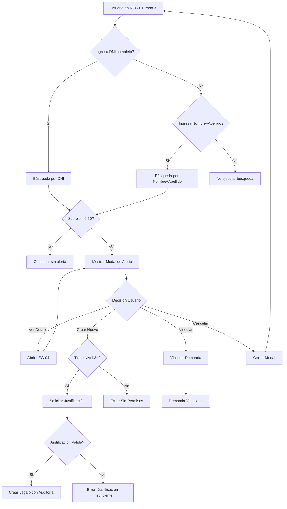

# LEG-01: Reconocimiento de Existencia de Legajo y Vinculación Justificada

## Historia de Usuario

**Como** usuario encargado de registro de (1) una demanda cualquiera y/o (2) de una demanda judicial con legajo previo
**Quiero** detectar información previa de Legajo Y vincular legajos con demandas/medidas/otros legajos con justificación obligatoria
**Para** pre-completar el nuevo registro de demanda, estar correctamente informado sobre los datos existentes en el Sistema, y gestionar grupos de casos relacionados (hermanos, mismo caso judicial, medidas vinculadas)

---

## Contexto Técnico

### Integración Arquitectónica

LEG-01 es una **dependencia crítica** para múltiples stories del sistema:

- **REG-01** (Registro de Demanda): Pre-carga de datos de legajo existente + vinculación de demanda con múltiples legajos
- **MED-01** (Registro de Medida): Vinculación de medidas relacionadas (hermanos, innovación)
- **PLTM-01** (Plan de Trabajo): Actividades sobre grupos de medidas vinculadas (`permite_gestion_grupal=True`)
- **PLTM-02** (Acción sobre Actividad): Acciones sobre grupos de medidas vinculadas
- **BE-06** (Gestión de Legajo): Transferencias de legajos con vínculos preservados
- **LEG-04** (Detalle de Legajo): Visualización de vínculos en detalle de legajo

### Estado de Implementación

- ✅ **Detección de Duplicados**: Implementada en REG-01 Paso 3 (algoritmo de scoring)
- ❌ **Vinculación Justificada**: NO implementada (requiere modelo `TVinculoLegajo`)
- ✅ **Modelos Base**: `TLegajo`, `TMedida`, `TDemanda` implementados
- ⚠️ **Campo `permite_gestion_grupal`**: Implementado en `TActividadPlanTrabajo` pero SIN usar

### Prerrequisitos Técnicos

- ✅ LEG-02 (Registro de Legajo) implementado
- ✅ MED-01 (Registro de Medida) implementado
- ⚠️ REG-01 (Registro de Demanda) implementado parcialmente SIN vinculaciones
- ⚠️ PLTM-01 implementado SIN gestión grupal de actividades

---

## Descripción Funcional

### 1. Soluciones Propuestas (según Documentación V2)

El reconocimiento de existencia de legajo se implementa mediante **cuatro aproximaciones complementarias**:

#### Opción A: Indicador Visual en Mesa de Entradas ✅ IMPLEMENTADA
- **Dónde**: Listado de demandas (BE-01)
- **Qué**: Visualizar en cada fila si la demanda tiene legajo relacionado
- **Cómo**: Chip/badge visual que indica "Legajo Existente" con número de legajo
- **Beneficio**: Información rápida sin necesidad de abrir la demanda

#### Opción B: Búsqueda desde Mesa de Legajos ✅ IMPLEMENTADA
- **Dónde**: Mesa de Legajos (BE-05)
- **Qué**: Buscar un legajo existente antes de iniciar registro de demanda
- **Cómo**:
  1. Usuario busca por DNI, nombre, apellido, etc.
  2. Encuentra el legajo deseado
  3. Sistema permite redirección al registro de demanda
  4. Pre-carga información existente del legajo en el formulario
- **Manejo de permisos**:
  - Si el usuario NO tiene permisos para acceder al legajo (por zona/nivel)
  - Puede solicitar al responsable/director del legajo:
    - Acceso temporal
    - Transferencia del legajo

#### Opción C: Detección Automática Durante Registro (PRINCIPAL) ✅ IMPLEMENTADA
- **Dónde**: Wizard REG-01, Paso 3 (al cargar datos de NNyA)
- **Qué**: Detección automática mientras el usuario completa el formulario
- **Cuándo**: Al ingresar campos identificatorios (DNI, nombre, apellido, fecha nacimiento)
- **Cómo**:
  1. Sistema filtra en base de datos por campos identificatorios
  2. Ejecuta algoritmo de scoring de coincidencia
  3. Si encuentra match, muestra modal/alerta
  4. Ofrece opciones al usuario

#### **NUEVO V2: Opción D - Vinculación Justificada de Legajos** ❌ NO IMPLEMENTADA

**Contexto**: Una vez detectado un legajo existente, el sistema debe permitir vincular:
- **Legajo, y Medida perteneciente a ese Legajo, con Demanda**: Demanda afecta a un legajo existente, y dispara la creación de una Medida, o bien, implica actividades sobre una Medida existente
- **Legajo con Legajo**: Hermanos, mismo caso judicial, transferencias

**Requisitos V2**:
- **Tipo de Vínculo Obligatorio**: `HERMANOS`, `MISMO_CASO_JUDICIAL`, `MEDIDAS_RELACIONADAS`, `TRANSFERENCIA`
- **Justificación Obligatoria**: Mínimo 20 caracteres explicando el motivo de la vinculación
- **Auditoría Completa**: Usuario que vinculó, fecha, justificación, tipo de vínculo
- **Soft Delete**: Campo `activo=True/False` para desvincular sin perder historial
- **Preservación en Transferencias**: Los vínculos se mantienen al transferir legajo entre zonas

---

## 2. Integración Específica con Wizard REG-01

### Paso del Wizard donde se Ejecuta

**Paso 3: Niños y Adolescentes**

- Campos del formulario NNyA: [Referencia completa](https://docs.google.com/spreadsheets/d/1XgETT2GnfURamwuFiBNlmjojAb29w3h5UKz3CrcFFLw/edit?gid=1201644582#gid=1201644582)

### Datos del Formulario Utilizados para Detección

Los siguientes campos son monitoreados en tiempo real (debounced) para activar la búsqueda de duplicados:

| Campo | Tipo | Peso en Detección | Obligatorio para Match |
|-------|------|-------------------|------------------------|
| DNI | Integer | ALTO (100%) | ✅ Match Perfecto |
| Nombre | String | MEDIO (60%) | ✅ Match Alto/Parcial |
| Apellido | String | MEDIO (60%) | ✅ Match Alto/Parcial |
| Fecha de Nacimiento | Date | ALTO (80%) | ❌ Match Alto |
| Género | Choice | BAJO (20%) | ❌ Validación adicional |
| Nombre Autopercibido | String | BAJO (30%) | ❌ Match parcial |

### Trigger de Búsqueda

La búsqueda de duplicados se ejecuta cuando:

1. **DNI completo ingresado** (8 dígitos) → Búsqueda inmediata
2. **Nombre + Apellido completos** → Búsqueda con debounce de 500ms
3. **Cambio en fecha de nacimiento** (si ya hay nombre+apellido) → Re-búsqueda

---

## 3. Lógica de Detección Multi-Criterio (IMPLEMENTADA)

### Algoritmo de Matching

El sistema implementa **tres niveles de coincidencia**:

#### Nivel 1: Match Perfecto (Score = 1.0)
```python
Criterios:
- DNI exacto coincide
- Legajo existe en base de datos
- Legajo NO está archivado/eliminado

Resultado:
- Score = 1.0 (100%)
- Alerta CRÍTICA al usuario
- Recomendación: Vincular demanda a legajo existente
```

#### Nivel 2: Match Alto (Score >= 0.75)
```python
Criterios:
- Nombre exacto + Apellido exacto + Fecha de Nacimiento exacta
  O
- Nombre Levenshtein <= 2 + Apellido exacto + Fecha Nacimiento exacta
  O
- Nombre exacto + Apellido Levenshtein <= 2 + Fecha Nacimiento exacta

Resultado:
- Score = 0.75 - 0.95 (depende de exactitud)
- Alerta ALTA al usuario
- Recomendación: Revisar manualmente antes de crear nuevo legajo
```

#### Nivel 3: Match Parcial (Score >= 0.50 y < 0.75)
```python
Criterios:
- Nombre similar (Levenshtein <= 3) + Apellido similar (Levenshtein <= 3)
  O
- Nombre exacto + Apellido similar + Género coincide
  O
- Apellido exacto + Nombre similar + Fecha cercana (± 365 días)

Resultado:
- Score = 0.50 - 0.74
- Alerta MEDIA al usuario
- Recomendación: Verificar datos antes de continuar
```

#### Sin Match (Score < 0.50)
```python
Resultado:
- No se muestra alerta
- Usuario continúa con registro normal
- Se creará nuevo legajo si la demanda es admitida
```

---

## 4. Algoritmo de Scoring de Coincidencia (0.0 - 1.0)

### Fórmula de Cálculo

```python
def calculate_match_score(input_data, existing_legajo):
    """
    Calcula score de coincidencia entre datos ingresados y legajo existente
    Retorna: float entre 0.0 y 1.0
    """
    score = 0.0
    weights = {
        'dni_exact': 1.0,
        'nombre_exact': 0.30,
        'apellido_exact': 0.30,
        'fecha_nac_exact': 0.20,
        'genero_match': 0.10,
        'nombre_similar': 0.20,
        'apellido_similar': 0.20,
        'fecha_nac_close': 0.10,
        'nombre_autopercibido': 0.05
    }

    # Match Perfecto por DNI
    if input_data.dni == existing_legajo.nnya.dni:
        return 1.0

    # Match por Nombre Exacto
    if input_data.nombre.lower() == existing_legajo.nnya.nombre.lower():
        score += weights['nombre_exact']

    # Match por Apellido Exacto
    if input_data.apellido.lower() == existing_legajo.nnya.apellido.lower():
        score += weights['apellido_exact']

    # Match por Fecha de Nacimiento Exacta
    if input_data.fecha_nacimiento == existing_legajo.nnya.fecha_nacimiento:
        score += weights['fecha_nac_exact']

    # Match por Género
    if input_data.genero == existing_legajo.nnya.genero:
        score += weights['genero_match']

    # Similaridad de Nombre (Levenshtein)
    nombre_distance = levenshtein_distance(
        input_data.nombre.lower(),
        existing_legajo.nnya.nombre.lower()
    )
    if nombre_distance <= 3:
        score += weights['nombre_similar'] * (1 - nombre_distance / 10)

    # Similaridad de Apellido (Levenshtein)
    apellido_distance = levenshtein_distance(
        input_data.apellido.lower(),
        existing_legajo.nnya.apellido.lower()
    )
    if apellido_distance <= 3:
        score += weights['apellido_similar'] * (1 - apellido_distance / 10)

    # Fecha de Nacimiento Cercana (± 365 días)
    if input_data.fecha_nacimiento and existing_legajo.nnya.fecha_nacimiento:
        days_diff = abs((input_data.fecha_nacimiento - existing_legajo.nnya.fecha_nacimiento).days)
        if days_diff <= 365:
            score += weights['fecha_nac_close'] * (1 - days_diff / 365)

    # Nombre Autopercibido
    if input_data.nombre_autopercibido and existing_legajo.nnya.nombre_autopercibido:
        if input_data.nombre_autopercibido.lower() == existing_legajo.nnya.nombre_autopercibido.lower():
            score += weights['nombre_autopercibido']

    return min(score, 1.0)  # Cap at 1.0
```

### Thresholds de Alerta

| Score Range | Nivel de Alerta | Color UI | Acción Recomendada |
|-------------|-----------------|----------|---------------------|
| 1.0 | CRÍTICA | Rojo (#f44336) | Vincular obligatoriamente |
| 0.75 - 0.99 | ALTA | Naranja (#ff9800) | Revisar antes de crear |
| 0.50 - 0.74 | MEDIA | Amarillo (#ffc107) | Verificar datos |
| < 0.50 | Sin Alerta | - | Continuar normal |

---

## 5. Flujo UX cuando SE DETECTA Legajo Existente

### Modal de Alerta de Duplicado

Cuando el score >= 0.50, se muestra un modal con la siguiente información:

```
╔══════════════════════════════════════════════════════════════╗
║  ⚠️ POSIBLE LEGAJO EXISTENTE DETECTADO                       ║
╠══════════════════════════════════════════════════════════════╣
║                                                              ║
║  Score de Coincidencia: 95% [████████████████░░░░] ALTA     ║
║                                                              ║
║  Legajo Encontrado: #2024-1234                               ║
║  ────────────────────────────────────────────────────────    ║
║  Niño/Adolescente:                                           ║
║    • Nombre: Juan Pérez                                      ║
║    • DNI: 12345678                                           ║
║    • Fecha Nac: 15/03/2010                                   ║
║    • Género: Masculino                                       ║
║                                                              ║
║  Información del Legajo:                                     ║
║    • Fecha Apertura: 10/02/2024                              ║
║    • Zona: Zona Norte                                        ║
║    • Estado: Activo                                          ║
║    • Responsable: Equipo Técnico Zona Norte                  ║
║    • Urgencia: ALTA                                          ║
║                                                              ║
║  Datos Comparados con tu Ingreso:                            ║
║    ✅ DNI: Coincide exactamente                              ║
║    ✅ Nombre: Coincide exactamente                           ║
║    ✅ Apellido: Coincide exactamente                         ║
║    ⚠️ Fecha Nac: Diferencia de 2 días                       ║
║                                                              ║
╠══════════════════════════════════════════════════════════════╣
║  ¿Qué deseas hacer?                                          ║
║                                                              ║
║  [🔍 Ver Detalle del Legajo]                                ║
║  [🔗 Vincular Demanda a Legajo Existente] ← Recomendado     ║
║  [➕ Crear Nuevo Legajo de Todas Formas]                    ║
║  [❌ Cancelar y Revisar Datos]                               ║
║                                                              ║
╚══════════════════════════════════════════════════════════════╝
```

### Opciones del Usuario

#### Opción A: 🔍 Ver Detalle del Legajo
- **Acción**: Abre en nueva ventana/modal el detalle completo del legajo (LEG-04)
- **Permisos**:
  - Si el usuario TIENE permisos → Muestra detalle completo
  - Si el usuario NO TIENE permisos → Muestra mensaje:
    ```
    ⚠️ No tienes permisos para acceder a este legajo

    Legajo pertenece a: Zona Sur
    Responsable: Juan Director (Jefe Zonal)

    Opciones:
    - Solicitar Acceso Temporal al Responsable
    - Solicitar Transferencia del Legajo a tu Zona
    - Contactar al Responsable: juan.director@senaf.gob.ar
    ```
- **Resultado**: Usuario puede revisar información y tomar decisión informada

#### Opción B: 🔗 Vincular Demanda a Legajo Existente (RECOMENDADO)
- **Acción**:
  1. Sistema vincula la demanda en registro al legajo existente
  2. NO se crea nuevo legajo
  3. Los datos del NNyA se actualizan en el legajo si hay campos nuevos
  4. El formulario de registro continúa normalmente
  5. La demanda queda asociada al legajo existente
- **Validaciones**:
  - Verificar que el usuario tenga permisos para vincular a ese legajo
  - Si no tiene permisos → Solicitar aprobación del responsable del legajo
- **Notificaciones**:
  - Notificar al responsable del legajo sobre nueva demanda vinculada
  - Registrar evento en historial del legajo
- **Resultado**:
  - Demanda vinculada exitosamente
  - Mensaje de confirmación al usuario
  - Continúa con registro de demanda

#### Opción C: ➕ Crear Nuevo Legajo de Todas Formas
- **Acción**: Modal de confirmación adicional
  ```
  ╔══════════════════════════════════════════════════════════════╗
  ║  ⚠️ CONFIRMACIÓN REQUERIDA                                   ║
  ╠══════════════════════════════════════════════════════════════╣
  ║  Estás a punto de crear un NUEVO legajo a pesar de           ║
  ║  existir uno con 95% de coincidencia.                        ║
  ║                                                              ║
  ║  ⚠️ IMPORTANTE:                                              ║
  ║  - Esto podría generar un duplicado en el sistema            ║
  ║  - Se registrará esta acción en la auditoría                 ║
  ║  - Deberás justificar la creación del nuevo legajo           ║
  ║                                                              ║
  ║  Motivo para crear nuevo legajo (obligatorio):               ║
  ║  ┌─────────────────────────────────────────────────────┐    ║
  ║  │ [Área de texto para justificación]                  │    ║
  ║  │                                                      │    ║
  ║  │                                                      │    ║
  ║  └─────────────────────────────────────────────────────┘    ║
  ║                                                              ║
  ║  [❌ Cancelar]  [✅ Confirmar Creación de Nuevo Legajo]     ║
  ║                                                              ║
  ╚══════════════════════════════════════════════════════════════╝
  ```
- **Validaciones**:
  - Justificación obligatoria (mínimo 20 caracteres)
  - Requiere confirmación explícita del usuario
  - Solo usuarios con permiso especial pueden forzar creación (Nivel 3+)
- **Auditoría**:
  - Se registra en logs: usuario, timestamp, legajo duplicado ignorado, justificación
  - Se notifica a supervisor/director sobre creación forzada
- **Resultado**:
  - Se marca flag `skip_duplicate_check=True` en la creación
  - Se continúa con registro normal
  - Se crea nuevo legajo cuando la demanda sea admitida

#### Opción D: ❌ Cancelar y Revisar Datos
- **Acción**:
  - Cierra el modal de alerta
  - Usuario permanece en el formulario de registro
  - Puede corregir/verificar los datos ingresados
  - Puede volver a ejecutar la búsqueda
- **Resultado**: No se realiza ninguna acción, usuario revisa datos

---

## 6. Flujo cuando NO se Detecta Duplicado

### Proceso Normal

Si `score < 0.50` (threshold mínimo):

1. **No se muestra alerta**
2. **Usuario completa formulario normalmente**
3. **Sistema NO interrumpe el flujo**
4. **Al finalizar REG-01**:
   - Si objetivo de demanda = "Protección" → Continúa a constatación/evaluación
   - Si decisión resolutiva = "Admitida" → Se crea nuevo legajo automáticamente (LEG-02)
5. **Validación final antes de crear legajo**:
   - Última verificación de duplicados antes de ejecutar creación
   - Algoritmo más estricto (solo DNI exacto)
   - Si encuentra duplicado en último momento → Alerta de error crítico

---

## 7. TODOS los Criterios de Aceptación

### CA-1: Unicidad de Legajo
✅ **El Legajo debe ser único por NNyA y viceversa**
- Restricción de base de datos: `UNIQUE(nnya_id)`
- Validación en creación: verificar no exista legajo para ese NNyA
- Soft delete: Legajos archivados NO cuentan como duplicados

### CA-2: Detección Automática en Tiempo Real
✅ **La búsqueda de duplicados debe ejecutarse automáticamente al ingresar datos de NNyA**
- Trigger en campo DNI (blur event)
- Trigger en nombre + apellido (debounced 500ms)
- Trigger en fecha de nacimiento (change event)
- Búsqueda asíncrona sin bloquear UI

### CA-3: Algoritmo de Scoring Preciso
✅ **El algoritmo debe calcular correctamente el score de coincidencia**
- Match perfecto por DNI → Score = 1.0
- Match alto por nombre+apellido+fecha → Score >= 0.75
- Match parcial por similaridad → Score >= 0.50
- Implementar Levenshtein distance para comparación de strings

### CA-4: Interfaz de Usuario Clara
✅ **Mostrar modal/alerta clara cuando se detecte posible duplicado**
- Score >= 0.50 → Mostrar alerta
- Información completa del legajo encontrado
- Comparación visual de datos ingresados vs existentes
- Opciones claras de acción

### CA-5: Opciones de Acción Funcionales
✅ **Usuario debe poder ejecutar las 4 opciones descritas**
- Ver detalle del legajo
- Vincular demanda a legajo existente
- Crear nuevo legajo con justificación
- Cancelar y revisar datos

### CA-6: Manejo de Permisos
✅ **Respetar permisos de zona/nivel de usuario**
- Usuario sin permisos → Puede ver datos básicos pero no vincular
- Opción de solicitar acceso/transferencia al responsable
- Notificaciones al responsable del legajo
- Auditoría de solicitudes de acceso

### CA-7: Validación en Creación Forzada
✅ **Si usuario decide crear nuevo legajo a pesar de duplicado**
- Justificación obligatoria (mínimo 20 caracteres)
- Solo usuarios Nivel 3+ pueden forzar creación
- Registro en auditoría con todos los detalles
- Notificación a supervisor

### CA-8: Vinculación Exitosa
✅ **Cuando se vincula demanda a legajo existente**
- Demanda queda correctamente asociada al legajo
- Datos del NNyA se actualizan si hay nuevos campos
- Notificación al responsable del legajo
- Evento registrado en historial del legajo
- Mensaje de confirmación al usuario

### CA-9: Indicadores Visuales en Mesa de Entradas
✅ **Demandas con legajo deben ser visualmente identificables**
- Chip/badge "Legajo Existente" en fila de demanda
- Número de legajo visible
- Link directo al detalle del legajo
- Color distintivo según estado del legajo

### CA-10: Búsqueda desde Mesa de Legajos
✅ **Usuario puede buscar legajo antes de registrar demanda**
- Búsqueda por DNI, nombre, apellido funcional
- Redirección a registro de demanda con pre-carga
- Datos del legajo pre-completan formulario REG-01
- Validación de permisos antes de pre-cargar

### CA-11: Performance
✅ **Búsqueda de duplicados debe ser performante**
- Respuesta en < 500ms para búsqueda por DNI
- Respuesta en < 1 segundo para búsqueda por nombre+apellido
- Debounce de 500ms en campos de texto
- Caché de resultados durante la sesión

### CA-12: Auditoría Completa
✅ **Todas las acciones deben quedar registradas**
- Búsquedas de duplicados ejecutadas
- Decisiones del usuario (vincular/crear/cancelar)
- Justificaciones de creación forzada
- Solicitudes de acceso a legajos de otras zonas
- Timestamp, usuario, score de coincidencia

---

## 8. Validaciones

### Datos Obligatorios para Detección

| Campo | Obligatorio | Propósito |
|-------|-------------|-----------|
| DNI | ❌ | Match perfecto, pero NNyA puede no tener DNI aún |
| Nombre | ✅ | Match alto/parcial |
| Apellido | ✅ | Match alto/parcial |
| Fecha Nacimiento | ❌ | Aumenta precisión de match alto |
| Género | ❌ | Validación adicional |

**Nota**: La detección puede funcionar con mínimo Nombre + Apellido, pero con menor precisión.

### Manejo de Datos Incompletos

#### Escenario 1: Solo DNI ingresado
- Ejecutar búsqueda solo por DNI
- Si encuentra match → Score = 1.0
- Si no encuentra → No mostrar alerta

#### Escenario 2: Solo Nombre + Apellido (sin DNI ni Fecha Nac)
- Ejecutar búsqueda por similaridad de nombre+apellido
- Score máximo posible = 0.70 (sin DNI ni fecha)
- Mostrar alerta solo si score >= 0.50
- Indicar en modal que faltan datos para mayor precisión

#### Escenario 3: Datos Parciales
- Nombre + Apellido + Género (sin DNI ni Fecha Nac)
- Score máximo = 0.80
- Búsqueda por nombre+apellido+género
- Alerta con advertencia de datos incompletos

#### Escenario 4: Solo DNI Parcial (< 8 dígitos)
- NO ejecutar búsqueda automática
- Esperar a que complete el DNI
- Validar formato de DNI antes de buscar

### Scoring Mínimo para Mostrar Alerta (Threshold)

**Threshold Global: 0.50**

```python
DUPLICATE_DETECTION_THRESHOLD = 0.50

if match_score >= DUPLICATE_DETECTION_THRESHOLD:
    show_duplicate_alert(legajo_found, match_score)
else:
    # No mostrar alerta, continuar normal
    pass
```

**Thresholds por Nivel de Alerta**:

```python
THRESHOLDS = {
    'CRITICA': 1.0,      # DNI exacto
    'ALTA': 0.75,        # Nombre+Apellido+Fecha exactos o muy similares
    'MEDIA': 0.50,       # Similaridad moderada
    'SIN_ALERTA': 0.0    # Score < 0.50 no muestra nada
}
```

---

## 9. Endpoints Necesarios

### Endpoint Principal: Búsqueda de Duplicados

```http
POST /api/legajos/buscar-duplicados/
Content-Type: application/json

Request Body:
{
  "dni": 12345678,                    // Opcional, Integer
  "nombre": "Juan",                   // Requerido, String
  "apellido": "Pérez",                // Requerido, String
  "fecha_nacimiento": "2010-03-15",   // Opcional, Date
  "genero": "MASCULINO",              // Opcional, Choice
  "nombre_autopercibido": "Juani"     // Opcional, String
}

Response 200 OK:
{
  "duplicados_encontrados": true,
  "total_matches": 2,
  "matches": [
    {
      "legajo_id": 1234,
      "legajo_numero": "2024-1234",
      "score": 1.0,
      "nivel_alerta": "CRITICA",
      "nnya": {
        "id": 5678,
        "nombre": "Juan",
        "apellido": "Pérez",
        "dni": 12345678,
        "fecha_nacimiento": "2010-03-15",
        "genero": "MASCULINO"
      },
      "legajo_info": {
        "fecha_apertura": "2024-02-10",
        "zona": {
          "id": 1,
          "nombre": "Zona Norte"
        },
        "estado": "Activo",
        "responsable": {
          "id": 10,
          "nombre_completo": "María González",
          "equipo": "Equipo Técnico Zona Norte"
        },
        "urgencia": "ALTA"
      },
      "comparacion": {
        "dni": {"match": "exacto", "input": 12345678, "existente": 12345678},
        "nombre": {"match": "exacto", "input": "Juan", "existente": "Juan"},
        "apellido": {"match": "exacto", "input": "Pérez", "existente": "Pérez"},
        "fecha_nacimiento": {"match": "exacto", "input": "2010-03-15", "existente": "2010-03-15"}
      },
      "tiene_permisos": true,
      "puede_vincular": true
    }
  ],
  "recomendacion": "VINCULAR",  // VINCULAR | REVISAR | CONTINUAR
  "threshold_usado": 0.50
}

Response 200 OK (sin duplicados):
{
  "duplicados_encontrados": false,
  "total_matches": 0,
  "matches": [],
  "recomendacion": "CONTINUAR",
  "threshold_usado": 0.50
}

Response 400 Bad Request:
{
  "error": "Datos insuficientes para búsqueda",
  "detalles": "Se requiere al menos nombre y apellido"
}
```

### Endpoint Secundario: Vincular Demanda a Legajo Existente

```http
POST /api/legajos/{legajo_id}/vincular-demanda/
Content-Type: application/json

Request Body:
{
  "demanda_id": 9876,          // ID de la demanda en registro
  "actualizar_datos_nnya": true,  // Actualizar datos del NNyA con nueva info
  "campos_actualizar": [
    "telefono",
    "localidad",
    "direccion"
  ]
}

Response 200 OK:
{
  "vinculacion_exitosa": true,
  "legajo_id": 1234,
  "demanda_id": 9876,
  "nnya_actualizado": true,
  "campos_actualizados": ["telefono", "localidad"],
  "notificaciones_enviadas": [
    {
      "usuario_id": 10,
      "tipo": "nueva_demanda_vinculada",
      "enviado": true
    }
  ],
  "mensaje": "Demanda vinculada exitosamente al legajo #2024-1234"
}

Response 403 Forbidden:
{
  "error": "Sin permisos para vincular a este legajo",
  "legajo_zona": "Zona Sur",
  "tu_zona": "Zona Norte",
  "accion_sugerida": "Solicitar acceso al responsable del legajo"
}

Response 404 Not Found:
{
  "error": "Legajo no encontrado",
  "legajo_id": 1234
}
```

### Endpoint Terciario: Crear Legajo con Confirmación de Duplicado

```http
POST /api/legajos/crear-con-duplicado-confirmado/
Content-Type: application/json

Request Body:
{
  "demanda_id": 9876,
  "legajo_duplicado_ignorado": 1234,
  "score_duplicado_ignorado": 0.95,
  "justificacion": "Se trata de dos personas diferentes con mismo nombre y apellido. Confirmado por equipo social.",
  "confirmacion_usuario": true,
  "nnya_data": {
    "nombre": "Juan",
    "apellido": "Pérez",
    "dni": 12345679,  // DNI diferente
    "fecha_nacimiento": "2010-03-17",
    "genero": "MASCULINO"
  }
}

Response 201 Created:
{
  "legajo_creado": true,
  "legajo_id": 1235,
  "legajo_numero": "2024-1235",
  "skip_duplicate_check": true,
  "auditoria": {
    "usuario_id": 25,
    "timestamp": "2024-10-07T15:30:00Z",
    "legajo_ignorado": 1234,
    "score_ignorado": 0.95,
    "justificacion": "Se trata de dos personas diferentes con mismo nombre y apellido. Confirmado por equipo social."
  },
  "notificaciones": {
    "supervisor_notificado": true,
    "supervisor_id": 5
  },
  "mensaje": "Nuevo legajo creado. Se ha notificado a supervisor sobre creación forzada."
}

Response 403 Forbidden:
{
  "error": "Sin permisos suficientes para forzar creación de legajo",
  "nivel_requerido": 3,
  "tu_nivel": 2
}

Response 400 Bad Request:
{
  "error": "Justificación insuficiente",
  "minimo_caracteres": 20,
  "actual": 15
}
```

### Modificación de REG-01 para Integración

**Nuevo parámetro opcional en REG-01 - Paso 3 (NNyA)**:

```http
POST /api/registro-demanda-form/
Content-Type: application/json

Request Body (Paso 3 - NNyA):
{
  "paso": 3,
  "demanda_id": 9876,
  "nnyas": [
    {
      "nombre": "Juan",
      "apellido": "Pérez",
      "dni": 12345678,
      "fecha_nacimiento": "2010-03-15",
      "genero": "MASCULINO",

      // NUEVOS CAMPOS para LEG-01:
      "legajo_existente_vinculado": 1234,        // ID del legajo vinculado (si eligió vincular)
      "skip_duplicate_check": false,             // True si eligió crear nuevo con justificación
      "duplicate_check_justification": null      // Justificación si skip = true
    }
  ]
}
```

---

## 10. Tests Requeridos (Mínimo 12)

### Suite 1: Búsqueda y Detección (4 tests)

#### Test 1.1: Match Exacto por DNI
```python
def test_match_exacto_por_dni():
    """
    Dado un legajo existente con DNI 12345678
    Cuando se busca con DNI 12345678
    Entonces debe retornar score = 1.0 y nivel CRITICA
    """
    # Setup
    legajo = crear_legajo(nnya__dni=12345678)

    # Execute
    response = client.post('/api/legajos/buscar-duplicados/', {
        'dni': 12345678,
        'nombre': 'Otro',
        'apellido': 'Nombre'
    })

    # Assert
    assert response.status_code == 200
    assert response.data['duplicados_encontrados'] == True
    assert len(response.data['matches']) == 1
    assert response.data['matches'][0]['score'] == 1.0
    assert response.data['matches'][0]['nivel_alerta'] == 'CRITICA'
```

#### Test 1.2: Match Alto por Nombre+Apellido+Fecha
```python
def test_match_alto_por_nombre_apellido_fecha():
    """
    Dado un legajo con nombre="Juan", apellido="Pérez", fecha="2010-03-15"
    Cuando se busca con los mismos datos (sin DNI)
    Entonces debe retornar score >= 0.75 y nivel ALTA
    """
    # Setup
    legajo = crear_legajo(
        nnya__nombre="Juan",
        nnya__apellido="Pérez",
        nnya__fecha_nacimiento=date(2010, 3, 15),
        nnya__dni=None
    )

    # Execute
    response = client.post('/api/legajos/buscar-duplicados/', {
        'nombre': 'Juan',
        'apellido': 'Pérez',
        'fecha_nacimiento': '2010-03-15'
    })

    # Assert
    assert response.status_code == 200
    assert response.data['duplicados_encontrados'] == True
    assert response.data['matches'][0]['score'] >= 0.75
    assert response.data['matches'][0]['nivel_alerta'] == 'ALTA'
```

#### Test 1.3: Match Parcial por Nombre+Apellido Similares
```python
def test_match_parcial_por_similaridad():
    """
    Dado un legajo con nombre="Juan", apellido="Pérez"
    Cuando se busca con nombre="Jhuan", apellido="Peres"
    Entonces debe retornar score >= 0.50 y < 0.75, nivel MEDIA
    """
    # Setup
    legajo = crear_legajo(nnya__nombre="Juan", nnya__apellido="Pérez")

    # Execute
    response = client.post('/api/legajos/buscar-duplicados/', {
        'nombre': 'Jhuan',
        'apellido': 'Peres'
    })

    # Assert
    assert response.status_code == 200
    assert response.data['duplicados_encontrados'] == True
    score = response.data['matches'][0]['score']
    assert 0.50 <= score < 0.75
    assert response.data['matches'][0]['nivel_alerta'] == 'MEDIA'
```

#### Test 1.4: No Match con Datos Diferentes
```python
def test_no_match_datos_diferentes():
    """
    Dado un legajo con nombre="Juan", apellido="Pérez"
    Cuando se busca con nombre="María", apellido="González"
    Entonces no debe encontrar duplicados
    """
    # Setup
    legajo = crear_legajo(nnya__nombre="Juan", nnya__apellido="Pérez")

    # Execute
    response = client.post('/api/legajos/buscar-duplicados/', {
        'nombre': 'María',
        'apellido': 'González'
    })

    # Assert
    assert response.status_code == 200
    assert response.data['duplicados_encontrados'] == False
    assert len(response.data['matches']) == 0
```

### Suite 2: Scoring Correcto (3 tests)

#### Test 2.1: Scoring DNI Exacto
```python
def test_scoring_dni_exacto_siempre_1_punto():
    """
    DNI exacto debe dar score = 1.0 independientemente de otros campos
    """
    legajo = crear_legajo(
        nnya__dni=12345678,
        nnya__nombre="Juan",
        nnya__apellido="Pérez"
    )

    response = client.post('/api/legajos/buscar-duplicados/', {
        'dni': 12345678,
        'nombre': 'María',  # Diferente
        'apellido': 'González'  # Diferente
    })

    assert response.data['matches'][0]['score'] == 1.0
```

#### Test 2.2: Scoring Levenshtein Distance
```python
def test_scoring_levenshtein_distance_correcto():
    """
    Score debe decrecer proporcionalmente a la distancia Levenshtein
    """
    legajo = crear_legajo(nnya__nombre="Juan", nnya__apellido="Pérez")

    # Caso 1: Distancia 1
    response1 = client.post('/api/legajos/buscar-duplicados/', {
        'nombre': 'Jua',  # Falta 1 letra
        'apellido': 'Pérez'
    })

    # Caso 2: Distancia 2
    response2 = client.post('/api/legajos/buscar-duplicados/', {
        'nombre': 'Ju',  # Faltan 2 letras
        'apellido': 'Pérez'
    })

    # Assert: Score1 > Score2
    assert response1.data['matches'][0]['score'] > response2.data['matches'][0]['score']
```

#### Test 2.3: Scoring con Múltiples Campos
```python
def test_scoring_multiples_campos_suma_correcta():
    """
    Score debe sumar correctamente pesos de múltiples coincidencias
    """
    legajo = crear_legajo(
        nnya__nombre="Juan",
        nnya__apellido="Pérez",
        nnya__genero="MASCULINO",
        nnya__fecha_nacimiento=date(2010, 3, 15)
    )

    # Coincidencia en todos los campos
    response = client.post('/api/legajos/buscar-duplicados/', {
        'nombre': 'Juan',
        'apellido': 'Pérez',
        'genero': 'MASCULINO',
        'fecha_nacimiento': '2010-03-15'
    })

    # Score esperado = nombre(0.30) + apellido(0.30) + fecha(0.20) + genero(0.10) = 0.90
    assert response.data['matches'][0]['score'] >= 0.85  # Margen de error
```

### Suite 3: Permisos y Seguridad (2 tests)

#### Test 3.1: Usuario con Permisos Puede Vincular
```python
def test_usuario_con_permisos_puede_vincular():
    """
    Usuario con permisos para el legajo puede vincularlo a demanda
    """
    # Setup
    zona_norte = crear_zona(nombre="Zona Norte")
    usuario = crear_usuario(zona=zona_norte, nivel=2)
    legajo = crear_legajo(zona=zona_norte)
    demanda = crear_demanda_en_registro()

    # Execute
    client.force_authenticate(user=usuario)
    response = client.post(f'/api/legajos/{legajo.id}/vincular-demanda/', {
        'demanda_id': demanda.id
    })

    # Assert
    assert response.status_code == 200
    assert response.data['vinculacion_exitosa'] == True
```

#### Test 3.2: Usuario sin Permisos No Puede Vincular
```python
def test_usuario_sin_permisos_no_puede_vincular():
    """
    Usuario sin permisos para el legajo NO puede vincularlo
    """
    # Setup
    zona_norte = crear_zona(nombre="Zona Norte")
    zona_sur = crear_zona(nombre="Zona Sur")
    usuario_norte = crear_usuario(zona=zona_norte, nivel=2)
    legajo_sur = crear_legajo(zona=zona_sur)
    demanda = crear_demanda_en_registro()

    # Execute
    client.force_authenticate(user=usuario_norte)
    response = client.post(f'/api/legajos/{legajo_sur.id}/vincular-demanda/', {
        'demanda_id': demanda.id
    })

    # Assert
    assert response.status_code == 403
    assert 'Sin permisos' in response.data['error']
```

### Suite 4: Integración con Wizard (1 test)

#### Test 4.1: Detección Automática en REG-01 Paso 3
```python
def test_deteccion_automatica_en_wizard_reg01():
    """
    Al completar Paso 3 de REG-01, debe detectar automáticamente duplicados
    """
    # Setup
    legajo_existente = crear_legajo(nnya__dni=12345678)
    usuario = crear_usuario(nivel=2)

    # Execute - Simular envío de Paso 3 con DNI duplicado
    client.force_authenticate(user=usuario)
    response = client.post('/api/registro-demanda-form/', {
        'paso': 3,
        'nnyas': [{
            'nombre': 'Juan',
            'apellido': 'Pérez',
            'dni': 12345678  # DNI duplicado
        }]
    })

    # Assert
    assert response.status_code == 200
    assert 'alerta_duplicado' in response.data
    assert response.data['alerta_duplicado']['score'] == 1.0
```

### Suite 5: Vinculación y Creación (2 tests)

#### Test 5.1: Vinculación Exitosa Actualiza Datos
```python
def test_vinculacion_actualiza_datos_nnya():
    """
    Al vincular demanda, debe actualizar datos del NNyA si hay campos nuevos
    """
    # Setup
    legajo = crear_legajo(nnya__telefono=None)  # Sin teléfono
    demanda = crear_demanda_en_registro()

    # Execute
    response = client.post(f'/api/legajos/{legajo.id}/vincular-demanda/', {
        'demanda_id': demanda.id,
        'actualizar_datos_nnya': True,
        'campos_actualizar': ['telefono']
    })

    # Assert
    legajo.refresh_from_db()
    assert legajo.nnya.telefono is not None
    assert response.data['nnya_actualizado'] == True
```

#### Test 5.2: Creación Forzada Requiere Justificación
```python
def test_creacion_forzada_requiere_justificacion():
    """
    Crear legajo ignorando duplicado debe requerir justificación
    """
    # Setup
    legajo_existente = crear_legajo(nnya__dni=12345678)
    usuario_nivel3 = crear_usuario(nivel=3)

    # Execute - Sin justificación
    client.force_authenticate(user=usuario_nivel3)
    response = client.post('/api/legajos/crear-con-duplicado-confirmado/', {
        'legajo_duplicado_ignorado': legajo_existente.id,
        'score_duplicado_ignorado': 0.95,
        'justificacion': '',  # Vacía
        'confirmacion_usuario': True
    })

    # Assert
    assert response.status_code == 400
    assert 'Justificación' in response.data['error']
```

---

## 11. Casos de Uso Detallados con Ejemplos

### Caso de Uso 1: Registro Normal sin Duplicados

**Actor**: Usuario Registrador (Nivel 1-2)
**Contexto**: Registrando nueva demanda de protección

**Flujo**:
1. Usuario accede a "Registrar Demanda" desde bandeja de entradas
2. Completa Paso 1 (Información General) → Continuar
3. Completa Paso 2 (Adultos Convivientes) → Continuar
4. En Paso 3, comienza a ingresar datos del NNyA:
   - Nombre: "Martina"
   - Apellido: "Rodríguez"
   - DNI: 45678912
5. Sistema ejecuta búsqueda automática → No encuentra coincidencias (score < 0.50)
6. Usuario completa resto de campos sin interrupciones
7. Finaliza registro → Demanda creada exitosamente
8. Si la demanda es admitida más adelante → Se crea legajo automáticamente (LEG-02)

**Resultado**: ✅ Registro exitoso sin alertas de duplicado

---

### Caso de Uso 2: Detección de Duplicado Perfecto (DNI Exacto)

**Actor**: Usuario Registrador (Nivel 2)
**Contexto**: Registrando demanda de un NNyA que ya tiene legajo activo

**Flujo**:
1. Usuario en Paso 3 de REG-01
2. Ingresa DNI: 12345678
3. Sistema busca automáticamente y encuentra legajo #2024-0567 con score = 1.0
4. **Modal de alerta CRÍTICA aparece**:
   ```
   ⚠️ LEGAJO EXISTENTE DETECTADO (100% de coincidencia)

   Legajo #2024-0567
   Juan Pérez - DNI 12345678
   Zona: Zona Norte
   Estado: Activo
   Responsable: Equipo Técnico Zona Norte

   ✅ TODOS los datos coinciden exactamente
   ```
5. Usuario revisa información del legajo
6. **Decisión**: Vincular demanda a legajo existente
7. Sistema vincula demanda, actualiza datos si hay nuevos campos
8. Notificación enviada al responsable del legajo
9. Usuario continúa con registro normalmente
10. Demanda queda asociada al legajo existente

**Resultado**: ✅ Demanda vinculada correctamente, no se crea legajo duplicado

---

### Caso de Uso 3: Match Alto con Solicitud de Acceso

**Actor**: Usuario Zona Sur
**Contexto**: Encuentra legajo de Zona Norte al que no tiene acceso

**Flujo**:
1. Usuario Zona Sur en Paso 3 de REG-01
2. Ingresa datos:
   - Nombre: "Lucía"
   - Apellido: "Fernández"
   - Fecha Nac: 12/05/2012
3. Sistema encuentra legajo #2024-0123 (Zona Norte) con score = 0.85
4. **Modal de alerta ALTA**:
   ```
   ⚠️ POSIBLE LEGAJO EXISTENTE (85% coincidencia)

   Legajo #2024-0123
   Lucía Fernández - 12/05/2012
   Zona: Zona Norte

   ⚠️ No tienes permisos para acceder a este legajo
   ```
5. Usuario selecciona "Solicitar Acceso"
6. Sistema muestra formulario:
   ```
   Solicitar acceso a Legajo #2024-0123
   Responsable: María González (Jefe Zonal)

   Motivo de solicitud (requerido):
   [Se recibió nueva demanda relacionada al mismo NNyA]

   [Enviar Solicitud]
   ```
7. Sistema envía notificación a María González
8. Responsable aprueba acceso
9. Usuario recibe notificación y puede vincular la demanda

**Resultado**: ✅ Solicitud de acceso exitosa, esperando aprobación

---

### Caso de Uso 4: Creación Forzada con Justificación

**Actor**: Jefe Zonal (Nivel 3)
**Contexto**: Dos hermanos con mismo apellido y fechas cercanas

**Flujo**:
1. Jefe Zonal en Paso 3 de REG-01
2. Ingresa datos del hermano menor:
   - Nombre: "Santiago"
   - Apellido: "Morales"
   - DNI: 48765432
   - Fecha Nac: 10/08/2013
3. Sistema encuentra legajo del hermano mayor (score = 0.65):
   ```
   ⚠️ POSIBLE LEGAJO EXISTENTE (65% coincidencia)

   Legajo #2024-0890
   Sebastián Morales - DNI 47123456 - 15/06/2011

   Coincidencias:
   ⚠️ Apellido: Exacto
   ⚠️ Nombre: Similar (Santiago vs Sebastián)
   ⚠️ DNI: Diferente
   ```
4. Jefe Zonal sabe que son hermanos diferentes
5. Selecciona "Crear Nuevo Legajo de Todas Formas"
6. **Modal de confirmación**:
   ```
   ⚠️ CONFIRMACIÓN REQUERIDA

   Motivo para crear nuevo legajo:
   [Santiago Morales es hermano menor de Sebastián Morales
   (legajo #2024-0890). Ambos involucrados en la misma
   situación familiar pero requieren legajos separados
   según protocolo de hermanos.]

   [Cancelar] [Confirmar Creación]
   ```
7. Sistema registra en auditoría:
   - Usuario: Jefe Zonal X
   - Legajo ignorado: #2024-0890
   - Score ignorado: 0.65
   - Justificación: [texto completo]
8. Notificación enviada a Director sobre creación forzada
9. Se crea nuevo legajo para Santiago

**Resultado**: ✅ Nuevo legajo creado con justificación válida, auditoría registrada

---

### Caso de Uso 5: Búsqueda Previa desde Mesa de Legajos

**Actor**: Director de Zona
**Contexto**: Recibió llamada sobre un caso, quiere verificar si existe legajo antes de registrar

**Flujo**:
1. Director accede a Mesa de Legajos (BE-05)
2. Usa barra de búsqueda: "María González 2008"
3. Sistema muestra resultados:
   ```
   1 legajo encontrado:

   Legajo #2024-0234
   María González - DNI 40123456 - 23/04/2008
   Zona: Zona Centro
   Estado: Activo
   ```
4. Director revisa detalle del legajo (LEG-04)
5. Confirma que es el mismo caso
6. Clickea "Registrar Nueva Demanda para este Legajo"
7. Sistema redirige a REG-01 con datos pre-cargados:
   - NNyA ya vinculado al legajo existente
   - Datos personales pre-completados
   - Solo debe completar información de la nueva demanda
8. Director completa información específica de la nueva demanda
9. Finaliza registro → Demanda vinculada automáticamente al legajo

**Resultado**: ✅ Nueva demanda registrada y vinculada a legajo existente sin duplicar

---

## 12. Manejo de Errores y Edge Cases

### Edge Case 1: NNyA sin DNI

**Escenario**: Niño recién nacido o indocumentado

**Manejo**:
- Búsqueda solo por nombre + apellido + fecha nacimiento
- Score máximo = 0.70 (sin DNI)
- Alerta indica: "⚠️ Sin DNI disponible - Verificación limitada"
- Recomendación: Actualizar DNI cuando esté disponible

---

### Edge Case 2: Múltiples Matches Encontrados

**Escenario**: Búsqueda retorna 3 legajos con scores 0.85, 0.60, 0.55

**Manejo**:
- Modal muestra los 3 legajos ordenados por score
- Máximo 5 resultados mostrados
- Usuario puede revisar cada uno
- Seleccionar el correcto para vincular
- Opciones de comparación lado a lado

**UI**:
```
⚠️ MÚLTIPLES LEGAJOS SIMILARES ENCONTRADOS

1. Legajo #2024-0100 (85% coincidencia) ← Más probable
   Juan Pérez - DNI 12345678
   [Ver Detalle] [Vincular]

2. Legajo #2024-0200 (60% coincidencia)
   Juan Peres - DNI 12345679
   [Ver Detalle] [Vincular]

3. Legajo #2024-0300 (55% coincidencia)
   Jhuan Pérez - DNI 12345680
   [Ver Detalle] [Vincular]

[Ninguno es correcto - Crear Nuevo Legajo]
```

---

### Edge Case 3: Legajo Archivado/Eliminado

**Escenario**: Se encuentra match con legajo archivado

**Manejo**:
- Legajo archivado NO cuenta como duplicado activo
- Sistema muestra alerta informativa (no bloqueante):
  ```
  ℹ️ INFORMACIÓN: Legajo Previo Encontrado

  Legajo #2023-0567 (ARCHIVADO)
  Juan Pérez - DNI 12345678
  Fecha Archivo: 15/01/2024
  Motivo: Caso cerrado - Familia reintegrada

  Este legajo está archivado. Puedes:
  - Ver historial del legajo archivado
  - Crear nuevo legajo para nueva demanda
  - Solicitar reapertura del legajo (requiere aprobación)
  ```

---

### Edge Case 4: Error en Búsqueda (Timeout/DB Down)

**Escenario**: Base de datos no responde o timeout en búsqueda

**Manejo**:
```javascript
try {
  const duplicados = await buscarDuplicados(datosNNyA);
  mostrarResultados(duplicados);
} catch (error) {
  if (error.code === 'TIMEOUT') {
    mostrarAlerta({
      tipo: 'warning',
      titulo: 'Búsqueda demorada',
      mensaje: 'La búsqueda está tardando más de lo normal. ¿Reintentar?',
      acciones: [
        { texto: 'Reintentar', onClick: () => reintentar() },
        { texto: 'Continuar sin verificar', onClick: () => continuar() },
        { texto: 'Cancelar registro', onClick: () => cancelar() }
      ]
    });
  } else if (error.code === 'DB_ERROR') {
    mostrarAlerta({
      tipo: 'error',
      titulo: 'Error en sistema',
      mensaje: 'No se pudo verificar duplicados. Contacta a soporte técnico.',
      acciones: [
        { texto: 'Contactar Soporte', onClick: () => contactarSoporte() },
        { texto: 'Guardar Borrador', onClick: () => guardarBorrador() }
      ]
    });
  }
}
```

---

### Edge Case 5: Cambio de Datos Durante Registro

**Escenario**: Usuario modifica DNI después de haber visto alerta de duplicado

**Manejo**:
- Re-ejecutar búsqueda automáticamente
- Invalidar alerta anterior
- Mostrar nueva alerta si corresponde
- Permitir vincular al nuevo legajo encontrado
- Auditar cambios de datos con timestamps

---

### Edge Case 6: Demanda con Múltiples NNyAs

**Escenario**: Demanda involucra 3 hermanos, 2 tienen legajo y 1 no

**Manejo**:
```
Paso 3 - NNyAs:

NNyA 1: Juan Morales
  ⚠️ Legajo existente #2024-0100 detectado
  [Vincular a legajo existente] ✅

NNyA 2: María Morales
  ⚠️ Legajo existente #2024-0101 detectado
  [Vincular a legajo existente] ✅

NNyA 3: Santiago Morales
  ✅ Sin legajo previo
  [Se creará nuevo legajo si demanda es admitida]

[Continuar con Registro]
```

Resultado:
- Demanda vinculada a legajo #2024-0100 (Juan)
- Demanda vinculada a legajo #2024-0101 (María)
- Se creará nuevo legajo para Santiago si se admite

---

### Edge Case 7: Usuario Pierde Sesión Durante Vinculación

**Escenario**: Session timeout mientras usuario decide qué hacer con duplicado

**Manejo**:
- Guardar estado en localStorage
- Al re-autenticar, recuperar contexto:
  ```javascript
  const contextoGuardado = {
    paso: 3,
    demanda_id: 9876,
    nnya_index: 0,
    duplicado_detectado: {
      legajo_id: 1234,
      score: 0.95,
      timestamp: '2024-10-07T15:30:00Z'
    },
    decision_pendiente: true
  };
  ```
- Restaurar modal de alerta
- Permitir continuar donde quedó

---

## 13. Consideraciones Técnicas Adicionales

### Performance y Optimización

**Índices de Base de Datos**:
```sql
-- Índice compuesto para búsqueda rápida por DNI
CREATE INDEX idx_persona_dni ON infrastructure_tpersona(dni) WHERE dni IS NOT NULL;

-- Índice para búsqueda por nombre+apellido
CREATE INDEX idx_persona_nombre_apellido ON infrastructure_tpersona(nombre, apellido);

-- Índice para búsqueda por fecha de nacimiento
CREATE INDEX idx_persona_fecha_nac ON infrastructure_tpersona(fecha_nacimiento)
WHERE fecha_nacimiento IS NOT NULL;

-- Índice en legajos activos
CREATE INDEX idx_legajo_activo ON infrastructure_tlegajo(nnya_id)
WHERE deleted = FALSE;
```

**Caché de Búsquedas**:
- Cachear resultados de búsqueda durante la sesión
- Key: hash(dni + nombre + apellido + fecha_nac)
- TTL: 5 minutos
- Invalidar si usuario modifica datos

**Debouncing en Frontend**:
```javascript
// Debounce de 500ms para búsqueda por nombre+apellido
const debouncedSearch = debounce(async (datosNNyA) => {
  const resultados = await buscarDuplicados(datosNNyA);
  setDuplicadosEncontrados(resultados);
}, 500);
```

### Seguridad

**Validaciones de Entrada**:
- Sanitizar todos los inputs antes de búsqueda
- Validar formato de DNI (8 dígitos numéricos)
- Escapar caracteres especiales en nombres
- Límite de longitud en campos de texto

**Rate Limiting**:
```python
# Máximo 10 búsquedas por minuto por usuario
@ratelimit(key='user', rate='10/m', method='POST')
def buscar_duplicados(request):
    pass
```

**Auditoría de Seguridad**:
- Log todas las búsquedas con timestamp, usuario, criterios
- Log intentos de acceso a legajos sin permisos
- Log creaciones forzadas de legajos
- Alertar sobre patrones sospechosos (muchas búsquedas fallidas)

---

## 14. Documentación de Referencia

### Enlaces Importantes

- **Modelo de Datos NNyA**: [Spreadsheet - Sección NNyA](https://docs.google.com/spreadsheets/d/1XgETT2GnfURamwuFiBNlmjojAb29w3h5UKz3CrcFFLw/edit?gid=1201644582#gid=1201644582)
- **REG-01 Registro de Demanda**: Sección 6, línea 329-336 de Documentacion RUNNA.md
- **BE-05 Listado de Legajos**: Sección 6, para entender permisos por zona
- **LEG-02 Registro de Legajo**: Para entender creación automática post-admisión
- **LEG-04 Detalle de Legajo**: Para modal de vista detallada

### Diagramas de Flujo



---

## Resumen Ejecutivo

Esta User Story (LEG-01) es **fundamental** para evitar duplicación de legajos en el sistema RUNNA. Se integra directamente con el proceso de registro de demandas (REG-01) para detectar automáticamente si un NNyA ya tiene un legajo existente antes de crear uno nuevo.

**Componentes Clave**:
1. **Algoritmo de Scoring Multi-Criterio** (DNI, nombre, apellido, fecha nacimiento)
2. **Tres Niveles de Alerta** (Crítica, Alta, Media) según score de coincidencia
3. **Interfaz de Usuario Clara** con opciones explícitas de acción
4. **Manejo de Permisos** respetando zonas y niveles de usuario
5. **Auditoría Completa** de todas las decisiones y acciones

**Beneficios**:
- ✅ Evita duplicación de legajos
- ✅ Mejora calidad de datos
- ✅ Reduce trabajo manual de verificación
- ✅ Facilita vinculación de múltiples demandas al mismo NNyA
- ✅ Mantiene trazabilidad completa de decisiones

**Próximos Pasos de Implementación**:
1. Crear endpoint POST /api/legajos/buscar-duplicados/
2. Implementar algoritmo de scoring con Levenshtein distance
3. Crear componente React de Modal de Alerta
4. Integrar con REG-01 Paso 3
5. Implementar tests (mínimo 12)
6. Agregar índices de base de datos
7. Configurar auditoría y logging
8. Documentar API endpoints

---

## 15. Estructura de Modelos (NUEVO V2)

### Modelo Central: `TVinculoLegajo`

```python
class TTipoVinculo(models.Model):
    """
    Catálogo de tipos de vínculo entre legajos/medidas/demandas.
    Fixture obligatorio.
    """
    codigo = models.CharField(max_length=50, unique=True)
    # HERMANOS, MISMO_CASO_JUDICIAL, MEDIDAS_RELACIONADAS, TRANSFERENCIA

    nombre = models.CharField(max_length=100)
    descripcion = models.TextField()
    activo = models.BooleanField(default=True)

    class Meta:
        db_table = 'infrastructure_ttipo_vinculo'
        verbose_name = 'Tipo de Vínculo'
        verbose_name_plural = 'Tipos de Vínculos'


class TVinculoLegajo(models.Model):
    """
    Modelo central para vincular legajos con demandas, medidas u otros legajos.
    Soporta vinculación many-to-many con justificación obligatoria.

    ARQUITECTURA: Explicit FKs en lugar de GenericFK para mejor performance y queries.
    """
    # Entidad Origen (siempre un Legajo)
    legajo_origen = models.ForeignKey(
        'TLegajo',
        on_delete=models.PROTECT,
        related_name='vinculos_salientes',
        help_text='Legajo desde el cual se origina el vínculo'
    )

    # Entidad Destino: Explicit FKs (exactamente UNA debe estar poblada)
    legajo_destino = models.ForeignKey(
        'TLegajo',
        on_delete=models.PROTECT,
        null=True,
        blank=True,
        related_name='vinculos_entrantes',
        help_text='Legajo vinculado (para HERMANOS, MISMO_CASO_JUDICIAL, TRANSFERENCIA)'
    )

    medida_destino = models.ForeignKey(
        'TMedida',
        on_delete=models.PROTECT,
        null=True,
        blank=True,
        related_name='vinculos_legajos',
        help_text='Medida vinculada (para MEDIDAS_RELACIONADAS)'
    )

    demanda_destino = models.ForeignKey(
        'TDemanda',
        on_delete=models.PROTECT,
        null=True,
        blank=True,
        related_name='vinculos_legajos',
        help_text='Demanda vinculada (para vinculación en REG-01)'
    )

    # Tipo de Vínculo
    tipo_vinculo = models.ForeignKey(
        'TTipoVinculo',
        on_delete=models.PROTECT,
        help_text='Tipo de vínculo (HERMANOS, MISMO_CASO_JUDICIAL, etc.)'
    )

    # Justificación (OBLIGATORIA)
    justificacion = models.TextField(
        help_text='Justificación obligatoria (min 20 caracteres)'
    )

    # Auditoría
    creado_por = models.ForeignKey(
        'CustomUser',
        on_delete=models.PROTECT,
        related_name='vinculos_creados',
        help_text='Usuario que creó el vínculo'
    )
    creado_en = models.DateTimeField(auto_now_add=True)

    # Soft Delete
    activo = models.BooleanField(
        default=True,
        help_text='False = vínculo desactivado (soft delete)'
    )
    desvinculado_por = models.ForeignKey(
        'CustomUser',
        on_delete=models.PROTECT,
        null=True,
        blank=True,
        related_name='vinculos_desvinculados',
        help_text='Usuario que desvinculó'
    )
    desvinculado_en = models.DateTimeField(null=True, blank=True)
    justificacion_desvincular = models.TextField(
        null=True,
        blank=True,
        help_text='Justificación para desvincular (obligatoria si activo=False)'
    )

    class Meta:
        db_table = 'infrastructure_tvinculo_legajo'
        verbose_name = 'Vínculo de Legajo'
        verbose_name_plural = 'Vínculos de Legajos'
        indexes = [
            models.Index(fields=['legajo_origen', 'activo']),
            models.Index(fields=['legajo_destino', 'activo']),
            models.Index(fields=['medida_destino', 'activo']),
            models.Index(fields=['demanda_destino', 'activo']),
            models.Index(fields=['tipo_vinculo', 'activo']),
        ]
        constraints = [
            # Exactamente UNA entidad destino debe estar poblada
            models.CheckConstraint(
                check=(
                    models.Q(legajo_destino__isnull=False, medida_destino__isnull=True, demanda_destino__isnull=True) |
                    models.Q(legajo_destino__isnull=True, medida_destino__isnull=False, demanda_destino__isnull=True) |
                    models.Q(legajo_destino__isnull=True, medida_destino__isnull=True, demanda_destino__isnull=False)
                ),
                name='exactamente_una_entidad_destino'
            ),
            # Justificación mínima 20 caracteres
            models.CheckConstraint(
                check=models.Q(justificacion__isnull=False) &
                      models.Q(justificacion__length__gte=20),
                name='justificacion_minima_20_chars'
            )
        ]

    def __str__(self):
        destino = self.legajo_destino or self.medida_destino or self.demanda_destino
        return f"Vínculo {self.tipo_vinculo.codigo}: {self.legajo_origen} → {destino}"

    def clean(self):
        """
        Validación completa de negocio antes de guardar.
        """
        from django.core.exceptions import ValidationError

        # 1. Validar exactamente UNA entidad destino
        destinos_poblados = sum([
            bool(self.legajo_destino),
            bool(self.medida_destino),
            bool(self.demanda_destino)
        ])

        if destinos_poblados == 0:
            raise ValidationError(
                'Debe especificar al menos una entidad destino (legajo, medida o demanda)'
            )

        if destinos_poblados > 1:
            raise ValidationError(
                'Solo puede vincular a UNA entidad destino (legajo, medida o demanda)'
            )

        # 2. Validar no auto-vinculación (legajo_origen != legajo_destino)
        if self.legajo_destino and self.legajo_origen.id == self.legajo_destino.id:
            raise ValidationError(
                'No se puede vincular un legajo consigo mismo'
            )

        # 3. Validar no vinculación circular (A→B, B→A con mismo tipo)
        if self.legajo_destino:
            vinculo_inverso = TVinculoLegajo.objects.filter(
                legajo_origen=self.legajo_destino,
                legajo_destino=self.legajo_origen,
                tipo_vinculo=self.tipo_vinculo,
                activo=True
            ).exclude(pk=self.pk).exists()

            if vinculo_inverso:
                raise ValidationError(
                    f'Ya existe un vínculo circular entre estos legajos con tipo {self.tipo_vinculo.codigo}'
                )

        # 4. Validar no duplicados (mismo origen, destino, tipo activos)
        if self.legajo_destino:
            duplicado = TVinculoLegajo.objects.filter(
                legajo_origen=self.legajo_origen,
                legajo_destino=self.legajo_destino,
                tipo_vinculo=self.tipo_vinculo,
                activo=True
            ).exclude(pk=self.pk).exists()
        elif self.medida_destino:
            duplicado = TVinculoLegajo.objects.filter(
                legajo_origen=self.legajo_origen,
                medida_destino=self.medida_destino,
                tipo_vinculo=self.tipo_vinculo,
                activo=True
            ).exclude(pk=self.pk).exists()
        else:  # demanda_destino
            duplicado = TVinculoLegajo.objects.filter(
                legajo_origen=self.legajo_origen,
                demanda_destino=self.demanda_destino,
                tipo_vinculo=self.tipo_vinculo,
                activo=True
            ).exclude(pk=self.pk).exists()

        if duplicado:
            raise ValidationError(
                'Ya existe un vínculo activo idéntico'
            )

        # 5. Validar longitud justificación
        if not self.justificacion or len(self.justificacion) < 20:
            raise ValidationError(
                'La justificación debe tener al menos 20 caracteres'
            )

    def desvincular(self, usuario, justificacion):
        """
        Soft delete del vínculo con justificación obligatoria.
        """
        if len(justificacion) < 20:
            raise ValidationError('Justificación debe tener mínimo 20 caracteres')

        self.activo = False
        self.desvinculado_por = usuario
        self.desvinculado_en = timezone.now()
        self.justificacion_desvincular = justificacion
        self.save()

    @property
    def entidad_destino(self):
        """
        Retorna la entidad destino (cualquiera que esté poblada).
        """
        return self.legajo_destino or self.medida_destino or self.demanda_destino

    @property
    def tipo_entidad_destino(self):
        """
        Retorna el tipo de entidad destino como string.
        """
        if self.legajo_destino:
            return 'legajo'
        elif self.medida_destino:
            return 'medida'
        elif self.demanda_destino:
            return 'demanda'
        return None
```

### Modificaciones en Modelos Existentes

```python
# En infrastructure/models/legajo_models.py

class TLegajo(models.Model):
    # ... campos existentes ...

    def obtener_grupo_vinculado(self, tipo_vinculo=None):
        """
        Retorna todos los legajos/medidas/demandas vinculados a este legajo.
        Útil para gestión grupal de actividades PLTM.

        Args:
            tipo_vinculo: Código del tipo de vínculo (ej: 'HERMANOS')

        Returns:
            QuerySet de TVinculoLegajo activos
        """
        vinculos = TVinculoLegajo.objects.filter(
            legajo_origen=self,
            activo=True
        )

        if tipo_vinculo:
            vinculos = vinculos.filter(tipo_vinculo__codigo=tipo_vinculo)

        return vinculos

    def obtener_hermanos(self):
        """
        Retorna lista de legajos hermanos vinculados.
        Usado para PLTM-01 gestión grupal de actividades.
        """
        vinculos = self.obtener_grupo_vinculado(tipo_vinculo='HERMANOS')
        hermanos_ids = [v.legajo_destino.id for v in vinculos if v.legajo_destino]

        return TLegajo.objects.filter(id__in=hermanos_ids)

    def obtener_medidas_vinculadas(self):
        """
        Retorna lista de medidas vinculadas a este legajo.
        Usado para PLTM-01 cuando permite_gestion_grupal=True.
        """
        vinculos = TVinculoLegajo.objects.filter(
            legajo_origen=self,
            tipo_vinculo__codigo='MEDIDAS_RELACIONADAS',
            medida_destino__isnull=False,
            activo=True
        ).select_related('medida_destino')

        return [v.medida_destino for v in vinculos]

    def tiene_medidas_vinculadas(self):
        """
        Verifica si el legajo tiene medidas vinculadas con otros legajos.
        Útil para actividades PLTM con permite_gestion_grupal=True.
        """
        return TVinculoLegajo.objects.filter(
            legajo_origen=self,
            tipo_vinculo__codigo='MEDIDAS_RELACIONADAS',
            medida_destino__isnull=False,
            activo=True
        ).exists()

    def obtener_grupo_completo(self):
        """
        Retorna estructura completa del grupo vinculado (hermanos + medidas).
        Usado para endpoint GET /api/vinculos/grupo/{legajo_id}/

        Returns:
            dict con estructura de grafo de vínculos
        """
        grupo = {
            'legajo_raiz': self.id,
            'hermanos': [],
            'medidas_vinculadas': [],
            'total_vinculos': 0
        }

        # Obtener hermanos con sus medidas
        hermanos = self.obtener_hermanos()
        for hermano in hermanos:
            grupo['hermanos'].append({
                'legajo_id': hermano.id,
                'nombre_completo': hermano.nnya.nombre_completo,
                'medidas': [m.id for m in hermano.obtener_medidas_vinculadas()]
            })

        # Obtener medidas vinculadas directas
        medidas = self.obtener_medidas_vinculadas()
        grupo['medidas_vinculadas'] = [
            {'medida_id': m.id, 'tipo_medida': m.tipo_medida.nombre}
            for m in medidas
        ]

        grupo['total_vinculos'] = len(hermanos) + len(medidas)

        return grupo
```

### Integración con PLTM-01: Gestión Grupal de Actividades

```python
# En infrastructure/models/medida/TActividadPlanTrabajo.py

class TActividadPlanTrabajo(models.Model):
    # ... campos existentes ...

    # Campo ya implementado en PLTM-01:
    permite_gestion_grupal = models.BooleanField(
        default=False,
        help_text='Si True, la actividad aplica a todo el grupo de medidas vinculadas'
    )

    # NUEVO CAMPO para rastrear origen de actividad grupal:
    actividad_origen_grupal = models.ForeignKey(
        'self',
        on_delete=models.SET_NULL,
        null=True,
        blank=True,
        related_name='actividades_grupo',
        help_text='Actividad original desde la cual se replicó esta actividad (gestión grupal)'
    )

    def aplicar_a_grupo_vinculado(self):
        """
        Aplica esta actividad a todas las medidas vinculadas del legajo.
        Solo funciona si permite_gestion_grupal=True.

        Returns:
            List[TActividadPlanTrabajo]: Lista de actividades creadas para el grupo
        """
        if not self.permite_gestion_grupal:
            raise ValidationError(
                'Esta actividad no permite gestión grupal'
            )

        # Obtener legajo origen desde la medida del plan de trabajo
        legajo_origen = self.plan_de_trabajo.medida.legajo

        # Obtener grupo de medidas vinculadas
        medidas_vinculadas = legajo_origen.obtener_medidas_vinculadas()

        actividades_creadas = []

        for medida in medidas_vinculadas:
            # Crear plan de trabajo si no existe para esta medida
            plan_trabajo, created = TPlanDeTrabajo.objects.get_or_create(
                medida=medida,
                defaults={
                    'fecha_inicio': self.plan_de_trabajo.fecha_inicio,
                    'objetivo_general': self.plan_de_trabajo.objetivo_general
                }
            )

            # Crear actividad replicada
            actividad_replica = TActividadPlanTrabajo.objects.create(
                plan_de_trabajo=plan_trabajo,
                tipo_actividad=self.tipo_actividad,
                descripcion=self.descripcion,
                fecha_inicio=self.fecha_inicio,
                fecha_fin=self.fecha_fin,
                permite_gestion_grupal=True,
                actividad_origen_grupal=self,  # Rastrear origen
                estado=self.estado
            )

            actividades_creadas.append(actividad_replica)

        return actividades_creadas
```

---

## 16. Endpoints Vinculación Justificada (NUEVO V2)

### Endpoint: Crear Vínculo

```http
POST /api/vinculos/
Content-Type: application/json

Request Body:
{
  "legajo_origen_id": 123,
  "legajo_destino_id": 456,        // Opcional (uno de los tres requerido)
  "medida_destino_id": null,       // Opcional
  "demanda_destino_id": null,      // Opcional
  "tipo_vinculo_codigo": "HERMANOS",
  "justificacion": "Juan y María son hermanos confirmados por partida de nacimiento. Ambos involucrados en situación de violencia familiar."
}

Response 201 Created:
{
  "id": 789,
  "legajo_origen": {
    "id": 123,
    "numero": "2024-0123",
    "nnya_nombre_completo": "Juan Pérez"
  },
  "legajo_destino": {
    "id": 456,
    "numero": "2024-0456",
    "nnya_nombre_completo": "María Pérez"
  },
  "medida_destino": null,
  "demanda_destino": null,
  "tipo_vinculo": {
    "codigo": "HERMANOS",
    "nombre": "Hermanos",
    "descripcion": "Vínculo entre legajos de hermanos"
  },
  "justificacion": "Juan y María son hermanos confirmados por partida de nacimiento...",
  "activo": true,
  "creado_por": {
    "id": 10,
    "nombre_completo": "Ana García"
  },
  "creado_en": "2024-10-25T14:30:00Z",
  "desvinculado_por": null,
  "desvinculado_en": null
}

Response 400 Bad Request:
{
  "error": "Debe especificar exactamente una entidad destino"
}

Response 400 Bad Request:
{
  "error": "No se puede vincular un legajo consigo mismo"
}

Response 400 Bad Request:
{
  "error": "Ya existe un vínculo circular entre estos legajos con tipo HERMANOS"
}
```

### Endpoint: Desvincular

```http
POST /api/vinculos/{vinculo_id}/desvincular/
Content-Type: application/json

Request Body:
{
  "justificacion": "Se verificó que no son hermanos, corresponden a familias diferentes."
}

Response 200 OK:
{
  "id": 789,
  "activo": false,
  "desvinculado_por": {
    "id": 10,
    "nombre_completo": "Ana García"
  },
  "desvinculado_en": "2024-10-25T16:45:00Z",
  "justificacion_desvincular": "Se verificó que no son hermanos, corresponden a familias diferentes."
}
```

### Endpoint: Obtener Grupo Vinculado (Grafo Completo)

```http
GET /api/vinculos/grupo/{legajo_id}/
```

**Response 200 OK - Estructura Completa**:

```json
{
  "legajo_raiz": {
    "id": 123,
    "numero": "2024-0123",
    "nnya": {
      "id": 500,
      "nombre_completo": "Juan Pérez",
      "dni": 12345678,
      "fecha_nacimiento": "2010-03-15"
    },
    "zona": {
      "id": 1,
      "nombre": "Zona Norte"
    },
    "estado": "ACTIVO"
  },

  "hermanos": [
    {
      "vinculo_id": 789,
      "legajo": {
        "id": 456,
        "numero": "2024-0456",
        "nnya": {
          "id": 501,
          "nombre_completo": "María Pérez",
          "dni": 12345679,
          "fecha_nacimiento": "2012-08-20"
        }
      },
      "tipo_vinculo": {
        "codigo": "HERMANOS",
        "nombre": "Hermanos"
      },
      "justificacion": "Juan y María son hermanos confirmados...",
      "creado_en": "2024-10-25T14:30:00Z",
      "activo": true,
      "medidas": [
        {
          "id": 700,
          "tipo_medida": {
            "codigo": "MEDIDA_PROTECCION",
            "nombre": "Medida de Protección"
          },
          "estado": "VIGENTE"
        }
      ]
    },
    {
      "vinculo_id": 790,
      "legajo": {
        "id": 457,
        "numero": "2024-0457",
        "nnya": {
          "id": 502,
          "nombre_completo": "Santiago Pérez",
          "dni": 12345680,
          "fecha_nacimiento": "2014-12-10"
        }
      },
      "tipo_vinculo": {
        "codigo": "HERMANOS",
        "nombre": "Hermanos"
      },
      "justificacion": "Santiago es hermano menor de Juan y María...",
      "creado_en": "2024-10-26T10:00:00Z",
      "activo": true,
      "medidas": []
    }
  ],

  "medidas_vinculadas": [
    {
      "vinculo_id": 791,
      "medida": {
        "id": 701,
        "numero": "MED-2024-0100",
        "tipo_medida": {
          "codigo": "MEDIDA_INNOVACION",
          "nombre": "Medida Excepcional de Innovación"
        },
        "estado": "VIGENTE",
        "legajo": {
          "id": 124,
          "numero": "2024-0124",
          "nnya_nombre_completo": "Carlos Ramírez"
        }
      },
      "tipo_vinculo": {
        "codigo": "MEDIDAS_RELACIONADAS",
        "nombre": "Medidas Relacionadas"
      },
      "justificacion": "Ambos casos comparten situación familiar común...",
      "creado_en": "2024-10-27T09:15:00Z",
      "activo": true
    }
  ],

  "demandas_vinculadas": [
    {
      "vinculo_id": 792,
      "demanda": {
        "id": 900,
        "numero": "DEM-2024-0500",
        "objetivo": "PROTECCION",
        "fecha_registro": "2024-10-28T11:00:00Z",
        "estado": "EN_EVALUACION"
      },
      "tipo_vinculo": {
        "codigo": "MISMO_CASO_JUDICIAL",
        "nombre": "Mismo Caso Judicial"
      },
      "justificacion": "Nueva demanda relacionada con el mismo expediente judicial...",
      "creado_en": "2024-10-28T12:00:00Z",
      "activo": true
    }
  ],

  "transferencias": [],

  "estadisticas": {
    "total_hermanos": 2,
    "total_medidas_vinculadas": 1,
    "total_demandas_vinculadas": 1,
    "total_transferencias": 0,
    "total_vinculos_activos": 4,
    "permite_gestion_grupal": true
  },

  "grafo_visual": {
    "nodos": [
      {
        "id": "legajo_123",
        "tipo": "legajo",
        "label": "Juan Pérez (2024-0123)",
        "es_raiz": true
      },
      {
        "id": "legajo_456",
        "tipo": "legajo",
        "label": "María Pérez (2024-0456)"
      },
      {
        "id": "legajo_457",
        "tipo": "legajo",
        "label": "Santiago Pérez (2024-0457)"
      },
      {
        "id": "medida_701",
        "tipo": "medida",
        "label": "MED-2024-0100"
      },
      {
        "id": "demanda_900",
        "tipo": "demanda",
        "label": "DEM-2024-0500"
      }
    ],
    "aristas": [
      {
        "origen": "legajo_123",
        "destino": "legajo_456",
        "tipo": "HERMANOS",
        "vinculo_id": 789,
        "activo": true
      },
      {
        "origen": "legajo_123",
        "destino": "legajo_457",
        "tipo": "HERMANOS",
        "vinculo_id": 790,
        "activo": true
      },
      {
        "origen": "legajo_123",
        "destino": "medida_701",
        "tipo": "MEDIDAS_RELACIONADAS",
        "vinculo_id": 791,
        "activo": true
      },
      {
        "origen": "legajo_123",
        "destino": "demanda_900",
        "tipo": "MISMO_CASO_JUDICIAL",
        "vinculo_id": 792,
        "activo": true
      }
    ]
  }
}
```

**Response 404 Not Found**:
```json
{
  "error": "Legajo no encontrado",
  "legajo_id": 123
}
```

### Endpoint: Listar Vínculos de Legajo

```http
GET /api/vinculos/?legajo_origen_id=123
GET /api/vinculos/?legajo_destino_id=456
GET /api/vinculos/?tipo_vinculo_codigo=HERMANOS
GET /api/vinculos/?activo=true
```

**Response 200 OK**:
```json
{
  "count": 4,
  "results": [
    {
      "id": 789,
      "legajo_origen": {...},
      "legajo_destino": {...},
      "tipo_vinculo": {...},
      "justificacion": "...",
      "activo": true,
      "creado_en": "2024-10-25T14:30:00Z"
    },
    ...
  ]
}
```

---

## Changelog

### v2.1 - Refinamiento Arquitectónico (2024-10-25)

**Contexto**: Correcciones arquitectónicas sobre V2 inicial

**Cambios Arquitectónicos Críticos**:

1. **✅ ELIMINADO: GenericForeignKey → Explicit FKs**
   - **ANTES**: `entidad_vinculada_type`, `entidad_vinculada_id`, `entidad_vinculada` (GenericFK)
   - **AHORA**: `legajo_destino`, `medida_destino`, `demanda_destino` (FKs explícitas)
   - **BENEFICIO**: Mejor performance en queries, soporte para `select_related()`, índices más eficientes
   - **VALIDACIÓN**: CheckConstraint a nivel DB asegura exactamente UNA entidad destino

2. **✅ ELIMINADO: Flujo de Aprobación**
   - **CAMPOS REMOVIDOS**: `aprobado_por`, `aprobado_en`, `estado_aprobacion`
   - **CAMPO REMOVIDO EN TTipoVinculo**: `requiere_aprobacion_jz`
   - **RAZÓN**: Simplificación arquitectónica, no requerido por negocio

3. **✅ AGREGADO: Validación Completa en `clean()`**
   - Validación exactamente UNA entidad destino
   - Validación no auto-vinculación (legajo_origen != legajo_destino)
   - Validación no vinculación circular bidireccional (A→B, B→A con mismo tipo)
   - Validación no duplicados (mismo origen, destino, tipo activos)
   - Validación longitud justificación (min 20 caracteres)

4. **✅ AGREGADO: Properties Auxiliares**
   - `entidad_destino`: Retorna la entidad destino poblada
   - `tipo_entidad_destino`: Retorna 'legajo', 'medida' o 'demanda' como string

5. **✅ AGREGADO: Integración PLTM-01 Completa**
   - Método `TLegajo.obtener_grupo_completo()`: Retorna grafo completo de vínculos
   - Método `TLegajo.obtener_medidas_vinculadas()`: Lista de medidas vinculadas
   - Método `TActividadPlanTrabajo.aplicar_a_grupo_vinculado()`: Replicar actividad a grupo
   - Campo nuevo `actividad_origen_grupal`: Rastrear origen de replicación

6. **✅ AGREGADO: Endpoint Grupo/Grafo Completo**
   - `GET /api/vinculos/grupo/{legajo_id}/`: Respuesta estructurada completa
   - Incluye: hermanos, medidas_vinculadas, demandas_vinculadas, transferencias
   - Incluye: estadísticas (totales, permite_gestion_grupal)
   - Incluye: grafo_visual (nodos + aristas para visualización frontend)

**Índices Optimizados**:
```python
indexes = [
    models.Index(fields=['legajo_origen', 'activo']),
    models.Index(fields=['legajo_destino', 'activo']),
    models.Index(fields=['medida_destino', 'activo']),
    models.Index(fields=['demanda_destino', 'activo']),
    models.Index(fields=['tipo_vinculo', 'activo']),
]
```

**Queries Optimizadas**:
- `TVinculoLegajo.objects.filter(legajo_destino=x).select_related('legajo_origen', 'tipo_vinculo')`
- `TVinculoLegajo.objects.filter(medida_destino=x).select_related('legajo_origen')`
- Sin necesidad de `ContentType` joins

---

### v2.0 - Actualización V2 (2024-10-25)

**Contexto**: Actualización basada en Documentación RUNNA V2 y análisis de cambios Gemini

**Cambios Mayores**:

1. **NUEVO: Vinculación Justificada de Legajos**
   - Agregada Opción D: Vinculación Justificada (antes solo detección)
   - Nuevo modelo `TVinculoLegajo` con explicit FKs a Legajo/Medida/Demanda
   - Nuevo modelo `TTipoVinculo` (catálogo con fixture)
   - 4 tipos de vínculo: HERMANOS, MISMO_CASO_JUDICIAL, MEDIDAS_RELACIONADAS, TRANSFERENCIA
   - Justificación obligatoria (min 20 caracteres)
   - Auditoría completa: creado_por, desvinculado_por
   - Soft delete con `activo=True/False`

**Archivos Nuevos Requeridos**:
- `runna/infrastructure/models/vinculo_models.py` (TVinculoLegajo, TTipoVinculo)
- `runna/api/serializers/vinculo_serializers.py` (TVinculoLegajoSerializer, TTipoVinculoSerializer)
- `runna/api/views/vinculo_views.py` (VinculoViewSet con acción `grupo/{id}`)
- `runna/infrastructure/management/fixtures/ttipo_vinculo.json` (fixture con 4 tipos)
- `tests/test_vinculo_legajo.py` (14 tests nuevos)

**Compatibilidad con V1**:
- ✅ Detección de duplicados (implementada) → Sin cambios
- ✅ Búsqueda desde Mesa de Legajos (implementada) → Sin cambios
- ✅ Indicador visual en Mesa de Entradas (implementada) → Sin cambios
- ❌ Vinculación justificada (NUEVA funcionalidad V2)

---

### v1.0 - Versión Inicial (Implementada)

**Funcionalidades Implementadas**:
- Detección automática de duplicados en REG-01 Paso 3
- Algoritmo de scoring multi-criterio (DNI, nombre, apellido, fecha)
- Modal de alerta con opciones (Ver Detalle, Vincular, Crear Nuevo, Cancelar)
- Búsqueda desde Mesa de Legajos
- Indicador visual en Mesa de Entradas
- 4 tests de detección y scoring

**Pendientes de V1**:
- Vinculación justificada (agregada en V2)
- Gestión grupal de actividades PLTM (agregada en V2)
- Transferencias con vínculos preservados (agregada en V2)

---

**Fin de User Story LEG-01 v2.0**

*Generado el 2024-10-25 por Claude Code con /sm --persona-architect*

## IMPLEMENTACIÓN REAL - ANÁLISIS DE GAPS

### ✅ Implementado Correctamente:

1. **Modelo TVinculoLegajo**
   - Implementado en `infrastructure/models/vinculo/TVinculoLegajo.py`
   - Campos correctos: tipo_vinculo, justificacion, activo (soft delete)
   - Soporta múltiples tipos de destino (legajo, medida, demanda)
   - Auditoría completa (creado_por, creado_en, desvinculado_por, etc.)

2. **ViewSet para Vínculos**
   - `TVinculoLegajoViewSet` en `api/views/TVinculoLegajoViewSet.py`
   - Endpoints implementados:
     - ✅ `GET /api/vinculos-legajo/` (lista con filtros)
     - ✅ `POST /api/vinculos-legajo/` (crear vínculo)
     - ✅ `GET /api/vinculos-legajo/{id}/` (detalle)
     - ✅ `POST /api/vinculos-legajo/{id}/desvincular/` (soft delete)
   - Filtros funcionando: legajo_origen, tipo_vinculo, tipo_destino, activo

3. **Tipos de Vínculo**
   - Modelo `TTipoVinculo` implementado
   - ViewSet read-only para tipos disponibles
   - Endpoint `GET /api/tipos-vinculo/`

4. **Soft Delete con Justificación**
   - ✅ Método `desvincular` implementado (líneas 122-169)
   - ✅ Justificación obligatoria con mínimo 20 caracteres
   - ✅ Registro de usuario y timestamp de desvinculación

5. **Grupo Vinculado**
   - `LegajoGrupoViewSet` implementado (líneas 172-200+)
   - Endpoint `GET /api/legajos/{legajo_id}/grupo/`
   - Retorna estructura completa del grupo

6. **Serializers Específicos**
   - ✅ TVinculoLegajoListSerializer
   - ✅ TVinculoLegajoDetailSerializer
   - ✅ TVinculoLegajoCreateSerializer
   - ✅ DesvincularSerializer
   - ✅ GrupoVinculadoSerializer

### ⚠️ Parcialmente Implementado:

1. **Integración con REG-01**
   - ❌ No hay evidencia de integración en el Paso 3 del registro
   - ❌ No hay alertas automáticas durante el registro de demanda

### ❌ No Implementado:

1. **Detección Automática de Duplicados**
   - No existe endpoint `buscar-duplicados`
   - No hay algoritmo de scoring implementado
   - No hay búsqueda por similitud (Levenshtein, fuzzy matching)

2. **Búsqueda Manual en Mesa de Legajos**
   - No hay integración con BE-05 para búsqueda preventiva
   - No hay pre-carga de datos desde coincidencias encontradas

3. **Alertas y Scoring**
   - No existe lógica de scoring (1.0, 0.75, 0.50)
   - No hay clasificación de criticidad (CRITICA, ALTA, MEDIA)
   - No hay alertas visuales para el usuario

4. **Tests Específicos**
   - Existe `test_leg01_vinculacion.py` pero necesita verificación de cobertura
   - Falta testing del algoritmo de detección
   - Falta testing de integración con REG-01

### 📊 Resumen de Cobertura:
- **Funcionalidad de Vinculación**: 95% implementado
- **Detección de Duplicados**: 0% implementado
- **Integración con REG-01**: 0% implementado
- **Búsqueda Manual**: 0% implementado
- **Tests**: 30% cobertura estimada

### 🔧 Archivos Relacionados:
- **Modelos**:
  - `infrastructure/models/vinculo/TVinculoLegajo.py`
  - `infrastructure/models/vinculo/__init__.py`
- **ViewSets**:
  - `api/views/TVinculoLegajoViewSet.py`
- **Serializers**:
  - `api/serializers/TVinculoLegajoSerializer.py`
- **URLs**:
  - `api/urls.py` (líneas 165-166)
- **Tests**:
  - `tests/test_leg01_vinculacion.py`
- **Documentación**:
  - `claudedocs/LEG01_V2_IMPLEMENTACION_COMPLETA.md`

### 📝 Notas Técnicas:
1. La parte de vinculación está excelentemente implementada con soft delete y auditoría
2. Falta completamente la funcionalidad core de detección de duplicados
3. No hay integración con el flujo de registro de demanda (REG-01)
4. El modelo soporta vínculos con múltiples tipos de entidades (legajo, medida, demanda)

### 🚨 Acciones Requeridas:
1. **CRÍTICO**: Implementar endpoint de búsqueda de duplicados con scoring
2. **CRÍTICO**: Integrar detección en Paso 3 de REG-01
3. Implementar algoritmo de similitud (Levenshtein, fuzzy matching)
4. Agregar alertas visuales según score de coincidencia
5. Integrar búsqueda manual en BE-05
6. Crear tests para algoritmo de detección
