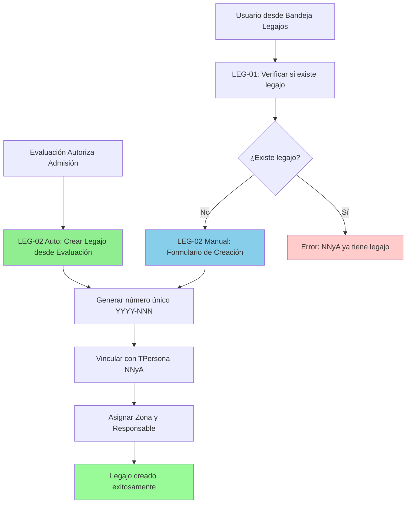

# LEG-02: Creación de Legajo (Automática/Manual)

## Historia de Usuario

**Como** usuario responsable de la decisión resolutiva de una demanda entrante
**Quiero** (1) crear automáticamente un legajo correspondiente a cada uno de los niños involucrados en la demanda admitida y/o (2) crear manualmente un Legajo
**Para** continuar con el ciclo de vida judicial(1) y/o restaurar un ciclo judicial perdido por la no existencia del Legajo(2)

## Contexto Técnico

### Dependencias Completadas
- ✅ **LEG-01**: Lógica de reconocimiento de legajo existente (validación por DNI/documento en TPersona)
- ✅ **BE-05**: LegajoViewSet con endpoints GET /api/legajos/ y /api/legajos/{id}/ (11/11 tests)
- ✅ **BE-06**: Endpoints de gestión TLegajoZona (asignación, derivación, reasignación)
- ✅ **REG-01**: Formulario de registro de demanda con datos de NNyA
- ✅ **EVAL-03**: Score y justificación con decisión de Dirección (Autorizar Admisión)

### Estado del Sistema
```python
# Modelo TLegajo ya existe en infrastructure/models/Persona.py
# Campos existentes:
#   - numero: CharField(max_length=30, unique=True) [autogenerado]
#   - fecha_apertura: DateTimeField(auto_now_add=True)
#   - nnya: OneToOneField(TPersona) [relación 1:1]
#   - urgencia: ForeignKey(TUrgenciaVulneracion)

# Modelo TLegajoZona ya existe para gestión de asignaciones
# Campos clave:
#   - legajo: ForeignKey(TLegajo)
#   - zona: ForeignKey(TZona)
#   - user_responsable: ForeignKey(CustomUser)
#   - tipo_responsabilidad: TRABAJO / CENTRO_VIDA
#   - esta_activo: Boolean

# Service existente:
# services/legajo_codes.py → generate_legajo_number()
# Genera número único formato: YYYY-NNN (ej: 2025-001)
```

## Flujo de Proceso (Según BPMN)



### Actores Involucrados

| Rol | Nivel Usuario | Acción |
|-----|---------------|--------|
| Director Capital/Interior | 3 o 4 | Autoriza admisión (trigger de creación automática) |
| Jefe Zonal | 3 | Puede crear legajo manual |
| Equipo Técnico | 2 | Crea legajo manual (en su zona asignada) |
| Sistema | N/A | Creación automática desde evaluación |

## Descripción del Proceso

### (1) Creación Automática desde Evaluación
1. **Trigger**: Director autoriza admisión en EVAL-03 (Score y Justificación)
2. **Validación**: Sistema verifica que NNyA no tenga legajo existente (LEG-01)
3. **Generación**: Sistema crea legajo automáticamente para cada NNyA admitido
4. **Autocarga de campos**:
   - `numero`: Generado por `generate_legajo_number()` (formato YYYY-NNN)
   - `fecha_apertura`: Timestamp automático
   - `nnya`: Relaciona con TPersona del NNyA
   - `urgencia`: Hereda de la demanda (TUrgenciaVulneracion)
5. **Asignación inicial via TLegajoZona**:
   - `zona`: Zona donde se constataba la demanda
   - `user_responsable`: Usuario responsable de constatación
   - `tipo_responsabilidad`: 'TRABAJO' (centro de vida queda en blanco)
   - `esta_activo`: True
6. **Resultado**: Legajo disponible en Bandeja de Legajos (BE-05)

### (2) Creación Manual por Usuario
1. **Acceso**: Usuario con permisos accede a Bandeja de Legajos
2. **Acción**: Presiona botón "+ Crear Legajo"
3. **Verificación previa**: Sistema sugiere búsqueda (LEG-01) para evitar duplicados
4. **Formulario de creación** (campos obligatorios):
   - **Datos del NNyA** (selección de TPersona existente o crear nueva):
     - Nombre, Apellido
     - DNI / Situación DNI
     - Fecha de nacimiento
     - Nacionalidad, Género
     - Localización (domicilio)
   - **Configuración del Legajo**:
     - Urgencia (TUrgenciaVulneracion)
     - Origen de la demanda
     - Equipo de Trabajo (zona) y Usuario Responsable
     - Local de Centro de Vida (opcional, vía TLocalCentroVida)
     - Equipo de Centro de Vida y Usuario Responsable (opcional)
5. **Autocarga de campos**:
   - `numero`: Generado automáticamente
   - `fecha_apertura`: Timestamp automático
6. **Validación**: Sistema valida que NNyA no tenga legajo previo
7. **Creación**: Sistema crea legajo y asignaciones (TLegajoZona)
8. **Resultado**: Legajo disponible en Bandeja de Legajos (BE-05)

## Criterios de Aceptación

### CA-1: Precondiciones Generales
- [ ] El NNyA no debe tener legajo existente (restricción OneToOne en TPersona)
- [ ] Usuario debe tener permisos según su rol y zona
- [ ] Sistema debe generar número único secuencial por año

### CA-2: Creación Automática desde Evaluación
- [ ] Trigger automático al autorizar admisión en EVAL-03
- [ ] Sistema crea legajo para cada NNyA marcado en decisión de dirección
- [ ] Número de legajo se genera automáticamente (YYYY-NNN)
- [ ] Fecha de apertura se autocompleta con timestamp actual
- [ ] Urgencia se hereda de la demanda evaluada
- [ ] Zona y usuario responsable se heredan de constatación
- [ ] Tipo de responsabilidad inicial es 'TRABAJO'
- [ ] Centro de vida queda sin asignar (posterior vía BE-06)
- [ ] Sistema previene duplicados (validación pre-creación)
- [ ] Si NNyA ya tiene legajo, sistema vincula demanda al legajo existente
- [ ] Sistema notifica a equipo asignado sobre nuevo legajo

### CA-3: Creación Manual de Legajo
- [ ] Formulario de creación accesible desde Bandeja de Legajos (BE-05)
- [ ] Botón "+ Crear Legajo" visible según permisos de usuario
- [ ] Sistema sugiere búsqueda previa (LEG-01) antes de crear
- [ ] Validación en tiempo real de DNI para detectar legajo existente
- [ ] Campos obligatorios de TPersona:
  - Nombre, Apellido
  - DNI o documento identificatorio
  - Fecha de nacimiento o edad aproximada
  - Nacionalidad
  - Género
  - Localización (domicilio)
- [ ] Campos obligatorios de TLegajo:
  - NNyA (TPersona seleccionada o creada)
  - Urgencia (selección de catálogo)
- [ ] Campos obligatorios de TLegajoZona (Trabajo):
  - Zona de trabajo
  - Usuario responsable de trabajo
- [ ] Campos opcionales de TLegajoZona (Centro de Vida):
  - Local de centro de vida
  - Zona de centro de vida
  - Usuario responsable de centro de vida
- [ ] Número se genera automáticamente (no editable)
- [ ] Fecha de apertura se autocompleta (no editable)
- [ ] Sistema crea TPersona si no existe (con flag nnya=True)
- [ ] Sistema crea TLegajo con relación OneToOne a TPersona
- [ ] Sistema crea uno o dos registros TLegajoZona según configuración

### CA-4: Generación de Número de Legajo
- [ ] Formato: YYYY-NNN (ej: 2025-001, 2025-002)
- [ ] Año corresponde al año de apertura
- [ ] Número secuencial por año (reinicia cada año en 001)
- [ ] Número es único en toda la base de datos
- [ ] Sistema previene colisiones de número (constraint unique)
- [ ] Generación automática vía `services/legajo_codes.py`
- [ ] No se permite edición manual del número

### CA-5: Validaciones de Negocio
- [ ] No permitir duplicados para mismo NNyA (constraint OneToOne)
- [ ] Validar que TPersona tenga flag `nnya=True` (menor de edad)
- [ ] Validar permisos según rol de usuario:
  - Nivel 2 (ET): Solo en su zona asignada
  - Nivel 3 (JZ): En su zona o zonas subordinadas
  - Nivel 3-4 (Director): En toda su jurisdicción
  - Nivel 5 (Admin): Sin restricciones
- [ ] Validar que zona de asignación exista y esté activa
- [ ] Validar que usuario responsable pertenezca a la zona
- [ ] Validar que local de centro de vida pertenezca a zona (si se especifica)
- [ ] Prevenir creación si datos obligatorios incompletos
- [ ] Sistema marca registro activo por defecto

### CA-6: Asignación Inicial (TLegajoZona)
- [ ] **Creación automática**: Crea TLegajoZona tipo 'TRABAJO' con:
  - Zona y responsable de constatación
  - `esta_activo=True`
  - `recibido=True` (ya está en la zona)
- [ ] **Creación manual**: Crea uno o dos TLegajoZona:
  - Obligatorio: tipo 'TRABAJO' (equipo de trabajo)
  - Opcional: tipo 'CENTRO_VIDA' (si se especifica local)
- [ ] Solo un TLegajoZona activo por tipo de responsabilidad
- [ ] Sistema registra usuario creador en `enviado_por`
- [ ] Fechas de asignación se autocompletar

### CA-7: Response Structure
- [ ] **Creación exitosa**: HTTP 201 Created
  ```json
  {
    "id": 1,
    "numero": "2025-001",
    "fecha_apertura": "2025-10-13T10:30:00Z",
    "nnya": {
      "id": 10,
      "nombre": "Juan",
      "apellido": "Pérez",
      "dni": 12345678,
      "fecha_nacimiento": "2015-05-15"
    },
    "urgencia": {
      "id": 2,
      "nombre": "Media"
    },
    "zona_trabajo": {
      "id": 5,
      "nombre": "Zona Norte"
    },
    "user_responsable_trabajo": {
      "id": 20,
      "nombre_completo": "María González"
    },
    "centro_vida": null,
    "origen": "Evaluación automática desde demanda #450"
  }
  ```
- [ ] **Error duplicado**: HTTP 409 Conflict
  ```json
  {
    "error": "DUPLICATE_LEGAJO",
    "detail": "El NNyA Juan Pérez (DNI 12345678) ya tiene un legajo asignado (2024-123)"
  }
  ```
- [ ] **Error validación**: HTTP 400 Bad Request
  ```json
  {
    "error": "VALIDATION_ERROR",
    "detail": {
      "nnya": ["Solo se pueden crear legajos para NNyAs (menores de edad)"],
      "urgencia": ["Este campo es obligatorio"]
    }
  }
  ```
- [ ] **Error permisos**: HTTP 403 Forbidden
  ```json
  {
    "error": "PERMISSION_DENIED",
    "detail": "No tiene permisos para crear legajos en esta zona"
  }
  ```

### CA-8: Integración con Otros Módulos
- [ ] Integración con LEG-01 (reconocimiento previo)
- [ ] Integración con BE-05 (listado inmediato)
- [ ] Integración con BE-06 (gestión posterior)
- [ ] Vinculación con demanda original (si es creación automática)
- [ ] Preparación para MED-01 (Registro de Medida)
- [ ] Preparación para PLTM-01 (Plan de Trabajo)

## Estructura de Datos

### Modelo TLegajo (Existente - Sin cambios)
```python
# Ubicación: infrastructure/models/Persona.py

class TLegajoBase(models.Model):
    numero = models.CharField(max_length=30, unique=True, null=False, blank=False)
    fecha_apertura = models.DateTimeField(auto_now_add=True)
    nnya = models.OneToOneField('TPersona', on_delete=models.CASCADE, related_name="legajo")
    urgencia = models.ForeignKey('infrastructure.TUrgenciaVulneracion', on_delete=models.SET_NULL, null=True, blank=True)

    class Meta:
        abstract = True
        constraints = [
            models.UniqueConstraint(fields=["nnya"], name="uniq_legajo_por_nnya")
        ]

class TLegajo(TLegajoBase):
    def save(self, *args, **kwargs):
        if not self.numero:
            from services.legajo_codes import generate_legajo_number
            self.numero = generate_legajo_number()
        super().save(*args, **kwargs)
```

### Modelo TLegajoZona (Existente - Sin cambios)
```python
# Ubicación: infrastructure/models/Persona.py

class TLegajoZonaBase(models.Model):
    esta_activo = models.BooleanField(default=True)
    recibido = models.BooleanField(default=False)
    comentarios = models.TextField(null=True, blank=True)

    legajo = models.ForeignKey('TLegajo', on_delete=models.CASCADE)
    zona = models.ForeignKey('customAuth.TZona', on_delete=models.CASCADE)
    user_responsable = models.ForeignKey('customAuth.CustomUser', related_name="%(class)sencargado", on_delete=models.PROTECT, null=True)

    enviado_por = models.ForeignKey('customAuth.CustomUser', related_name="%(class)senviado_por", on_delete=models.PROTECT, null=True)
    recibido_por = models.ForeignKey('customAuth.CustomUser', related_name="%(class)srecibido_por", on_delete=models.PROTECT, null=True)

    TIPO_RESPONSABILIDAD_CHOICES = [
        ('TRABAJO', 'Responsable de Trabajo'),
        ('CENTRO_VIDA', 'Responsable de Centro de Vida'),
    ]
    tipo_responsabilidad = models.CharField(max_length=20, choices=TIPO_RESPONSABILIDAD_CHOICES, default='TRABAJO')
    local_centro_vida = models.ForeignKey('TLocalCentroVida', on_delete=models.SET_NULL, null=True, blank=True)
```

### Modelo TPersona (Existente - Campos relevantes)
```python
# Ubicación: infrastructure/models/Persona.py

class TPersonaBase(models.Model):
    deleted = models.BooleanField(default=False)
    nombre = models.CharField(max_length=255, null=False, blank=False)
    apellido = models.CharField(max_length=255, null=False, blank=False)
    fecha_nacimiento = models.DateField(null=True, blank=True)
    edad_aproximada = models.IntegerField(null=True, blank=True)
    nacionalidad = models.CharField(max_length=10, choices=NACIONALIDAD_CHOICES)
    dni = models.IntegerField(null=True, blank=True)
    situacion_dni = models.CharField(max_length=20, choices=SITUACION_DNI_CHOICES)
    genero = models.CharField(max_length=10, choices=GENERO_CHOICES)
    # ... otros campos (localización, contacto, etc.)

    # Flag para identificar NNyAs (menores de edad)
    nnya = models.BooleanField(default=False)
```

## Serializers

### LegajoCreateManualSerializer (Existente - Extender)
```python
# Ubicación: api/serializers/LegajoSerializer.py

class LegajoCreateManualSerializer(serializers.ModelSerializer):
    """
    Serializer for manual legajo creation.
    Valida que NNyA no tenga legajo existente.
    """

    # Nested serializer para crear NNyA si no existe
    nnya_data = NinoCreateSerializer(required=False, write_only=True)

    # Campos de asignación (TLegajoZona)
    zona_trabajo_id = serializers.IntegerField(required=True)
    user_responsable_trabajo_id = serializers.IntegerField(required=True)

    # Opcionales para centro de vida
    local_centro_vida_id = serializers.IntegerField(required=False, allow_null=True)
    zona_centro_vida_id = serializers.IntegerField(required=False, allow_null=True)
    user_responsable_centro_vida_id = serializers.IntegerField(required=False, allow_null=True)

    origen = serializers.CharField(required=False, allow_blank=True, max_length=500)

    class Meta:
        model = TLegajo
        fields = [
            'nnya', 'nnya_data', 'urgencia',
            'zona_trabajo_id', 'user_responsable_trabajo_id',
            'local_centro_vida_id', 'zona_centro_vida_id', 'user_responsable_centro_vida_id',
            'origen'
        ]

    def validate_nnya(self, value):
        """Ensure NNyA doesn't already have a legajo"""
        if hasattr(value, 'legajo') and value.legajo is not None:
            raise serializers.ValidationError(
                f"El NNyA {value.nombre} {value.apellido} ya tiene un legajo asignado: {value.legajo.numero}"
            )
        if not value.nnya:
            raise serializers.ValidationError(
                "Solo se pueden crear legajos para NNyAs (menores de edad)."
            )
        return value

    def validate_zona_trabajo_id(self, value):
        """Validar que zona de trabajo existe y usuario tiene permisos"""
        user = self.context.get('request').user

        # Validar que zona existe
        try:
            zona = TZona.objects.get(id=value)
        except TZona.DoesNotExist:
            raise serializers.ValidationError("Zona de trabajo no existe")

        # Validar permisos según rol
        # Nivel 2: Solo su zona
        # Nivel 3+: Su zona o zonas subordinadas
        # Implementar lógica de permisos

        return value

    def validate(self, data):
        """Validaciones complejas entre campos"""

        # Si se especifica nnya_data, crear NNyA primero
        if 'nnya_data' in data:
            # Validar que nnya no esté presente
            if 'nnya' in data:
                raise serializers.ValidationError({
                    'nnya': 'No puede especificar nnya y nnya_data simultáneamente'
                })

            # Validar que DNI no exista ya
            dni = data['nnya_data'].get('dni')
            if dni and TPersona.objects.filter(dni=dni, nnya=True).exists():
                raise serializers.ValidationError({
                    'nnya_data': f'Ya existe un NNyA con DNI {dni}'
                })

        # Validar campos de centro de vida (todos o ninguno)
        centro_vida_fields = [
            data.get('local_centro_vida_id'),
            data.get('zona_centro_vida_id'),
            data.get('user_responsable_centro_vida_id')
        ]

        if any(centro_vida_fields) and not all(centro_vida_fields):
            raise serializers.ValidationError({
                'centro_vida': 'Si especifica centro de vida, debe completar local, zona y responsable'
            })

        # Validar que usuario responsable pertenece a zona
        self._validar_usuario_en_zona(
            data.get('user_responsable_trabajo_id'),
            data.get('zona_trabajo_id'),
            'trabajo'
        )

        if data.get('user_responsable_centro_vida_id'):
            self._validar_usuario_en_zona(
                data.get('user_responsable_centro_vida_id'),
                data.get('zona_centro_vida_id'),
                'centro_vida'
            )

        return data

    def _validar_usuario_en_zona(self, user_id, zona_id, tipo):
        """Validar que usuario pertenece a zona especificada"""
        if not TCustomUserZona.objects.filter(user_id=user_id, zona_id=zona_id).exists():
            raise serializers.ValidationError({
                f'user_responsable_{tipo}_id': f'Usuario no pertenece a la zona de {tipo}'
            })

    def create(self, validated_data):
        """
        Crea legajo con asignaciones de zona.
        Maneja creación de NNyA si viene en nnya_data.
        """
        # Extraer campos de asignación
        zona_trabajo_id = validated_data.pop('zona_trabajo_id')
        user_responsable_trabajo_id = validated_data.pop('user_responsable_trabajo_id')

        local_centro_vida_id = validated_data.pop('local_centro_vida_id', None)
        zona_centro_vida_id = validated_data.pop('zona_centro_vida_id', None)
        user_responsable_centro_vida_id = validated_data.pop('user_responsable_centro_vida_id', None)

        origen = validated_data.pop('origen', 'Creación manual')

        # Crear NNyA si viene en nnya_data
        if 'nnya_data' in validated_data:
            nnya_data = validated_data.pop('nnya_data')
            nnya_data['nnya'] = True  # Flag obligatorio
            nnya = TPersona.objects.create(**nnya_data)
            validated_data['nnya'] = nnya

        # Crear legajo (número se genera automáticamente en save())
        legajo = TLegajo.objects.create(**validated_data)

        # Crear asignación de trabajo (obligatoria)
        TLegajoZona.objects.create(
            legajo=legajo,
            zona_id=zona_trabajo_id,
            user_responsable_id=user_responsable_trabajo_id,
            tipo_responsabilidad='TRABAJO',
            esta_activo=True,
            recibido=True,  # Creación manual = ya recibido
            enviado_por=self.context.get('request').user,
            comentarios=origen
        )

        # Crear asignación de centro de vida (opcional)
        if local_centro_vida_id:
            TLegajoZona.objects.create(
                legajo=legajo,
                zona_id=zona_centro_vida_id,
                user_responsable_id=user_responsable_centro_vida_id,
                tipo_responsabilidad='CENTRO_VIDA',
                local_centro_vida_id=local_centro_vida_id,
                esta_activo=True,
                recibido=True,
                enviado_por=self.context.get('request').user,
                comentarios=origen
            )

        return legajo
```

### NinoCreateSerializer (Nuevo)
```python
# Ubicación: api/serializers/LegajoSerializer.py

class NinoCreateSerializer(serializers.ModelSerializer):
    """
    Serializer para crear NNyA dentro de creación de legajo.
    Valida campos obligatorios del modelo TPersona.
    """

    class Meta:
        model = TPersona
        fields = [
            'nombre', 'apellido',
            'dni', 'situacion_dni',
            'fecha_nacimiento', 'edad_aproximada',
            'nacionalidad', 'genero',
            # Campos de localización
            'domicilio_calle', 'domicilio_numero',
            'domicilio_localidad', 'domicilio_provincia'
        ]

    def validate(self, data):
        """Validar que al menos fecha_nacimiento o edad_aproximada estén presentes"""
        if not data.get('fecha_nacimiento') and not data.get('edad_aproximada'):
            raise serializers.ValidationError({
                'fecha_nacimiento': 'Debe especificar fecha de nacimiento o edad aproximada'
            })
        return data
```

### LegajoCreateAutoSerializer (Nuevo - Para creación automática)
```python
# Ubicación: api/serializers/LegajoSerializer.py

class LegajoCreateAutoSerializer(serializers.Serializer):
    """
    Serializer para creación automática de legajo desde evaluación.
    No requiere campos de usuario, todo se hereda de la demanda.
    """

    id_demanda = serializers.IntegerField(required=True)
    id_nnya = serializers.IntegerField(required=True)

    def validate_id_demanda(self, value):
        """Validar que demanda existe y está autorizada para admisión"""
        try:
            demanda = TDemanda.objects.get(id=value)
        except TDemanda.DoesNotExist:
            raise serializers.ValidationError("Demanda no existe")

        # Validar que demanda está en estado "Autorizada para Admisión"
        # (Implementar según lógica de EVAL-03)

        return value

    def validate_id_nnya(self, value):
        """Validar que NNyA existe y no tiene legajo"""
        try:
            nnya = TPersona.objects.get(id=value, nnya=True)
        except TPersona.DoesNotExist:
            raise serializers.ValidationError("NNyA no existe")

        if hasattr(nnya, 'legajo') and nnya.legajo is not None:
            raise serializers.ValidationError(
                f"El NNyA ya tiene un legajo asignado: {nnya.legajo.numero}"
            )

        return value

    def create(self, validated_data):
        """
        Crea legajo automáticamente heredando datos de la demanda.
        """
        demanda = TDemanda.objects.get(id=validated_data['id_demanda'])
        nnya = TPersona.objects.get(id=validated_data['id_nnya'])

        # Crear legajo con datos heredados
        legajo = TLegajo.objects.create(
            nnya=nnya,
            urgencia=demanda.urgencia  # Hereda urgencia de demanda
        )

        # Crear asignación de trabajo heredando de constatación
        # (Buscar zona y responsable actual de la demanda)
        zona_actual = demanda.zona_actual  # Implementar según modelo
        responsable_actual = demanda.responsable_actual  # Implementar según modelo

        TLegajoZona.objects.create(
            legajo=legajo,
            zona=zona_actual,
            user_responsable=responsable_actual,
            tipo_responsabilidad='TRABAJO',
            esta_activo=True,
            recibido=True,
            enviado_por=responsable_actual,
            comentarios=f"Creación automática desde demanda #{demanda.id}"
        )

        return legajo
```

## Endpoints

### POST /api/legajos/ (Creación Manual)
**Descripción**: Crear legajo manualmente desde Bandeja de Legajos

**Permisos**: Equipo Técnico (nivel 2+), Jefe Zonal (nivel 3+), Director (nivel 3-4)

**Request Body**:
```json
{
  "nnya": 10,  // ID de TPersona existente
  "urgencia": 2,  // ID de TUrgenciaVulneracion
  "zona_trabajo_id": 5,
  "user_responsable_trabajo_id": 20,
  "origen": "Registro manual - caso restaurado"
}
```

**O con creación de NNyA**:
```json
{
  "nnya_data": {
    "nombre": "Juan",
    "apellido": "Pérez",
    "dni": 12345678,
    "situacion_dni": "VALIDO",
    "fecha_nacimiento": "2015-05-15",
    "nacionalidad": "ARGENTINA",
    "genero": "MASCULINO",
    "domicilio_calle": "San Martín",
    "domicilio_numero": "123",
    "domicilio_localidad": "San Fernando del Valle de Catamarca",
    "domicilio_provincia": "Catamarca"
  },
  "urgencia": 2,
  "zona_trabajo_id": 5,
  "user_responsable_trabajo_id": 20,
  "local_centro_vida_id": 3,
  "zona_centro_vida_id": 6,
  "user_responsable_centro_vida_id": 25
}
```

**Response 201 Created**:
```json
{
  "id": 1,
  "numero": "2025-001",
  "fecha_apertura": "2025-10-13T10:30:00Z",
  "nnya": {
    "id": 10,
    "nombre": "Juan",
    "apellido": "Pérez",
    "nombre_completo": "Juan Pérez",
    "dni": 12345678,
    "fecha_nacimiento": "2015-05-15"
  },
  "urgencia": {
    "id": 2,
    "nombre": "Media"
  },
  "zona_trabajo": {
    "id": 5,
    "nombre": "Zona Norte"
  },
  "user_responsable_trabajo": {
    "id": 20,
    "nombre_completo": "María González",
    "username": "mgonzalez"
  },
  "centro_vida": {
    "local": {
      "id": 3,
      "nombre": "Hogar San José"
    },
    "zona": {
      "id": 6,
      "nombre": "Zona Sur"
    },
    "user_responsable": {
      "id": 25,
      "nombre_completo": "Pedro Ramírez"
    }
  },
  "origen": "Registro manual - caso restaurado",
  "message": "Legajo creado exitosamente. Visible en Bandeja de Legajos (BE-05)."
}
```

**Response 400 Bad Request**:
```json
{
  "error": "VALIDATION_ERROR",
  "detail": {
    "nnya": ["Solo se pueden crear legajos para NNyAs (menores de edad)"],
    "urgencia": ["Este campo es obligatorio"],
    "zona_trabajo_id": ["Zona de trabajo no existe"]
  }
}
```

**Response 403 Forbidden**:
```json
{
  "error": "PERMISSION_DENIED",
  "detail": "No tiene permisos para crear legajos en esta zona"
}
```

**Response 409 Conflict**:
```json
{
  "error": "DUPLICATE_LEGAJO",
  "detail": "El NNyA Juan Pérez (DNI 12345678) ya tiene un legajo asignado: 2024-123",
  "legajo_existente": {
    "id": 50,
    "numero": "2024-123",
    "fecha_apertura": "2024-03-10T09:00:00Z"
  }
}
```

### POST /api/evaluaciones/{id_evaluacion}/crear-legajos/ (Creación Automática)
**Descripción**: Crear legajos automáticamente al autorizar admisión en evaluación

**Permisos**: Director (nivel 3-4) - Llamado automáticamente por EVAL-03

**Request Body**:
```json
{
  "id_demanda": 450,
  "nnya_ids": [10, 11, 12]  // IDs de NNyAs a admitir
}
```

**Response 201 Created**:
```json
{
  "legajos_creados": [
    {
      "id": 1,
      "numero": "2025-001",
      "nnya": {
        "id": 10,
        "nombre": "Juan",
        "apellido": "Pérez"
      }
    },
    {
      "id": 2,
      "numero": "2025-002",
      "nnya": {
        "id": 11,
        "nombre": "María",
        "apellido": "López"
      }
    }
  ],
  "legajos_existentes": [
    {
      "nnya_id": 12,
      "legajo_numero": "2024-150",
      "message": "NNyA ya tenía legajo. Demanda vinculada al legajo existente."
    }
  ],
  "total_creados": 2,
  "total_existentes": 1,
  "message": "Proceso completado. 2 legajos creados, 1 vinculado a legajo existente."
}
```

**Response 409 Conflict** (si algún NNyA ya tiene legajo):
```json
{
  "warning": "PARTIAL_CREATION",
  "detail": "Algunos NNyAs ya tenían legajo asignado",
  "legajos_creados": [...],
  "legajos_existentes": [...]
}
```

### GET /api/legajos/{id}/
**Descripción**: Obtener detalle de legajo creado (Reutiliza BE-05 existente)

**Permisos**: Según permisos de zona

**Response 200 OK**: (Ver LegajoDetalleSerializer existente)

## Lógica de Negocio

### Función: crear_legajo_manual()
```python
def crear_legajo_manual(
    user,
    nnya_id=None,
    nnya_data=None,
    urgencia_id,
    zona_trabajo_id,
    user_responsable_trabajo_id,
    local_centro_vida_id=None,
    zona_centro_vida_id=None,
    user_responsable_centro_vida_id=None,
    origen="Creación manual"
):
    """
    Crea legajo manualmente desde Bandeja de Legajos.

    Args:
        user: Usuario que crea el legajo
        nnya_id: ID de TPersona existente (mutuamente excluyente con nnya_data)
        nnya_data: Dict con datos para crear TPersona (mutuamente excluyente con nnya_id)
        urgencia_id: ID de TUrgenciaVulneracion
        zona_trabajo_id: ID de zona para equipo de trabajo
        user_responsable_trabajo_id: ID de usuario responsable de trabajo
        local_centro_vida_id: ID de local (opcional, para centro de vida)
        zona_centro_vida_id: ID de zona para centro de vida (opcional)
        user_responsable_centro_vida_id: ID de usuario responsable centro vida (opcional)
        origen: Descripción del origen (default: "Creación manual")

    Returns:
        TLegajo: Legajo creado con asignaciones

    Raises:
        ValidationError: Si validaciones fallan
        PermissionError: Si usuario no tiene permisos en zona
        IntegrityError: Si NNyA ya tiene legajo
    """

    # 1. Validar permisos del usuario en zona
    _validar_permisos_zona(user, zona_trabajo_id)

    # 2. Obtener o crear NNyA
    if nnya_id:
        nnya = TPersona.objects.get(id=nnya_id)

        # Validar que sea NNyA
        if not nnya.nnya:
            raise ValidationError("Solo se pueden crear legajos para NNyAs (menores de edad)")

        # Validar que no tenga legajo
        if hasattr(nnya, 'legajo') and nnya.legajo is not None:
            raise IntegrityError(
                f"El NNyA {nnya.nombre} {nnya.apellido} ya tiene un legajo asignado: {nnya.legajo.numero}"
            )

    elif nnya_data:
        # Validar DNI único
        if nnya_data.get('dni'):
            if TPersona.objects.filter(dni=nnya_data['dni'], nnya=True).exists():
                raise IntegrityError(f"Ya existe un NNyA con DNI {nnya_data['dni']}")

        # Crear NNyA
        nnya_data['nnya'] = True
        nnya = TPersona.objects.create(**nnya_data)

    else:
        raise ValidationError("Debe especificar nnya_id o nnya_data")

    # 3. Validar urgencia
    try:
        urgencia = TUrgenciaVulneracion.objects.get(id=urgencia_id)
    except TUrgenciaVulneracion.DoesNotExist:
        raise ValidationError("Urgencia no existe")

    # 4. Crear legajo (número se genera automáticamente)
    legajo = TLegajo.objects.create(
        nnya=nnya,
        urgencia=urgencia
    )

    # 5. Crear asignación de trabajo (obligatoria)
    _crear_asignacion_trabajo(
        legajo=legajo,
        zona_id=zona_trabajo_id,
        user_responsable_id=user_responsable_trabajo_id,
        enviado_por=user,
        origen=origen
    )

    # 6. Crear asignación de centro de vida (opcional)
    if local_centro_vida_id:
        _validar_campos_centro_vida(
            local_centro_vida_id,
            zona_centro_vida_id,
            user_responsable_centro_vida_id
        )

        _crear_asignacion_centro_vida(
            legajo=legajo,
            local_id=local_centro_vida_id,
            zona_id=zona_centro_vida_id,
            user_responsable_id=user_responsable_centro_vida_id,
            enviado_por=user,
            origen=origen
        )

    # 7. Notificar a equipos asignados
    _notificar_equipos_nuevo_legajo(legajo)

    return legajo


def _validar_permisos_zona(user, zona_id):
    """Valida que usuario tenga permisos en zona según su rol"""

    # Admin: sin restricciones
    if user.is_superuser:
        return

    # Obtener zonas del usuario
    user_zonas = TCustomUserZona.objects.filter(user=user)

    # Nivel 2 (ET): Solo su zona asignada
    if user_zonas.filter(zona_id=zona_id).exists():
        return

    # Nivel 3+ (JZ/Director): Su zona o zonas subordinadas
    # Implementar lógica de jerarquía de zonas

    raise PermissionError("No tiene permisos para crear legajos en esta zona")


def _crear_asignacion_trabajo(legajo, zona_id, user_responsable_id, enviado_por, origen):
    """Crea registro TLegajoZona para equipo de trabajo"""

    # Validar que usuario pertenece a zona
    if not TCustomUserZona.objects.filter(user_id=user_responsable_id, zona_id=zona_id).exists():
        raise ValidationError("Usuario responsable no pertenece a la zona de trabajo")

    TLegajoZona.objects.create(
        legajo=legajo,
        zona_id=zona_id,
        user_responsable_id=user_responsable_id,
        tipo_responsabilidad='TRABAJO',
        esta_activo=True,
        recibido=True,  # Creación manual = ya recibido
        enviado_por=enviado_por,
        recibido_por=enviado_por,
        comentarios=origen
    )


def _validar_campos_centro_vida(local_id, zona_id, user_responsable_id):
    """Valida que todos los campos de centro de vida estén completos"""
    if not all([local_id, zona_id, user_responsable_id]):
        raise ValidationError(
            "Si especifica centro de vida, debe completar local, zona y responsable"
        )

    # Validar que local existe y pertenece a zona
    try:
        local = TLocalCentroVida.objects.get(id=local_id)
        if local.zona_id != zona_id:
            raise ValidationError("Local de centro de vida no pertenece a la zona especificada")
    except TLocalCentroVida.DoesNotExist:
        raise ValidationError("Local de centro de vida no existe")


def _crear_asignacion_centro_vida(legajo, local_id, zona_id, user_responsable_id, enviado_por, origen):
    """Crea registro TLegajoZona para centro de vida"""

    # Validar que usuario pertenece a zona
    if not TCustomUserZona.objects.filter(user_id=user_responsable_id, zona_id=zona_id).exists():
        raise ValidationError("Usuario responsable no pertenece a la zona de centro de vida")

    TLegajoZona.objects.create(
        legajo=legajo,
        zona_id=zona_id,
        user_responsable_id=user_responsable_id,
        tipo_responsabilidad='CENTRO_VIDA',
        local_centro_vida_id=local_id,
        esta_activo=True,
        recibido=True,
        enviado_por=enviado_por,
        recibido_por=enviado_por,
        comentarios=origen
    )


def _notificar_equipos_nuevo_legajo(legajo):
    """Notifica a equipos asignados sobre nuevo legajo"""
    # Implementar usando sistema de notificaciones existente
    # NOTINT-01: Historial de notificaciones
    pass
```

### Función: crear_legajos_desde_evaluacion()
```python
def crear_legajos_desde_evaluacion(
    id_demanda,
    nnya_ids,
    user_director
):
    """
    Crea legajos automáticamente al autorizar admisión en evaluación.
    Llamado desde EVAL-03 cuando Director autoriza admisión.

    Args:
        id_demanda: ID de TDemanda evaluada
        nnya_ids: Lista de IDs de TPersona (NNyAs) a admitir
        user_director: Usuario Director que autoriza

    Returns:
        dict: {
            'legajos_creados': [lista de legajos creados],
            'legajos_existentes': [lista de NNyAs que ya tenían legajo],
            'total_creados': int,
            'total_existentes': int
        }

    Raises:
        ValidationError: Si demanda no está en estado correcto
        PermissionError: Si usuario no es Director
    """

    # 1. Validar que usuario es Director
    if not user_director.is_director:
        raise PermissionError("Solo Directores pueden autorizar admisión")

    # 2. Obtener demanda y validar estado
    try:
        demanda = TDemanda.objects.get(id=id_demanda)
    except TDemanda.DoesNotExist:
        raise ValidationError("Demanda no existe")

    # Validar que demanda está en estado "Autorizada para Admisión"
    # (Implementar según lógica de EVAL-03)

    # 3. Obtener zona y responsable actual de demanda
    zona_actual = demanda.zona_actual  # Implementar según modelo TDemanda
    responsable_actual = demanda.responsable_actual
    urgencia = demanda.urgencia

    # 4. Procesar cada NNyA
    legajos_creados = []
    legajos_existentes = []

    for nnya_id in nnya_ids:
        try:
            nnya = TPersona.objects.get(id=nnya_id, nnya=True)
        except TPersona.DoesNotExist:
            # Log error y continuar
            continue

        # Verificar si ya tiene legajo (LEG-01)
        if hasattr(nnya, 'legajo') and nnya.legajo is not None:
            # Vincular demanda al legajo existente
            legajo_existente = nnya.legajo
            _vincular_demanda_a_legajo(demanda, legajo_existente)

            legajos_existentes.append({
                'nnya_id': nnya_id,
                'legajo_numero': legajo_existente.numero,
                'message': 'NNyA ya tenía legajo. Demanda vinculada al legajo existente.'
            })
            continue

        # Crear legajo nuevo
        legajo = TLegajo.objects.create(
            nnya=nnya,
            urgencia=urgencia
        )

        # Crear asignación de trabajo heredando de demanda
        TLegajoZona.objects.create(
            legajo=legajo,
            zona=zona_actual,
            user_responsable=responsable_actual,
            tipo_responsabilidad='TRABAJO',
            esta_activo=True,
            recibido=True,
            enviado_por=user_director,
            recibido_por=responsable_actual,
            comentarios=f"Creación automática desde demanda #{demanda.id} - Evaluación autorizada por {user_director.get_full_name()}"
        )

        # Vincular demanda al legajo
        _vincular_demanda_a_legajo(demanda, legajo)

        legajos_creados.append(legajo)

    # 5. Notificar equipos asignados
    for legajo in legajos_creados:
        _notificar_equipos_nuevo_legajo(legajo)

    # 6. Actualizar estado de demanda
    # (Implementar según lógica de estados de demanda)

    return {
        'legajos_creados': [
            {
                'id': leg.id,
                'numero': leg.numero,
                'nnya': {
                    'id': leg.nnya.id,
                    'nombre': leg.nnya.nombre,
                    'apellido': leg.nnya.apellido
                }
            }
            for leg in legajos_creados
        ],
        'legajos_existentes': legajos_existentes,
        'total_creados': len(legajos_creados),
        'total_existentes': len(legajos_existentes)
    }


def _vincular_demanda_a_legajo(demanda, legajo):
    """
    Vincula demanda a legajo existente o recién creado.
    Actualiza relación en modelo TDemanda.
    """
    # Implementar según estructura de modelo TDemanda
    # demanda.legajo = legajo
    # demanda.save()
    pass
```

## Tests Requeridos

### Tests Unitarios (15-18 tests mínimo)

#### test_legajo_creacion_manual.py
```python
class TestLegajoCreacionManual(TestCase):
    """Tests para creación manual de legajo"""

    def test_crear_legajo_manual_con_nnya_existente_exitoso(self):
        """Usuario crea legajo seleccionando NNyA existente"""
        pass

    def test_crear_legajo_manual_con_nnya_nuevo_exitoso(self):
        """Usuario crea legajo y NNyA simultáneamente"""
        pass

    def test_numero_legajo_se_genera_automaticamente(self):
        """Número de legajo se genera en formato YYYY-NNN"""
        pass

    def test_fecha_apertura_se_autocompleta(self):
        """Fecha de apertura se autocompleta con timestamp actual"""
        pass

    def test_crear_legajo_con_centro_vida_exitoso(self):
        """Legajo se crea con asignaciones de trabajo y centro de vida"""
        pass

    def test_crear_legajo_solo_trabajo_sin_centro_vida(self):
        """Legajo se crea solo con asignación de trabajo"""
        pass
```

#### test_legajo_creacion_automatica.py
```python
class TestLegajoCreacionAutomatica(TestCase):
    """Tests para creación automática desde evaluación"""

    def test_crear_legajo_automatico_desde_evaluacion_exitoso(self):
        """Sistema crea legajo automáticamente al autorizar admisión"""
        pass

    def test_crear_legajo_hereda_datos_de_demanda(self):
        """Legajo automático hereda urgencia, zona y responsable de demanda"""
        pass

    def test_crear_multiples_legajos_desde_evaluacion(self):
        """Sistema crea múltiples legajos para varios NNyAs en una demanda"""
        pass

    def test_nnya_con_legajo_existente_vincula_demanda(self):
        """Si NNyA ya tiene legajo, sistema vincula demanda al existente"""
        pass
```

#### test_legajo_validaciones.py
```python
class TestLegajoValidaciones(TestCase):
    """Tests de validaciones de negocio"""

    def test_nnya_duplicado_debe_fallar(self):
        """No se puede crear legajo para NNyA que ya tiene uno"""
        pass

    def test_solo_nnya_puede_tener_legajo(self):
        """Solo TPersona con flag nnya=True puede tener legajo"""
        pass

    def test_numero_legajo_debe_ser_unico(self):
        """Número de legajo es único en toda la base de datos"""
        pass

    def test_formato_numero_legajo_correcto(self):
        """Formato de número es YYYY-NNN"""
        pass

    def test_urgencia_debe_existir(self):
        """Urgencia especificada debe existir en catálogo"""
        pass

    def test_zona_debe_existir_y_estar_activa(self):
        """Zona de asignación debe existir y estar activa"""
        pass

    def test_usuario_debe_pertenecer_a_zona(self):
        """Usuario responsable debe pertenecer a zona asignada"""
        pass

    def test_centro_vida_campos_todos_o_ninguno(self):
        """Si se especifica centro de vida, todos sus campos son obligatorios"""
        pass
```

#### test_legajo_permisos.py
```python
class TestLegajoPermisos(TestCase):
    """Tests de permisos según rol de usuario"""

    def test_equipo_tecnico_solo_su_zona(self):
        """Nivel 2 solo puede crear legajos en su zona"""
        pass

    def test_jefe_zonal_su_zona_y_subordinadas(self):
        """Nivel 3 puede crear en su zona y subordinadas"""
        pass

    def test_director_toda_jurisdiccion(self):
        """Nivel 3-4 puede crear en toda su jurisdicción"""
        pass

    def test_admin_sin_restricciones(self):
        """Nivel 5 puede crear legajos en cualquier zona"""
        pass

    def test_usuario_sin_permisos_falla(self):
        """Usuario sin permisos en zona no puede crear legajo"""
        pass
```

#### test_legajo_asignaciones.py
```python
class TestLegajoAsignaciones(TestCase):
    """Tests de asignaciones TLegajoZona"""

    def test_asignacion_trabajo_se_crea_automaticamente(self):
        """TLegajoZona tipo TRABAJO se crea al crear legajo"""
        pass

    def test_asignacion_centro_vida_opcional(self):
        """TLegajoZona tipo CENTRO_VIDA es opcional"""
        pass

    def test_solo_una_asignacion_activa_por_tipo(self):
        """Solo puede haber una asignación activa por tipo"""
        pass

    def test_asignacion_hereda_usuario_creador(self):
        """Campo enviado_por registra usuario que crea legajo"""
        pass

    def test_asignacion_manual_recibido_true(self):
        """Creación manual marca recibido=True"""
        pass
```

### Tests de Integración (5-7 tests)

#### test_legajo_integration.py
```python
class TestLegajoIntegration(TestCase):
    """Tests de integración end-to-end"""

    def test_flujo_completo_creacion_manual_con_nnya_nuevo(self):
        """Flujo completo: Usuario crea NNyA y legajo → visible en BE-05"""
        pass

    def test_flujo_completo_creacion_manual_con_nnya_existente(self):
        """Flujo completo: Usuario busca NNyA (LEG-01) → crea legajo → BE-05"""
        pass

    def test_flujo_completo_creacion_automatica_desde_evaluacion(self):
        """Flujo completo: EVAL-03 autoriza → legajos creados → BE-05"""
        pass

    def test_creacion_multiple_legajos_desde_evaluacion(self):
        """Evaluación con múltiples NNyAs crea múltiples legajos"""
        pass

    def test_nnya_con_legajo_existente_vincula_demanda(self):
        """Si NNyA tiene legajo, demanda se vincula al existente (no duplica)"""
        pass

    def test_legajo_visible_en_be05_inmediatamente(self):
        """Legajo creado es visible inmediatamente en listado BE-05"""
        pass

    def test_notificaciones_se_envian_a_equipos_asignados(self):
        """Notificaciones se envían a responsables al crear legajo"""
        pass
```

## Casos de Uso Detallados

### CU-1: Creación Manual con NNyA Existente
**Actor**: Equipo Técnico (nivel 2)
**Precondición**: NNyA registrado en sistema, sin legajo previo
**Flujo Principal**:
1. Usuario accede a Bandeja de Legajos (BE-05)
2. Usuario presiona botón "+ Crear Legajo"
3. Sistema sugiere búsqueda previa (LEG-01)
4. Usuario busca por DNI y encuentra NNyA existente
5. Usuario selecciona NNyA
6. Sistema pre-completa datos del NNyA (solo lectura)
7. Usuario selecciona urgencia del catálogo
8. Usuario selecciona zona de trabajo (su zona)
9. Usuario selecciona usuario responsable de la zona
10. Usuario opcionalmente completa datos de centro de vida
11. Usuario presiona "Crear Legajo"
12. Sistema valida datos y permisos
13. Sistema genera número de legajo (2025-001)
14. Sistema crea registro TLegajo
15. Sistema crea TLegajoZona para trabajo
16. Sistema crea TLegajoZona para centro de vida (si aplica)
17. Sistema notifica a equipos asignados
18. Sistema redirige a detalle del legajo (BE-05 detalle)

**Postcondición**: Legajo creado y visible en Bandeja de Legajos

### CU-2: Creación Manual con NNyA Nuevo
**Actor**: Jefe Zonal (nivel 3)
**Precondición**: NNyA no existe en sistema
**Flujo Principal**:
1. Usuario accede a Bandeja de Legajos (BE-05)
2. Usuario presiona botón "+ Crear Legajo"
3. Sistema sugiere búsqueda previa (LEG-01)
4. Usuario busca por DNI pero no encuentra resultados
5. Usuario selecciona "Crear Nuevo NNyA"
6. Usuario completa formulario de TPersona:
   - Datos personales (nombre, apellido, DNI, fecha nacimiento)
   - Datos de localización (domicilio)
   - Género, nacionalidad
7. Sistema valida unicidad de DNI
8. Usuario selecciona urgencia
9. Usuario configura asignaciones (trabajo y/o centro vida)
10. Usuario presiona "Crear Legajo"
11. Sistema crea TPersona con flag nnya=True
12. Sistema crea TLegajo vinculado a TPersona
13. Sistema genera número de legajo
14. Sistema crea asignaciones TLegajoZona
15. Sistema notifica a equipos
16. Sistema redirige a detalle del legajo

**Postcondición**: NNyA y Legajo creados, visible en Bandeja de Legajos

### CU-3: Creación Automática desde Evaluación
**Actor**: Director Capital (nivel 3), Sistema
**Precondición**: Demanda evaluada, NNyAs marcados para admisión
**Flujo Principal**:
1. Director completa EVAL-03 (Score y Justificación)
2. Director selecciona NNyAs para admitir (pueden ser 1 o más)
3. Director presiona "Autorizar Admisión"
4. Sistema valida permisos de Director
5. Sistema ejecuta `crear_legajos_desde_evaluacion()`:
   - Para cada NNyA:
     - Valida si ya tiene legajo (LEG-01)
     - Si NO tiene: Crea legajo nuevo
       - Hereda urgencia de demanda
       - Hereda zona de constatación
       - Hereda responsable de constatación
       - Genera número de legajo
       - Crea asignación de trabajo
       - Vincula demanda al legajo
     - Si SÍ tiene: Vincula demanda al legajo existente
6. Sistema notifica a equipos asignados
7. Sistema actualiza estado de demanda
8. Sistema muestra resumen de operación:
   - "2 legajos creados: 2025-001, 2025-002"
   - "1 legajo existente: 2024-150 (vinculado)"

**Postcondición**: Legajos creados y/o vinculados, equipos notificados

### CU-4: Intento de Duplicar Legajo (Validación)
**Actor**: Equipo Técnico (nivel 2)
**Precondición**: NNyA ya tiene legajo asignado
**Flujo Principal**:
1. Usuario accede a creación de legajo
2. Usuario busca NNyA por DNI (LEG-01)
3. Sistema detecta que NNyA ya tiene legajo
4. Sistema muestra alerta:
   - "Juan Pérez (DNI 12345678) ya tiene el legajo 2024-123"
   - "Fecha de apertura: 10/03/2024"
   - "Zona actual: Zona Norte"
5. Sistema ofrece opciones:
   - Ver detalle del legajo existente
   - Buscar otro NNyA
6. Usuario selecciona "Ver detalle"
7. Sistema redirige a detalle del legajo existente (BE-05)

**Postcondición**: Usuario accede al legajo existente, duplicado prevenido

### CU-5: Error en Permisos de Zona
**Actor**: Equipo Técnico Zona Norte (nivel 2)
**Precondición**: Usuario intenta crear legajo en zona diferente
**Flujo Principal**:
1. Usuario accede a creación de legajo
2. Usuario completa datos del NNyA
3. Usuario selecciona "Zona Sur" (no asignada)
4. Usuario presiona "Crear Legajo"
5. Sistema valida permisos:
   - Usuario pertenece a Zona Norte
   - Intenta crear en Zona Sur
   - Rol nivel 2 (ET) solo puede crear en su zona
6. Sistema retorna error HTTP 403:
   - "No tiene permisos para crear legajos en esta zona"
7. Sistema sugiere:
   - "Seleccione su zona asignada: Zona Norte"
8. Usuario corrige zona
9. Usuario presiona "Crear Legajo"
10. Sistema valida exitosamente
11. Legajo se crea en Zona Norte

**Postcondición**: Legajo creado en zona correcta según permisos

## Restricciones por Nivel de Usuario

| Nivel | Rol | Crear Manual | Crear Auto | Zonas Permitidas |
|-------|-----|--------------|------------|------------------|
| 2 | Equipo Técnico | ✅ | ❌ | Solo su zona asignada |
| 3 | Jefe Zonal | ✅ | ❌ | Su zona y subordinadas |
| 3 | Director Capital | ✅ | ✅ | Toda jurisdicción Capital |
| 4 | Director Interior | ✅ | ✅ | Toda jurisdicción Interior |
| 5 | Administrador | ✅ | ✅ | Sin restricciones |

## Notas de Implementación

1. **Reutilizar modelos existentes**: TLegajo, TLegajoZona, TPersona ya están implementados
2. **Service de generación de número**: `services/legajo_codes.py` ya implementado
3. **Validación LEG-01**: Reutilizar lógica de reconocimiento de legajo existente
4. **Integración con BE-05**: Legajo creado debe aparecer inmediatamente en listado
5. **Integración con BE-06**: Asignaciones via TLegajoZona deben funcionar con derivación
6. **Notificaciones**: Usar sistema NOTINT-01 para notificar equipos
7. **Auditoría**: Registrar creador, fecha y origen en comentarios de TLegajoZona
8. **Transacciones**: Usar `@transaction.atomic` para creación de legajo + asignaciones
9. **Validaciones**: Implementar en serializer Y en lógica de negocio (defensa en profundidad)
10. **Signals**: Considerar usar Django signals para notificaciones post-creación

## Relación con Diagramas BPMN

### Flujo Objetivo: Petición de Informe (PI)
```
REG-01 (Registro) → Objetivo PI → LEG-01 (¿Existe legajo?)
  ↓ No existe
  LEG-02 (manual): Crear Legajo
  ↓
  Notificar equipo a cargo del Legajo
  ↓
  PLTM: Auto-crear actividad de respuesta
```

### Flujo Objetivo: Protección
```
REG-01 (Registro) → Objetivo Protección → BE-04 (Derivar/Asignar)
  ↓
  CONS (Constatación) → EVAL (Evaluación) → Decisión Dirección
  ↓ Autorizar Admisión
  LEG-02 (auto): Crear Legajo(s) automáticamente
  ↓
  MED-01: Iniciar Registro de Medida
```

### Carril: Legajo / Equipo Técnico
- **Tarea**: LINKLEG (Relacionar / LEG-02 crear)
- **Origen Manual**: Desde Bandeja de Legajos (BE-05)
- **Origen Automático**: Desde EVAL (Evaluación autorizada)
- **Siguiente Paso**: NOTIF_ET (Notificar equipo del Legajo)

## Integración con Módulos Relacionados

### LEG-01 (Reconocimiento de Legajo)
- **Llamado previo**: Antes de crear legajo manual, sugerir búsqueda
- **Validación automática**: En creación automática, verificar existencia
- **Prevención de duplicados**: Constraint OneToOne + validación de negocio

### BE-05 (Listado de Legajos)
- **Visibilidad inmediata**: Legajo creado debe aparecer en listado
- **Filtros**: Legajos creados deben ser filtrables por zona, responsable, etc.
- **Permisos**: Solo visible según permisos de zona del usuario

### BE-06 (Gestionar Legajo)
- **Asignaciones**: TLegajoZona creado debe funcionar con derivación
- **Historial**: Creación debe registrarse en historial de asignaciones
- **Reasignación**: Legajo creado debe poder ser reasignado posteriormente

### EVAL-03 (Score y Justificación)
- **Trigger**: Autorizar Admisión dispara creación automática
- **Herencia de datos**: Legajo hereda urgencia, zona y responsable
- **Vinculación**: Demanda se vincula al legajo creado

### MED-01 (Registro de Medida)
- **Prerequisito**: Legajo debe existir antes de crear medida
- **Relación**: TMedida se vincula a TLegajo
- **Flujo**: LEG-02 → MED-01 (Registro de Medida)

### PLTM-01 (Plan de Trabajo)
- **Vinculación**: Actividades de PT se vinculan a TLegajo
- **Auto-creación**: Algunas actividades se crean automáticamente al crear legajo

## Definición de Hecho (Definition of Done)

- [ ] Serializers implementados (LegajoCreateManualSerializer, NinoCreateSerializer, LegajoCreateAutoSerializer)
- [ ] Validaciones completas en serializers
- [ ] Endpoint POST /api/legajos/ funcionando (creación manual)
- [ ] Endpoint POST /api/evaluaciones/{id}/crear-legajos/ funcionando (creación automática)
- [ ] Lógica de negocio implementada (crear_legajo_manual, crear_legajos_desde_evaluacion)
- [ ] Generación automática de número de legajo funcionando
- [ ] Asignaciones TLegajoZona creándose correctamente
- [ ] Validación de permisos por rol funcionando
- [ ] Prevención de duplicados (constraint + validaciones)
- [ ] Integración con LEG-01 (reconocimiento previo)
- [ ] Legajos creados visibles en BE-05 inmediatamente
- [ ] Notificaciones a equipos asignados funcionando
- [ ] 15+ tests unitarios passing
- [ ] 5+ tests de integración passing
- [ ] Tests de validación de duplicados
- [ ] Tests de permisos por rol
- [ ] Tests de generación de número
- [ ] Tests de asignaciones TLegajoZona
- [ ] Documentación de API actualizada
- [ ] Migraciones aplicadas (si hay cambios en modelos)
- [ ] Fixtures actualizados (TUrgenciaVulneracion, TLocalCentroVida si aplica)

---

**Fecha de Creación**: 2025-10-13
**Dependencias**: LEG-01 ✅, BE-05 ✅, BE-06 ✅, REG-01 ✅, EVAL-03 ✅
**Siguientes Pasos**: LEG-03 (Búsqueda y Filtrado), LEG-04 (Detalle de Legajo), MED-01 (Registro de Medida)
