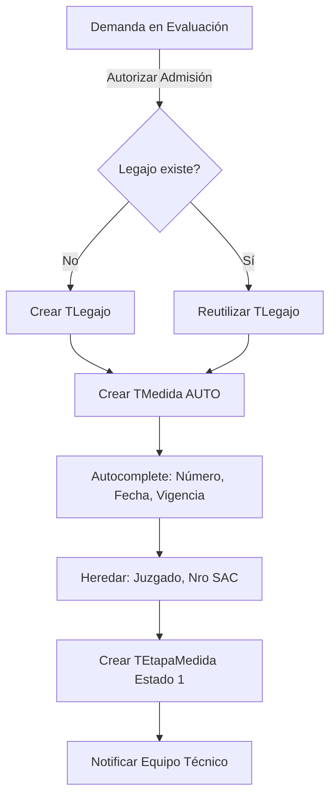
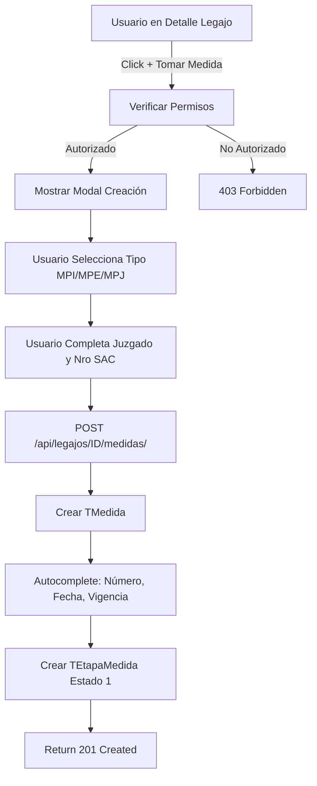

# MED-01: Registro de Medida de Protección (DOCUMENTACIÓN COMPLETA)

> **NOTA:** Esta es la documentación completa de referencia. Para implementación, usar las sub-stories:
> - **MED-01a:** Modelos Base (8 puntos) - [Ver MED-01a_Modelos_Base.md](.claude/stories/MED-01a_Modelos_Base.md)
> - **MED-01b:** Creación Manual (8 puntos) - [Ver MED-01b_Creacion_Manual.md](.claude/stories/MED-01b_Creacion_Manual.md)
> - **MED-01c:** Creación Automática (5 puntos) - [Ver MED-01c_Creacion_Automatica.md](.claude/stories/MED-01c_Creacion_Automatica.md)

**Fecha de Creación:** 2025-10-10
**Sprint:** TBD
**Estimación:** 21 puntos total (Grande) - Dividida en 3 sub-stories
**Prioridad:** Alta
**Estado:** Documentada - Ver sub-stories para implementación

---

## Historia de Usuario

**Como** Usuario responsable del Legajo (Equipo Técnico, Jefe Zonal) perteneciente a la zona/UDER de trabajo correspondiente
**Quiero** registrar medidas de protección MPI (Protección Integral), MPE (Protección Excepcional) o MPJ (Penal Juvenil) asociadas a un legajo existente
**Para** iniciar formalmente el proceso de intervención y comenzar el nuevo proceso de seguimiento de medidas

---

## Contexto del Negocio

### Integración con Otras US

- **LEG-04** (Detalle de Legajo): Visualizar medidas activas desde detalle del legajo
- **BE-05** (Listado de Legajos): Acceso al botón "+ Tomar Medida" desde listado
- **BE-06** (Asignaciones): Usuario responsable del legajo puede crear medidas
- **EVAL-03** (Evaluación Demandas): Apertura automática de medida tras admisión de demanda
- **MED-02** (Registro de Intervención): Siguiente paso tras crear medida
- **MED-03** (Nota de Aval): Aprobación de medida por Director
- **MED-04** (Informe Jurídico): Carga de informe legal
- **MED-05** (Ratificación Judicial): Cierre del ciclo jurídico

### Tipos de Medidas

**MPI - Medida de Protección Integral:**
- Intervención en situaciones de vulneración de derechos
- No requiere separación del NNyA de su familia
- Seguimiento y acompañamiento técnico

**MPE - Medida de Protección Excepcional:**
- Separación temporal del NNyA de su familia
- Requiere dispositivo institucional (hogar, centro de vida)
- Mayor complejidad jurídica y administrativa

**MPJ - Medida Penal Juvenil:**
- Aplicada a adolescentes en conflicto con la ley penal
- Requiere intervención judicial específica
- Seguimiento especializado

### Objetivo de la Medida

Proveer un **sistema de registro formal** que:
- Registre medidas MPI, MPE, MPJ con trazabilidad completa
- Vincule medidas al legajo del NNyA
- Automatice la creación desde demandas admitidas
- Permita creación manual desde legajo existente
- Inicie la Etapa "Apertura de la Medida" con estado `(1) Pendiente de registro de intervención`
- Integre con el flujo de aprobación (MED-02 → MED-05)

---

## Descripción Funcional

### Vías de Creación de Medida

#### Vía 1: Creación Automática (Desde Demanda)

**Trigger:** Una `TDemanda` en estado de `Evaluación` es "Autorizada para Admisión" (EVAL-03)

**Flujo Automático:**
1. Usuario autoriza admisión de demanda con objetivo "Protección"
2. Sistema crea o reutiliza `TLegajo` existente
3. Sistema **automáticamente genera** `TMedida` asociada al legajo
4. Campos autocompletados:
   - `numero_medida`: Generado por sistema (formato: `MED-{año}-{consecutivo}-{tipo}`)
   - `tipo_medida`: Heredado de la evaluación de demanda
   - `estado_vigencia`: "VIGENTE"
   - `fecha_apertura`: Timestamp actual
   - `legajo_id`: ID del legajo creado/existente
   - `juzgado`: Heredado de demanda (si existe)
   - `nro_sac`: Heredado de demanda (si existe)
5. Sistema crea automáticamente `TEtapaMedida` inicial:
   - `nombre`: "Apertura de la Medida"
   - `estado`: `(1) Pendiente de registro de intervención`
   - `fecha_inicio_estado`: Timestamp actual
6. Sistema notifica al Equipo Técnico asignado

**Diagrama de Flujo (desde Demanda):**


---

#### Vía 2: Creación Manual (Desde Legajo)

**Trigger:** Usuario responsable accede al detalle de un `TLegajo` existente (BE-05 o LEG-04) y presiona botón **"+ Tomar Medida"**

**Flujo Manual:**
1. Usuario visualiza detalle de legajo (GET `/api/legajos/{id}/`)
2. Sistema verifica que usuario es responsable del legajo (permisos)
3. Usuario presiona botón **"+ Tomar Medida"**
4. Sistema muestra modal/formulario con:
   - **Campo obligatorio:** `tipo_medida` (dropdown: MPI, MPE, MPJ)
   - **Campos manuales:** `juzgado` (dropdown), `nro_sac` (texto)
   - **Campos read-only:** `legajo` (mostrado, no editable)
5. Usuario selecciona tipo de medida y completa campos
6. Usuario confirma creación
7. Sistema ejecuta POST `/api/legajos/{legajo_id}/medidas/`
8. Sistema genera `TMedida`:
   - `numero_medida`: Autogenerado
   - `tipo_medida`: Seleccionado por usuario
   - `estado_vigencia`: "VIGENTE"
   - `fecha_apertura`: Timestamp actual
   - `legajo_id`: ID del legajo (de URL)
   - `juzgado`: Ingresado manualmente
   - `nro_sac`: Ingresado manualmente
9. Sistema crea `TEtapaMedida` inicial (Estado 1)
10. Sistema retorna 201 Created con objeto medida

**Diagrama de Flujo (Manual):**


---

### Estados de la Medida (Andarivel)

La medida pasa por 5 estados secuenciales en la etapa "Apertura de la Medida":

| Estado | Nombre | Responsable | Siguiente Acción |
|--------|--------|-------------|------------------|
| 1 | Pendiente de registro de intervención | Equipo Técnico | Registrar intervención (MED-02) |
| 2 | Pendiente de aprobación de registro | Jefe Zonal | Aprobar/Rechazar intervención (MED-02) |
| 3 | Pendiente de Nota de Aval | Director | Emitir Nota de Aval (MED-03) |
| 4 | Pendiente de Informe Jurídico | Equipo Legal | Cargar Informe Jurídico (MED-04) |
| 5 | Pendiente de ratificación judicial | Equipo Legal/Jefe Zonal | Registrar Ratificación Judicial (MED-05) |

**Estado inicial tras MED-01:** Siempre es `(1) Pendiente de registro de intervención`

---

### Integración con Diagramas de Flujo

#### Diagrama de Flujo Informal (Mermaid)

El diagrama de flujo informal muestra:
- **Bifurcación por Objetivo de Demanda:** Protección → Apertura de Legajo → MED-01
- **Vía Manual:** Legajo existente → "+ Tomar Medida" → MED-01
- **Andarivel de Estados:** MED-01 (Estado 1) → MED-02 (Estado 2-3) → MED-03 (Estado 4) → MED-04 (Estado 5) → MED-05
- **Paralelismo con PLTM:** Plan de Trabajo inicia en MED-02 y corre en paralelo

#### Diagrama BPMN (Carriles por Rol)

**Lane Demandas:**
- Evaluación → Admisión → Trigger MED-01 (automático)

**Lane Legajo/Equipo Técnico:**
- Detalle Legajo → "+ Tomar Medida" → MED-01 (manual)
- MED-01 → MED-02 (Registro de Intervención)

**Lane Jefe Zonal/Coordinación:**
- MED-02 → Aprobar/Rechazar

**Lane Dirección:**
- MED-03 → Nota de Aval

**Lane Legales:**
- MED-04 → Informe Jurídico
- MED-05 → Ratificación Judicial

**Lane Judicial:**
- MED-05 → Resolución Judicial (externa)

---

## Estructura de Datos

### Modelo Principal: TMedida

```python
# infrastructure/models/medida/TMedida.py

from django.db import models
from django.contrib.auth import get_user_model
from simple_history.models import HistoricalRecords
from infrastructure.models import TLegajo
from infrastructure.models.dropdown import TJuzgado, TUrgencia

CustomUser = get_user_model()

class TMedida(models.Model):
    """
    Modelo para registrar Medidas de Protección (MPI, MPE, MPJ)
    vinculadas a un legajo.

    Estados de Vigencia:
    - VIGENTE: Medida activa y en proceso
    - CERRADA: Medida finalizada por cumplimiento
    - ARCHIVADA: Medida archivada por resolución judicial
    - NO_RATIFICADA: Medida no ratificada judicialmente
    """

    TIPO_MEDIDA_CHOICES = [
        ('MPI', 'Medida de Protección Integral'),
        ('MPE', 'Medida de Protección Excepcional'),
        ('MPJ', 'Medida Penal Juvenil'),
    ]

    ESTADO_VIGENCIA_CHOICES = [
        ('VIGENTE', 'Vigente'),
        ('CERRADA', 'Cerrada'),
        ('ARCHIVADA', 'Archivada'),
        ('NO_RATIFICADA', 'No Ratificada'),
    ]

    # Identificación
    numero_medida = models.CharField(
        max_length=50,
        unique=True,
        help_text="Número de medida autogenerado (ej: MED-2025-001-MPE)"
    )

    # Tipo y Estado
    tipo_medida = models.CharField(
        max_length=3,
        choices=TIPO_MEDIDA_CHOICES,
        help_text="Tipo de medida: MPI, MPE o MPJ"
    )

    estado_vigencia = models.CharField(
        max_length=20,
        choices=ESTADO_VIGENCIA_CHOICES,
        default='VIGENTE',
        help_text="Estado de vigencia de la medida"
    )

    # Fechas
    fecha_apertura = models.DateTimeField(
        auto_now_add=True,
        help_text="Fecha de apertura de la medida"
    )

    fecha_cierre = models.DateTimeField(
        null=True,
        blank=True,
        help_text="Fecha de cierre de la medida"
    )

    # Relaciones
    legajo = models.ForeignKey(
        TLegajo,
        on_delete=models.CASCADE,
        related_name='medidas',
        help_text="Legajo al que pertenece la medida"
    )

    juzgado = models.ForeignKey(
        TJuzgado,
        on_delete=models.PROTECT,
        null=True,
        blank=True,
        help_text="Juzgado que interviene (opcional para MPI)"
    )

    nro_sac = models.CharField(
        max_length=50,
        null=True,
        blank=True,
        help_text="Número SAC (Sistema de Administración de Causas)"
    )

    urgencia = models.ForeignKey(
        TUrgencia,
        on_delete=models.PROTECT,
        null=True,
        blank=True,
        help_text="Nivel de urgencia de la medida"
    )

    # Etapa Actual
    etapa_actual = models.ForeignKey(
        'TEtapaMedida',
        on_delete=models.SET_NULL,
        null=True,
        blank=True,
        related_name='medidas_en_esta_etapa',
        help_text="Etapa actual de la medida"
    )

    # Auditoría
    creado_por = models.ForeignKey(
        CustomUser,
        on_delete=models.SET_NULL,
        null=True,
        related_name='medidas_creadas'
    )

    fecha_creacion = models.DateTimeField(auto_now_add=True)
    fecha_modificacion = models.DateTimeField(auto_now=True)

    # Historia
    history = HistoricalRecords()

    class Meta:
        db_table = 't_medida'
        verbose_name = 'Medida'
        verbose_name_plural = 'Medidas'
        ordering = ['-fecha_apertura']

    def __str__(self):
        return f"{self.numero_medida} - {self.get_tipo_medida_display()}"

    def save(self, *args, **kwargs):
        """Override save para generar numero_medida automáticamente"""
        if not self.numero_medida:
            self.numero_medida = self.generar_numero_medida()
        super().save(*args, **kwargs)

    @staticmethod
    def generar_numero_medida():
        """
        Genera número de medida único con formato:
        MED-{año}-{consecutivo:03d}-{tipo}
        Ejemplo: MED-2025-001-MPE
        """
        from datetime import datetime

        año_actual = datetime.now().year

        # Obtener último número del año
        ultima_medida = TMedida.objects.filter(
            numero_medida__startswith=f"MED-{año_actual}-"
        ).order_by('-numero_medida').first()

        if ultima_medida:
            # Extraer consecutivo de formato MED-2025-001-MPE
            partes = ultima_medida.numero_medida.split('-')
            consecutivo = int(partes[2]) + 1
        else:
            consecutivo = 1

        # Retornar sin tipo (se agregará al guardar)
        return f"MED-{año_actual}-{consecutivo:03d}"

    @property
    def duracion_dias(self):
        """Calcula duración de la medida en días"""
        from datetime import datetime

        fecha_fin = self.fecha_cierre or datetime.now()
        return (fecha_fin - self.fecha_apertura).days
```

---

### Modelo: TEtapaMedida

```python
# infrastructure/models/medida/TEtapaMedida.py

from django.db import models
from simple_history.models import HistoricalRecords

class TEtapaMedida(models.Model):
    """
    Modelo para registrar las etapas de una medida.

    Estados posibles:
    1. Pendiente de registro de intervención (MED-01 → MED-02)
    2. Pendiente de aprobación de registro (MED-02 aprobación JZ)
    3. Pendiente de Nota de Aval (MED-03)
    4. Pendiente de Informe Jurídico (MED-04)
    5. Pendiente de ratificación judicial (MED-05)
    """

    ESTADO_CHOICES = [
        ('PENDIENTE_REGISTRO_INTERVENCION', '(1) Pendiente de registro de intervención'),
        ('PENDIENTE_APROBACION_REGISTRO', '(2) Pendiente de aprobación de registro'),
        ('PENDIENTE_NOTA_AVAL', '(3) Pendiente de Nota de Aval'),
        ('PENDIENTE_INFORME_JURIDICO', '(4) Pendiente de Informe Jurídico'),
        ('PENDIENTE_RATIFICACION_JUDICIAL', '(5) Pendiente de ratificación judicial'),
    ]

    # Relación con Medida
    medida = models.ForeignKey(
        'TMedida',
        on_delete=models.CASCADE,
        related_name='etapas',
        help_text="Medida a la que pertenece esta etapa"
    )

    # Etapa
    nombre = models.CharField(
        max_length=100,
        default='Apertura de la Medida',
        help_text="Nombre de la etapa"
    )

    estado = models.CharField(
        max_length=50,
        choices=ESTADO_CHOICES,
        default='PENDIENTE_REGISTRO_INTERVENCION',
        help_text="Estado actual de la etapa"
    )

    # Fechas
    fecha_inicio_estado = models.DateTimeField(
        auto_now_add=True,
        help_text="Fecha de inicio del estado actual"
    )

    fecha_fin_estado = models.DateTimeField(
        null=True,
        blank=True,
        help_text="Fecha de finalización del estado"
    )

    # Observaciones
    observaciones = models.TextField(
        null=True,
        blank=True,
        help_text="Observaciones sobre el estado actual"
    )

    # Auditoría
    fecha_creacion = models.DateTimeField(auto_now_add=True)
    fecha_modificacion = models.DateTimeField(auto_now=True)

    # Historia
    history = HistoricalRecords()

    class Meta:
        db_table = 't_etapa_medida'
        verbose_name = 'Etapa de Medida'
        verbose_name_plural = 'Etapas de Medidas'
        ordering = ['-fecha_inicio_estado']

    def __str__(self):
        return f"{self.medida.numero_medida} - {self.nombre} - {self.get_estado_display()}"
```

---

### Modelo Dropdown: TJuzgado (si no existe)

```python
# infrastructure/models/dropdown/TJuzgado.py

from django.db import models

class TJuzgado(models.Model):
    """Juzgados que intervienen en medidas"""

    nombre = models.CharField(
        max_length=200,
        unique=True,
        help_text="Nombre completo del juzgado"
    )

    tipo = models.CharField(
        max_length=50,
        help_text="Tipo de juzgado (Familia, Penal Juvenil, etc.)"
    )

    jurisdiccion = models.CharField(
        max_length=100,
        help_text="Jurisdicción del juzgado (Capital, Interior)"
    )

    activo = models.BooleanField(default=True)

    class Meta:
        db_table = 't_juzgado'
        verbose_name = 'Juzgado'
        verbose_name_plural = 'Juzgados'
        ordering = ['nombre']

    def __str__(self):
        return self.nombre
```

---

## Endpoints

### Endpoint 1: Crear Medida (Vía Manual)

```
POST /api/legajos/{legajo_id}/medidas/
```

**Autenticación:** Requerida
**Permisos:** Usuario responsable del legajo (Equipo Técnico, Jefe Zonal, Director)

**Request Body:**
```json
{
  "tipo_medida": "MPE",
  "juzgado": 4,  // ID del juzgado (opcional)
  "nro_sac": "SAC-2025-1234",  // Opcional
  "urgencia": 3  // ID de urgencia (opcional)
}
```

**Response 201 Created:**
```json
{
  "id": "a1b2c3d4-e5f6-7890-1234-567890abcdef",
  "numero_medida": "MED-2025-123-MPE",
  "tipo_medida": "MPE",
  "estado_vigencia": "VIGENTE",
  "fecha_apertura": "2025-10-10T10:00:00Z",
  "fecha_cierre": null,
  "legajo": {
    "id": 1,
    "numero": "2025-001-ZOCEN"
  },
  "juzgado": {
    "id": 4,
    "nombre": "Juzgado de Familia 1ra Nom.",
    "tipo": "Familia"
  },
  "nro_sac": "SAC-2025-1234",
  "urgencia": {
    "id": 3,
    "nombre": "Alta",
    "peso": 0.8
  },
  "etapa_actual": {
    "id": 1,
    "nombre": "Apertura de la Medida",
    "estado": "PENDIENTE_REGISTRO_INTERVENCION",
    "estado_display": "(1) Pendiente de registro de intervención",
    "fecha_inicio_estado": "2025-10-10T10:00:00Z"
  },
  "creado_por": {
    "id": 15,
    "nombre_completo": "María Pérez"
  },
  "fecha_creacion": "2025-10-10T10:00:00Z",
  "duracion_dias": 0
}
```

**Response 400 Bad Request:**
```json
{
  "detail": "El legajo no existe o no tiene asignación activa",
  "codigo": "LEGAJO_INVALIDO"
}
```

**Response 403 Forbidden:**
```json
{
  "detail": "No tiene permisos para crear medidas en este legajo",
  "codigo": "PERMISO_DENEGADO"
}
```

---

### Endpoint 2: Listar Medidas de un Legajo

```
GET /api/legajos/{legajo_id}/medidas/
```

**Query Parameters:**
```
?estado_vigencia=VIGENTE  // Filtrar por estado
?tipo_medida=MPE          // Filtrar por tipo
?ordering=-fecha_apertura  // Ordenar
?limit=10&offset=0        // Paginación
```

**Response 200 OK:**
```json
{
  "count": 2,
  "next": null,
  "previous": null,
  "results": [
    {
      "id": 23,
      "numero_medida": "MED-2025-023-MPE",
      "tipo_medida": "MPE",
      "tipo_medida_display": "Medida de Protección Excepcional",
      "estado_vigencia": "VIGENTE",
      "fecha_apertura": "2025-01-20T11:00:00Z",
      "fecha_cierre": null,
      "duracion_dias": 70,
      "juzgado": {
        "id": 4,
        "nombre": "Juzgado de Familia 1ra Nom."
      },
      "nro_sac": "SAC-2025-1234",
      "urgencia": {
        "id": 3,
        "nombre": "Alta"
      },
      "etapa_actual": {
        "estado": "PENDIENTE_NOTA_AVAL",
        "estado_display": "(3) Pendiente de Nota de Aval"
      }
    },
    {
      "id": 15,
      "numero_medida": "MED-2024-015-MPI",
      "tipo_medida": "MPI",
      "tipo_medida_display": "Medida de Protección Integral",
      "estado_vigencia": "CERRADA",
      "fecha_apertura": "2024-06-10T08:00:00Z",
      "fecha_cierre": "2024-12-15T16:00:00Z",
      "duracion_dias": 188,
      "juzgado": null,
      "nro_sac": null,
      "urgencia": {
        "id": 2,
        "nombre": "Media"
      },
      "etapa_actual": null
    }
  ]
}
```

---

### Endpoint 3: Obtener Detalle de Medida

```
GET /api/medidas/{id}/
```

**Response 200 OK:**
```json
{
  "id": 23,
  "numero_medida": "MED-2025-023-MPE",
  "tipo_medida": "MPE",
  "tipo_medida_display": "Medida de Protección Excepcional",
  "estado_vigencia": "VIGENTE",
  "fecha_apertura": "2025-01-20T11:00:00Z",
  "fecha_cierre": null,
  "duracion_dias": 70,
  "legajo": {
    "id": 1,
    "numero": "2025-001-ZOCEN",
    "nnya": {
      "id": 45,
      "nombre": "Juan Martín",
      "apellido": "González López",
      "edad_calculada": 10
    }
  },
  "juzgado": {
    "id": 4,
    "nombre": "Juzgado de Familia 1ra Nom.",
    "tipo": "Familia",
    "jurisdiccion": "Capital"
  },
  "nro_sac": "SAC-2025-1234",
  "urgencia": {
    "id": 3,
    "nombre": "Alta",
    "peso": 0.8
  },
  "etapa_actual": {
    "id": 25,
    "nombre": "Apertura de la Medida",
    "estado": "PENDIENTE_NOTA_AVAL",
    "estado_display": "(3) Pendiente de Nota de Aval",
    "fecha_inicio_estado": "2025-02-01T10:00:00Z",
    "observaciones": "Aprobado por Jefe Zonal - En espera de revisión de Dirección"
  },
  "historial_etapas": [
    {
      "id": 25,
      "nombre": "Apertura de la Medida",
      "estado": "PENDIENTE_NOTA_AVAL",
      "estado_display": "(3) Pendiente de Nota de Aval",
      "fecha_inicio_estado": "2025-02-01T10:00:00Z",
      "fecha_fin_estado": null
    },
    {
      "id": 24,
      "nombre": "Apertura de la Medida",
      "estado": "PENDIENTE_APROBACION_REGISTRO",
      "estado_display": "(2) Pendiente de aprobación de registro",
      "fecha_inicio_estado": "2025-01-25T14:00:00Z",
      "fecha_fin_estado": "2025-02-01T10:00:00Z"
    },
    {
      "id": 23,
      "nombre": "Apertura de la Medida",
      "estado": "PENDIENTE_REGISTRO_INTERVENCION",
      "estado_display": "(1) Pendiente de registro de intervención",
      "fecha_inicio_estado": "2025-01-20T11:00:00Z",
      "fecha_fin_estado": "2025-01-25T14:00:00Z"
    }
  ],
  "creado_por": {
    "id": 15,
    "nombre_completo": "María Pérez",
    "nivel": 2
  },
  "fecha_creacion": "2025-01-20T11:00:00Z",
  "fecha_modificacion": "2025-02-01T10:00:00Z"
}
```

---

## Serializers

### Serializer Principal: TMedidaSerializer

```python
# api/serializers/TMedidaSerializer.py

from rest_framework import serializers
from infrastructure.models import TMedida, TEtapaMedida, TLegajo
from api.serializers import TJuzgadoSerializer, TUrgenciaSerializer

class TEtapaMedidaSerializer(serializers.ModelSerializer):
    """Serializer para etapas de medida"""
    estado_display = serializers.CharField(source='get_estado_display', read_only=True)

    class Meta:
        model = TEtapaMedida
        fields = [
            'id', 'nombre', 'estado', 'estado_display',
            'fecha_inicio_estado', 'fecha_fin_estado', 'observaciones'
        ]
        read_only_fields = ['id', 'fecha_inicio_estado', 'fecha_fin_estado']


class TMedidaSerializer(serializers.ModelSerializer):
    """Serializer principal para medidas"""

    # Campos calculados
    tipo_medida_display = serializers.CharField(source='get_tipo_medida_display', read_only=True)
    estado_vigencia_display = serializers.CharField(source='get_estado_vigencia_display', read_only=True)
    duracion_dias = serializers.IntegerField(read_only=True)

    # Nested serializers
    juzgado = TJuzgadoSerializer(read_only=True)
    urgencia = TUrgenciaSerializer(read_only=True)
    etapa_actual = TEtapaMedidaSerializer(read_only=True)
    creado_por = serializers.SerializerMethodField()

    # IDs para escritura
    juzgado_id = serializers.PrimaryKeyRelatedField(
        queryset=TJuzgado.objects.all(),
        source='juzgado',
        write_only=True,
        required=False,
        allow_null=True
    )
    urgencia_id = serializers.PrimaryKeyRelatedField(
        queryset=TUrgencia.objects.all(),
        source='urgencia',
        write_only=True,
        required=False,
        allow_null=True
    )

    class Meta:
        model = TMedida
        fields = [
            'id', 'numero_medida', 'tipo_medida', 'tipo_medida_display',
            'estado_vigencia', 'estado_vigencia_display',
            'fecha_apertura', 'fecha_cierre', 'duracion_dias',
            'juzgado', 'juzgado_id', 'nro_sac',
            'urgencia', 'urgencia_id',
            'etapa_actual', 'creado_por',
            'fecha_creacion', 'fecha_modificacion'
        ]
        read_only_fields = [
            'id', 'numero_medida', 'fecha_apertura', 'fecha_cierre',
            'duracion_dias', 'creado_por', 'fecha_creacion', 'fecha_modificacion'
        ]

    def get_creado_por(self, obj):
        if obj.creado_por:
            return {
                'id': obj.creado_por.id,
                'nombre_completo': f"{obj.creado_por.first_name} {obj.creado_por.last_name}",
                'nivel': obj.creado_por.nivel
            }
        return None


class TMedidaDetalleSerializer(TMedidaSerializer):
    """Serializer detallado con legajo y historial de etapas"""

    legajo = serializers.SerializerMethodField()
    historial_etapas = TEtapaMedidaSerializer(source='etapas', many=True, read_only=True)

    class Meta(TMedidaSerializer.Meta):
        fields = TMedidaSerializer.Meta.fields + ['legajo', 'historial_etapas']

    def get_legajo(self, obj):
        from api.serializers import TLegajoSerializer
        return {
            'id': obj.legajo.id,
            'numero': obj.legajo.numero,
            'nnya': {
                'id': obj.legajo.nnya.id,
                'nombre': obj.legajo.nnya.nombre,
                'apellido': obj.legajo.nnya.apellido,
                'edad_calculada': self._calcular_edad(obj.legajo.nnya)
            }
        }

    def _calcular_edad(self, persona):
        """Calcula edad actual en años"""
        if persona.fecha_nacimiento:
            from datetime import date
            today = date.today()
            return today.year - persona.fecha_nacimiento.year - (
                (today.month, today.day) < (persona.fecha_nacimiento.month, persona.fecha_nacimiento.day)
            )
        return None


class TMedidaCreateSerializer(serializers.ModelSerializer):
    """Serializer para crear medidas desde legajo"""

    class Meta:
        model = TMedida
        fields = ['tipo_medida', 'juzgado', 'nro_sac', 'urgencia']

    def create(self, validated_data):
        """Override create para agregar legajo y usuario desde contexto"""
        request = self.context.get('request')
        legajo_id = self.context.get('legajo_id')

        # Agregar legajo
        validated_data['legajo_id'] = legajo_id

        # Agregar usuario creador
        if request and request.user:
            validated_data['creado_por'] = request.user

        # Crear medida
        medida = super().create(validated_data)

        # Crear etapa inicial automáticamente
        TEtapaMedida.objects.create(
            medida=medida,
            nombre='Apertura de la Medida',
            estado='PENDIENTE_REGISTRO_INTERVENCION'
        )

        # Actualizar etapa_actual
        medida.etapa_actual = medida.etapas.first()
        medida.save()

        return medida
```

---

## ViewSet Implementation

```python
# api/views/TMedidaViewSet.py

from rest_framework import status
from rest_framework.decorators import action
from rest_framework.response import Response
from rest_framework.permissions import IsAuthenticated
from drf_spectacular.utils import extend_schema, OpenApiParameter

from .BaseView import BaseViewSet
from infrastructure.models import TMedida, TLegajo, TLegajoZona
from api.serializers import (
    TMedidaSerializer,
    TMedidaDetalleSerializer,
    TMedidaCreateSerializer
)
from customAuth.models import TCustomUserZona


class TMedidaViewSet(BaseViewSet):
    model = TMedida
    serializer_class = TMedidaSerializer
    permission_classes = [IsAuthenticated]
    http_method_names = ['get', 'post', 'patch']

    filterset_fields = ['tipo_medida', 'estado_vigencia', 'legajo']
    ordering_fields = ['fecha_apertura', 'numero_medida']

    def get_serializer_class(self):
        """Seleccionar serializer según acción"""
        if self.action == 'retrieve':
            return TMedidaDetalleSerializer
        elif self.action == 'crear_medida':
            return TMedidaCreateSerializer
        return TMedidaSerializer

    def get_queryset(self):
        """Filtrar medidas según permisos del usuario"""
        user = self.request.user

        # Admin: todas las medidas
        if user.nivel == 4:
            return TMedida.objects.all()

        # Director: todas de su jurisdicción
        if user.nivel == 3:
            user_zona = TCustomUserZona.objects.filter(
                user=user,
                director=True
            ).first()

            if user_zona:
                # TODO: Filtrar por jurisdicción
                return TMedida.objects.all()

        # Jefe Zonal: todas de su zona
        user_zonas = TCustomUserZona.objects.filter(
            user=user,
            jefe=True
        ).values_list('zona_id', flat=True)

        if user_zonas:
            legajo_ids = TLegajoZona.objects.filter(
                zona_id__in=user_zonas,
                esta_activo=True
            ).values_list('legajo_id', flat=True)

            return TMedida.objects.filter(legajo_id__in=legajo_ids)

        # Equipo Técnico: solo las asignadas
        legajo_ids = TLegajoZona.objects.filter(
            user_responsable=user,
            esta_activo=True
        ).values_list('legajo_id', flat=True)

        return TMedida.objects.filter(legajo_id__in=legajo_ids)


# Agregar método a TLegajoViewSet existente
class TLegajoViewSet(BaseViewSet):
    # ... código existente ...

    @extend_schema(
        request=TMedidaCreateSerializer,
        responses={201: TMedidaSerializer},
        description="Crear medida asociada a un legajo (vía manual)"
    )
    @action(detail=True, methods=['post'], url_path='medidas')
    def crear_medida(self, request, pk=None):
        """
        POST /api/legajos/{legajo_id}/medidas/

        Crear medida manualmente desde detalle de legajo.

        Permisos:
        - Usuario debe ser responsable del legajo
        - O Jefe Zonal de la zona del legajo
        - O Director/Admin
        """
        legajo = self.get_object()

        # Verificar permisos
        if not self._puede_crear_medida(request.user, legajo):
            return Response(
                {
                    "detail": "No tiene permisos para crear medidas en este legajo",
                    "codigo": "PERMISO_DENEGADO"
                },
                status=status.HTTP_403_FORBIDDEN
            )

        # Validar datos
        serializer = TMedidaCreateSerializer(
            data=request.data,
            context={'request': request, 'legajo_id': legajo.id}
        )

        if not serializer.is_valid():
            return Response(serializer.errors, status=status.HTTP_400_BAD_REQUEST)

        # Crear medida
        medida = serializer.save()

        # Retornar con serializer completo
        response_serializer = TMedidaSerializer(medida, context={'request': request})

        return Response(
            response_serializer.data,
            status=status.HTTP_201_CREATED
        )

    def _puede_crear_medida(self, user, legajo):
        """Verifica si usuario puede crear medidas en el legajo"""

        # Admin siempre puede
        if user.nivel == 4:
            return True

        # Director puede
        if user.nivel == 3:
            user_zona = TCustomUserZona.objects.filter(
                user=user,
                director=True
            ).first()
            if user_zona:
                return True

        # Jefe Zonal de la zona del legajo
        user_zonas = TCustomUserZona.objects.filter(
            user=user,
            jefe=True
        ).values_list('zona_id', flat=True)

        if user_zonas:
            es_jefe_zona = TLegajoZona.objects.filter(
                legajo=legajo,
                zona_id__in=user_zonas,
                esta_activo=True
            ).exists()
            if es_jefe_zona:
                return True

        # Responsable del legajo
        es_responsable = TLegajoZona.objects.filter(
            legajo=legajo,
            user_responsable=user,
            esta_activo=True
        ).exists()

        return es_responsable
```

---

## Restricciones por Nivel de Usuario

### Nivel 2: Equipo Técnico

**Crear Medidas:**
- ✅ Solo en legajos donde es responsable activo
- ✅ Puede crear MPI, MPE, MPJ
- ✅ Debe completar campos: tipo_medida, juzgado (opcional), nro_sac (opcional)

**Ver Medidas:**
- ✅ Solo medidas de legajos asignados
- ❌ NO ve medidas de otros legajos

---

### Nivel 3: Jefe Zonal

**Crear Medidas:**
- ✅ En todos los legajos de su zona
- ✅ Puede crear cualquier tipo de medida

**Ver Medidas:**
- ✅ Todas las medidas de su zona
- ✅ Puede aprobar intervenciones (MED-02)

---

### Nivel 3: Director

**Crear Medidas:**
- ✅ En todos los legajos de su jurisdicción
- ✅ Puede crear cualquier tipo de medida

**Ver Medidas:**
- ✅ Todas las medidas de su jurisdicción
- ✅ Puede emitir Notas de Aval (MED-03)

---

### Nivel 3: Equipo Legal

**Crear Medidas:**
- ❌ NO puede crear medidas directamente
- ✅ Puede cargar informes jurídicos (MED-04)

**Ver Medidas:**
- ✅ Todas las medidas con intervención jurídica
- ✅ Puede registrar ratificación judicial (MED-05)

---

### Nivel 4: Administrador

**Crear Medidas:**
- ✅ Sin restricciones

**Ver Medidas:**
- ✅ Todas las medidas del sistema

---

## Criterios de Aceptación

### CA-1: Creación Automática desde Demanda

- ✅ Al admitir demanda con objetivo "Protección", se crea medida automáticamente
- ✅ Medida se vincula al legajo creado/existente
- ✅ Campos se autocompletan: numero_medida, fecha_apertura, estado_vigencia
- ✅ Juzgado y nro_sac se heredan de demanda (si existen)
- ✅ Etapa inicial se crea automáticamente con estado `(1) Pendiente de registro de intervención`
- ✅ Usuario responsable recibe notificación

### CA-2: Creación Manual desde Legajo

- ✅ Usuario responsable puede crear medida desde detalle de legajo
- ✅ Botón "+ Tomar Medida" visible solo para usuarios autorizados
- ✅ Modal/formulario muestra campos: tipo_medida, juzgado, nro_sac, urgencia
- ✅ Usuario completa campos y confirma
- ✅ Sistema genera medida con numero_medida único
- ✅ Etapa inicial se crea automáticamente
- ✅ Response 201 incluye medida completa

### CA-3: Restricciones por Nivel de Usuario

- ✅ Nivel 2: Solo crea en legajos asignados
- ✅ Nivel 3 (Jefe Zonal): Crea en todos de su zona
- ✅ Nivel 3 (Director): Crea en todos de su jurisdicción
- ✅ Nivel 3 (Legal): NO crea medidas
- ✅ Nivel 4 (Admin): Sin restricciones
- ✅ Usuario sin permisos recibe 403 Forbidden

### CA-4: Validaciones de Negocio

- ✅ Número de medida es único en todo el sistema
- ✅ Formato de numero_medida: `MED-{año}-{consecutivo:03d}-{tipo}`
- ✅ Tipo de medida debe ser MPI, MPE o MPJ
- ✅ Legajo debe existir y estar activo
- ✅ No se puede crear medida si legajo no tiene asignación activa
- ✅ Juzgado y nro_sac son opcionales (pueden ser null)

### CA-5: Integración con LEG-04

- ✅ Detalle de legajo muestra medidas activas
- ✅ Detalle de legajo muestra historial de medidas
- ✅ Botón "+ Tomar Medida" integrado en vista detalle
- ✅ Al crear medida, se actualiza vista detalle automáticamente

### CA-6: Performance

- ✅ Generación de numero_medida optimizada (query única)
- ✅ Queries con select_related/prefetch_related
- ✅ Response time < 300ms para crear medida

### CA-7: Auditoría

- ✅ simple_history registra cambios en TMedida
- ✅ simple_history registra cambios en TEtapaMedida
- ✅ creado_por se registra correctamente
- ✅ Fechas de creación/modificación se actualizan

---

## Tests Requeridos (Mínimo 15)

### Suite 1: Tests de Creación Automática (3 tests)

```python
# runna/tests/test_medida_creacion_automatica.py

import pytest
from django.urls import reverse
from rest_framework import status
from infrastructure.models import TMedida, TEtapaMedida, TLegajo

@pytest.mark.django_db
class TestMedidaCreacionAutomatica:
    """Tests de creación automática desde demanda"""

    def test_admitir_demanda_crea_medida_automatica(self, demanda, legajo):
        """Al admitir demanda se crea medida automáticamente"""
        # Simular admisión de demanda (EVAL-03)
        # ... código de admisión ...

        # Verificar que se creó medida
        medida = TMedida.objects.filter(legajo=legajo).first()
        assert medida is not None
        assert medida.tipo_medida in ['MPI', 'MPE', 'MPJ']
        assert medida.estado_vigencia == 'VIGENTE'

    def test_medida_automatica_hereda_juzgado_y_sac(self, demanda_con_juzgado):
        """Medida automática hereda juzgado y nro_sac de demanda"""
        # ... admitir demanda ...

        medida = TMedida.objects.first()
        assert medida.juzgado == demanda_con_juzgado.juzgado
        assert medida.nro_sac == demanda_con_juzgado.nro_sac

    def test_medida_automatica_crea_etapa_inicial(self, demanda, legajo):
        """Medida automática crea etapa inicial Estado 1"""
        # ... admitir demanda ...

        medida = TMedida.objects.first()
        etapa = TEtapaMedida.objects.filter(medida=medida).first()

        assert etapa is not None
        assert etapa.nombre == 'Apertura de la Medida'
        assert etapa.estado == 'PENDIENTE_REGISTRO_INTERVENCION'
```

---

### Suite 2: Tests de Creación Manual (5 tests)

```python
@pytest.mark.django_db
class TestMedidaCreacionManual:
    """Tests de creación manual desde legajo"""

    def test_crear_medida_manual_desde_legajo(self, equipo_user, legajo, zona):
        """Usuario responsable puede crear medida manualmente"""
        from rest_framework.test import APIClient

        # Asignar legajo al usuario
        TLegajoZona.objects.create(
            legajo=legajo,
            zona=zona,
            user_responsable=equipo_user,
            tipo_responsabilidad='TRABAJO',
            esta_activo=True,
            recibido=True
        )

        url = reverse('legajos-crear-medida', args=[legajo.id])
        client = APIClient()
        client.force_authenticate(user=equipo_user)

        data = {
            'tipo_medida': 'MPE',
            'juzgado': 4,
            'nro_sac': 'SAC-2025-TEST'
        }

        response = client.post(url, data)

        assert response.status_code == status.HTTP_201_CREATED
        assert 'numero_medida' in response.data
        assert response.data['tipo_medida'] == 'MPE'

    def test_crear_medida_genera_numero_unico(self, equipo_user, legajo, zona):
        """Número de medida generado es único"""
        # ... asignar legajo ...

        # Crear primera medida
        response1 = client.post(url, {'tipo_medida': 'MPI'})
        numero1 = response1.data['numero_medida']

        # Crear segunda medida
        response2 = client.post(url, {'tipo_medida': 'MPE'})
        numero2 = response2.data['numero_medida']

        assert numero1 != numero2
        assert 'MED-2025-' in numero1
        assert 'MED-2025-' in numero2

    def test_crear_medida_crea_etapa_inicial(self, equipo_user, legajo):
        """Crear medida manual crea etapa inicial"""
        # ... crear medida ...

        medida = TMedida.objects.get(numero_medida=response.data['numero_medida'])

        assert medida.etapa_actual is not None
        assert medida.etapa_actual.estado == 'PENDIENTE_REGISTRO_INTERVENCION'

    def test_crear_medida_sin_permisos_devuelve_403(self, equipo_user, legajo_otra_zona):
        """Usuario sin permisos recibe 403"""
        url = reverse('legajos-crear-medida', args=[legajo_otra_zona.id])
        client = APIClient()
        client.force_authenticate(user=equipo_user)

        response = client.post(url, {'tipo_medida': 'MPI'})

        assert response.status_code == status.HTTP_403_FORBIDDEN

    def test_jefe_zonal_puede_crear_medida_en_su_zona(self, jefe_user, legajo, zona):
        """Jefe Zonal puede crear medidas en legajos de su zona"""
        # Asignar jefe a zona
        TCustomUserZona.objects.create(
            user=jefe_user,
            zona=zona,
            jefe=True
        )

        # Asignar legajo a zona (sin usuario específico)
        TLegajoZona.objects.create(
            legajo=legajo,
            zona=zona,
            tipo_responsabilidad='TRABAJO',
            esta_activo=True
        )

        url = reverse('legajos-crear-medida', args=[legajo.id])
        client = APIClient()
        client.force_authenticate(user=jefe_user)

        response = client.post(url, {'tipo_medida': 'MPE'})

        assert response.status_code == status.HTTP_201_CREATED
```

---

### Suite 3: Tests de Listado y Filtrado (3 tests)

```python
@pytest.mark.django_db
class TestMedidaListadoFiltrado:
    """Tests de listado y filtrado de medidas"""

    def test_listar_medidas_de_legajo(self, admin_user, legajo):
        """Listar medidas de un legajo específico"""
        # Crear 2 medidas
        TMedida.objects.create(legajo=legajo, tipo_medida='MPI')
        TMedida.objects.create(legajo=legajo, tipo_medida='MPE')

        url = reverse('legajos-crear-medida', args=[legajo.id])
        client = APIClient()
        client.force_authenticate(user=admin_user)

        response = client.get(url)

        assert response.status_code == status.HTTP_200_OK
        assert len(response.data['results']) == 2

    def test_filtrar_medidas_por_tipo(self, admin_user, legajo):
        """Filtrar medidas por tipo"""
        TMedida.objects.create(legajo=legajo, tipo_medida='MPI')
        TMedida.objects.create(legajo=legajo, tipo_medida='MPE')

        url = f"{reverse('medidas-list')}?tipo_medida=MPE"
        client = APIClient()
        client.force_authenticate(user=admin_user)

        response = client.get(url)

        assert len(response.data['results']) == 1
        assert response.data['results'][0]['tipo_medida'] == 'MPE'

    def test_filtrar_medidas_por_estado_vigencia(self, admin_user, legajo):
        """Filtrar medidas por estado de vigencia"""
        TMedida.objects.create(legajo=legajo, estado_vigencia='VIGENTE')
        TMedida.objects.create(legajo=legajo, estado_vigencia='CERRADA')

        url = f"{reverse('medidas-list')}?estado_vigencia=VIGENTE"
        client = APIClient()
        client.force_authenticate(user=admin_user)

        response = client.get(url)

        assert len(response.data['results']) == 1
        assert response.data['results'][0]['estado_vigencia'] == 'VIGENTE'
```

---

### Suite 4: Tests de Permisos (4 tests)

```python
@pytest.mark.django_db
class TestMedidaPermisos:
    """Tests de permisos por nivel de usuario"""

    def test_equipo_tecnico_solo_ve_medidas_asignadas(self, equipo_user, legajo, legajo_otro):
        """Nivel 2 solo ve medidas de legajos asignados"""
        # Crear medidas en ambos legajos
        medida1 = TMedida.objects.create(legajo=legajo, tipo_medida='MPI')
        medida2 = TMedida.objects.create(legajo=legajo_otro, tipo_medida='MPE')

        # Asignar solo legajo1
        TLegajoZona.objects.create(
            legajo=legajo,
            user_responsable=equipo_user,
            esta_activo=True
        )

        client = APIClient()
        client.force_authenticate(user=equipo_user)
        response = client.get(reverse('medidas-list'))

        ids = [m['id'] for m in response.data['results']]
        assert medida1.id in ids
        assert medida2.id not in ids

    def test_director_ve_todas_medidas_jurisdiccion(self, director_user):
        """Director ve todas las medidas de su jurisdicción"""
        # ... crear medidas en Capital e Interior ...

        client = APIClient()
        client.force_authenticate(user=director_user)
        response = client.get(reverse('medidas-list'))

        assert len(response.data['results']) >= 1

    def test_equipo_legal_no_puede_crear_medidas(self, legal_user, legajo):
        """Equipo Legal NO puede crear medidas"""
        url = reverse('legajos-crear-medida', args=[legajo.id])
        client = APIClient()
        client.force_authenticate(user=legal_user)

        response = client.post(url, {'tipo_medida': 'MPE'})

        assert response.status_code == status.HTTP_403_FORBIDDEN

    def test_admin_puede_crear_en_cualquier_legajo(self, admin_user, legajo):
        """Admin puede crear medidas sin restricciones"""
        url = reverse('legajos-crear-medida', args=[legajo.id])
        client = APIClient()
        client.force_authenticate(user=admin_user)

        response = client.post(url, {'tipo_medida': 'MPJ'})

        assert response.status_code == status.HTTP_201_CREATED
```

---

## Casos de Uso Detallados

### CU-1: Creación Automática desde Demanda

**Actores:** Sistema (automático), Equipo Técnico (receptor)

**Precondiciones:**
- Demanda en estado "En Evaluación"
- Demanda con objetivo "Protección"
- Usuario autoriza admisión (EVAL-03)

**Flujo Principal:**
1. Usuario evalúa demanda y decide "Autorizar para Admisión"
2. Sistema verifica objetivo de demanda = "Protección"
3. Sistema busca o crea `TLegajo` para el NNyA
4. Sistema **automáticamente** crea `TMedida`:
   - `tipo_medida`: Heredado de evaluación
   - `numero_medida`: Generado (MED-2025-001-MPE)
   - `fecha_apertura`: Timestamp actual
   - `estado_vigencia`: "VIGENTE"
   - `juzgado`: Heredado de demanda
   - `nro_sac`: Heredado de demanda
5. Sistema crea `TEtapaMedida` inicial (Estado 1)
6. Sistema asigna `etapa_actual` a la medida
7. Sistema notifica al Equipo Técnico asignado

**Postcondiciones:**
- Medida creada y vinculada al legajo
- Etapa inicial en Estado 1
- Equipo Técnico notificado para MED-02

---

### CU-2: Creación Manual desde Legajo

**Actores:** Equipo Técnico (Nivel 2), Jefe Zonal (Nivel 3)

**Precondiciones:**
- Usuario autenticado
- Usuario es responsable del legajo O es Jefe Zonal
- Legajo existe y tiene asignación activa

**Flujo Principal:**
1. Usuario navega a detalle de legajo (BE-05 o LEG-04)
2. Usuario visualiza sección "Medidas Activas"
3. Usuario presiona botón **"+ Tomar Medida"**
4. Sistema verifica permisos (responsable o jefe zonal)
5. Sistema muestra modal/formulario con:
   - Dropdown `tipo_medida`: MPI, MPE, MPJ
   - Dropdown `juzgado`: Lista de juzgados activos
   - Input text `nro_sac`: Número SAC (opcional)
   - Dropdown `urgencia`: Baja, Media, Alta
6. Usuario selecciona tipo de medida (ej: MPE)
7. Usuario completa juzgado y nro_sac (opcional)
8. Usuario confirma "Crear Medida"
9. Sistema valida datos
10. Sistema ejecuta POST `/api/legajos/{id}/medidas/`
11. Sistema genera `TMedida`:
    - `numero_medida`: Autogenerado (MED-2025-123-MPE)
    - `tipo_medida`: Seleccionado por usuario
    - `fecha_apertura`: Timestamp actual
    - `estado_vigencia`: "VIGENTE"
    - `juzgado`: Seleccionado
    - `nro_sac`: Ingresado
    - `legajo_id`: ID del legajo
    - `creado_por`: Usuario actual
12. Sistema crea `TEtapaMedida` inicial
13. Sistema retorna 201 Created con medida completa
14. Frontend actualiza vista detalle mostrando nueva medida

**Postcondiciones:**
- Medida creada manualmente
- Etapa inicial en Estado 1
- Vista detalle actualizada

---

### CU-3: Jefe Zonal Crea Medida en Legajo de su Zona

**Actores:** Jefe Zonal (Nivel 3)

**Precondiciones:**
- Usuario es Jefe Zonal de la zona
- Legajo pertenece a la zona del usuario
- Legajo tiene asignación activa

**Flujo Principal:**
1. Jefe Zonal accede a detalle de legajo de su zona
2. Jefe Zonal presiona "+ Tomar Medida"
3. Sistema verifica que usuario es Jefe de la zona del legajo
4. Sistema autoriza creación de medida
5. Jefe Zonal completa formulario
6. Sistema crea medida (mismo flujo que CU-2)

**Postcondiciones:**
- Medida creada por Jefe Zonal
- Equipo Técnico asignado notificado para MED-02

---

### CU-4: Usuario Sin Permisos Intenta Crear Medida

**Actores:** Equipo Técnico (Nivel 2) intentando crear en legajo no asignado

**Precondiciones:**
- Usuario autenticado
- Usuario NO es responsable del legajo
- Usuario NO es Jefe Zonal de la zona

**Flujo Principal:**
1. Usuario intenta acceder a POST `/api/legajos/{id}/medidas/`
2. Sistema verifica permisos
3. Sistema detecta que usuario no es responsable ni jefe
4. Sistema retorna 403 Forbidden
5. Frontend muestra mensaje de error

**Postcondiciones:**
- No se crea medida
- Usuario recibe error de permisos

---

## Dependencias Técnicas

### Modelos Requeridos

- ✅ `TLegajo` (existente)
- ✅ `TDemanda` (existente)
- ✅ `TUrgencia` (existente)
- ❌ `TMedida` (nuevo - MED-01)
- ❌ `TEtapaMedida` (nuevo - MED-01)
- ❌ `TJuzgado` (nuevo dropdown - MED-01)

### Paquetes Requeridos

```txt
# requirements.txt
django>=4.2
djangorestframework>=3.14
django-simple-history>=3.4.0
django-filter>=23.2
drf-spectacular>=0.26.0
```

---

## Próximos Pasos

### Implementación Backend (MED-01)

1. ✅ Crear modelo `TMedida` en `infrastructure/models/medida/`
2. ✅ Crear modelo `TEtapaMedida` en `infrastructure/models/medida/`
3. ✅ Crear modelo `TJuzgado` en `infrastructure/models/dropdown/`
4. ✅ Exportar modelos en `__init__.py`
5. ✅ Crear serializers `TMedidaSerializer`, `TMedidaDetalleSerializer`, `TMedidaCreateSerializer`
6. ✅ Crear `TMedidaViewSet` con método `crear_medida`
7. ✅ Modificar `TLegajoViewSet` para agregar action `crear_medida`
8. ✅ Registrar URLs en `api/urls.py`
9. ✅ Crear fixtures para `TJuzgado` en `infrastructure/fixtures/`
10. ✅ Actualizar `setup_project.py` con migraciones de MED
11. ✅ Actualizar `populate_database.py` con fixtures de juzgados
12. ✅ Escribir 15 tests
13. ✅ Ejecutar ciclo de validación en BD

### Integración con Otros Módulos

1. ⏳ **EVAL-03:** Modificar lógica de admisión para crear medida automática
2. ⏳ **LEG-04:** Agregar sección "Medidas Activas" con botón "+ Tomar Medida"
3. ⏳ **MED-02:** Implementar siguiente paso (Registro de Intervención)
4. ⏳ **Notificaciones:** Sistema de notificaciones al Equipo Técnico

### Integración Frontend

1. ⏳ Crear modal `CrearMedidaModal` con formulario
2. ⏳ Integrar botón "+ Tomar Medida" en vista detalle legajo
3. ⏳ Implementar lógica de permisos (mostrar/ocultar botón)
4. ⏳ Actualizar vista detalle tras crear medida
5. ⏳ Mostrar medidas activas en sección expandible

---

## Notas Técnicas Importantes

### Generación de Número de Medida

```python
@staticmethod
def generar_numero_medida():
    """
    Genera número único con formato: MED-{año}-{consecutivo:03d}-{tipo}

    Lógica:
    1. Obtener año actual
    2. Buscar última medida del año
    3. Incrementar consecutivo
    4. Agregar tipo al final (se hace en save())
    """
    from datetime import datetime

    año_actual = datetime.now().year

    ultima_medida = TMedida.objects.filter(
        numero_medida__startswith=f"MED-{año_actual}-"
    ).order_by('-numero_medida').first()

    consecutivo = 1 if not ultima_medida else int(ultima_medida.numero_medida.split('-')[2]) + 1

    return f"MED-{año_actual}-{consecutivo:03d}"
```

---

### Signal para Creación Automática

```python
# infrastructure/signals/medida_signals.py

from django.db.models.signals import post_save
from django.dispatch import receiver
from infrastructure.models import TDemanda, TMedida, TEtapaMedida

@receiver(post_save, sender=TDemanda)
def crear_medida_automatica(sender, instance, created, **kwargs):
    """
    Crea medida automáticamente cuando demanda es admitida.

    Condiciones:
    - Demanda con objetivo "Protección"
    - Estado cambia a "Admitida"
    - Tiene legajo asociado
    """
    if instance.estado_demanda.nombre == 'ADMITIDA' and instance.objetivo_de_demanda == 'PROTECCION_INTEGRAL':
        # Obtener o crear legajo
        legajo = instance.obtener_o_crear_legajo()

        # Crear medida
        medida = TMedida.objects.create(
            legajo=legajo,
            tipo_medida=instance.tipo_medida_evaluado,  # Heredado de evaluación
            juzgado=instance.juzgado,
            nro_sac=instance.nro_sac,
            creado_por=instance.evaluado_por
        )

        # Crear etapa inicial
        etapa = TEtapaMedida.objects.create(
            medida=medida,
            nombre='Apertura de la Medida',
            estado='PENDIENTE_REGISTRO_INTERVENCION'
        )

        # Asignar etapa actual
        medida.etapa_actual = etapa
        medida.save()

        # Notificar equipo técnico (TODO: implementar)
```

---

### Fixtures de Juzgados

```json
// infrastructure/fixtures/juzgados.json

[
  {
    "model": "infrastructure.tjuzgado",
    "pk": 1,
    "fields": {
      "nombre": "Juzgado de Familia 1ra Nominación",
      "tipo": "Familia",
      "jurisdiccion": "Capital",
      "activo": true
    }
  },
  {
    "model": "infrastructure.tjuzgado",
    "pk": 2,
    "fields": {
      "nombre": "Juzgado de Familia 2da Nominación",
      "tipo": "Familia",
      "jurisdiccion": "Capital",
      "activo": true
    }
  },
  {
    "model": "infrastructure.tjuzgado",
    "pk": 3,
    "fields": {
      "nombre": "Juzgado Penal Juvenil 1ra Nominación",
      "tipo": "Penal Juvenil",
      "jurisdiccion": "Capital",
      "activo": true
    }
  },
  {
    "model": "infrastructure.tjuzgado",
    "pk": 4,
    "fields": {
      "nombre": "Juzgado de Familia Interior - Río Cuarto",
      "tipo": "Familia",
      "jurisdiccion": "Interior",
      "activo": true
    }
  }
]
```

---

## Resumen Ejecutivo

**MED-01** implementa el **registro formal de Medidas de Protección** con:
- **Dos vías de creación:** Automática (desde demanda admitida) y Manual (desde legajo)
- **3 tipos de medidas:** MPI, MPE, MPJ con validaciones específicas
- **5 estados secuenciales:** Andarivel de aprobación (Estado 1 → Estado 5)
- **Restricciones por nivel:** Equipo Técnico, Jefe Zonal, Director, Legal, Admin
- **Integración completa:** LEG-04 (detalle), EVAL-03 (admisión), MED-02 (siguiente paso)
- **15 tests cubriendo:** Creación automática, manual, permisos, validaciones

**Estimación:** 21 puntos (Grande)
**Tiempo:** 4-5 días backend + 2-3 días frontend = **6-8 días totales**

---

**Story MED-01 documentada completamente. Lista para implementación con /sc:implement.**
