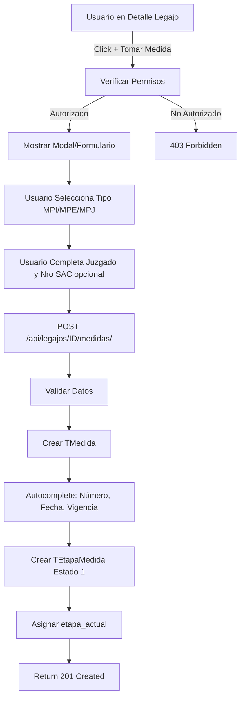

# MED-01b: Creación Manual de Medida desde Legajo

**Fecha de Creación:** 2025-10-10
**Sprint:** TBD
**Estimación:** 8 puntos (Mediano)
**Prioridad:** Alta
**Estado:** Documentada
**Dependencias:** MED-01a (Modelos base deben existir)

---

## Historia de Usuario

**Como** Usuario responsable del Legajo (Equipo Técnico, Jefe Zonal, Director)
**Quiero** crear medidas de protección manualmente desde el detalle de un legajo
**Para** registrar formalmente intervenciones MPI, MPE o MPJ cuando sea necesario

---

## Alcance de MED-01b

Esta sub-story se enfoca **exclusivamente** en:
- ✅ Crear serializers para medidas
- ✅ Implementar endpoint POST para crear medida
- ✅ Implementar endpoint GET para listar medidas de legajo
- ✅ Lógica de permisos por nivel de usuario
- ✅ Validaciones de negocio
- ✅ Tests de creación manual y permisos
- ❌ NO incluye creación automática (ver MED-01c)
- ❌ NO incluye modelos (ver MED-01a)

---

## Flujo de Creación Manual

### Diagrama de Flujo



### Paso a Paso

1. Usuario responsable navega a detalle de legajo (LEG-04)
2. Usuario presiona botón **"+ Tomar Medida"**
3. Sistema verifica permisos (responsable, jefe zonal, director)
4. Sistema muestra formulario con:
   - **Dropdown:** tipo_medida (MPI, MPE, MPJ)
   - **Dropdown:** juzgado (opcional)
   - **Input:** nro_sac (opcional)
   - **Dropdown:** urgencia (opcional)
5. Usuario completa y confirma
6. Sistema ejecuta `POST /api/legajos/{legajo_id}/medidas/`
7. Sistema crea medida + etapa inicial
8. Sistema retorna 201 Created

---

## Serializers

### 1. TEtapaMedidaSerializer

```python
# api/serializers/TEtapaMedidaSerializer.py

from rest_framework import serializers
from infrastructure.models import TEtapaMedida

class TEtapaMedidaSerializer(serializers.ModelSerializer):
    """Serializer para etapas de medida"""
    estado_display = serializers.CharField(source='get_estado_display', read_only=True)

    class Meta:
        model = TEtapaMedida
        fields = [
            'id', 'nombre', 'estado', 'estado_display',
            'fecha_inicio_estado', 'fecha_fin_estado', 'observaciones'
        ]
        read_only_fields = ['id', 'fecha_inicio_estado', 'fecha_fin_estado']
```

---

### 2. TMedidaSerializer (Principal)

```python
# api/serializers/TMedidaSerializer.py

from rest_framework import serializers
from infrastructure.models import TMedida, TJuzgado, TUrgencia
from api.serializers import TEtapaMedidaSerializer

class TMedidaSerializer(serializers.ModelSerializer):
    """Serializer principal para medidas"""

    # Campos calculados
    tipo_medida_display = serializers.CharField(source='get_tipo_medida_display', read_only=True)
    estado_vigencia_display = serializers.CharField(source='get_estado_vigencia_display', read_only=True)
    duracion_dias = serializers.IntegerField(read_only=True)

    # Nested serializers (read)
    juzgado = serializers.SerializerMethodField()
    urgencia = serializers.SerializerMethodField()
    etapa_actual = TEtapaMedidaSerializer(read_only=True)
    creado_por = serializers.SerializerMethodField()

    # IDs para escritura
    juzgado_id = serializers.PrimaryKeyRelatedField(
        queryset=TJuzgado.objects.filter(activo=True),
        source='juzgado',
        write_only=True,
        required=False,
        allow_null=True
    )
    urgencia_id = serializers.PrimaryKeyRelatedField(
        queryset=TUrgencia.objects.all(),
        source='urgencia',
        write_only=True,
        required=False,
        allow_null=True
    )

    class Meta:
        model = TMedida
        fields = [
            'id', 'numero_medida', 'tipo_medida', 'tipo_medida_display',
            'estado_vigencia', 'estado_vigencia_display',
            'fecha_apertura', 'fecha_cierre', 'duracion_dias',
            'juzgado', 'juzgado_id', 'nro_sac',
            'urgencia', 'urgencia_id',
            'etapa_actual', 'creado_por',
            'fecha_creacion', 'fecha_modificacion'
        ]
        read_only_fields = [
            'id', 'numero_medida', 'fecha_apertura', 'fecha_cierre',
            'duracion_dias', 'creado_por', 'fecha_creacion', 'fecha_modificacion'
        ]

    def get_juzgado(self, obj):
        if obj.juzgado:
            return {
                'id': obj.juzgado.id,
                'nombre': obj.juzgado.nombre,
                'tipo': obj.juzgado.tipo,
                'tipo_display': obj.juzgado.get_tipo_display(),
                'jurisdiccion': obj.juzgado.jurisdiccion,
                'jurisdiccion_display': obj.juzgado.get_jurisdiccion_display()
            }
        return None

    def get_urgencia(self, obj):
        if obj.urgencia:
            return {
                'id': obj.urgencia.id,
                'nombre': obj.urgencia.nombre,
                'peso': obj.urgencia.peso if hasattr(obj.urgencia, 'peso') else None
            }
        return None

    def get_creado_por(self, obj):
        if obj.creado_por:
            return {
                'id': obj.creado_por.id,
                'nombre_completo': f"{obj.creado_por.first_name} {obj.creado_por.last_name}",
                'nivel': obj.creado_por.nivel
            }
        return None
```

---

### 3. TMedidaCreateSerializer

```python
# api/serializers/TMedidaSerializer.py (continuación)

class TMedidaCreateSerializer(serializers.ModelSerializer):
    """Serializer para crear medidas desde legajo (vía manual)"""

    class Meta:
        model = TMedida
        fields = ['tipo_medida', 'juzgado', 'nro_sac', 'urgencia']

    def validate_tipo_medida(self, value):
        """Validar que tipo de medida sea válido"""
        if value not in ['MPI', 'MPE', 'MPJ']:
            raise serializers.ValidationError("Tipo de medida inválido")
        return value

    def create(self, validated_data):
        """Override create para agregar legajo y usuario desde contexto"""
        request = self.context.get('request')
        legajo_id = self.context.get('legajo_id')

        # Agregar legajo
        validated_data['legajo_id'] = legajo_id

        # Agregar usuario creador
        if request and request.user:
            validated_data['creado_por'] = request.user

        # Crear medida (numero_medida se genera en model.save())
        medida = super().create(validated_data)

        # Crear etapa inicial automáticamente
        from infrastructure.models import TEtapaMedida
        etapa = TEtapaMedida.objects.create(
            medida=medida,
            nombre='Apertura de la Medida',
            estado='PENDIENTE_REGISTRO_INTERVENCION'
        )

        # Actualizar etapa_actual
        medida.etapa_actual = etapa
        medida.save()

        return medida
```

---

### 4. Exports en __init__.py

```python
# api/serializers/__init__.py (agregar)

from .TEtapaMedidaSerializer import TEtapaMedidaSerializer
from .TMedidaSerializer import (
    TMedidaSerializer,
    TMedidaCreateSerializer
)

__all__ = [
    # ... exports existentes ...
    'TEtapaMedidaSerializer',
    'TMedidaSerializer',
    'TMedidaCreateSerializer',
]
```

---

## ViewSet y Endpoints

### Modificar TLegajoViewSet

```python
# api/views/LegajoView.py (agregar método)

from rest_framework.decorators import action
from rest_framework.response import Response
from rest_framework import status
from drf_spectacular.utils import extend_schema
from api.serializers import TMedidaSerializer, TMedidaCreateSerializer
from infrastructure.models import TLegajoZona
from customAuth.models import TCustomUserZona

class TLegajoViewSet(BaseViewSet):
    # ... código existente ...

    @extend_schema(
        request=TMedidaCreateSerializer,
        responses={201: TMedidaSerializer},
        description="Crear medida asociada a un legajo (vía manual)"
    )
    @action(detail=True, methods=['post'], url_path='medidas')
    def crear_medida(self, request, pk=None):
        """
        POST /api/legajos/{legajo_id}/medidas/

        Crear medida manualmente desde detalle de legajo.

        Permisos:
        - Usuario debe ser responsable del legajo
        - O Jefe Zonal de la zona del legajo
        - O Director/Admin
        """
        legajo = self.get_object()

        # Verificar permisos
        if not self._puede_crear_medida(request.user, legajo):
            return Response(
                {
                    "detail": "No tiene permisos para crear medidas en este legajo",
                    "codigo": "PERMISO_DENEGADO"
                },
                status=status.HTTP_403_FORBIDDEN
            )

        # Validar datos
        serializer = TMedidaCreateSerializer(
            data=request.data,
            context={'request': request, 'legajo_id': legajo.id}
        )

        if not serializer.is_valid():
            return Response(serializer.errors, status=status.HTTP_400_BAD_REQUEST)

        # Crear medida
        medida = serializer.save()

        # Retornar con serializer completo
        response_serializer = TMedidaSerializer(medida, context={'request': request})

        return Response(
            response_serializer.data,
            status=status.HTTP_201_CREATED
        )

    @extend_schema(
        responses={200: TMedidaSerializer(many=True)},
        description="Listar medidas de un legajo"
    )
    @action(detail=True, methods=['get'], url_path='medidas')
    def listar_medidas(self, request, pk=None):
        """
        GET /api/legajos/{legajo_id}/medidas/

        Listar todas las medidas de un legajo.

        Query Parameters:
        - tipo_medida: MPI, MPE, MPJ
        - estado_vigencia: VIGENTE, CERRADA, ARCHIVADA
        """
        legajo = self.get_object()

        # Obtener medidas del legajo
        from infrastructure.models import TMedida
        medidas = TMedida.objects.filter(legajo=legajo).select_related(
            'juzgado', 'urgencia', 'etapa_actual', 'creado_por'
        ).order_by('-fecha_apertura')

        # Filtros opcionales
        tipo_medida = request.query_params.get('tipo_medida')
        if tipo_medida:
            medidas = medidas.filter(tipo_medida=tipo_medida)

        estado_vigencia = request.query_params.get('estado_vigencia')
        if estado_vigencia:
            medidas = medidas.filter(estado_vigencia=estado_vigencia)

        # Serializar
        serializer = TMedidaSerializer(medidas, many=True, context={'request': request})

        return Response(serializer.data, status=status.HTTP_200_OK)

    def _puede_crear_medida(self, user, legajo):
        """Verifica si usuario puede crear medidas en el legajo"""

        # Admin siempre puede
        if user.nivel == 4:
            return True

        # Director puede
        if user.nivel == 3:
            user_zona = TCustomUserZona.objects.filter(
                user=user,
                director=True
            ).first()
            if user_zona:
                return True

        # Jefe Zonal de la zona del legajo
        user_zonas = TCustomUserZona.objects.filter(
            user=user,
            jefe=True
        ).values_list('zona_id', flat=True)

        if user_zonas:
            es_jefe_zona = TLegajoZona.objects.filter(
                legajo=legajo,
                zona_id__in=user_zonas,
                esta_activo=True
            ).exists()
            if es_jefe_zona:
                return True

        # Responsable del legajo
        es_responsable = TLegajoZona.objects.filter(
            legajo=legajo,
            user_responsable=user,
            esta_activo=True
        ).exists()

        return es_responsable
```

---

### Registrar URLs

```python
# api/urls.py (ya incluido en router de legajos)

# Las URLs se generan automáticamente:
# POST   /api/legajos/{id}/medidas/         -> crear_medida
# GET    /api/legajos/{id}/medidas/         -> listar_medidas
```

---

## Restricciones por Nivel de Usuario

### Tabla de Permisos

| Nivel | Rol | Crear Medida | Condición |
|-------|-----|--------------|-----------|
| 2 | Equipo Técnico | ✅ Sí | Solo en legajos asignados |
| 3 | Jefe Zonal | ✅ Sí | En todos los legajos de su zona |
| 3 | Director | ✅ Sí | En todos los legajos de su jurisdicción |
| 3 | Equipo Legal | ❌ No | Solo ve medidas, no crea |
| 4 | Administrador | ✅ Sí | Sin restricciones |

### Lógica de Permisos

```python
def _puede_crear_medida(user, legajo):
    """
    Retorna True si usuario puede crear medida en el legajo

    Jerarquía:
    1. Admin (nivel 4) → siempre True
    2. Director (nivel 3, director=True) → True
    3. Jefe Zonal (nivel 3, jefe=True) → True si legajo en su zona
    4. Responsable (nivel 2) → True si es responsable activo
    5. Otros → False
    """
    pass  # Ver implementación arriba
```

---

## Validaciones de Negocio

### Validaciones en Serializer

1. **tipo_medida:** Debe ser MPI, MPE o MPJ
2. **juzgado:** Debe estar activo (`activo=True`)
3. **nro_sac:** Opcional, máximo 50 caracteres
4. **urgencia:** Opcional, debe existir en TUrgencia

### Validaciones en ViewSet

1. **Legajo existe:** Verified by `get_object()`
2. **Usuario autorizado:** `_puede_crear_medida()`
3. **Legajo activo:** Verificar asignación activa
4. **No duplicar número:** Verificado en modelo (unique=True)

---

## Tests Requeridos (6 tests)

### Suite 1: Tests de Creación Manual (4 tests)

```python
# runna/tests/test_medida_creacion_manual.py

import pytest
from django.urls import reverse
from rest_framework import status
from rest_framework.test import APIClient
from infrastructure.models import TMedida, TEtapaMedida, TLegajoZona
from customAuth.models import TCustomUserZona

@pytest.mark.django_db
class TestMedidaCreacionManual:
    """Tests de creación manual de medidas"""

    def test_crear_medida_manual_desde_legajo(self, equipo_user, legajo, zona):
        """Usuario responsable puede crear medida manualmente"""
        # Asignar legajo al usuario
        TLegajoZona.objects.create(
            legajo=legajo,
            zona=zona,
            user_responsable=equipo_user,
            tipo_responsabilidad='TRABAJO',
            esta_activo=True,
            recibido=True
        )

        url = reverse('legajos-crear-medida', args=[legajo.id])
        client = APIClient()
        client.force_authenticate(user=equipo_user)

        data = {
            'tipo_medida': 'MPE',
            'juzgado': 1,  # Asume fixture
            'nro_sac': 'SAC-2025-TEST'
        }

        response = client.post(url, data)

        assert response.status_code == status.HTTP_201_CREATED
        assert 'numero_medida' in response.data
        assert response.data['tipo_medida'] == 'MPE'
        assert response.data['nro_sac'] == 'SAC-2025-TEST'

    def test_crear_medida_genera_numero_unico(self, equipo_user, legajo, zona):
        """Número de medida generado es único"""
        TLegajoZona.objects.create(
            legajo=legajo,
            zona=zona,
            user_responsable=equipo_user,
            esta_activo=True
        )

        url = reverse('legajos-crear-medida', args=[legajo.id])
        client = APIClient()
        client.force_authenticate(user=equipo_user)

        # Crear primera medida
        response1 = client.post(url, {'tipo_medida': 'MPI'})
        numero1 = response1.data['numero_medida']

        # Crear segunda medida
        response2 = client.post(url, {'tipo_medida': 'MPE'})
        numero2 = response2.data['numero_medida']

        assert numero1 != numero2
        assert 'MED-2025-' in numero1
        assert 'MED-2025-' in numero2

    def test_crear_medida_crea_etapa_inicial(self, equipo_user, legajo, zona):
        """Crear medida manual crea etapa inicial automáticamente"""
        TLegajoZona.objects.create(
            legajo=legajo,
            zona=zona,
            user_responsable=equipo_user,
            esta_activo=True
        )

        url = reverse('legajos-crear-medida', args=[legajo.id])
        client = APIClient()
        client.force_authenticate(user=equipo_user)

        response = client.post(url, {'tipo_medida': 'MPE'})

        medida = TMedida.objects.get(numero_medida=response.data['numero_medida'])

        assert medida.etapa_actual is not None
        assert medida.etapa_actual.estado == 'PENDIENTE_REGISTRO_INTERVENCION'
        assert medida.etapa_actual.nombre == 'Apertura de la Medida'

    def test_listar_medidas_de_legajo(self, admin_user, legajo):
        """Listar medidas de un legajo específico"""
        # Crear 2 medidas
        TMedida.objects.create(legajo=legajo, tipo_medida='MPI')
        TMedida.objects.create(legajo=legajo, tipo_medida='MPE')

        url = reverse('legajos-listar-medidas', args=[legajo.id])
        client = APIClient()
        client.force_authenticate(user=admin_user)

        response = client.get(url)

        assert response.status_code == status.HTTP_200_OK
        assert len(response.data) == 2
```

---

### Suite 2: Tests de Permisos (2 tests)

```python
@pytest.mark.django_db
class TestMedidaPermisos:
    """Tests de permisos por nivel de usuario"""

    def test_crear_medida_sin_permisos_devuelve_403(self, equipo_user, legajo_otra_zona):
        """Usuario sin permisos recibe 403"""
        url = reverse('legajos-crear-medida', args=[legajo_otra_zona.id])
        client = APIClient()
        client.force_authenticate(user=equipo_user)

        response = client.post(url, {'tipo_medida': 'MPI'})

        assert response.status_code == status.HTTP_403_FORBIDDEN
        assert 'PERMISO_DENEGADO' in response.data['codigo']

    def test_jefe_zonal_puede_crear_medida_en_su_zona(self, jefe_user, legajo, zona):
        """Jefe Zonal puede crear medidas en legajos de su zona"""
        # Asignar jefe a zona
        TCustomUserZona.objects.create(
            user=jefe_user,
            zona=zona,
            jefe=True
        )

        # Asignar legajo a zona (sin usuario específico)
        TLegajoZona.objects.create(
            legajo=legajo,
            zona=zona,
            tipo_responsabilidad='TRABAJO',
            esta_activo=True
        )

        url = reverse('legajos-crear-medida', args=[legajo.id])
        client = APIClient()
        client.force_authenticate(user=jefe_user)

        response = client.post(url, {'tipo_medida': 'MPE'})

        assert response.status_code == status.HTTP_201_CREATED
```

---

## Criterios de Aceptación

### CA-1: Creación Manual

- ✅ Usuario responsable puede crear medida desde detalle de legajo
- ✅ Endpoint POST `/api/legajos/{id}/medidas/` funciona correctamente
- ✅ Campos requeridos: `tipo_medida`
- ✅ Campos opcionales: `juzgado`, `nro_sac`, `urgencia`
- ✅ Sistema genera `numero_medida` automáticamente
- ✅ Response 201 incluye medida completa

### CA-2: Etapa Inicial

- ✅ Al crear medida, se crea TEtapaMedida automáticamente
- ✅ Estado inicial: `PENDIENTE_REGISTRO_INTERVENCION`
- ✅ Nombre etapa: "Apertura de la Medida"
- ✅ `etapa_actual` se asigna correctamente

### CA-3: Permisos

- ✅ Nivel 2 (Equipo Técnico): Solo en legajos asignados
- ✅ Nivel 3 (Jefe Zonal): En todos de su zona
- ✅ Nivel 3 (Director): En todos de su jurisdicción
- ✅ Nivel 4 (Admin): Sin restricciones
- ✅ Usuario sin permisos recibe 403 Forbidden

### CA-4: Validaciones

- ✅ tipo_medida debe ser MPI, MPE o MPJ
- ✅ Juzgado debe estar activo
- ✅ Número de medida es único
- ✅ Legajo debe existir y estar activo

### CA-5: Listado

- ✅ Endpoint GET `/api/legajos/{id}/medidas/` lista medidas del legajo
- ✅ Filtros por `tipo_medida` y `estado_vigencia` funcionan
- ✅ Ordenamiento por `fecha_apertura` descendente
- ✅ Nested data incluido (juzgado, urgencia, etapa_actual)

### CA-6: Response Structure

- ✅ Response incluye todos los campos definidos
- ✅ Campos calculados funcionan (`duracion_dias`, displays)
- ✅ Nested objects completos (juzgado, urgencia, etapa, creado_por)

---

## Integración con Frontend

### Endpoint para Dropdown Juzgados

```python
# api/views/TJuzgadoViewSet.py

from .BaseView import BaseViewSet
from infrastructure.models import TJuzgado
from api.serializers import TJuzgadoSerializer

class TJuzgadoViewSet(BaseViewSet):
    model = TJuzgado
    serializer_class = TJuzgadoSerializer
    http_method_names = ['get']

    def get_queryset(self):
        return TJuzgado.objects.filter(activo=True).order_by('nombre')
```

### URLs

```python
# api/urls.py (agregar)

router.register(r'juzgados', TJuzgadoViewSet, basename='juzgados')
```

---

## Ciclo de Validación en Base de Datos

```bash
# 1. Activar entorno
pipenv shell

# 2. Verificar migraciones aplicadas (MED-01a)
python .\runna\manage.py showmigrations infrastructure

# 3. Ejecutar tests
python .\runna\manage.py test tests.test_medida_creacion_manual -v 2

# 4. Prueba manual en shell
python .\runna\manage.py shell
>>> from infrastructure.models import TMedida, TLegajo
>>> legajo = TLegajo.objects.first()
>>> medida = TMedida.objects.create(legajo=legajo, tipo_medida='MPE')
>>> medida.numero_medida  # Debe mostrar MED-2025-001
>>> medida.etapa_actual  # Debe existir
```

---

## Próximos Pasos

Después de completar MED-01b:

1. ✅ MED-01a: Modelos base creados
2. ✅ MED-01b: Creación manual implementada
3. ⏳ **MED-01c:** Implementar creación automática desde demanda
4. ⏳ **Frontend:** Modal "Crear Medida" integrado en LEG-04
5. ⏳ **MED-02:** Registro de intervención en medida

---

## Resumen Ejecutivo

**MED-01b** implementa la **creación manual de medidas** desde legajo:
- **Serializers completos:** Create, List, Detail con nested data
- **Endpoints funcionales:** POST y GET en `/api/legajos/{id}/medidas/`
- **Permisos por nivel:** Equipo Técnico, Jefe Zonal, Director, Admin
- **Validaciones robustas:** Tipo medida, juzgado activo, permisos
- **Etapa inicial automática:** Estado 1 se crea al crear medida
- **6 tests:** Creación manual (4) + Permisos (2)

**Estimación:** 8 puntos (Mediano)
**Tiempo:** 2-3 días backend

**Listo para implementación con:**
```bash
/sc:implement --persona-backend "Implementar MED-01b según story documentada. Prerequisito: MED-01a debe estar completo."
```
