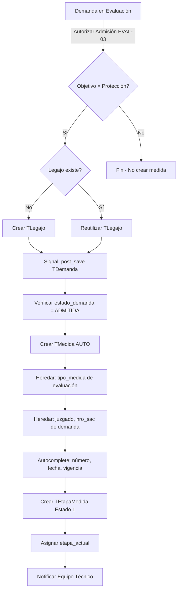

# MED-01c: Creación Automática de Medida desde Demanda

**Fecha de Creación:** 2025-10-10
**Sprint:** TBD
**Estimación:** 5 puntos (Pequeño-Mediano)
**Prioridad:** Alta
**Estado:** Documentada
**Dependencias:** MED-01a (Modelos), MED-01b (Serializers), EVAL-03 (Admisión Demanda)

---

## Historia de Usuario

**Como** Sistema RUNNA
**Quiero** crear automáticamente medidas de protección cuando una demanda es admitida
**Para** iniciar el proceso formal de intervención sin intervención manual del usuario

---

## Alcance de MED-01c

Esta sub-story se enfoca **exclusivamente** en:
- ✅ Implementar signal para creación automática
- ✅ Integrar con flujo de admisión de demanda (EVAL-03)
- ✅ Serializer detallado para vista de medida completa
- ✅ Endpoint GET `/api/medidas/{id}/` para detalle
- ✅ Heredar datos de demanda (juzgado, nro_sac)
- ✅ Tests de creación automática
- ❌ NO incluye modelos (ver MED-01a)
- ❌ NO incluye creación manual (ver MED-01b)

---

## Flujo de Creación Automática

### Diagrama de Flujo



### Trigger del Sistema

**Evento:** `post_save` de modelo `TDemanda`

**Condiciones para ejecutar:**
1. `estado_demanda.nombre == 'ADMITIDA'`
2. `objetivo_de_demanda == 'PROTECCION_INTEGRAL'` o `'PROTECCION'`
3. Tiene legajo asociado (creado o existente)

### Datos Heredados vs Generados

| Campo | Fuente | Valor |
|-------|--------|-------|
| `tipo_medida` | Heredado | De evaluación de demanda (campo a agregar en EVAL-03) |
| `juzgado` | Heredado | `demanda.juzgado` |
| `nro_sac` | Heredado | `demanda.nro_sac` |
| `numero_medida` | Generado | `MED-2025-001` (autogenerado) |
| `fecha_apertura` | Generado | Timestamp actual |
| `estado_vigencia` | Generado | `'VIGENTE'` |
| `legajo` | Obtenido | De demanda o creado nuevo |
| `creado_por` | Heredado | Usuario que admitió la demanda |

---

## Signal Implementation

### Signal para Creación Automática

```python
# infrastructure/signals/medida_signals.py

from django.db.models.signals import post_save
from django.dispatch import receiver
from infrastructure.models import TDemanda, TMedida, TEtapaMedida

@receiver(post_save, sender=TDemanda)
def crear_medida_automatica(sender, instance, created, **kwargs):
    """
    Signal que crea medida automáticamente cuando demanda es admitida.

    Condiciones:
    1. Estado de demanda = 'ADMITIDA'
    2. Objetivo de demanda = 'PROTECCION_INTEGRAL' o 'PROTECCION'
    3. Tiene legajo asociado
    4. No existe medida creada previamente para esta demanda

    Flujo:
    - Obtener o crear legajo
    - Crear TMedida con datos heredados
    - Crear TEtapaMedida inicial
    - Asignar etapa_actual
    - Notificar equipo técnico (TODO)
    """

    # Solo ejecutar si es admisión (cambio de estado)
    if not hasattr(instance, '_state') or instance._state.adding:
        return

    # Verificar condiciones
    if not instance.estado_demanda or instance.estado_demanda.nombre != 'ADMITIDA':
        return

    objetivo = instance.objetivo_de_demanda
    if objetivo not in ['PROTECCION_INTEGRAL', 'PROTECCION']:
        return

    # Verificar que no se haya creado medida previamente
    # (usar flag en demanda o buscar medidas existentes)
    if hasattr(instance, 'medida_creada') and instance.medida_creada:
        return

    # Obtener legajo (asumiendo que ya fue creado en flujo de admisión)
    legajo = instance.obtener_legajo()
    if not legajo:
        # Log error: No se pudo obtener legajo para crear medida
        return

    # Obtener tipo de medida de evaluación
    tipo_medida = getattr(instance, 'tipo_medida_evaluado', None)
    if not tipo_medida:
        # Default a MPI si no se especificó
        tipo_medida = 'MPI'

    # Crear medida
    medida = TMedida.objects.create(
        legajo=legajo,
        tipo_medida=tipo_medida,
        juzgado=instance.juzgado,
        nro_sac=instance.nro_sac,
        estado_vigencia='VIGENTE',
        creado_por=instance.evaluado_por if hasattr(instance, 'evaluado_por') else None
    )

    # Crear etapa inicial
    etapa = TEtapaMedida.objects.create(
        medida=medida,
        nombre='Apertura de la Medida',
        estado='PENDIENTE_REGISTRO_INTERVENCION',
        observaciones=f'Medida creada automáticamente desde demanda {instance.id}'
    )

    # Asignar etapa actual
    medida.etapa_actual = etapa
    medida.save()

    # Marcar demanda como procesada (evitar duplicados)
    instance.medida_creada = True
    instance.save(update_fields=['medida_creada'])

    # TODO: Notificar equipo técnico asignado
    # enviar_notificacion_nueva_medida(medida, equipo_responsable)
```

---

### Registrar Signal

```python
# infrastructure/signals/__init__.py

from .medida_signals import crear_medida_automatica

__all__ = [
    # ... signals existentes ...
    'crear_medida_automatica',
]
```

```python
# infrastructure/apps.py

from django.apps import AppConfig

class InfrastructureConfig(AppConfig):
    default_auto_field = 'django.db.models.BigAutoField'
    name = 'infrastructure'

    def ready(self):
        # Importar signals
        import infrastructure.signals
```

---

## Modificaciones en TDemanda

### Agregar Campos para Medidas

```python
# infrastructure/models/demanda/TDemanda.py (modificar)

class TDemanda(models.Model):
    # ... campos existentes ...

    # Campos para creación automática de medida
    tipo_medida_evaluado = models.CharField(
        max_length=3,
        choices=[('MPI', 'MPI'), ('MPE', 'MPE'), ('MPJ', 'MPJ')],
        null=True,
        blank=True,
        help_text="Tipo de medida determinado en evaluación (EVAL-03)"
    )

    medida_creada = models.BooleanField(
        default=False,
        help_text="Flag para evitar duplicar creación de medida"
    )

    # ... resto del modelo ...

    def obtener_legajo(self):
        """
        Obtiene o crea legajo asociado a la demanda.

        Retorna:
        - TLegajo existente si ya fue creado
        - Nuevo TLegajo si es la primera vez
        - None si no se puede determinar el NNyA principal
        """
        from infrastructure.models import TLegajo, TDemandaPersona

        # Buscar NNyA principal de la demanda
        demanda_persona = TDemandaPersona.objects.filter(
            demanda=self,
            vinculo_con_nnya_principal__isnull=True  # Es el principal
        ).first()

        if not demanda_persona:
            return None

        nnya = demanda_persona.persona

        # Buscar legajo existente
        legajo = TLegajo.objects.filter(nnya=nnya).first()

        if legajo:
            return legajo

        # Crear nuevo legajo
        from infrastructure.services.legajo_codes import generar_codigo_legajo

        legajo = TLegajo.objects.create(
            nnya=nnya,
            numero=generar_codigo_legajo(nnya),
            urgencia=self.urgencia,
            # ... otros campos según lógica de negocio
        )

        return legajo
```

---

## Serializer Detallado

### TMedidaDetalleSerializer

```python
# api/serializers/TMedidaSerializer.py (agregar)

class TMedidaDetalleSerializer(TMedidaSerializer):
    """Serializer detallado con legajo y historial de etapas"""

    legajo = serializers.SerializerMethodField()
    historial_etapas = TEtapaMedidaSerializer(source='etapas', many=True, read_only=True)

    class Meta(TMedidaSerializer.Meta):
        fields = TMedidaSerializer.Meta.fields + ['legajo', 'historial_etapas']

    def get_legajo(self, obj):
        """Incluye datos básicos del legajo y NNyA"""
        return {
            'id': obj.legajo.id,
            'numero': obj.legajo.numero,
            'nnya': {
                'id': obj.legajo.nnya.id,
                'nombre': obj.legajo.nnya.nombre,
                'apellido': obj.legajo.nnya.apellido,
                'edad_calculada': self._calcular_edad(obj.legajo.nnya)
            }
        }

    def _calcular_edad(self, persona):
        """Calcula edad actual en años"""
        if persona.fecha_nacimiento:
            from datetime import date
            today = date.today()
            return today.year - persona.fecha_nacimiento.year - (
                (today.month, today.day) < (persona.fecha_nacimiento.month, persona.fecha_nacimiento.day)
            )
        return None
```

---

## ViewSet para Detalle de Medida

### TMedidaViewSet

```python
# api/views/TMedidaViewSet.py

from rest_framework import status
from rest_framework.response import Response
from rest_framework.permissions import IsAuthenticated
from drf_spectacular.utils import extend_schema

from .BaseView import BaseViewSet
from infrastructure.models import TMedida, TLegajoZona
from api.serializers import TMedidaSerializer, TMedidaDetalleSerializer
from customAuth.models import TCustomUserZona


class TMedidaViewSet(BaseViewSet):
    model = TMedida
    serializer_class = TMedidaSerializer
    permission_classes = [IsAuthenticated]
    http_method_names = ['get']

    filterset_fields = ['tipo_medida', 'estado_vigencia', 'legajo']
    ordering_fields = ['fecha_apertura', 'numero_medida']

    def get_serializer_class(self):
        """Usar serializer detallado para retrieve"""
        if self.action == 'retrieve':
            return TMedidaDetalleSerializer
        return TMedidaSerializer

    def get_queryset(self):
        """Filtrar medidas según permisos del usuario"""
        user = self.request.user

        # Admin: todas las medidas
        if user.nivel == 4:
            return TMedida.objects.all()

        # Director: todas de su jurisdicción
        if user.nivel == 3:
            user_zona = TCustomUserZona.objects.filter(
                user=user,
                director=True
            ).first()

            if user_zona:
                # TODO: Filtrar por jurisdicción (Capital/Interior)
                return TMedida.objects.all()

        # Jefe Zonal: todas de su zona
        user_zonas = TCustomUserZona.objects.filter(
            user=user,
            jefe=True
        ).values_list('zona_id', flat=True)

        if user_zonas:
            legajo_ids = TLegajoZona.objects.filter(
                zona_id__in=user_zonas,
                esta_activo=True
            ).values_list('legajo_id', flat=True)

            return TMedida.objects.filter(legajo_id__in=legajo_ids)

        # Equipo Técnico: solo las asignadas
        legajo_ids = TLegajoZona.objects.filter(
            user_responsable=user,
            esta_activo=True
        ).values_list('legajo_id', flat=True)

        return TMedida.objects.filter(legajo_id__in=legajo_ids)

    @extend_schema(
        responses={200: TMedidaDetalleSerializer},
        description="Obtener detalle completo de una medida"
    )
    def retrieve(self, request, pk=None):
        """
        GET /api/medidas/{id}/

        Retorna detalle completo de medida con:
        - Datos de medida
        - Legajo asociado + NNyA
        - Juzgado completo
        - Etapa actual
        - Historial de etapas
        """
        medida = self.get_object()

        # Optimizar queries
        medida = TMedida.objects.select_related(
            'legajo',
            'legajo__nnya',
            'juzgado',
            'urgencia',
            'etapa_actual',
            'creado_por'
        ).prefetch_related(
            'etapas'
        ).get(id=medida.id)

        serializer = self.get_serializer(medida, context={'request': request})

        return Response(serializer.data, status=status.HTTP_200_OK)
```

---

### Registrar URLs

```python
# api/urls.py (agregar)

from api.views import TMedidaViewSet

router.register(r'medidas', TMedidaViewSet, basename='medidas')

# URLs generadas:
# GET /api/medidas/              -> list
# GET /api/medidas/{id}/         -> retrieve (detalle completo)
```

---

## Tests Requeridos (4 tests)

### Suite: Tests de Creación Automática

```python
# runna/tests/test_medida_creacion_automatica.py

import pytest
from infrastructure.models import TMedida, TEtapaMedida, TDemanda, TLegajo

@pytest.mark.django_db
class TestMedidaCreacionAutomatica:
    """Tests de creación automática desde demanda"""

    def test_admitir_demanda_crea_medida_automatica(self, demanda_proteccion, legajo):
        """Al admitir demanda con objetivo Protección se crea medida"""
        # Simular admisión de demanda
        estado_admitida = TEstadoDemanda.objects.get(nombre='ADMITIDA')
        demanda_proteccion.estado_demanda = estado_admitida
        demanda_proteccion.tipo_medida_evaluado = 'MPE'
        demanda_proteccion.save()

        # Verificar que se creó medida
        medida = TMedida.objects.filter(legajo=legajo).first()

        assert medida is not None
        assert medida.tipo_medida == 'MPE'
        assert medida.estado_vigencia == 'VIGENTE'

    def test_medida_automatica_hereda_juzgado_y_sac(self, demanda_proteccion, juzgado):
        """Medida automática hereda juzgado y nro_sac de demanda"""
        # Configurar demanda con juzgado y SAC
        demanda_proteccion.juzgado = juzgado
        demanda_proteccion.nro_sac = 'SAC-2025-AUTO'
        demanda_proteccion.save()

        # Admitir demanda
        estado_admitida = TEstadoDemanda.objects.get(nombre='ADMITIDA')
        demanda_proteccion.estado_demanda = estado_admitida
        demanda_proteccion.tipo_medida_evaluado = 'MPE'
        demanda_proteccion.save()

        # Verificar herencia
        medida = TMedida.objects.first()

        assert medida.juzgado == juzgado
        assert medida.nro_sac == 'SAC-2025-AUTO'

    def test_medida_automatica_crea_etapa_inicial(self, demanda_proteccion):
        """Medida automática crea etapa inicial Estado 1"""
        # Admitir demanda
        estado_admitida = TEstadoDemanda.objects.get(nombre='ADMITIDA')
        demanda_proteccion.estado_demanda = estado_admitida
        demanda_proteccion.tipo_medida_evaluado = 'MPI'
        demanda_proteccion.save()

        # Verificar etapa
        medida = TMedida.objects.first()
        etapa = TEtapaMedida.objects.filter(medida=medida).first()

        assert etapa is not None
        assert etapa.nombre == 'Apertura de la Medida'
        assert etapa.estado == 'PENDIENTE_REGISTRO_INTERVENCION'
        assert medida.etapa_actual == etapa

    def test_no_duplicar_medida_si_ya_existe(self, demanda_proteccion):
        """No duplicar medida si demanda ya tiene medida_creada=True"""
        # Admitir demanda primera vez
        estado_admitida = TEstadoDemanda.objects.get(nombre='ADMITIDA')
        demanda_proteccion.estado_demanda = estado_admitida
        demanda_proteccion.tipo_medida_evaluado = 'MPI'
        demanda_proteccion.save()

        # Verificar que se creó una medida
        assert TMedida.objects.count() == 1
        medida_inicial = TMedida.objects.first()

        # Simular segundo save (actualización)
        demanda_proteccion.observaciones = "Actualización"
        demanda_proteccion.save()

        # Verificar que NO se creó otra medida
        assert TMedida.objects.count() == 1
        assert TMedida.objects.first().id == medida_inicial.id
```

---

### Fixtures para Tests

```python
# runna/tests/conftest.py (agregar)

@pytest.fixture
def demanda_proteccion(db):
    """Fixture de demanda con objetivo Protección"""
    from infrastructure.models import TDemanda, TObjetivoDemanda, TEstadoDemanda

    objetivo = TObjetivoDemanda.objects.get_or_create(
        nombre='PROTECCION_INTEGRAL'
    )[0]

    estado_evaluacion = TEstadoDemanda.objects.get_or_create(
        nombre='EN_EVALUACION'
    )[0]

    return TDemanda.objects.create(
        objetivo_de_demanda='PROTECCION_INTEGRAL',
        estado_demanda=estado_evaluacion,
        # ... otros campos necesarios
    )
```

---

## Criterios de Aceptación

### CA-1: Creación Automática

- ✅ Al admitir demanda con objetivo "Protección", se crea medida automáticamente
- ✅ Signal `post_save` de TDemanda ejecuta correctamente
- ✅ Medida se crea solo si `estado_demanda = 'ADMITIDA'`
- ✅ Medida se crea solo si `objetivo_de_demanda = 'PROTECCION_INTEGRAL'`

### CA-2: Herencia de Datos

- ✅ `tipo_medida` heredado de `demanda.tipo_medida_evaluado`
- ✅ `juzgado` heredado de `demanda.juzgado`
- ✅ `nro_sac` heredado de `demanda.nro_sac`
- ✅ `creado_por` heredado de usuario que admitió demanda
- ✅ `numero_medida` generado automáticamente

### CA-3: Etapa Inicial

- ✅ TEtapaMedida se crea automáticamente
- ✅ Estado inicial: `PENDIENTE_REGISTRO_INTERVENCION`
- ✅ `etapa_actual` se asigna correctamente
- ✅ Observaciones incluyen referencia a demanda origen

### CA-4: Prevención de Duplicados

- ✅ Flag `medida_creada` previene duplicación
- ✅ Signal verifica flag antes de crear
- ✅ Actualizaciones de demanda NO crean nueva medida

### CA-5: Endpoint Detalle

- ✅ GET `/api/medidas/{id}/` retorna medida completa
- ✅ Incluye nested data: legajo, nnya, juzgado, etapas
- ✅ Historial de etapas ordenado cronológicamente
- ✅ Permisos aplicados según nivel de usuario

---

## Integración con EVAL-03

### Modificar Flujo de Admisión

```python
# En view de admisión de demanda (EVAL-03)

def admitir_demanda(request, demanda_id):
    """
    Admite demanda y dispara creación automática de medida
    """
    demanda = TDemanda.objects.get(id=demanda_id)

    # Actualizar estado
    estado_admitida = TEstadoDemanda.objects.get(nombre='ADMITIDA')
    demanda.estado_demanda = estado_admitida

    # Guardar tipo de medida evaluado (para signal)
    tipo_medida = request.data.get('tipo_medida_evaluado', 'MPI')
    demanda.tipo_medida_evaluado = tipo_medida

    # Save dispara signal crear_medida_automatica
    demanda.save()

    # Signal crea medida automáticamente

    return Response({
        'detail': 'Demanda admitida y medida creada',
        'medida_numero': TMedida.objects.filter(legajo__nnya=demanda.nnya_principal).last().numero_medida
    })
```

---

## Ciclo de Validación

```bash
# 1. Verificar prerequisitos
python .\runna\manage.py shell
>>> from infrastructure.models import TMedida, TEtapaMedida, TJuzgado
>>> TMedida.objects.exists()  # Debe ser True (MED-01a)
>>> TJuzgado.objects.count()  # Debe ser >= 8

# 2. Ejecutar tests
python .\runna\manage.py test tests.test_medida_creacion_automatica -v 2

# 3. Prueba manual de signal
>>> from infrastructure.models import TDemanda, TEstadoDemanda
>>> demanda = TDemanda.objects.first()
>>> demanda.tipo_medida_evaluado = 'MPE'
>>> demanda.estado_demanda = TEstadoDemanda.objects.get(nombre='ADMITIDA')
>>> demanda.save()
>>> TMedida.objects.filter(legajo=demanda.legajo).exists()  # Debe ser True
```

---

## Próximos Pasos

Después de completar MED-01c:

1. ✅ MED-01a: Modelos base
2. ✅ MED-01b: Creación manual
3. ✅ MED-01c: Creación automática
4. ⏳ **MED-02:** Registro de Intervención en Medida
5. ⏳ **Frontend:** Integrar vista detalle de medida
6. ⏳ **Notificaciones:** Sistema de alertas al crear medida

---

## Resumen Ejecutivo

**MED-01c** implementa la **creación automática de medidas** desde demanda:
- **Signal post_save:** Dispara creación al admitir demanda
- **Herencia de datos:** juzgado, nro_sac, tipo_medida desde demanda
- **Prevención duplicados:** Flag `medida_creada` evita recreación
- **Endpoint detalle:** GET `/api/medidas/{id}/` con nested data completo
- **Integración EVAL-03:** Flujo de admisión dispara creación
- **4 tests:** Creación automática, herencia, etapa inicial, anti-duplicados

**Estimación:** 5 puntos (Pequeño-Mediano)
**Tiempo:** 1-2 días backend

**Listo para implementación con:**
```bash
/sc:implement --persona-backend "Implementar MED-01c según story documentada. Prerequisites: MED-01a y MED-01b completos."
```
