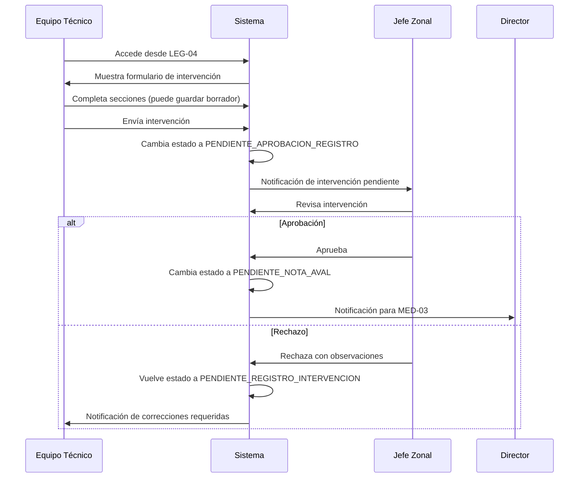

# MED-02: Registro de Primera Intervención

**Estado**: 📋 Pendiente de implementación
**Prioridad**: Alta
**Dependencias**: MED-01a, MED-01b, MED-01c (✅ Completadas)
**Módulo**: Medidas de Protección
**Estimación**: 20-25 horas

---

## Historia de Usuario

**Como** Equipo Técnico asignado a la Medida

**Quiero** registrar los datos básicos e institucionales de una intervención MPE/MPI, adjuntar la documentación inicial y definir las actividades de seguimiento

**Para** dejar constancia oficial de la intervención y habilitar el resto del proceso de aprobación

---

## Contexto Técnico

### Estado Actual (MED-01 Completado)

✅ **Modelos existentes**:
- `TMedida`: Modelo principal de medida con auto-generación de número
- `TEtapaMedida`: Modelo de etapas con 5 estados del andarivel
- `TJuzgado`: Catálogo de juzgados

✅ **Estados implementados**:
- Estado 1: `PENDIENTE_REGISTRO_INTERVENCION` (creado en MED-01)

✅ **Endpoints operativos**:
- `POST /api/legajos/{id}/medidas/` - Crear medida manual
- `GET /api/legajos/{id}/medidas/` - Listar medidas
- `GET /api/medidas/{id}/` - Detalle de medida

### Alcance MED-02

📋 **Nuevo estado a implementar**:
- Estado 2: `PENDIENTE_APROBACION_REGISTRO`

📋 **Transiciones de estado**:
```
Estado 1 (PENDIENTE_REGISTRO_INTERVENCION)
    ↓ [Equipo Técnico registra intervención]
Estado 2 (PENDIENTE_APROBACION_REGISTRO)
    ↓ [Jefe Zonal aprueba]
Estado 3 (PENDIENTE_NOTA_AVAL)
    O
    ↓ [Jefe Zonal rechaza]
Estado 1 (PENDIENTE_REGISTRO_INTERVENCION) + observaciones
```

---

## Descripción Detallada

### Punto de Entrada

El Equipo Técnico (ET) accede desde **LEG-04 (Detalle de Legajo)** a la medida activa y presiona el botón **"Cargar Informes"** para iniciar el registro de la primera intervención.

### Flujo Completo

#### Fase 1: Registro por Equipo Técnico

1. **Acceso**: Desde LEG-04 → Vista detallada de medida → "Cargar informes"
2. **Formulario**: Se despliega formulario multi-sección con:
   - Información Básica (datos de la intervención)
   - Detalles de Intervención (motivos y categorías)
   - Documentos y Archivos (evidencias y respaldos)
   - Plan de Trabajo (definición inicial de actividades PLTM)
   - Configuración Adicional (informes, notificaciones)

3. **Guardado progresivo**: Sistema permite guardar borrador en cualquier momento
4. **Envío final**: Al completar campos obligatorios, ET envía a aprobación

#### Fase 2: Aprobación por Jefe Zonal

1. **Notificación**: JZ recibe notificación de intervención pendiente
2. **Revisión**: JZ accede y revisa el registro completo
3. **Decisión**:
   - **Aprobar** → Estado 3 (PENDIENTE_NOTA_AVAL)
   - **Rechazar** → Estado 1 con observaciones justificatorias

#### Diagrama de Flujo Simplificado



---

## Criterios de Aceptación

### CA-1: Formulario de Registro

**Dado** que soy Equipo Técnico asignado a una medida en Estado 1

**Cuando** accedo al detalle de la medida desde LEG-04 y presiono "Cargar Informes"

**Entonces**:
- ✅ Se muestra formulario multi-sección con todas las secciones definidas
- ✅ Campos obligatorios están marcados claramente con (*)
- ✅ Sistema genera código de intervención automáticamente
- ✅ Datos de legajo, persona y zona están autocompletados (solo lectura)

### CA-2: Validaciones de Campos

**Dado** que estoy completando el formulario de intervención

**Cuando** intento avanzar o guardar

**Entonces**:
- ✅ Validación en tiempo real de archivos (extensión, peso máximo 10MB)
- ✅ Campos obligatorios muestran error si están vacíos al intentar enviar
- ✅ Fecha de intervención no puede ser futura
- ✅ Archivos solo permiten: PDF, DOC, DOCX, JPG, PNG

### CA-3: Guardar Borrador

**Dado** que estoy completando el formulario

**Cuando** presiono "Guardar Borrador"

**Entonces**:
- ✅ Sistema guarda datos parciales sin validar obligatoriedad
- ✅ Puedo salir y volver más tarde
- ✅ Al volver, datos guardados están prellenados
- ✅ Estado de la medida permanece en Estado 1

### CA-4: Envío a Aprobación

**Dado** que he completado todos los campos obligatorios

**Cuando** presiono "Enviar a Aprobación"

**Entonces**:
- ✅ Sistema valida que todos los campos obligatorios estén completos
- ✅ Estado de medida cambia a `PENDIENTE_APROBACION_REGISTRO` (Estado 2)
- ✅ Se crea nueva etapa en TEtapaMedida con estado Estado 2
- ✅ Etapa anterior (Estado 1) se marca con fecha_fin_estado
- ✅ Se actualiza `medida.etapa_actual` a la nueva etapa
- ✅ Sistema envía notificación al Jefe Zonal
- ✅ Sistema crea actividades iniciales de Plan de Trabajo (PLTM)

### CA-5: Notificación a Jefe Zonal

**Dado** que un Equipo Técnico envió una intervención a aprobación

**Cuando** la transición a Estado 2 se completa

**Entonces**:
- ✅ Jefe Zonal recibe notificación in-app
- ✅ Jefe Zonal recibe email con deep-link a la medida
- ✅ Notificación incluye: número de medida, legajo, nombre NNyA, fecha de envío
- ✅ Medida aparece en bandeja de JZ con filtro "Pendiente mi aprobación"

### CA-6: Aprobación por Jefe Zonal

**Dado** que soy Jefe Zonal y tengo una intervención pendiente

**Cuando** reviso y presiono "Aprobar"

**Entonces**:
- ✅ Estado de medida cambia a `PENDIENTE_NOTA_AVAL` (Estado 3)
- ✅ Se crea nueva etapa en TEtapaMedida con estado Estado 3
- ✅ Etapa anterior (Estado 2) se marca con fecha_fin_estado
- ✅ Se actualiza `medida.etapa_actual` a Estado 3
- ✅ Sistema envía notificación al Director
- ✅ Sistema registra fecha, usuario y decisión de aprobación
- ✅ Plan de Trabajo queda activo y en progreso

### CA-7: Rechazo por Jefe Zonal

**Dado** que soy Jefe Zonal y la intervención requiere correcciones

**Cuando** presiono "Rechazar" e ingreso observaciones

**Entonces**:
- ✅ Sistema valida que observaciones no estén vacías
- ✅ Estado de medida vuelve a `PENDIENTE_REGISTRO_INTERVENCION` (Estado 1)
- ✅ Se crea nueva etapa en TEtapaMedida con estado Estado 1
- ✅ Etapa anterior (Estado 2) se marca con fecha_fin_estado
- ✅ Observaciones quedan registradas en la nueva etapa
- ✅ Sistema envía notificación al Equipo Técnico con observaciones
- ✅ Formulario queda editable con datos previos + observaciones visibles
- ✅ Sistema registra fecha, usuario y decisión de rechazo

### CA-8: Permisos de Acceso

**Dado** que existen diferentes niveles de usuario

**Cuando** acceden al módulo de intervenciones

**Entonces**:

| Rol | Crear Intervención | Editar Borrador | Enviar a Aprobación | Aprobar/Rechazar |
|-----|-------------------|-----------------|---------------------|------------------|
| **Equipo Técnico (responsable)** | ✅ | ✅ (solo propias) | ✅ | ❌ |
| **Equipo Técnico (otro)** | ❌ | ✅ | ❌ | ❌ |
| **Jefe Zonal (de la zona)** | ✅ | ✅ | ✅ | ✅ |
| **Jefe Zonal (otra zona)** | ❌ | ❌ | ❌ | ❌ |
| **Director** | ✅ | ✅ | ✅ | ✅ |
| **Admin** | ✅ | ✅ | ✅ | ✅ |

### CA-9: Integración con Plan de Trabajo

**Dado** que un Equipo Técnico envía una intervención a aprobación

**Cuando** el sistema procesa el registro

**Entonces**:
- ✅ Se crean actividades de PLTM según lo definido en sección Plan de Trabajo
- ✅ Actividades quedan vinculadas a la medida
- ✅ Actividades tienen responsable, plazo y estado inicial "Pendiente"
- ✅ Plan de Trabajo corre en paralelo al andarivel de aprobación

### CA-10: Auditoría y Trazabilidad

**Dado** que se realizan cambios en el registro de intervención

**Cuando** ocurre cualquier acción (guardar, enviar, aprobar, rechazar)

**Entonces**:
- ✅ Sistema registra quién realizó la acción
- ✅ Sistema registra fecha/hora de la acción
- ✅ Sistema registra tipo de acción y decisión tomada
- ✅ Historial de cambios es visible en detalle de medida
- ✅ Adjuntos conservan versión por cada guardado

---

## Estructura de Datos

### Modelo Existente: TEtapaMedida (Sin cambios)

```python
class TEtapaMedida(models.Model):
    """
    Estados ya definidos en MED-01a:
    1. PENDIENTE_REGISTRO_INTERVENCION
    2. PENDIENTE_APROBACION_REGISTRO      ← Usaremos este
    3. PENDIENTE_NOTA_AVAL                 ← Transición a este si aprueba
    4. PENDIENTE_INFORME_JURIDICO
    5. PENDIENTE_RATIFICACION_JUDICIAL
    """

    medida = models.ForeignKey('TMedida', on_delete=models.CASCADE, related_name='etapas')
    nombre = models.CharField(max_length=100, default='Apertura de la Medida')
    estado = models.CharField(max_length=50, choices=ESTADO_CHOICES)
    fecha_inicio_estado = models.DateTimeField(auto_now_add=True)
    fecha_fin_estado = models.DateTimeField(null=True, blank=True)
    observaciones = models.TextField(null=True, blank=True)  # Usaremos para observaciones JZ
```

### Nuevo Modelo: TIntervencionMedida

**Ubicación**: `runna/infrastructure/models/medida/TIntervencionMedida.py`

```python
from django.db import models
from django.contrib.auth import get_user_model
from django.utils.translation import gettext_lazy as _

CustomUser = get_user_model()


class TIntervencionMedida(models.Model):
    """
    Modelo para registrar datos de la primera intervención de una medida.

    Este modelo almacena toda la información ingresada por el Equipo Técnico
    en MED-02, incluyendo datos básicos, detalles de intervención, documentos
    y configuración adicional.
    """

    ESTADO_BORRADOR = 'BORRADOR'
    ESTADO_ENVIADO = 'ENVIADO'
    ESTADO_APROBADO = 'APROBADO'
    ESTADO_RECHAZADO = 'RECHAZADO'

    ESTADO_CHOICES = [
        (ESTADO_BORRADOR, 'Borrador'),
        (ESTADO_ENVIADO, 'Enviado a Aprobación'),
        (ESTADO_APROBADO, 'Aprobado'),
        (ESTADO_RECHAZADO, 'Rechazado'),
    ]

    # Relación con Medida (1 medida puede tener múltiples registros si hay rechazos)
    medida = models.ForeignKey(
        'TMedida',
        on_delete=models.CASCADE,
        related_name='intervenciones',
        help_text="Medida a la que pertenece este registro de intervención"
    )

    # Código autogenerado
    codigo_intervencion = models.CharField(
        max_length=50,
        unique=True,
        help_text="Código único de intervención (ej: INT-MED-2025-001-001)"
    )

    # Estado del registro
    estado = models.CharField(
        max_length=20,
        choices=ESTADO_CHOICES,
        default=ESTADO_BORRADOR,
        help_text="Estado actual del registro de intervención"
    )

    # =================== INFORMACIÓN BÁSICA ===================
    fecha_intervencion = models.DateField(
        help_text="Fecha en que se realizó la intervención"
    )

    # Datos autocompletados (solo lectura, pero guardados para snapshot)
    legajo_numero = models.CharField(max_length=50)
    persona_nombre = models.CharField(max_length=200)
    persona_apellido = models.CharField(max_length=200)
    persona_dni = models.CharField(max_length=20, null=True, blank=True)
    zona_nombre = models.CharField(max_length=200)

    # Tipo y dispositivo (dropdowns - foreign keys a catálogos)
    tipo_dispositivo = models.ForeignKey(
        'TTipoDispositivo',
        on_delete=models.PROTECT,
        null=True,
        blank=True,
        help_text="Tipo de dispositivo de intervención"
    )

    # =================== DETALLES DE INTERVENCIÓN ===================
    motivo = models.ForeignKey(
        'TCategoriaMotivo',
        on_delete=models.PROTECT,
        help_text="Motivo principal de la intervención"
    )

    sub_motivo = models.ForeignKey(
        'TSubMotivo',
        on_delete=models.PROTECT,
        null=True,
        blank=True,
        help_text="Sub-motivo específico"
    )

    categoria_intervencion = models.ForeignKey(
        'TCategoriaIntervencion',
        on_delete=models.PROTECT,
        help_text="Categoría de la intervención"
    )

    intervencion_especifica = models.TextField(
        help_text="Descripción específica de la intervención realizada"
    )

    descripcion_detallada = models.TextField(
        null=True,
        blank=True,
        help_text="Descripción adicional o contexto de la intervención"
    )

    # =================== CONFIGURACIÓN ADICIONAL ===================
    motivo_vulneraciones = models.TextField(
        null=True,
        blank=True,
        help_text="Descripción de vulneraciones de derechos detectadas"
    )

    requiere_informes_ampliatorios = models.BooleanField(
        default=False,
        help_text="Indica si se requieren informes ampliatorios posteriores"
    )

    # =================== PROCESO DE APROBACIÓN ===================
    # Fechas del proceso
    fecha_envio = models.DateTimeField(
        null=True,
        blank=True,
        help_text="Fecha y hora de envío a aprobación"
    )

    fecha_aprobacion = models.DateTimeField(
        null=True,
        blank=True,
        help_text="Fecha y hora de aprobación por JZ"
    )

    fecha_rechazo = models.DateTimeField(
        null=True,
        blank=True,
        help_text="Fecha y hora de rechazo por JZ"
    )

    # Usuarios del proceso
    registrado_por = models.ForeignKey(
        CustomUser,
        on_delete=models.SET_NULL,
        null=True,
        related_name='intervenciones_registradas',
        help_text="Usuario (Equipo Técnico) que registró la intervención"
    )

    aprobado_por = models.ForeignKey(
        CustomUser,
        on_delete=models.SET_NULL,
        null=True,
        blank=True,
        related_name='intervenciones_aprobadas',
        help_text="Usuario (Jefe Zonal) que aprobó"
    )

    rechazado_por = models.ForeignKey(
        CustomUser,
        on_delete=models.SET_NULL,
        null=True,
        blank=True,
        related_name='intervenciones_rechazadas',
        help_text="Usuario (Jefe Zonal) que rechazó"
    )

    # Observaciones del JZ (en caso de rechazo)
    observaciones_jz = models.TextField(
        null=True,
        blank=True,
        help_text="Observaciones del Jefe Zonal (obligatorias en rechazo)"
    )

    # =================== AUDITORÍA ===================
    fecha_creacion = models.DateTimeField(auto_now_add=True)
    fecha_modificacion = models.DateTimeField(auto_now=True)

    class Meta:
        app_label = 'infrastructure'
        db_table = 't_intervencion_medida'
        verbose_name = _('Intervención de Medida')
        verbose_name_plural = _('Intervenciones de Medidas')
        ordering = ['-fecha_creacion']
        indexes = [
            models.Index(fields=['medida', 'estado']),
            models.Index(fields=['codigo_intervencion']),
        ]

    def __str__(self):
        return f"{self.codigo_intervencion} - {self.medida.numero_medida} - {self.get_estado_display()}"

    def save(self, *args, **kwargs):
        """Override save para generar codigo_intervencion automáticamente"""
        if not self.codigo_intervencion:
            self.codigo_intervencion = self.generar_codigo_intervencion()
        super().save(*args, **kwargs)

    @staticmethod
    def generar_codigo_intervencion():
        """
        Genera código único de intervención con formato:
        INT-MED-{año}-{consecutivo_medida:03d}-{consecutivo_intervencion:03d}
        Ejemplo: INT-MED-2025-001-001
        """
        from datetime import datetime

        año_actual = datetime.now().year

        # Obtener último código del año
        ultima_intervencion = TIntervencionMedida.objects.filter(
            codigo_intervencion__startswith=f"INT-MED-{año_actual}-"
        ).order_by('-codigo_intervencion').first()

        if ultima_intervencion:
            try:
                partes = ultima_intervencion.codigo_intervencion.split('-')
                consecutivo = int(partes[4]) + 1
            except (IndexError, ValueError):
                consecutivo = 1
        else:
            consecutivo = 1

        return f"INT-MED-{año_actual}-{consecutivo:06d}"
```

### Nuevos Modelos de Catálogo (Dropdowns)

#### TTipoDispositivo

```python
class TTipoDispositivo(models.Model):
    """Catálogo de tipos de dispositivo de intervención"""

    nombre = models.CharField(max_length=200, unique=True)
    descripcion = models.TextField(null=True, blank=True)
    activo = models.BooleanField(default=True)

    class Meta:
        app_label = 'infrastructure'
        db_table = 't_tipo_dispositivo'
        verbose_name = _('Tipo de Dispositivo')
        verbose_name_plural = _('Tipos de Dispositivos')
        ordering = ['nombre']
```

#### TSubMotivo

```python
class TSubMotivo(models.Model):
    """Catálogo de sub-motivos de intervención"""

    categoria_motivo = models.ForeignKey(
        'TCategoriaMotivo',
        on_delete=models.CASCADE,
        related_name='sub_motivos'
    )
    nombre = models.CharField(max_length=200)
    descripcion = models.TextField(null=True, blank=True)
    activo = models.BooleanField(default=True)

    class Meta:
        app_label = 'infrastructure'
        db_table = 't_sub_motivo'
        verbose_name = _('Sub-motivo')
        verbose_name_plural = _('Sub-motivos')
        ordering = ['categoria_motivo', 'nombre']
        unique_together = [['categoria_motivo', 'nombre']]
```

#### TCategoriaIntervencion

```python
class TCategoriaIntervencion(models.Model):
    """Catálogo de categorías de intervención"""

    nombre = models.CharField(max_length=200, unique=True)
    descripcion = models.TextField(null=True, blank=True)
    activo = models.BooleanField(default=True)

    class Meta:
        app_label = 'infrastructure'
        db_table = 't_categoria_intervencion'
        verbose_name = _('Categoría de Intervención')
        verbose_name_plural = _('Categorías de Intervenciones')
        ordering = ['nombre']
```

### Modelo de Adjuntos: TIntervencionAdjunto

```python
class TIntervencionAdjunto(models.Model):
    """Adjuntos de una intervención (documentos, actas, respaldos)"""

    TIPO_MODELO = 'MODELO'
    TIPO_ACTA = 'ACTA'
    TIPO_RESPALDO = 'RESPALDO'
    TIPO_INFORME = 'INFORME'

    TIPO_CHOICES = [
        (TIPO_MODELO, 'Modelo'),
        (TIPO_ACTA, 'Acta'),
        (TIPO_RESPALDO, 'Documentación Respaldatoria'),
        (TIPO_INFORME, 'Informe Ampliatorio'),
    ]

    intervencion = models.ForeignKey(
        'TIntervencionMedida',
        on_delete=models.CASCADE,
        related_name='adjuntos'
    )

    tipo = models.CharField(
        max_length=20,
        choices=TIPO_CHOICES,
        help_text="Tipo de documento adjunto"
    )

    archivo = models.FileField(
        upload_to='intervenciones/%Y/%m/',
        help_text="Archivo adjunto"
    )

    nombre_original = models.CharField(
        max_length=255,
        help_text="Nombre original del archivo"
    )

    tamaño_bytes = models.IntegerField(
        help_text="Tamaño del archivo en bytes"
    )

    extension = models.CharField(
        max_length=10,
        help_text="Extensión del archivo (pdf, doc, jpg, etc.)"
    )

    descripcion = models.CharField(
        max_length=500,
        null=True,
        blank=True,
        help_text="Descripción del documento"
    )

    subido_por = models.ForeignKey(
        CustomUser,
        on_delete=models.SET_NULL,
        null=True
    )

    fecha_subida = models.DateTimeField(auto_now_add=True)

    class Meta:
        app_label = 'infrastructure'
        db_table = 't_intervencion_adjunto'
        verbose_name = _('Adjunto de Intervención')
        verbose_name_plural = _('Adjuntos de Intervenciones')
        ordering = ['fecha_subida']
```

---

## Endpoints

### POST /api/medidas/{medida_id}/intervenciones/

**Descripción**: Crear o actualizar borrador de intervención

**Permisos**: Equipo Técnico responsable, Jefe Zonal, Director, Admin

**Request Body**:

```json
{
  "fecha_intervencion": "2025-01-20",
  "tipo_dispositivo": 1,
  "motivo": 2,
  "sub_motivo": 5,
  "categoria_intervencion": 3,
  "intervencion_especifica": "Intervención domiciliaria con familia...",
  "descripcion_detallada": "Se realizó entrevista con...",
  "motivo_vulneraciones": "Vulneración de derecho a la educación...",
  "requiere_informes_ampliatorios": false,
  "estado": "BORRADOR"
}
```

**Response 201 CREATED**:

```json
{
  "id": 1,
  "codigo_intervencion": "INT-MED-2025-000001",
  "medida": {
    "id": 1,
    "numero_medida": "MED-2025-001"
  },
  "estado": "BORRADOR",
  "fecha_intervencion": "2025-01-20",
  "legajo_numero": "LEG-2025-0001",
  "persona_nombre": "Juan",
  "persona_apellido": "Pérez",
  "zona_nombre": "Zona Norte",
  "tipo_dispositivo": {
    "id": 1,
    "nombre": "Intervención Domiciliaria"
  },
  "motivo": {
    "id": 2,
    "nombre": "Violencia Familiar"
  },
  "sub_motivo": {
    "id": 5,
    "nombre": "Violencia Física"
  },
  "categoria_intervencion": {
    "id": 3,
    "nombre": "Protección Integral"
  },
  "intervencion_especifica": "Intervención domiciliaria con familia...",
  "descripcion_detallada": "Se realizó entrevista con...",
  "motivo_vulneraciones": "Vulneración de derecho a la educación...",
  "requiere_informes_ampliatorios": false,
  "registrado_por": {
    "id": 5,
    "nombre_completo": "María González",
    "username": "mgonzalez"
  },
  "fecha_creacion": "2025-01-20T10:30:00Z",
  "fecha_modificacion": "2025-01-20T10:30:00Z",
  "adjuntos": []
}
```

### PATCH /api/medidas/{medida_id}/intervenciones/{intervencion_id}/enviar/

**Descripción**: Enviar intervención a aprobación (transición Estado 1 → Estado 2)

**Permisos**: Equipo Técnico responsable, Jefe Zonal, Director, Admin

**Request Body**: (vacío)

**Response 200 OK**:

```json
{
  "id": 1,
  "codigo_intervencion": "INT-MED-2025-000001",
  "estado": "ENVIADO",
  "fecha_envio": "2025-01-20T14:30:00Z",
  "medida": {
    "id": 1,
    "numero_medida": "MED-2025-001",
    "etapa_actual": {
      "id": 2,
      "nombre": "Registro de Intervención",
      "estado": "PENDIENTE_APROBACION_REGISTRO",
      "estado_display": "(2) Pendiente de aprobación de registro",
      "fecha_inicio_estado": "2025-01-20T14:30:00Z"
    }
  },
  "mensaje": "Intervención enviada a aprobación. Se notificó al Jefe Zonal."
}
```

**Response 400 BAD REQUEST** (si faltan campos obligatorios):

```json
{
  "error": "CAMPOS_INCOMPLETOS",
  "detalle": "Faltan campos obligatorios",
  "campos_faltantes": [
    "fecha_intervencion",
    "motivo",
    "categoria_intervencion"
  ]
}
```

### POST /api/medidas/{medida_id}/intervenciones/{intervencion_id}/aprobar/

**Descripción**: Aprobar intervención (transición Estado 2 → Estado 3)

**Permisos**: Jefe Zonal de la zona, Director, Admin

**Request Body**: (vacío)

**Response 200 OK**:

```json
{
  "id": 1,
  "codigo_intervencion": "INT-MED-2025-000001",
  "estado": "APROBADO",
  "fecha_aprobacion": "2025-01-21T09:15:00Z",
  "aprobado_por": {
    "id": 8,
    "nombre_completo": "Carlos Ramírez",
    "username": "cramirez"
  },
  "medida": {
    "id": 1,
    "numero_medida": "MED-2025-001",
    "etapa_actual": {
      "id": 3,
      "nombre": "Nota de Aval",
      "estado": "PENDIENTE_NOTA_AVAL",
      "estado_display": "(3) Pendiente de Nota de Aval",
      "fecha_inicio_estado": "2025-01-21T09:15:00Z"
    }
  },
  "mensaje": "Intervención aprobada. Se notificó al Director para MED-03."
}
```

**Response 403 FORBIDDEN** (si no es JZ de la zona):

```json
{
  "error": "PERMISO_DENEGADO",
  "detalle": "Solo el Jefe Zonal de la zona puede aprobar esta intervención"
}
```

### POST /api/medidas/{medida_id}/intervenciones/{intervencion_id}/rechazar/

**Descripción**: Rechazar intervención (transición Estado 2 → Estado 1)

**Permisos**: Jefe Zonal de la zona, Director, Admin

**Request Body**:

```json
{
  "observaciones": "La descripción de la intervención es insuficiente. Falta detallar las acciones concretas realizadas con la familia y los acuerdos establecidos."
}
```

**Response 200 OK**:

```json
{
  "id": 1,
  "codigo_intervencion": "INT-MED-2025-000001",
  "estado": "RECHAZADO",
  "fecha_rechazo": "2025-01-21T09:20:00Z",
  "rechazado_por": {
    "id": 8,
    "nombre_completo": "Carlos Ramírez",
    "username": "cramirez"
  },
  "observaciones_jz": "La descripción de la intervención es insuficiente. Falta detallar las acciones concretas realizadas con la familia y los acuerdos establecidos.",
  "medida": {
    "id": 1,
    "numero_medida": "MED-2025-001",
    "etapa_actual": {
      "id": 4,
      "nombre": "Registro de Intervención (Correcciones)",
      "estado": "PENDIENTE_REGISTRO_INTERVENCION",
      "estado_display": "(1) Pendiente de registro de intervención",
      "fecha_inicio_estado": "2025-01-21T09:20:00Z",
      "observaciones": "La descripción de la intervención es insuficiente..."
    }
  },
  "mensaje": "Intervención rechazada. Se notificó al Equipo Técnico para correcciones."
}
```

**Response 400 BAD REQUEST** (si faltan observaciones):

```json
{
  "error": "OBSERVACIONES_REQUERIDAS",
  "detalle": "Las observaciones son obligatorias al rechazar una intervención"
}
```

### POST /api/medidas/{medida_id}/intervenciones/{intervencion_id}/adjuntos/

**Descripción**: Subir adjuntos a la intervención

**Permisos**: Equipo Técnico responsable, Jefe Zonal, Director, Admin

**Request**: Multipart form-data

```
tipo: MODELO | ACTA | RESPALDO | INFORME
archivo: (file upload)
descripcion: "Descripción del documento" (opcional)
```

**Response 201 CREATED**:

```json
{
  "id": 1,
  "tipo": "ACTA",
  "tipo_display": "Acta",
  "nombre_original": "acta_intervencion_2025.pdf",
  "tamaño_bytes": 245678,
  "extension": "pdf",
  "descripcion": "Acta de intervención domiciliaria",
  "url": "/media/intervenciones/2025/01/acta_intervencion_2025.pdf",
  "subido_por": {
    "id": 5,
    "nombre_completo": "María González"
  },
  "fecha_subida": "2025-01-20T11:00:00Z"
}
```

**Response 400 BAD REQUEST** (validación de archivo):

```json
{
  "error": "ARCHIVO_INVALIDO",
  "detalle": "Solo se permiten archivos PDF, DOC, DOCX, JPG, PNG",
  "extension_recibida": "exe"
}
```

**Response 413 PAYLOAD TOO LARGE** (archivo muy grande):

```json
{
  "error": "ARCHIVO_MUY_GRANDE",
  "detalle": "El tamaño máximo permitido es 10MB",
  "tamaño_recibido_mb": 15.2
}
```

### GET /api/medidas/{medida_id}/intervenciones/

**Descripción**: Listar intervenciones de una medida (incluye borradores y rechazadas)

**Permisos**: Equipo Técnico, Jefe Zonal, Director, Admin (filtrado por permisos)

**Response 200 OK**:

```json
[
  {
    "id": 2,
    "codigo_intervencion": "INT-MED-2025-000002",
    "estado": "APROBADO",
    "fecha_intervencion": "2025-01-25",
    "fecha_envio": "2025-01-25T16:00:00Z",
    "fecha_aprobacion": "2025-01-26T10:00:00Z",
    "registrado_por": { ... },
    "aprobado_por": { ... }
  },
  {
    "id": 1,
    "codigo_intervencion": "INT-MED-2025-000001",
    "estado": "RECHAZADO",
    "fecha_intervencion": "2025-01-20",
    "fecha_envio": "2025-01-20T14:30:00Z",
    "fecha_rechazo": "2025-01-21T09:20:00Z",
    "observaciones_jz": "La descripción de la intervención es insuficiente...",
    "registrado_por": { ... },
    "rechazado_por": { ... }
  }
]
```

---

## Tests Requeridos

### Test Suite 1: Creación de Intervención (4 tests)

**Archivo**: `runna/tests/test_intervencion_creacion.py`

```python
def test_crear_intervencion_borrador(self):
    """Equipo Técnico puede crear borrador de intervención"""
    # Crear borrador con datos parciales
    # Verificar que se guarda sin validar obligatoriedad
    # Verificar código autogenerado
    # Verificar estado BORRADOR

def test_crear_intervencion_genera_codigo_unico(self):
    """Códigos de intervención son únicos y secuenciales"""
    # Crear 3 intervenciones
    # Verificar códigos INT-MED-2025-000001, 000002, 000003

def test_crear_intervencion_autocompleta_datos(self):
    """Datos de legajo y persona se autocomple human automáticamente"""
    # Verificar que legajo_numero, persona_nombre, etc. se copian

def test_crear_intervencion_sin_permisos_devuelve_403(self):
    """Usuario sin permisos no puede crear intervención"""
    # Equipo Técnico de otra zona
    # Verificar 403 FORBIDDEN
```

### Test Suite 2: Validaciones (3 tests)

**Archivo**: `runna/tests/test_intervencion_validaciones.py`

```python
def test_enviar_sin_campos_obligatorios_devuelve_400(self):
    """No se puede enviar sin completar campos obligatorios"""
    # Crear borrador incompleto
    # Intentar enviar
    # Verificar 400 con lista de campos faltantes

def test_validar_formato_archivos(self):
    """Solo se aceptan extensiones permitidas"""
    # Intentar subir .exe
    # Verificar 400 ARCHIVO_INVALIDO

def test_validar_tamaño_archivos(self):
    """Archivos mayores a 10MB son rechazados"""
    # Mock archivo de 15MB
    # Verificar 413 PAYLOAD TOO LARGE
```

### Test Suite 3: Transiciones de Estado (6 tests)

**Archivo**: `runna/tests/test_intervencion_transiciones.py`

```python
def test_enviar_intervencion_cambia_estado_medida(self):
    """Enviar intervención cambia estado de medida a Estado 2"""
    # Crear y enviar intervención
    # Verificar medida.etapa_actual.estado == 'PENDIENTE_APROBACION_REGISTRO'
    # Verificar etapa anterior tiene fecha_fin_estado

def test_enviar_intervencion_notifica_jefe_zonal(self):
    """Sistema notifica a JZ al enviar intervención"""
    # Mock de sistema de notificaciones
    # Enviar intervención
    # Verificar llamada a notificación con datos correctos

def test_aprobar_intervencion_cambia_a_estado_3(self):
    """Aprobar intervención cambia estado de medida a Estado 3"""
    # JZ aprueba intervención
    # Verificar medida.etapa_actual.estado == 'PENDIENTE_NOTA_AVAL'
    # Verificar fecha_aprobacion y aprobado_por

def test_aprobar_intervencion_notifica_director(self):
    """Sistema notifica a Director al aprobar"""
    # Mock notificaciones
    # JZ aprueba
    # Verificar notificación a Director

def test_rechazar_intervencion_vuelve_a_estado_1(self):
    """Rechazar intervención vuelve estado de medida a Estado 1"""
    # JZ rechaza con observaciones
    # Verificar medida.etapa_actual.estado == 'PENDIENTE_REGISTRO_INTERVENCION'
    # Verificar observaciones en etapa

def test_rechazar_sin_observaciones_devuelve_400(self):
    """No se puede rechazar sin ingresar observaciones"""
    # Intentar rechazar sin observaciones
    # Verificar 400 OBSERVACIONES_REQUERIDAS
```

### Test Suite 4: Permisos (5 tests)

**Archivo**: `runna/tests/test_intervencion_permisos.py`

```python
def test_equipo_tecnico_solo_edita_propias(self):
    """ET solo puede editar sus propias intervenciones"""
    # ET1 crea intervención
    # ET2 (otra zona) intenta editar
    # Verificar 403

def test_jefe_zonal_solo_aprueba_su_zona(self):
    """JZ solo puede aprobar intervenciones de su zona"""
    # Crear intervención en Zona A
    # JZ de Zona B intenta aprobar
    # Verificar 403

def test_jefe_zonal_puede_editar_borradores_zona(self):
    """JZ puede editar borradores de su zona"""
    # ET crea borrador
    # JZ de misma zona edita
    # Verificar 200 OK

def test_director_puede_aprobar_cualquier_zona(self):
    """Director puede aprobar de cualquier zona"""
    # Crear intervención
    # Director (no JZ de esa zona) aprueba
    # Verificar 200 OK

def test_admin_tiene_permisos_completos(self):
    """Admin puede crear, editar, aprobar, rechazar"""
    # Admin realiza todas las acciones
    # Verificar todas exitosas
```

### Test Suite 5: Integración con Plan de Trabajo (2 tests)

**Archivo**: `runna/tests/test_intervencion_plan_trabajo.py`

```python
def test_enviar_intervencion_crea_actividades_pltm(self):
    """Al enviar intervención se crean actividades de Plan de Trabajo"""
    # Definir actividades en formulario
    # Enviar intervención
    # Verificar actividades PLTM creadas
    # Verificar vinculación con medida

def test_actividades_pltm_corren_paralelo(self):
    """Actividades PLTM no bloquean aprobación de medida"""
    # Enviar intervención con actividades
    # Aprobar medida
    # Verificar actividades siguen en estado Pendiente
```

### Test Suite 6: Adjuntos (3 tests)

**Archivo**: `runna/tests/test_intervencion_adjuntos.py`

```python
def test_subir_adjunto_a_intervencion(self):
    """Se pueden subir adjuntos a una intervención"""
    # Crear intervención
    # Subir archivo PDF
    # Verificar adjunto guardado
    # Verificar metadata (nombre, tamaño, extensión)

def test_listar_adjuntos_por_tipo(self):
    """Adjuntos se pueden filtrar por tipo"""
    # Subir adjuntos de diferentes tipos
    # Filtrar por ACTA
    # Verificar solo ACTAs en respuesta

def test_adjuntos_conservan_version(self):
    """Adjuntos no se eliminan al editar intervención"""
    # Crear intervención con adjunto
    # Editar intervención
    # Verificar adjunto original sigue presente
```

---

## Serializers

### TIntervencionMedidaSerializer

**Ubicación**: `runna/api/serializers/TIntervencionMedidaSerializer.py`

```python
from rest_framework import serializers
from infrastructure.models import TIntervencionMedida, TIntervencionAdjunto


class TIntervencionMedidaSerializer(serializers.ModelSerializer):
    """Serializer para intervenciones de medida"""

    # Campos calculados
    estado_display = serializers.CharField(source='get_estado_display', read_only=True)

    # Nested serializers (read)
    tipo_dispositivo = serializers.SerializerMethodField()
    motivo = serializers.SerializerMethodField()
    sub_motivo = serializers.SerializerMethodField()
    categoria_intervencion = serializers.SerializerMethodField()

    # Usuarios
    registrado_por = serializers.SerializerMethodField()
    aprobado_por = serializers.SerializerMethodField()
    rechazado_por = serializers.SerializerMethodField()

    # Adjuntos
    adjuntos = serializers.SerializerMethodField()

    # IDs para escritura
    tipo_dispositivo_id = serializers.PrimaryKeyRelatedField(
        queryset=TTipoDispositivo.objects.filter(activo=True),
        source='tipo_dispositivo',
        write_only=True,
        required=False,
        allow_null=True
    )
    motivo_id = serializers.PrimaryKeyRelatedField(
        queryset=TCategoriaMotivo.objects.all(),
        source='motivo',
        write_only=True
    )

    class Meta:
        model = TIntervencionMedida
        fields = [
            'id', 'codigo_intervencion', 'medida', 'estado', 'estado_display',
            'fecha_intervencion',
            'legajo_numero', 'persona_nombre', 'persona_apellido', 'persona_dni', 'zona_nombre',
            'tipo_dispositivo', 'tipo_dispositivo_id',
            'motivo', 'motivo_id',
            'sub_motivo', 'sub_motivo_id',
            'categoria_intervencion', 'categoria_intervencion_id',
            'intervencion_especifica', 'descripcion_detallada',
            'motivo_vulneraciones', 'requiere_informes_ampliatorios',
            'fecha_envio', 'fecha_aprobacion', 'fecha_rechazo',
            'registrado_por', 'aprobado_por', 'rechazado_por',
            'observaciones_jz',
            'adjuntos',
            'fecha_creacion', 'fecha_modificacion'
        ]
        read_only_fields = [
            'id', 'codigo_intervencion', 'legajo_numero', 'persona_nombre',
            'persona_apellido', 'persona_dni', 'zona_nombre',
            'fecha_envio', 'fecha_aprobacion', 'fecha_rechazo',
            'registrado_por', 'aprobado_por', 'rechazado_por',
            'observaciones_jz', 'fecha_creacion', 'fecha_modificacion'
        ]

    def get_tipo_dispositivo(self, obj):
        if obj.tipo_dispositivo:
            return {
                'id': obj.tipo_dispositivo.id,
                'nombre': obj.tipo_dispositivo.nombre
            }
        return None

    def get_adjuntos(self, obj):
        adjuntos = obj.adjuntos.all()
        return TIntervencionAdjuntoSerializer(adjuntos, many=True).data

    # ... otros métodos get_*
```

### TIntervencionAdjuntoSerializer

```python
class TIntervencionAdjuntoSerializer(serializers.ModelSerializer):
    """Serializer para adjuntos de intervención"""

    tipo_display = serializers.CharField(source='get_tipo_display', read_only=True)
    url = serializers.SerializerMethodField()
    subido_por = serializers.SerializerMethodField()

    class Meta:
        model = TIntervencionAdjunto
        fields = [
            'id', 'tipo', 'tipo_display', 'nombre_original', 'tamaño_bytes',
            'extension', 'descripcion', 'url', 'subido_por', 'fecha_subida'
        ]

    def get_url(self, obj):
        return obj.archivo.url if obj.archivo else None

    def get_subido_por(self, obj):
        if obj.subido_por:
            return {
                'id': obj.subido_por.id,
                'nombre_completo': f"{obj.subido_por.first_name} {obj.subido_por.last_name}".strip()
            }
        return None
```

---

## ViewSet

### TIntervencionMedidaViewSet

**Ubicación**: `runna/api/views/TIntervencionMedidaView.py`

```python
from rest_framework import status
from rest_framework.decorators import action
from rest_framework.response import Response
from django.utils import timezone

from .BaseView import BaseViewSet
from infrastructure.models import TIntervencionMedida, TMedida, TEtapaMedida
from api.serializers import TIntervencionMedidaSerializer


class TIntervencionMedidaViewSet(BaseViewSet):
    """ViewSet para intervenciones de medida"""

    model = TIntervencionMedida
    serializer_class = TIntervencionMedidaSerializer
    http_method_names = ['get', 'post', 'patch', 'delete']

    def get_queryset(self):
        """Filtrar intervenciones según permisos"""
        user = self.request.user

        # Admin: todas
        if user.is_superuser:
            return TIntervencionMedida.objects.all().select_related(
                'medida', 'tipo_dispositivo', 'motivo', 'sub_motivo',
                'categoria_intervencion', 'registrado_por', 'aprobado_por',
                'rechazado_por'
            ).prefetch_related('adjuntos')

        # Director: todas de su jurisdicción
        # ... implementar lógica similar a TMedidaViewSet

    def create(self, request, medida_pk=None):
        """POST /api/medidas/{medida_id}/intervenciones/"""
        # Obtener medida
        # Verificar permisos
        # Autocmpletar datos de legajo y persona
        # Crear intervención en estado BORRADOR
        # Retornar serializer

    @action(detail=True, methods=['patch'], url_path='enviar')
    def enviar_a_aprobacion(self, request, medida_pk=None, pk=None):
        """PATCH /api/medidas/{medida_id}/intervenciones/{id}/enviar/"""
        # Obtener intervención
        # Verificar permisos
        # Validar campos obligatorios
        # Cambiar estado a ENVIADO
        # Actualizar fecha_envio
        # Transicionar medida a Estado 2
        # Notificar Jefe Zonal
        # Retornar respuesta

    @action(detail=True, methods=['post'], url_path='aprobar')
    def aprobar(self, request, medida_pk=None, pk=None):
        """POST /api/medidas/{medida_id}/intervenciones/{id}/aprobar/"""
        # Obtener intervención
        # Verificar que usuario es JZ de la zona
        # Cambiar estado a APROBADO
        # Actualizar fecha_aprobacion y aprobado_por
        # Transicionar medida a Estado 3
        # Notificar Director
        # Retornar respuesta

    @action(detail=True, methods=['post'], url_path='rechazar')
    def rechazar(self, request, medida_pk=None, pk=None):
        """POST /api/medidas/{medida_id}/intervenciones/{id}/rechazar/"""
        # Obtener intervención
        # Verificar que usuario es JZ de la zona
        # Validar que observaciones no estén vacías
        # Cambiar estado a RECHAZADO
        # Actualizar fecha_rechazo, rechazado_por, observaciones_jz
        # Transicionar medida a Estado 1
        # Agregar observaciones a nueva etapa
        # Notificar Equipo Técnico
        # Retornar respuesta
```

---

## Migraciones

### Migración 0041: Crear modelos de intervención

**Operaciones**:
1. Crear `t_tipo_dispositivo`
2. Crear `t_sub_motivo`
3. Crear `t_categoria_intervencion`
4. Crear `t_intervencion_medida`
5. Crear `t_intervencion_adjunto`

---

## Fixtures

### tipos_dispositivo.json

```json
[
  {
    "model": "infrastructure.ttipodispositivo",
    "pk": 1,
    "fields": {
      "nombre": "Intervención Domiciliaria",
      "descripcion": "Intervención realizada en el domicilio del NNyA",
      "activo": true
    }
  },
  {
    "model": "infrastructure.ttipodispositivo",
    "pk": 2,
    "fields": {
      "nombre": "Centro de Día",
      "descripcion": "Intervención en centro de día",
      "activo": true
    }
  },
  {
    "model": "infrastructure.ttipodispositivo",
    "pk": 3,
    "fields": {
      "nombre": "Residencial",
      "descripcion": "Intervención en dispositivo residencial",
      "activo": true
    }
  }
]
```

---

## Próximos Pasos

Una vez implementado MED-02:

1. **MED-03**: Redacción de Nota de Aval por Director (Estado 3 → Estado 4)
2. **MED-04**: Carga de Informe Jurídico por Legales (Estado 4 → Estado 5)
3. **MED-05**: Ratificación Judicial (Estado 5 → Cierre)
4. **PLTM-01**: Implementación completa de Plan de Trabajo
5. **Integración LEG-04**: Mostrar intervenciones en detalle de legajo

---

## Notas Técnicas

### Transiciones de Estado con Historial Completo

Cada transición debe:
1. Finalizar etapa anterior (`fecha_fin_estado = now()`)
2. Crear nueva etapa con nuevo estado
3. Actualizar `medida.etapa_actual` al nuevo estado
4. Registrar usuario y fecha de transición

### Código de Intervención

Formato: `INT-MED-{año}-{consecutivo:06d}`

Ejemplo:
- Primera del año: `INT-MED-2025-000001`
- Décima: `INT-MED-2025-000010`
- Milésima: `INT-MED-2025-001000`

### Validaciones de Archivos

Extensiones permitidas:
- Documentos: `.pdf`, `.doc`, `.docx`
- Imágenes: `.jpg`, `.jpeg`, `.png`

Tamaño máximo: 10 MB

### Notificaciones

Sistema debe enviar notificaciones:
- **In-app**: Badge en menú + listado en bandeja
- **Email**: Con deep-link directo a la medida/intervención

---

**Fin de Story MED-02**
