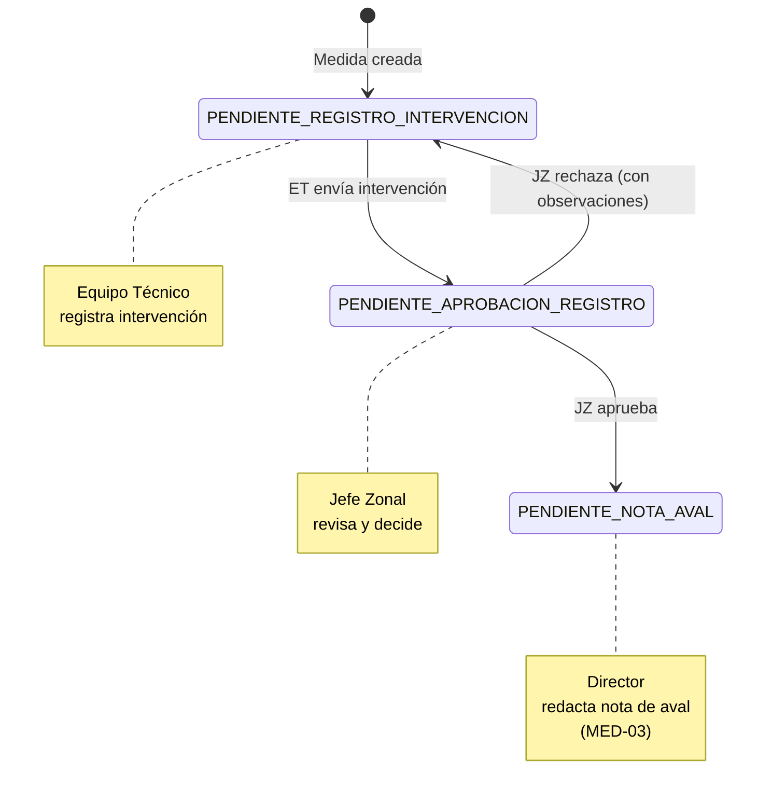

# MED-02b: Aprobación y Transiciones de Estado

**Fecha de Creación:** 2025-10-11
**Sprint:** TBD
**Estimación:** 8 puntos (Mediano)
**Prioridad:** Alta
**Estado:** Documentada
**Dependencias:** MED-02a (Modelos y serializers básicos deben existir)

---

## Historia de Usuario

**Como** Jefe Zonal
**Quiero** aprobar o rechazar intervenciones registradas por el Equipo Técnico
**Para** validar la calidad de la documentación antes de avanzar al siguiente estado del proceso

---

## Alcance de MED-02b

Esta sub-story se enfoca **exclusivamente** en:
- ✅ Implementar helper `_transicionar_estado()` para cambios de etapa
- ✅ Implementar action `enviar()` - Estado 1 → Estado 2
- ✅ Implementar action `aprobar()` - Estado 2 → Estado 3
- ✅ Implementar action `rechazar()` - Estado 2 → Estado 1
- ✅ Sistema de notificaciones (mock inicial)
- ✅ Endpoints PATCH/POST para transiciones
- ✅ Tests de transiciones, notificaciones y permisos (9-10 tests)
- ❌ NO incluye modelos (ver MED-02a)
- ❌ NO incluye adjuntos (ver MED-02c)

---

## Flujo de Transiciones de Estado

### Diagrama de Estados



---

## Implementación

### 1. Helper: _transicionar_estado()

**Ubicación:** Agregar método en `TIntervencionMedidaViewSet`

```python
def _transicionar_estado(self, medida, nuevo_estado, observaciones=None):
    """
    Helper para transicionar estado de medida creando nueva etapa.

    Args:
        medida: Instancia de TMedida
        nuevo_estado: Código del nuevo estado (ej: 'PENDIENTE_APROBACION_REGISTRO')
        observaciones: Texto de observaciones (opcional, usado en rechazos)

    Returns:
        TEtapaMedida: Nueva etapa creada

    Proceso:
        1. Finalizar etapa anterior (fecha_fin_estado = now())
        2. Crear nueva etapa con nuevo estado
        3. Actualizar medida.etapa_actual
    """
    from django.utils import timezone
    from infrastructure.models import TEtapaMedida

    # 1. Finalizar etapa anterior
    etapa_anterior = medida.etapa_actual
    if etapa_anterior:
        etapa_anterior.fecha_fin_estado = timezone.now()
        etapa_anterior.save(update_fields=['fecha_fin_estado'])

    # 2. Crear nueva etapa
    nueva_etapa = TEtapaMedida.objects.create(
        medida=medida,
        estado=nuevo_estado,
        nombre=self._obtener_nombre_etapa(nuevo_estado),
        observaciones=observaciones
    )

    # 3. Actualizar etapa_actual de medida
    medida.etapa_actual = nueva_etapa
    medida.save(update_fields=['etapa_actual'])

    return nueva_etapa

def _obtener_nombre_etapa(self, estado):
    """Retorna nombre descriptivo según código de estado"""
    nombres = {
        'PENDIENTE_REGISTRO_INTERVENCION': 'Registro de Intervención',
        'PENDIENTE_APROBACION_REGISTRO': 'Aprobación de Registro',
        'PENDIENTE_NOTA_AVAL': 'Nota de Aval',
        'PENDIENTE_INFORME_JURIDICO': 'Informe Jurídico',
        'PENDIENTE_RATIFICACION_JUDICIAL': 'Ratificación Judicial',
    }
    return nombres.get(estado, 'Etapa de Medida')
```

---

### 2. Action: enviar_a_aprobacion()

**Transición:** Estado 1 → Estado 2

**Endpoint:** `PATCH /api/medidas/{medida_id}/intervenciones/{id}/enviar/`

```python
from rest_framework.decorators import action
from rest_framework.response import Response
from rest_framework import status
from django.utils import timezone


@action(detail=True, methods=['patch'], url_path='enviar')
def enviar_a_aprobacion(self, request, medida_pk=None, pk=None):
    """
    Enviar intervención a aprobación (Estado 1 → Estado 2)

    Validaciones:
    - Intervención debe estar en estado BORRADOR
    - Todos los campos obligatorios completos
    - Usuario tiene permisos (ET responsable, JZ, Director, Admin)

    Proceso:
    1. Validar campos obligatorios
    2. Cambiar estado intervención a ENVIADO
    3. Actualizar fecha_envio
    4. Transicionar medida a Estado 2
    5. Notificar Jefe Zonal
    """
    intervencion = self.get_object()
    medida = intervencion.medida
    user = request.user

    # Validación 1: Estado debe ser BORRADOR
    if intervencion.estado != TIntervencionMedida.ESTADO_BORRADOR:
        return Response(
            {
                'error': 'ESTADO_INVALIDO',
                'detalle': 'Solo se pueden enviar intervenciones en estado BORRADOR',
                'estado_actual': intervencion.get_estado_display()
            },
            status=status.HTTP_400_BAD_REQUEST
        )

    # Validación 2: Campos obligatorios
    campos_obligatorios = {
        'fecha_intervencion': intervencion.fecha_intervencion,
        'motivo': intervencion.motivo,
        'categoria_intervencion': intervencion.categoria_intervencion,
        'intervencion_especifica': intervencion.intervencion_especifica,
    }

    campos_faltantes = [
        campo for campo, valor in campos_obligatorios.items()
        if not valor or (isinstance(valor, str) and not valor.strip())
    ]

    if campos_faltantes:
        return Response(
            {
                'error': 'CAMPOS_INCOMPLETOS',
                'detalle': 'Faltan campos obligatorios',
                'campos_faltantes': campos_faltantes
            },
            status=status.HTTP_400_BAD_REQUEST
        )

    # Validación 3: Permisos
    if not intervencion.puede_editar(user):
        return Response(
            {
                'error': 'PERMISO_DENEGADO',
                'detalle': 'No tiene permisos para enviar esta intervención'
            },
            status=status.HTTP_403_FORBIDDEN
        )

    # Proceso 1: Cambiar estado de intervención
    intervencion.estado = TIntervencionMedida.ESTADO_ENVIADO
    intervencion.fecha_envio = timezone.now()
    intervencion.save(update_fields=['estado', 'fecha_envio'])

    # Proceso 2: Transicionar medida a Estado 2
    nueva_etapa = self._transicionar_estado(
        medida=medida,
        nuevo_estado='PENDIENTE_APROBACION_REGISTRO'
    )

    # Proceso 3: Notificar Jefe Zonal
    self._notificar_jefe_zonal_intervencion_enviada(medida, intervencion)

    # Response
    serializer = self.get_serializer(intervencion)
    data = serializer.data
    data['mensaje'] = 'Intervención enviada a aprobación. Se notificó al Jefe Zonal.'
    data['medida'] = {
        'id': medida.id,
        'numero_medida': medida.numero_medida,
        'etapa_actual': {
            'id': nueva_etapa.id,
            'nombre': nueva_etapa.nombre,
            'estado': nueva_etapa.estado,
            'estado_display': nueva_etapa.get_estado_display(),
            'fecha_inicio_estado': nueva_etapa.fecha_inicio_estado
        }
    }

    return Response(data, status=status.HTTP_200_OK)
```

---

### 3. Action: aprobar()

**Transición:** Estado 2 → Estado 3

**Endpoint:** `POST /api/medidas/{medida_id}/intervenciones/{id}/aprobar/`

```python
@action(detail=True, methods=['post'], url_path='aprobar')
def aprobar(self, request, medida_pk=None, pk=None):
    """
    Aprobar intervención (Estado 2 → Estado 3)

    Validaciones:
    - Intervención debe estar en estado ENVIADO
    - Usuario debe ser JZ de la zona, Director o Admin

    Proceso:
    1. Cambiar estado intervención a APROBADO
    2. Actualizar fecha_aprobacion y aprobado_por
    3. Transicionar medida a Estado 3
    4. Notificar Director para MED-03
    """
    intervencion = self.get_object()
    medida = intervencion.medida
    legajo = medida.legajo
    user = request.user

    # Validación 1: Estado debe ser ENVIADO
    if intervencion.estado != TIntervencionMedida.ESTADO_ENVIADO:
        return Response(
            {
                'error': 'ESTADO_INVALIDO',
                'detalle': 'Solo se pueden aprobar intervenciones en estado ENVIADO',
                'estado_actual': intervencion.get_estado_display()
            },
            status=status.HTTP_400_BAD_REQUEST
        )

    # Validación 2: Permisos - solo JZ de la zona, Director, Admin
    puede_aprobar = False

    if user.is_superuser:
        puede_aprobar = True
    elif hasattr(user, 'nivel_usuario'):
        if user.nivel_usuario == 'DIRECTOR':
            puede_aprobar = True
        elif user.nivel_usuario == 'JEFEZONAL':
            if hasattr(user, 'zona') and user.zona == legajo.zona:
                puede_aprobar = True

    if not puede_aprobar:
        return Response(
            {
                'error': 'PERMISO_DENEGADO',
                'detalle': 'Solo el Jefe Zonal de la zona puede aprobar esta intervención'
            },
            status=status.HTTP_403_FORBIDDEN
        )

    # Proceso 1: Cambiar estado de intervención
    intervencion.estado = TIntervencionMedida.ESTADO_APROBADO
    intervencion.fecha_aprobacion = timezone.now()
    intervencion.aprobado_por = user
    intervencion.save(update_fields=['estado', 'fecha_aprobacion', 'aprobado_por'])

    # Proceso 2: Transicionar medida a Estado 3
    nueva_etapa = self._transicionar_estado(
        medida=medida,
        nuevo_estado='PENDIENTE_NOTA_AVAL'
    )

    # Proceso 3: Notificar Director
    self._notificar_director_intervencion_aprobada(medida, intervencion)

    # Response
    serializer = self.get_serializer(intervencion)
    data = serializer.data
    data['mensaje'] = 'Intervención aprobada. Se notificó al Director para MED-03.'
    data['medida'] = {
        'id': medida.id,
        'numero_medida': medida.numero_medida,
        'etapa_actual': {
            'id': nueva_etapa.id,
            'nombre': nueva_etapa.nombre,
            'estado': nueva_etapa.estado,
            'estado_display': nueva_etapa.get_estado_display(),
            'fecha_inicio_estado': nueva_etapa.fecha_inicio_estado
        }
    }

    return Response(data, status=status.HTTP_200_OK)
```

---

### 4. Action: rechazar()

**Transición:** Estado 2 → Estado 1 (con observaciones)

**Endpoint:** `POST /api/medidas/{medida_id}/intervenciones/{id}/rechazar/`

```python
@action(detail=True, methods=['post'], url_path='rechazar')
def rechazar(self, request, medida_pk=None, pk=None):
    """
    Rechazar intervención (Estado 2 → Estado 1 con observaciones)

    Validaciones:
    - Intervención debe estar en estado ENVIADO
    - Usuario debe ser JZ de la zona, Director o Admin
    - Observaciones son obligatorias

    Proceso:
    1. Validar que observaciones no estén vacías
    2. Cambiar estado intervención a RECHAZADO
    3. Actualizar fecha_rechazo, rechazado_por, observaciones_jz
    4. Transicionar medida a Estado 1 con observaciones en etapa
    5. Notificar Equipo Técnico
    """
    intervencion = self.get_object()
    medida = intervencion.medida
    legajo = medida.legajo
    user = request.user

    # Validación 1: Estado debe ser ENVIADO
    if intervencion.estado != TIntervencionMedida.ESTADO_ENVIADO:
        return Response(
            {
                'error': 'ESTADO_INVALIDO',
                'detalle': 'Solo se pueden rechazar intervenciones en estado ENVIADO',
                'estado_actual': intervencion.get_estado_display()
            },
            status=status.HTTP_400_BAD_REQUEST
        )

    # Validación 2: Permisos - solo JZ de la zona, Director, Admin
    puede_rechazar = False

    if user.is_superuser:
        puede_rechazar = True
    elif hasattr(user, 'nivel_usuario'):
        if user.nivel_usuario == 'DIRECTOR':
            puede_rechazar = True
        elif user.nivel_usuario == 'JEFEZONAL':
            if hasattr(user, 'zona') and user.zona == legajo.zona:
                puede_rechazar = True

    if not puede_rechazar:
        return Response(
            {
                'error': 'PERMISO_DENEGADO',
                'detalle': 'Solo el Jefe Zonal de la zona puede rechazar esta intervención'
            },
            status=status.HTTP_403_FORBIDDEN
        )

    # Validación 3: Observaciones obligatorias
    observaciones = request.data.get('observaciones', '').strip()
    if not observaciones:
        return Response(
            {
                'error': 'OBSERVACIONES_REQUERIDAS',
                'detalle': 'Las observaciones son obligatorias al rechazar una intervención'
            },
            status=status.HTTP_400_BAD_REQUEST
        )

    # Proceso 1: Cambiar estado de intervención
    intervencion.estado = TIntervencionMedida.ESTADO_RECHAZADO
    intervencion.fecha_rechazo = timezone.now()
    intervencion.rechazado_por = user
    intervencion.observaciones_jz = observaciones
    intervencion.save(update_fields=[
        'estado', 'fecha_rechazo', 'rechazado_por', 'observaciones_jz'
    ])

    # Proceso 2: Transicionar medida a Estado 1 con observaciones
    nueva_etapa = self._transicionar_estado(
        medida=medida,
        nuevo_estado='PENDIENTE_REGISTRO_INTERVENCION',
        observaciones=observaciones
    )

    # Proceso 3: Notificar Equipo Técnico
    self._notificar_equipo_tecnico_intervencion_rechazada(medida, intervencion, observaciones)

    # Response
    serializer = self.get_serializer(intervencion)
    data = serializer.data
    data['mensaje'] = 'Intervención rechazada. Se notificó al Equipo Técnico para correcciones.'
    data['medida'] = {
        'id': medida.id,
        'numero_medida': medida.numero_medida,
        'etapa_actual': {
            'id': nueva_etapa.id,
            'nombre': nueva_etapa.nombre,
            'estado': nueva_etapa.estado,
            'estado_display': nueva_etapa.get_estado_display(),
            'fecha_inicio_estado': nueva_etapa.fecha_inicio_estado,
            'observaciones': nueva_etapa.observaciones
        }
    }

    return Response(data, status=status.HTTP_200_OK)
```

---

### 5. Sistema de Notificaciones (Mock)

**Ubicación:** Agregar métodos helper en `TIntervencionMedidaViewSet`

```python
def _notificar_jefe_zonal_intervencion_enviada(self, medida, intervencion):
    """
    Notificar al Jefe Zonal que hay una intervención pendiente de aprobación.

    TODO: Implementar notificación real con sistema de notificaciones.
    Por ahora, solo log para testing.
    """
    legajo = medida.legajo
    jefe_zonal = self._obtener_jefe_zonal(legajo.zona)

    if jefe_zonal:
        # Mock de notificación
        print(f"""
        [NOTIFICACIÓN MOCK]
        Para: {jefe_zonal.email}
        Asunto: Intervención pendiente de aprobación
        Contenido:
            - Medida: {medida.numero_medida}
            - Legajo: {legajo.numero_legajo}
            - NNyA: {legajo.persona.nombre} {legajo.persona.apellido}
            - Código Intervención: {intervencion.codigo_intervencion}
            - Registrado por: {intervencion.registrado_por.get_full_name()}
            - Fecha envío: {intervencion.fecha_envio}
            - Link: /medidas/{medida.id}/intervenciones/{intervencion.id}/
        """)

        # TODO: Reemplazar con llamada real a sistema de notificaciones
        # notificaciones.enviar_notificacion(
        #     usuario=jefe_zonal,
        #     tipo='INTERVENCION_PENDIENTE_APROBACION',
        #     contexto={...}
        # )

def _notificar_director_intervencion_aprobada(self, medida, intervencion):
    """
    Notificar al Director que la intervención fue aprobada y puede continuar con MED-03.

    TODO: Implementar notificación real.
    """
    directores = self._obtener_directores()

    for director in directores:
        print(f"""
        [NOTIFICACIÓN MOCK]
        Para: {director.email}
        Asunto: Intervención aprobada - Pendiente Nota de Aval
        Contenido:
            - Medida: {medida.numero_medida}
            - Código Intervención: {intervencion.codigo_intervencion}
            - Aprobado por: {intervencion.aprobado_por.get_full_name()}
            - Fecha aprobación: {intervencion.fecha_aprobacion}
            - Próximo paso: Redactar Nota de Aval (MED-03)
            - Link: /medidas/{medida.id}/
        """)

def _notificar_equipo_tecnico_intervencion_rechazada(self, medida, intervencion, observaciones):
    """
    Notificar al Equipo Técnico que la intervención fue rechazada y necesita correcciones.

    TODO: Implementar notificación real.
    """
    equipo_tecnico = intervencion.registrado_por

    if equipo_tecnico:
        print(f"""
        [NOTIFICACIÓN MOCK]
        Para: {equipo_tecnico.email}
        Asunto: Intervención rechazada - Correcciones requeridas
        Contenido:
            - Medida: {medida.numero_medida}
            - Código Intervención: {intervencion.codigo_intervencion}
            - Rechazado por: {intervencion.rechazado_por.get_full_name()}
            - Fecha rechazo: {intervencion.fecha_rechazo}
            - Observaciones:
            {observaciones}
            - Link: /medidas/{medida.id}/intervenciones/{intervencion.id}/
        """)

def _obtener_jefe_zonal(self, zona):
    """Obtener Jefe Zonal de una zona"""
    from django.contrib.auth import get_user_model
    CustomUser = get_user_model()

    try:
        return CustomUser.objects.get(nivel_usuario='JEFEZONAL', zona=zona)
    except CustomUser.DoesNotExist:
        return None

def _obtener_directores(self):
    """Obtener todos los Directores"""
    from django.contrib.auth import get_user_model
    CustomUser = get_user_model()

    return CustomUser.objects.filter(nivel_usuario='DIRECTOR')
```

---

## Endpoints

### PATCH /api/medidas/{medida_id}/intervenciones/{id}/enviar/

**Request:** (body vacío)

**Response 200 OK:**
```json
{
  "id": 1,
  "codigo_intervencion": "INT-MED-2025-000001",
  "estado": "ENVIADO",
  "estado_display": "Enviado a Aprobación",
  "fecha_envio": "2025-01-20T14:30:00Z",
  "medida": {
    "id": 1,
    "numero_medida": "MED-2025-001",
    "etapa_actual": {
      "id": 2,
      "nombre": "Aprobación de Registro",
      "estado": "PENDIENTE_APROBACION_REGISTRO",
      "estado_display": "(2) Pendiente de aprobación de registro",
      "fecha_inicio_estado": "2025-01-20T14:30:00Z"
    }
  },
  "mensaje": "Intervención enviada a aprobación. Se notificó al Jefe Zonal."
}
```

**Response 400 BAD REQUEST** (campos incompletos):
```json
{
  "error": "CAMPOS_INCOMPLETOS",
  "detalle": "Faltan campos obligatorios",
  "campos_faltantes": ["motivo", "categoria_intervencion"]
}
```

---

### POST /api/medidas/{medida_id}/intervenciones/{id}/aprobar/

**Request:** (body vacío)

**Response 200 OK:**
```json
{
  "id": 1,
  "codigo_intervencion": "INT-MED-2025-000001",
  "estado": "APROBADO",
  "estado_display": "Aprobado",
  "fecha_aprobacion": "2025-01-21T09:15:00Z",
  "aprobado_por_detalle": {
    "id": 8,
    "nombre_completo": "Carlos Ramírez",
    "username": "cramirez"
  },
  "medida": {
    "id": 1,
    "numero_medida": "MED-2025-001",
    "etapa_actual": {
      "id": 3,
      "nombre": "Nota de Aval",
      "estado": "PENDIENTE_NOTA_AVAL",
      "estado_display": "(3) Pendiente de Nota de Aval",
      "fecha_inicio_estado": "2025-01-21T09:15:00Z"
    }
  },
  "mensaje": "Intervención aprobada. Se notificó al Director para MED-03."
}
```

**Response 403 FORBIDDEN** (no es JZ de la zona):
```json
{
  "error": "PERMISO_DENEGADO",
  "detalle": "Solo el Jefe Zonal de la zona puede aprobar esta intervención"
}
```

---

### POST /api/medidas/{medida_id}/intervenciones/{id}/rechazar/

**Request:**
```json
{
  "observaciones": "La descripción de la intervención es insuficiente. Falta detallar las acciones concretas realizadas con la familia y los acuerdos establecidos."
}
```

**Response 200 OK:**
```json
{
  "id": 1,
  "codigo_intervencion": "INT-MED-2025-000001",
  "estado": "RECHAZADO",
  "estado_display": "Rechazado",
  "fecha_rechazo": "2025-01-21T09:20:00Z",
  "rechazado_por_detalle": {
    "id": 8,
    "nombre_completo": "Carlos Ramírez",
    "username": "cramirez"
  },
  "observaciones_jz": "La descripción de la intervención es insuficiente. Falta detallar las acciones concretas realizadas con la familia y los acuerdos establecidos.",
  "medida": {
    "id": 1,
    "numero_medida": "MED-2025-001",
    "etapa_actual": {
      "id": 4,
      "nombre": "Registro de Intervención (Correcciones)",
      "estado": "PENDIENTE_REGISTRO_INTERVENCION",
      "estado_display": "(1) Pendiente de registro de intervención",
      "fecha_inicio_estado": "2025-01-21T09:20:00Z",
      "observaciones": "La descripción de la intervención es insuficiente..."
    }
  },
  "mensaje": "Intervención rechazada. Se notificó al Equipo Técnico para correcciones."
}
```

**Response 400 BAD REQUEST** (sin observaciones):
```json
{
  "error": "OBSERVACIONES_REQUERIDAS",
  "detalle": "Las observaciones son obligatorias al rechazar una intervención"
}
```

---

## Tests Requeridos (9-10 tests)

### Test Suite: Transiciones de Estado

**Archivo:** `runna/tests/test_intervencion_med02b_transiciones.py`

```python
from django.test import TestCase
from rest_framework.test import APIClient
from django.contrib.auth import get_user_model
from infrastructure.models import (
    TMedida, TEtapaMedida, TIntervencionMedida
)

CustomUser = get_user_model()


class IntervencionTransicionesTestCase(TestCase):
    """Tests de transiciones de estado (MED-02b)"""

    def setUp(self):
        """Configurar datos de prueba"""
        # Crear usuarios
        self.admin = CustomUser.objects.create_superuser(...)
        self.et_user = CustomUser.objects.create_user(nivel_usuario='EQUIPOTECNICO', ...)
        self.jz_user = CustomUser.objects.create_user(nivel_usuario='JEFEZONAL', zona=zona, ...)
        self.director = CustomUser.objects.create_user(nivel_usuario='DIRECTOR', ...)

        # Crear medida en Estado 1
        self.medida = TMedida.objects.create(...)
        self.etapa1 = TEtapaMedida.objects.create(
            medida=self.medida,
            estado='PENDIENTE_REGISTRO_INTERVENCION'
        )
        self.medida.etapa_actual = self.etapa1
        self.medida.save()

        # Crear intervención en estado BORRADOR
        self.intervencion = TIntervencionMedida.objects.create(
            medida=self.medida,
            estado='BORRADOR',
            registrado_por=self.et_user,
            fecha_intervencion='2025-01-20',
            motivo=...,
            categoria_intervencion=...,
            intervencion_especifica='Test completo'
        )

        self.client = APIClient()

    def test_enviar_intervencion_cambia_estado_a_enviado(self):
        """Enviar intervención cambia estado a ENVIADO"""
        self.client.force_authenticate(user=self.et_user)

        response = self.client.patch(
            f'/api/medidas/{self.medida.id}/intervenciones/{self.intervencion.id}/enviar/'
        )

        self.assertEqual(response.status_code, 200)

        # Verificar estado intervención
        self.intervencion.refresh_from_db()
        self.assertEqual(self.intervencion.estado, 'ENVIADO')
        self.assertIsNotNone(self.intervencion.fecha_envio)

    def test_enviar_intervencion_transiciona_medida_a_estado_2(self):
        """Enviar intervención cambia estado de medida a Estado 2"""
        self.client.force_authenticate(user=self.et_user)

        response = self.client.patch(
            f'/api/medidas/{self.medida.id}/intervenciones/{self.intervencion.id}/enviar/'
        )

        self.assertEqual(response.status_code, 200)

        # Verificar etapa anterior finalizada
        self.etapa1.refresh_from_db()
        self.assertIsNotNone(self.etapa1.fecha_fin_estado)

        # Verificar nueva etapa creada
        self.medida.refresh_from_db()
        self.assertEqual(self.medida.etapa_actual.estado, 'PENDIENTE_APROBACION_REGISTRO')

    def test_enviar_sin_campos_obligatorios_devuelve_400(self):
        """No se puede enviar intervención sin campos obligatorios"""
        # Crear intervención incompleta
        intervencion_incompleta = TIntervencionMedida.objects.create(
            medida=self.medida,
            estado='BORRADOR',
            registrado_por=self.et_user,
            fecha_intervencion='2025-01-20'
            # Faltan motivo, categoria_intervencion, intervencion_especifica
        )

        self.client.force_authenticate(user=self.et_user)

        response = self.client.patch(
            f'/api/medidas/{self.medida.id}/intervenciones/{intervencion_incompleta.id}/enviar/'
        )

        self.assertEqual(response.status_code, 400)
        self.assertIn('CAMPOS_INCOMPLETOS', response.json()['error'])
        self.assertIn('campos_faltantes', response.json())

    def test_aprobar_intervencion_cambia_estado_a_aprobado(self):
        """Jefe Zonal puede aprobar intervención ENVIADA"""
        # Enviar primero
        self.intervencion.estado = 'ENVIADO'
        self.intervencion.save()

        self.client.force_authenticate(user=self.jz_user)

        response = self.client.post(
            f'/api/medidas/{self.medida.id}/intervenciones/{self.intervencion.id}/aprobar/'
        )

        self.assertEqual(response.status_code, 200)

        # Verificar estado intervención
        self.intervencion.refresh_from_db()
        self.assertEqual(self.intervencion.estado, 'APROBADO')
        self.assertIsNotNone(self.intervencion.fecha_aprobacion)
        self.assertEqual(self.intervencion.aprobado_por, self.jz_user)

    def test_aprobar_intervencion_transiciona_medida_a_estado_3(self):
        """Aprobar intervención cambia estado de medida a Estado 3"""
        # Enviar primero y actualizar medida a Estado 2
        self.intervencion.estado = 'ENVIADO'
        self.intervencion.save()
        etapa2 = TEtapaMedida.objects.create(
            medida=self.medida,
            estado='PENDIENTE_APROBACION_REGISTRO'
        )
        self.medida.etapa_actual = etapa2
        self.medida.save()

        self.client.force_authenticate(user=self.jz_user)

        response = self.client.post(
            f'/api/medidas/{self.medida.id}/intervenciones/{self.intervencion.id}/aprobar/'
        )

        self.assertEqual(response.status_code, 200)

        # Verificar nueva etapa
        self.medida.refresh_from_db()
        self.assertEqual(self.medida.etapa_actual.estado, 'PENDIENTE_NOTA_AVAL')

    def test_rechazar_intervencion_vuelve_a_estado_1(self):
        """Rechazar intervención vuelve estado de medida a Estado 1"""
        # Configurar intervención enviada en Estado 2
        self.intervencion.estado = 'ENVIADO'
        self.intervencion.save()
        etapa2 = TEtapaMedida.objects.create(
            medida=self.medida,
            estado='PENDIENTE_APROBACION_REGISTRO'
        )
        self.medida.etapa_actual = etapa2
        self.medida.save()

        self.client.force_authenticate(user=self.jz_user)

        response = self.client.post(
            f'/api/medidas/{self.medida.id}/intervenciones/{self.intervencion.id}/rechazar/',
            data={
                'observaciones': 'Descripción insuficiente, ampliar detalles de la intervención.'
            }
        )

        self.assertEqual(response.status_code, 200)

        # Verificar estado intervención
        self.intervencion.refresh_from_db()
        self.assertEqual(self.intervencion.estado, 'RECHAZADO')
        self.assertIsNotNone(self.intervencion.fecha_rechazo)
        self.assertEqual(self.intervencion.rechazado_por, self.jz_user)
        self.assertIn('insuficiente', self.intervencion.observaciones_jz)

        # Verificar medida volvió a Estado 1
        self.medida.refresh_from_db()
        self.assertEqual(self.medida.etapa_actual.estado, 'PENDIENTE_REGISTRO_INTERVENCION')

        # Verificar observaciones en etapa
        self.assertIn('insuficiente', self.medida.etapa_actual.observaciones)

    def test_rechazar_sin_observaciones_devuelve_400(self):
        """No se puede rechazar sin ingresar observaciones"""
        self.intervencion.estado = 'ENVIADO'
        self.intervencion.save()

        self.client.force_authenticate(user=self.jz_user)

        response = self.client.post(
            f'/api/medidas/{self.medida.id}/intervenciones/{self.intervencion.id}/rechazar/',
            data={'observaciones': ''}  # Vacío
        )

        self.assertEqual(response.status_code, 400)
        self.assertIn('OBSERVACIONES_REQUERIDAS', response.json()['error'])

    def test_jefe_zonal_otra_zona_no_puede_aprobar(self):
        """JZ de otra zona no puede aprobar intervención"""
        # Crear JZ de otra zona
        otra_zona = Zona.objects.create(nombre='Zona Sur')
        jz_otra_zona = CustomUser.objects.create_user(
            username='jz_sur',
            nivel_usuario='JEFEZONAL',
            zona=otra_zona
        )

        self.intervencion.estado = 'ENVIADO'
        self.intervencion.save()

        self.client.force_authenticate(user=jz_otra_zona)

        response = self.client.post(
            f'/api/medidas/{self.medida.id}/intervenciones/{self.intervencion.id}/aprobar/'
        )

        self.assertEqual(response.status_code, 403)
        self.assertIn('PERMISO_DENEGADO', response.json()['error'])

    def test_director_puede_aprobar_cualquier_zona(self):
        """Director puede aprobar intervenciones de cualquier zona"""
        self.intervencion.estado = 'ENVIADO'
        self.intervencion.save()

        self.client.force_authenticate(user=self.director)

        response = self.client.post(
            f'/api/medidas/{self.medida.id}/intervenciones/{self.intervencion.id}/aprobar/'
        )

        self.assertEqual(response.status_code, 200)

    def test_editar_intervencion_rechazada_permitido(self):
        """Intervención rechazada puede editarse nuevamente"""
        self.intervencion.estado = 'RECHAZADO'
        self.intervencion.observaciones_jz = 'Ampliar descripción'
        self.intervencion.save()

        self.client.force_authenticate(user=self.et_user)

        response = self.client.patch(
            f'/api/medidas/{self.medida.id}/intervenciones/{self.intervencion.id}/',
            data={'intervencion_especifica': 'Descripción ampliada con más detalles...'}
        )

        self.assertEqual(response.status_code, 200)

        # Verificar actualización
        self.intervencion.refresh_from_db()
        self.assertIn('ampliada', self.intervencion.intervencion_especifica)
```

---

## Criterios de Aceptación (MED-02b)

### CA-4: Envío a Aprobación ✅

- ✅ Sistema valida campos obligatorios completos
- ✅ Estado de medida cambia a `PENDIENTE_APROBACION_REGISTRO` (Estado 2)
- ✅ Se crea nueva etapa en TEtapaMedida con estado Estado 2
- ✅ Etapa anterior (Estado 1) se marca con fecha_fin_estado
- ✅ Se actualiza `medida.etapa_actual` a la nueva etapa
- ✅ Sistema envía notificación al Jefe Zonal (mock)

### CA-5: Notificación a Jefe Zonal ✅

- ✅ Jefe Zonal recibe notificación (mock con print)
- ✅ Notificación incluye: número de medida, legajo, nombre NNyA, fecha de envío
- ✅ Medida aparece en bandeja de JZ (filtrado implementado en queryset)

### CA-6: Aprobación por Jefe Zonal ✅

- ✅ Estado de medida cambia a `PENDIENTE_NOTA_AVAL` (Estado 3)
- ✅ Se crea nueva etapa en TEtapaMedida con estado Estado 3
- ✅ Etapa anterior (Estado 2) se marca con fecha_fin_estado
- ✅ Se actualiza `medida.etapa_actual` a Estado 3
- ✅ Sistema envía notificación al Director (mock)
- ✅ Sistema registra fecha, usuario y decisión de aprobación

### CA-7: Rechazo por Jefe Zonal ✅

- ✅ Sistema valida que observaciones no estén vacías
- ✅ Estado de medida vuelve a `PENDIENTE_REGISTRO_INTERVENCION` (Estado 1)
- ✅ Se crea nueva etapa en TEtapaMedida con estado Estado 1
- ✅ Etapa anterior (Estado 2) se marca con fecha_fin_estado
- ✅ Observaciones quedan registradas en la nueva etapa
- ✅ Sistema envía notificación al Equipo Técnico (mock)
- ✅ Sistema registra fecha, usuario y decisión de rechazo

### CA-8: Permisos de Acceso ✅ (Completar)

| Rol | Crear | Editar Borrador | Enviar | Aprobar/Rechazar |
|-----|-------|----------------|--------|------------------|
| **Equipo Técnico (responsable)** | ✅ | ✅ | ✅ | ❌ |
| **Jefe Zonal (de la zona)** | ✅ | ✅ | ✅ | ✅ |
| **Director** | ✅ | ✅ | ✅ | ✅ |

---

## Próximos Pasos

Una vez completado MED-02b, continuar con:

**MED-02c**: Adjuntos y validaciones avanzadas de archivos

---

## Registro de URLs

Agregar a `runna/api/urls.py`:

```python
# Intervenciones (nested under medidas)
router.register(
    r'medidas/(?P<medida_pk>\d+)/intervenciones',
    TIntervencionMedidaViewSet,
    basename='intervencion-medida'
)
```

---

**Fin de MED-02b: Aprobación y Transiciones de Estado**
