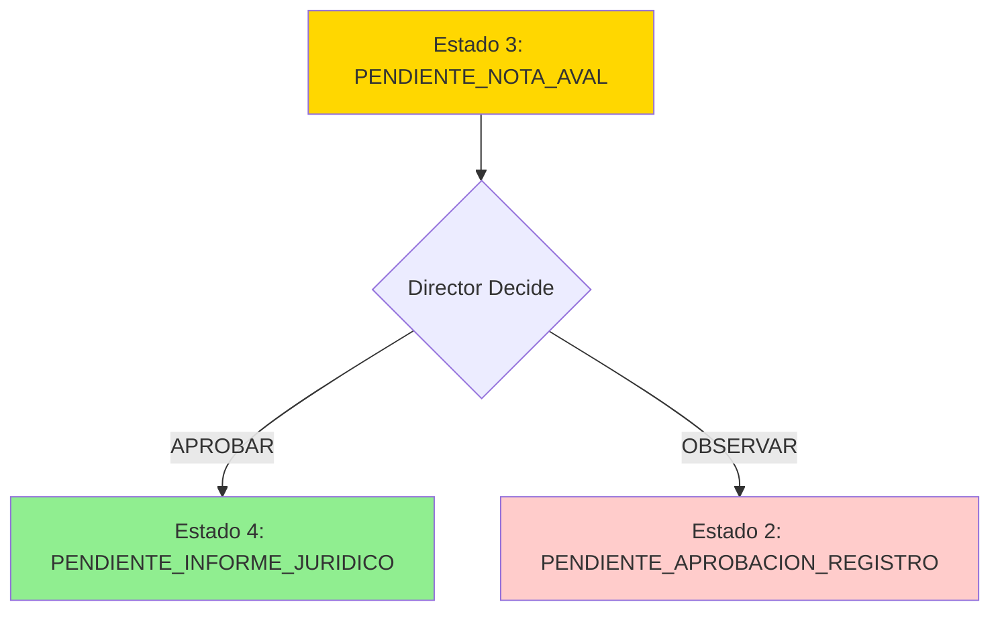

# MED-03: Redacción de Nota de Aval por Director

## Historia de Usuario

**Como** Director/a (Capital o Interior)
**Quiero** revisar la intervención cargada, emitir una Nota de Aval, aprobarla u observarla
**Para** autorizar la continuidad de la Medida o devolverla para corrección

## Contexto Técnico

### Dependencias Completadas
- ✅ **MED-01**: Modelos TMedida, TEtapaMedida, TJuzgado creados (19/19 tests)
- ✅ **MED-02a**: TIntervencionMedida + catálogos (10/10 tests)
- ✅ **MED-02b**: Transiciones de estado con `_transicionar_estado()` (10/10 tests)
- ✅ **MED-02c**: TIntervencionAdjunto (6/6 tests)
- ✅ **Estado actual**: PENDIENTE_NOTA_AVAL (Estado 3) después de aprobación JZ

### Estado del Sistema
```python
# Estado inicial: PENDIENTE_NOTA_AVAL (3)
# Transiciones posibles:
#   - APROBAR → PENDIENTE_INFORME_JURIDICO (4)
#   - OBSERVAR → PENDIENTE_APROBACION_REGISTRO (2)
```

## Flujo de Proceso (Según BPMN)



### Actores Involucrados

| Rol | Nivel Usuario | Acción |
|-----|---------------|--------|
| Director/a Capital o Interior | 3 o 4 | Aprueba u observa la intervención |
| Equipo Técnico | 2 | Recibe notificación si es observada |
| Jefe Zonal | 3 | Es notificado del resultado |

## Descripción del Proceso

1. **Acceso**: Director accede a medida en estado PENDIENTE_NOTA_AVAL
2. **Revisión**: Revisa información de intervención y documentos adjuntos de MED-02
3. **Decisión**: Toma una de dos acciones:
   - **APROBAR**: Emite Nota de Aval → medida avanza a Estado 4
   - **OBSERVAR**: Rechaza intervención → medida retrocede a Estado 2
4. **Registro**: Sistema registra decisión, comentarios y archivos adjuntos
5. **Notificación**: Sistema notifica automáticamente a roles involucrados

## Criterios de Aceptación

### CA-1: Precondiciones
- [ ] La medida debe estar en estado `PENDIENTE_NOTA_AVAL` (3)
- [ ] MED-02 debe estar completado y aprobado por Jefe Zonal
- [ ] Solo usuarios con rol Director (nivel 3 o 4) pueden acceder

### CA-2: Aprobación de Nota de Aval
- [ ] Director puede aprobar la intervención
- [ ] Al aprobar, estado cambia a `PENDIENTE_INFORME_JURIDICO` (4)
- [ ] Se registra fecha, usuario y decisión para auditoría
- [ ] Se permite adjuntar documento de aval firmado
- [ ] Sistema notifica a Equipo Legal

### CA-3: Observación de Intervención
- [ ] Director puede observar la intervención
- [ ] Al observar, estado cambia a `PENDIENTE_APROBACION_REGISTRO` (2)
- [ ] Campo de comentarios es obligatorio al observar
- [ ] Se registra fecha, usuario, decisión y comentarios
- [ ] Sistema notifica a Equipo Técnico y Jefe Zonal

### CA-4: Validaciones de Negocio
- [ ] No se puede emitir Nota de Aval si MED-02 no está aprobado
- [ ] Comentarios obligatorios al observar (mínimo 10 caracteres)
- [ ] Archivos adjuntos opcionales al aprobar, formato PDF
- [ ] Tamaño máximo de archivo: 10MB

### CA-5: Auditoría y Trazabilidad
- [ ] Se crea registro de auditoría con:
  - id_medida
  - id_usuario (Director)
  - fecha_decision
  - decision (APROBADO/OBSERVADO)
  - comentarios
  - archivos_adjuntos
- [ ] Registro es inmutable
- [ ] Se puede consultar historial de decisiones

### CA-6: Notificaciones Automáticas
- [ ] Si APROBAR: notificar a Equipo Legal
- [ ] Si OBSERVAR: notificar a Equipo Técnico y Jefe Zonal
- [ ] Notificaciones incluyen comentarios del Director
- [ ] Notificaciones vía email e in-app

## Estructura de Datos

### Modelo TNotaAval (Nuevo)
```python
class TNotaAval(models.Model):
    """
    Registro de decisión del Director sobre la intervención.
    Estado: PENDIENTE_NOTA_AVAL → PENDIENTE_INFORME_JURIDICO o
            PENDIENTE_NOTA_AVAL → PENDIENTE_APROBACION_REGISTRO
    """
    id_nota_aval = models.AutoField(primary_key=True)
    id_medida = models.ForeignKey('TMedida', on_delete=models.PROTECT)
    id_usuario = models.ForeignKey('TUsuario', on_delete=models.PROTECT)  # Director
    fecha_decision = models.DateTimeField(auto_now_add=True)
    decision = models.CharField(
        max_length=20,
        choices=[
            ('APROBADO', 'Aprobado'),
            ('OBSERVADO', 'Observado')
        ]
    )
    comentarios = models.TextField(blank=True, null=True)
    fecha_creacion = models.DateTimeField(auto_now_add=True)
    fecha_actualizacion = models.DateTimeField(auto_now=True)
    activo = models.BooleanField(default=True)

    class Meta:
        db_table = 't_nota_aval'
        verbose_name = 'Nota de Aval'
        verbose_name_plural = 'Notas de Aval'
```

### Modelo TNotaAvalAdjunto (Nuevo)
```python
class TNotaAvalAdjunto(models.Model):
    """
    Documentos adjuntos a la Nota de Aval (firmados por Director).
    """
    id_nota_aval_adjunto = models.AutoField(primary_key=True)
    id_nota_aval = models.ForeignKey('TNotaAval', on_delete=models.CASCADE)
    nombre_archivo = models.CharField(max_length=255)
    ruta_archivo = models.CharField(max_length=500)
    tipo_archivo = models.CharField(max_length=50)  # application/pdf
    tamano_bytes = models.IntegerField()
    fecha_carga = models.DateTimeField(auto_now_add=True)
    activo = models.BooleanField(default=True)

    class Meta:
        db_table = 't_nota_aval_adjunto'
        verbose_name = 'Adjunto Nota de Aval'
        verbose_name_plural = 'Adjuntos Nota de Aval'
```

## Serializers

### TNotaAvalSerializer
```python
class TNotaAvalSerializer(serializers.ModelSerializer):
    """
    Serializer para creación y lectura de Nota de Aval.
    """
    usuario_nombre = serializers.SerializerMethodField()
    adjuntos = serializers.SerializerMethodField()

    class Meta:
        model = TNotaAval
        fields = [
            'id_nota_aval',
            'id_medida',
            'id_usuario',
            'usuario_nombre',
            'fecha_decision',
            'decision',
            'comentarios',
            'adjuntos',
            'fecha_creacion'
        ]
        read_only_fields = ['id_nota_aval', 'fecha_decision', 'fecha_creacion']

    def validate_decision(self, value):
        if value not in ['APROBADO', 'OBSERVADO']:
            raise serializers.ValidationError("Decisión inválida")
        return value

    def validate(self, data):
        # Comentarios obligatorios al observar
        if data.get('decision') == 'OBSERVADO':
            if not data.get('comentarios') or len(data['comentarios']) < 10:
                raise serializers.ValidationError({
                    'comentarios': 'Comentarios obligatorios al observar (mínimo 10 caracteres)'
                })
        return data
```

### TNotaAvalAdjuntoSerializer
```python
class TNotaAvalAdjuntoSerializer(serializers.ModelSerializer):
    """
    Serializer para adjuntos de Nota de Aval.
    """
    class Meta:
        model = TNotaAvalAdjunto
        fields = [
            'id_nota_aval_adjunto',
            'id_nota_aval',
            'nombre_archivo',
            'ruta_archivo',
            'tipo_archivo',
            'tamano_bytes',
            'fecha_carga'
        ]
        read_only_fields = ['id_nota_aval_adjunto', 'fecha_carga']

    def validate_tipo_archivo(self, value):
        if value != 'application/pdf':
            raise serializers.ValidationError("Solo se permiten archivos PDF")
        return value

    def validate_tamano_bytes(self, value):
        if value > 10 * 1024 * 1024:  # 10MB
            raise serializers.ValidationError("El archivo excede el tamaño máximo de 10MB")
        return value
```

## Endpoints

### POST /api/medidas/{id_medida}/nota-aval/
**Descripción**: Director emite decisión sobre la intervención (aprobar u observar)

**Permisos**: Director (nivel 3 o 4)

**Request Body**:
```json
{
  "decision": "APROBADO",  // o "OBSERVADO"
  "comentarios": "string (opcional si APROBADO, obligatorio si OBSERVADO)",
  "adjuntos": [
    {
      "nombre_archivo": "nota_aval_firmada.pdf",
      "archivo_base64": "base64_encoded_content"
    }
  ]
}
```

**Response 201 Created**:
```json
{
  "id_nota_aval": 1,
  "id_medida": 123,
  "id_usuario": 5,
  "usuario_nombre": "Dr. Juan Pérez",
  "fecha_decision": "2025-10-11T14:30:00Z",
  "decision": "APROBADO",
  "comentarios": "Intervención correcta y completa",
  "adjuntos": [
    {
      "id_nota_aval_adjunto": 1,
      "nombre_archivo": "nota_aval_firmada.pdf",
      "ruta_archivo": "/media/notas_aval/123/nota_aval_firmada.pdf",
      "tipo_archivo": "application/pdf",
      "tamano_bytes": 256789,
      "fecha_carga": "2025-10-11T14:30:00Z"
    }
  ],
  "fecha_creacion": "2025-10-11T14:30:00Z",
  "estado_medida_nuevo": "PENDIENTE_INFORME_JURIDICO"
}
```

**Response 400 Bad Request**:
```json
{
  "error": "VALIDATION_ERROR",
  "detail": {
    "comentarios": ["Comentarios obligatorios al observar (mínimo 10 caracteres)"]
  }
}
```

**Response 403 Forbidden**:
```json
{
  "error": "PERMISSION_DENIED",
  "detail": "Solo Directores pueden emitir Nota de Aval"
}
```

**Response 409 Conflict**:
```json
{
  "error": "INVALID_STATE",
  "detail": "La medida debe estar en estado PENDIENTE_NOTA_AVAL"
}
```

### GET /api/medidas/{id_medida}/nota-aval/
**Descripción**: Consulta Nota de Aval de una medida

**Permisos**: Director, Jefe Zonal, Equipo Técnico, Equipo Legal

**Response 200 OK**:
```json
{
  "id_nota_aval": 1,
  "id_medida": 123,
  "id_usuario": 5,
  "usuario_nombre": "Dr. Juan Pérez",
  "fecha_decision": "2025-10-11T14:30:00Z",
  "decision": "APROBADO",
  "comentarios": "Intervención correcta y completa",
  "adjuntos": [
    {
      "id_nota_aval_adjunto": 1,
      "nombre_archivo": "nota_aval_firmada.pdf",
      "ruta_archivo": "/media/notas_aval/123/nota_aval_firmada.pdf",
      "tipo_archivo": "application/pdf",
      "tamano_bytes": 256789,
      "fecha_carga": "2025-10-11T14:30:00Z"
    }
  ],
  "fecha_creacion": "2025-10-11T14:30:00Z"
}
```

**Response 404 Not Found**:
```json
{
  "error": "NOT_FOUND",
  "detail": "No existe Nota de Aval para esta medida"
}
```

## Lógica de Negocio

### Transición de Estados
```python
def emitir_nota_aval(self, id_medida, id_usuario, decision, comentarios=None, adjuntos=None):
    """
    Procesa decisión del Director sobre la intervención.

    Args:
        id_medida: ID de la medida
        id_usuario: ID del Director
        decision: 'APROBADO' o 'OBSERVADO'
        comentarios: Comentarios del Director (obligatorio si OBSERVADO)
        adjuntos: Lista de archivos adjuntos (opcional)

    Returns:
        TNotaAval: Registro de la decisión

    Raises:
        ValidationError: Si validaciones fallan
        PermissionError: Si usuario no es Director
        StateError: Si estado de medida no es PENDIENTE_NOTA_AVAL
    """
    # 1. Validar estado actual
    medida = TMedida.objects.get(id_medida=id_medida)
    if medida.id_etapa_medida.nombre != 'PENDIENTE_NOTA_AVAL':
        raise StateError("La medida debe estar en estado PENDIENTE_NOTA_AVAL")

    # 2. Validar permisos
    usuario = TUsuario.objects.get(id_usuario=id_usuario)
    if usuario.id_rol.nombre not in ['Director Capital', 'Director Interior']:
        raise PermissionError("Solo Directores pueden emitir Nota de Aval")

    # 3. Validar comentarios si es observado
    if decision == 'OBSERVADO' and (not comentarios or len(comentarios) < 10):
        raise ValidationError("Comentarios obligatorios al observar (mínimo 10 caracteres)")

    # 4. Crear registro de Nota de Aval
    nota_aval = TNotaAval.objects.create(
        id_medida=medida,
        id_usuario=usuario,
        decision=decision,
        comentarios=comentarios
    )

    # 5. Procesar adjuntos
    if adjuntos:
        for adjunto in adjuntos:
            TNotaAvalAdjunto.objects.create(
                id_nota_aval=nota_aval,
                nombre_archivo=adjunto['nombre_archivo'],
                ruta_archivo=adjunto['ruta_archivo'],
                tipo_archivo=adjunto['tipo_archivo'],
                tamano_bytes=adjunto['tamano_bytes']
            )

    # 6. Transicionar estado de medida
    if decision == 'APROBADO':
        nuevo_estado = TEtapaMedida.objects.get(nombre='PENDIENTE_INFORME_JURIDICO')
        medida._transicionar_estado(nuevo_estado, usuario, "Nota de Aval aprobada por Director")
        # Notificar a Equipo Legal
        self._notificar_equipo_legal(medida, nota_aval)
    else:  # OBSERVADO
        nuevo_estado = TEtapaMedida.objects.get(nombre='PENDIENTE_APROBACION_REGISTRO')
        medida._transicionar_estado(nuevo_estado, usuario, f"Intervención observada por Director: {comentarios}")
        # Notificar a Equipo Técnico y Jefe Zonal
        self._notificar_equipo_tecnico(medida, nota_aval)
        self._notificar_jefe_zonal(medida, nota_aval)

    return nota_aval
```

## Tests Requeridos

### Tests Unitarios (15 tests mínimo)

#### test_nota_aval_aprobacion.py
```python
class TestNotaAvalAprobacion(TestCase):
    """Tests para aprobación de Nota de Aval"""

    def test_aprobar_nota_aval_exitoso(self):
        """Director aprueba intervención correctamente"""
        pass

    def test_aprobar_cambia_estado_a_pendiente_informe_juridico(self):
        """Al aprobar, estado cambia a PENDIENTE_INFORME_JURIDICO"""
        pass

    def test_aprobar_sin_comentarios_es_valido(self):
        """Comentarios son opcionales al aprobar"""
        pass

    def test_aprobar_con_adjuntos(self):
        """Se pueden adjuntar documentos al aprobar"""
        pass

    def test_aprobar_notifica_equipo_legal(self):
        """Sistema notifica a Equipo Legal al aprobar"""
        pass
```

#### test_nota_aval_observacion.py
```python
class TestNotaAvalObservacion(TestCase):
    """Tests para observación de intervención"""

    def test_observar_nota_aval_exitoso(self):
        """Director observa intervención correctamente"""
        pass

    def test_observar_cambia_estado_a_pendiente_aprobacion_registro(self):
        """Al observar, estado retrocede a PENDIENTE_APROBACION_REGISTRO"""
        pass

    def test_observar_sin_comentarios_falla(self):
        """Comentarios son obligatorios al observar"""
        pass

    def test_observar_comentarios_minimo_10_caracteres(self):
        """Comentarios deben tener al menos 10 caracteres"""
        pass

    def test_observar_notifica_equipo_tecnico_y_jefe_zonal(self):
        """Sistema notifica a ET y JZ al observar"""
        pass
```

#### test_nota_aval_validaciones.py
```python
class TestNotaAvalValidaciones(TestCase):
    """Tests de validaciones de negocio"""

    def test_solo_director_puede_emitir_nota_aval(self):
        """Solo usuarios con rol Director pueden emitir Nota de Aval"""
        pass

    def test_estado_debe_ser_pendiente_nota_aval(self):
        """Medida debe estar en estado PENDIENTE_NOTA_AVAL"""
        pass

    def test_med02_debe_estar_aprobado(self):
        """No se puede emitir Nota de Aval si MED-02 no está aprobado"""
        pass

    def test_decision_debe_ser_valida(self):
        """Decisión debe ser APROBADO o OBSERVADO"""
        pass

    def test_adjunto_debe_ser_pdf(self):
        """Adjuntos deben ser archivos PDF"""
        pass
```

#### test_nota_aval_auditoria.py
```python
class TestNotaAvalAuditoria(TestCase):
    """Tests de auditoría y trazabilidad"""

    def test_crea_registro_auditoria_al_aprobar(self):
        """Se crea registro de auditoría al aprobar"""
        pass

    def test_crea_registro_auditoria_al_observar(self):
        """Se crea registro de auditoría al observar"""
        pass

    def test_registro_auditoria_es_inmutable(self):
        """Registro de auditoría no se puede modificar"""
        pass

    def test_consultar_historial_decisiones(self):
        """Se puede consultar historial de decisiones"""
        pass
```

### Tests de Integración (5 tests)

#### test_nota_aval_integration.py
```python
class TestNotaAvalIntegration(TestCase):
    """Tests de integración end-to-end"""

    def test_flujo_completo_aprobar(self):
        """Flujo completo: MED-02 aprobado → Director aprueba → Estado 4"""
        pass

    def test_flujo_completo_observar(self):
        """Flujo completo: MED-02 aprobado → Director observa → Estado 2"""
        pass

    def test_multiples_observaciones_y_aprobacion_final(self):
        """Medida puede ser observada múltiples veces antes de aprobar"""
        pass

    def test_adjuntos_se_almacenan_correctamente(self):
        """Adjuntos se guardan en filesystem y BD correctamente"""
        pass

    def test_notificaciones_se_envian_correctamente(self):
        """Notificaciones se envían a roles correctos según decisión"""
        pass
```

## Casos de Uso Detallados

### CU-1: Director Aprueba Intervención
**Actor**: Director Capital/Interior
**Precondición**: Medida en estado PENDIENTE_NOTA_AVAL
**Flujo Principal**:
1. Director accede a medida asignada
2. Revisa información de intervención (MED-02)
3. Revisa documentos adjuntos del Equipo Técnico
4. Selecciona "Aprobar"
5. Opcionalmente agrega comentarios
6. Opcionalmente adjunta documento de aval firmado
7. Confirma decisión
8. Sistema cambia estado a PENDIENTE_INFORME_JURIDICO
9. Sistema notifica a Equipo Legal

**Postcondición**: Medida en Estado 4, Equipo Legal notificado

### CU-2: Director Observa Intervención
**Actor**: Director Capital/Interior
**Precondición**: Medida en estado PENDIENTE_NOTA_AVAL
**Flujo Principal**:
1. Director accede a medida asignada
2. Revisa información de intervención (MED-02)
3. Identifica errores o información faltante
4. Selecciona "Observar"
5. Ingresa comentarios detallados (obligatorio, mínimo 10 caracteres)
6. Confirma decisión
7. Sistema cambia estado a PENDIENTE_APROBACION_REGISTRO
8. Sistema notifica a Equipo Técnico y Jefe Zonal

**Postcondición**: Medida en Estado 2, ET y JZ notificados

### CU-3: Equipo Técnico Consulta Observaciones
**Actor**: Equipo Técnico
**Precondición**: Intervención observada por Director
**Flujo Principal**:
1. ET recibe notificación de observación
2. ET accede a medida
3. ET consulta comentarios del Director
4. ET realiza correcciones en MED-02
5. ET notifica a Jefe Zonal para nueva revisión

**Postcondición**: Intervención corregida, esperando aprobación JZ

## Restricciones por Nivel de Usuario

| Nivel | Rol | Permisos |
|-------|-----|----------|
| 2 | Equipo Técnico | Solo lectura de Nota de Aval |
| 3 | Jefe Zonal | Solo lectura de Nota de Aval |
| 3 | Director Capital | Crear/Leer Nota de Aval |
| 4 | Director Interior | Crear/Leer Nota de Aval |
| 5 | Administrador | Todas las operaciones |

## Notas de Implementación

1. **Reutilizar helper `_transicionar_estado()`** de MED-02b para cambios de estado
2. **Almacenamiento de archivos**: Usar misma estructura que TIntervencionAdjunto
3. **Notificaciones**: Reutilizar sistema de notificaciones existente
4. **Auditoría**: Mantener consistencia con otros módulos (inmutabilidad, timestamps)
5. **Validaciones**: Implementar en serializer Y en lógica de negocio (defensa en profundidad)

## Relación con Diagramas BPMN

### Carril: Dirección
- **Tarea**: AVAL (MED-03)
- **Gateway de Decisión**: DEV_DEC
- **Ruta "No (continúa)"**: → INF_JUR (MED-04) en carril Legales
- **Ruta "Sí (observa)"**: → APR_JZ (MED-02) en carril Jefe Zonal

### Flujo Completo MED-01 → MED-03
```
MED-01 (ET) → Medida creada (Estado 1)
  ↓
MED-02 (ET) → Intervención registrada
  ↓
MED-02 (JZ) → Intervención aprobada (Estado 3)
  ↓
MED-03 (Director) → Decisión
  ↓                    ↓
  APROBAR            OBSERVAR
  ↓                    ↓
  Estado 4           Estado 2 (volver a MED-02)
  (MED-04 Legal)     (corrección ET)
```

## Definición de Hecho (Definition of Done)

- [ ] Modelos TNotaAval y TNotaAvalAdjunto creados
- [ ] Serializers implementados con validaciones completas
- [ ] Endpoint POST /api/medidas/{id}/nota-aval/ funcionando
- [ ] Endpoint GET /api/medidas/{id}/nota-aval/ funcionando
- [ ] 15+ tests unitarios passing
- [ ] 5+ tests de integración passing
- [ ] Transiciones de estado funcionando correctamente
- [ ] Notificaciones enviándose a roles correctos
- [ ] Adjuntos guardándose en filesystem y BD
- [ ] Auditoría inmutable funcionando
- [ ] Validaciones de permisos implementadas
- [ ] Documentación de API actualizada
- [ ] Migraciones aplicadas
- [ ] Fixtures creados (si aplica)

---

**Fecha de Creación**: 2025-10-11
**Dependencias**: MED-01 ✅, MED-02 ✅
**Siguientes Pasos**: MED-04 (Informe Jurídico)
