# MED-04: Carga de Informe Jurídico por Equipo Legal

## Historia de Usuario

**Como** miembro del Equipo Legal (Abogado/a)
**Quiero** cargar el informe jurídico de la medida de protección, adjuntar notificaciones institucionales y sus acuses de recibo
**Para** formalizar legalmente la intervención y preparar el caso para ratificación judicial

## Contexto Técnico

### Dependencias Completadas
- ✅ **MED-01**: Modelos TMedida, TEtapaMedida, TJuzgado creados (19/19 tests)
- ✅ **MED-02a**: TIntervencionMedida + catálogos (10/10 tests)
- ✅ **MED-02b**: Transiciones de estado con `_transicionar_estado()` (10/10 tests)
- ✅ **MED-02c**: TIntervencionAdjunto (6/6 tests)
- ✅ **MED-03**: TNotaAval con decisión dual APROBAR/OBSERVAR (24/24 tests)
- ✅ **Estado actual**: PENDIENTE_INFORME_JURIDICO (Estado 4) después de aprobación Director

### Estado del Sistema
```python
# Estado inicial: PENDIENTE_INFORME_JURIDICO (4)
# Transición única:
#   - ENVIAR → PENDIENTE_RATIFICACION_JUDICIAL (5)
```

## Flujo de Proceso (Según BPMN)

```mermaid
graph TD
    S4[Estado 4: PENDIENTE_INFORME_JURIDICO]
    LEGAL[Equipo Legal carga informe + notificaciones]
    VALID{¿Informe + Acuses completos?}
    S5[Estado 5: PENDIENTE_RATIFICACION_JUDICIAL]

    S4 --> LEGAL
    LEGAL --> VALID
    VALID -->|SÍ| S5
    VALID -->|NO| LEGAL

    style S4 fill:#ffd700
    style S5 fill:#90ee90
    style LEGAL fill:#87ceeb
```



### Actores Involucrados

| Rol | Nivel Usuario | Acción |
|-----|---------------|--------|
| Equipo Legal (Abogado/a) | 3 o 4 | Carga informe jurídico, envía notificaciones, adjunta acuses |
| Director/a | 3 o 4 | Consulta el informe jurídico |
| Jefe Zonal | 3 | Consulta el informe jurídico |
| Poder Judicial | Externo | Recibe caso para MED-05 (ratificación) |

## Descripción del Proceso

1. **Acceso**: Equipo Legal accede a medida en estado PENDIENTE_INFORME_JURIDICO
2. **Análisis Legal**: Revisa toda la documentación previa (MED-01, MED-02, MED-03)
3. **Elaboración**: Redacta informe jurídico oficial
4. **Adjuntar Informe**: Carga documento de informe jurídico (obligatorio)
5. **Notificaciones**: Envía notificaciones por correo electrónico a instituciones pertinentes
6. **Adjuntar Acuses**: Carga acuses de recibo de las notificaciones enviadas
7. **Envío**: Una vez completo, envía todo el expediente
8. **Transición**: Sistema cambia estado a PENDIENTE_RATIFICACION_JUDICIAL (Estado 5)
9. **Notificación**: Sistema notifica preparación para MED-05

## Criterios de Aceptación

### CA-1: Precondiciones
- [ ] La medida debe estar en estado `PENDIENTE_INFORME_JURIDICO` (4)
- [ ] MED-03 debe estar completado y aprobado por Director
- [ ] Solo usuarios con rol Equipo Legal pueden cargar informe jurídico
- [ ] Juzgado debe estar asignado en la medida (TMedida.juzgado)

### CA-2: Carga de Informe Jurídico
- [ ] Equipo Legal puede cargar informe jurídico oficial
- [ ] Informe debe ser archivo PDF
- [ ] Tamaño máximo: 10MB
- [ ] Se registra fecha de carga y usuario que carga
- [ ] Campo de observaciones es opcional

### CA-3: Notificaciones Institucionales
- [ ] Equipo Legal registra instituciones notificadas (texto libre o lista)
- [ ] Fecha de envío de notificaciones es obligatoria
- [ ] Medio de notificación (email, correo postal, presencial)
- [ ] Destinatarios de las notificaciones

### CA-4: Adjuntar Acuses de Recibo
- [ ] Equipo Legal puede adjuntar múltiples acuses de recibo
- [ ] Cada acuse es un archivo PDF
- [ ] Tamaño máximo por archivo: 10MB
- [ ] Se vinculan al informe jurídico
- [ ] Descripción opcional para cada acuse

### CA-5: Envío y Transición de Estado
- [ ] Al enviar, estado cambia a `PENDIENTE_RATIFICACION_JUDICIAL` (5)
- [ ] Informe jurídico debe estar cargado (obligatorio)
- [ ] Se registra fecha de envío
- [ ] Se registra usuario que envía
- [ ] Sistema notifica a actores relevantes

---

## IMPLEMENTACIÓN REAL - ANÁLISIS DE GAPS

### ✅ Implementado (92%):

1. **Modelos Completos**
   - TInformeJuridico con todos los campos requeridos
   - TInformeJuridicoAdjunto para múltiples acuses de recibo
   - Migración 0045 creada y aplicada

2. **ViewSet y Serializers**
   - TInformeJuridicoViewSet con acciones completas
   - TInformeJuridicoSerializer con nested fields
   - Manejo de archivos múltiples

3. **Endpoints Funcionales**
   - `GET /api/medidas/{id}/informe-juridico/` - Consultar informe
   - `POST /api/medidas/{id}/informe-juridico/` - Crear/actualizar informe
   - `PATCH /api/medidas/{id}/informe-juridico/{id}/enviar/` - Enviar a ratificación
   - `POST /api/medidas/{id}/informe-juridico/{id}/adjuntos/` - Subir acuses
   - `GET /api/medidas/{id}/informe-juridico/{id}/adjuntos/` - Listar adjuntos
   - `DELETE /api/medidas/{id}/informe-juridico/{id}/adjuntos/{id}/` - Eliminar adjunto

4. **Transiciones de Estado**
   - Estado 4 → Estado 5 (envío para ratificación)
   - Actualización correcta de etapas en TEtapaMedida
   - Validación de informe obligatorio antes de enviar

5. **Tests Completos**
   - test_informe_juridico_med04.py con 18 tests
   - Cobertura de permisos, validaciones y transiciones

6. **Campos de Notificaciones**
   - instituciones_notificadas (texto)
   - fecha_envio_notificaciones
   - medio_notificacion (email/correo/presencial)
   - destinatarios_notificacion

### ⚠️ Parcialmente Implementado:

1. **Validación de Juzgado**
   - Campo existe en TMedida
   - ❌ No se valida que esté asignado antes de enviar

### ❌ No Implementado:

1. **Notificaciones Automáticas**
   - Sin notificación al Poder Judicial
   - Sin notificación a actores internos

### 📊 Resumen:
- **Cobertura Total**: 92%
- **Core Funcional**: 100% completo
- **Validaciones**: 95% (falta validar juzgado)
- **Notificaciones**: 0% (placeholder)

### 🔧 Archivos Clave:
- **Model**: `infrastructure/models/medida/TInformeJuridico.py`
- **View**: `api/views/TInformeJuridicoView.py`
- **Tests**: `tests/test_informe_juridico_med04.py`

### CA-6: Validaciones de Negocio
- [ ] No se puede enviar sin informe jurídico adjunto
- [ ] Fecha de notificaciones no puede ser futura
- [ ] Acuses de recibo solo pueden ser PDF
- [ ] Solo un informe jurídico activo por medida
- [ ] Usuario debe pertenecer al Equipo Legal

### CA-7: Auditoría y Trazabilidad
- [ ] Se crea registro de auditoría con:
  - id_medida
  - id_usuario (Equipo Legal)
  - fecha_carga_informe
  - fecha_notificaciones
  - instituciones_notificadas
  - fecha_envio
  - archivos_adjuntos (informe + acuses)
- [ ] Registro es inmutable
- [ ] Se puede consultar historial completo

### CA-8: Notificaciones Automáticas
- [ ] Al enviar: notificar a Director y Jefe Zonal
- [ ] Incluir resumen de documentación cargada
- [ ] Notificación de preparación para MED-05
- [ ] Notificaciones vía email e in-app

### CA-9: Consulta de Informe Jurídico
- [ ] Director, Jefe Zonal y Equipo Técnico pueden consultar
- [ ] Se muestra informe jurídico y todos los acuses adjuntos
- [ ] Se muestra detalle de notificaciones enviadas
- [ ] Solo lectura para roles no legales

## Estructura de Datos

### Modelo TInformeJuridico (Nuevo)
```python
class TInformeJuridico(models.Model):
    """
    Registro del informe jurídico elaborado por el Equipo Legal.
    Estado: PENDIENTE_INFORME_JURIDICO → PENDIENTE_RATIFICACION_JUDICIAL
    """
    id_informe_juridico = models.AutoField(primary_key=True)
    medida = models.ForeignKey(
        'TMedida',
        on_delete=models.CASCADE,
        related_name='informes_juridicos',
        help_text="Medida a la que pertenece este informe"
    )
    elaborado_por = models.ForeignKey(
        CustomUser,
        on_delete=models.PROTECT,
        related_name='informes_juridicos_elaborados',
        help_text="Usuario del Equipo Legal que elaboró el informe"
    )

    # Información del informe
    observaciones = models.TextField(
        blank=True,
        null=True,
        help_text="Observaciones adicionales del Equipo Legal"
    )

    # Notificaciones institucionales
    instituciones_notificadas = models.TextField(
        help_text="Instituciones a las que se enviaron notificaciones (lista o descripción)"
    )
    fecha_notificaciones = models.DateField(
        help_text="Fecha en que se enviaron las notificaciones"
    )
    medio_notificacion = models.CharField(
        max_length=50,
        choices=[
            ('EMAIL', 'Correo Electrónico'),
            ('POSTAL', 'Correo Postal'),
            ('PRESENCIAL', 'Presencial'),
            ('MIXTO', 'Mixto')
        ],
        default='EMAIL',
        help_text="Medio utilizado para las notificaciones"
    )
    destinatarios = models.TextField(
        help_text="Destinatarios de las notificaciones (emails, direcciones, etc.)"
    )

    # Envío y estado
    fecha_envio = models.DateTimeField(
        null=True,
        blank=True,
        help_text="Fecha y hora de envío del informe completo"
    )
    enviado = models.BooleanField(
        default=False,
        help_text="Indica si el informe fue enviado (Estado 4 → Estado 5)"
    )

    # Auditoría
    fecha_creacion = models.DateTimeField(auto_now_add=True)
    fecha_modificacion = models.DateTimeField(auto_now=True)
    activo = models.BooleanField(default=True)

    class Meta:
        app_label = 'infrastructure'
        db_table = 't_informe_juridico'
        verbose_name = 'Informe Jurídico'
        verbose_name_plural = 'Informes Jurídicos'
        ordering = ['-fecha_creacion']
        indexes = [
            models.Index(fields=['medida', 'enviado']),
        ]

    def __str__(self):
        return f"Informe Jurídico - Medida {self.medida.numero_medida}"
```

### Modelo TInformeJuridicoAdjunto (Nuevo)
```python
class TInformeJuridicoAdjunto(models.Model):
    """
    Adjuntos del informe jurídico:
    - Informe jurídico oficial (obligatorio, tipo='INFORME')
    - Acuses de recibo de notificaciones (múltiples, tipo='ACUSE')
    """

    TIPO_ADJUNTO_CHOICES = [
        ('INFORME', 'Informe Jurídico Oficial'),
        ('ACUSE', 'Acuse de Recibo'),
    ]

    EXTENSIONES_PERMITIDAS = ['.pdf']
    TAMANO_MAXIMO_MB = 10

    id_informe_juridico_adjunto = models.AutoField(primary_key=True)
    informe_juridico = models.ForeignKey(
        'TInformeJuridico',
        on_delete=models.CASCADE,
        related_name='adjuntos',
        help_text="Informe jurídico al que pertenece este adjunto"
    )

    tipo_adjunto = models.CharField(
        max_length=20,
        choices=TIPO_ADJUNTO_CHOICES,
        help_text="Tipo de documento adjunto"
    )

    archivo = models.FileField(
        upload_to='informes_juridicos/%Y/%m/',
        help_text="Archivo PDF del documento"
    )
    nombre_original = models.CharField(
        max_length=255,
        help_text="Nombre original del archivo"
    )
    tamano_bytes = models.IntegerField(
        help_text="Tamaño del archivo en bytes"
    )

    descripcion = models.CharField(
        max_length=500,
        blank=True,
        null=True,
        help_text="Descripción opcional del adjunto (útil para acuses)"
    )

    subido_por = models.ForeignKey(
        CustomUser,
        on_delete=models.PROTECT,
        help_text="Usuario que subió el archivo"
    )

    fecha_carga = models.DateTimeField(auto_now_add=True)
    activo = models.BooleanField(default=True)

    class Meta:
        app_label = 'infrastructure'
        db_table = 't_informe_juridico_adjunto'
        verbose_name = 'Adjunto Informe Jurídico'
        verbose_name_plural = 'Adjuntos Informe Jurídico'
        ordering = ['-fecha_carga']

    def __str__(self):
        return f"{self.get_tipo_adjunto_display()} - {self.nombre_original}"
```

## Serializers

### TInformeJuridicoSerializer
```python
class TInformeJuridicoSerializer(serializers.ModelSerializer):
    """
    Serializer para creación y lectura de Informe Jurídico.
    """
    elaborado_por_nombre = serializers.SerializerMethodField()
    adjuntos = TInformeJuridicoAdjuntoSerializer(many=True, read_only=True)
    tiene_informe_oficial = serializers.SerializerMethodField()
    cantidad_acuses = serializers.SerializerMethodField()

    class Meta:
        model = TInformeJuridico
        fields = [
            'id_informe_juridico',
            'medida_id',
            'elaborado_por',
            'elaborado_por_nombre',
            'observaciones',
            'instituciones_notificadas',
            'fecha_notificaciones',
            'medio_notificacion',
            'destinatarios',
            'fecha_envio',
            'enviado',
            'adjuntos',
            'tiene_informe_oficial',
            'cantidad_acuses',
            'fecha_creacion',
            'fecha_modificacion'
        ]
        read_only_fields = [
            'id_informe_juridico',
            'fecha_envio',
            'enviado',
            'fecha_creacion',
            'fecha_modificacion'
        ]

    def get_elaborado_por_nombre(self, obj):
        if obj.elaborado_por:
            return obj.elaborado_por.get_full_name() or obj.elaborado_por.username
        return 'N/A'

    def get_tiene_informe_oficial(self, obj):
        return obj.adjuntos.filter(tipo_adjunto='INFORME', activo=True).exists()

    def get_cantidad_acuses(self, obj):
        return obj.adjuntos.filter(tipo_adjunto='ACUSE', activo=True).count()

    def validate_fecha_notificaciones(self, value):
        """Fecha de notificaciones no puede ser futura"""
        from django.utils import timezone
        if value > timezone.now().date():
            raise serializers.ValidationError(
                "La fecha de notificaciones no puede ser futura"
            )
        return value

    def validate(self, data):
        """Validaciones cruzadas"""
        # Validar que instituciones_notificadas tenga contenido
        if 'instituciones_notificadas' in data:
            if not data['instituciones_notificadas'].strip():
                raise serializers.ValidationError({
                    'instituciones_notificadas': 'Debe especificar las instituciones notificadas'
                })

        # Validar que destinatarios tenga contenido
        if 'destinatarios' in data:
            if not data['destinatarios'].strip():
                raise serializers.ValidationError({
                    'destinatarios': 'Debe especificar los destinatarios de las notificaciones'
                })

        return data
```

### TInformeJuridicoAdjuntoSerializer
```python
class TInformeJuridicoAdjuntoSerializer(serializers.ModelSerializer):
    """
    Serializer para adjuntos de Informe Jurídico (informe oficial + acuses).
    """
    url_descarga = serializers.SerializerMethodField()
    subido_por_nombre = serializers.SerializerMethodField()

    class Meta:
        model = TInformeJuridicoAdjunto
        fields = [
            'id_informe_juridico_adjunto',
            'informe_juridico_id',
            'tipo_adjunto',
            'archivo',
            'url_descarga',
            'nombre_original',
            'tamano_bytes',
            'descripcion',
            'subido_por',
            'subido_por_nombre',
            'fecha_carga'
        ]
        read_only_fields = [
            'id_informe_juridico_adjunto',
            'tamano_bytes',
            'fecha_carga'
        ]

    def get_url_descarga(self, obj):
        if obj.archivo:
            return obj.archivo.url
        return None

    def get_subido_por_nombre(self, obj):
        if obj.subido_por:
            return obj.subido_por.get_full_name() or obj.subido_por.username
        return 'N/A'

    def validate_archivo(self, value):
        """Validar extensión y tamaño del archivo"""
        import os

        # Validar extensión
        ext = os.path.splitext(value.name)[1].lower()
        if ext not in TInformeJuridicoAdjunto.EXTENSIONES_PERMITIDAS:
            raise serializers.ValidationError(
                f"Solo se permiten archivos {', '.join(TInformeJuridicoAdjunto.EXTENSIONES_PERMITIDAS)}"
            )

        # Validar tamaño (10MB máximo)
        max_size = TInformeJuridicoAdjunto.TAMANO_MAXIMO_MB * 1024 * 1024
        if value.size > max_size:
            raise serializers.ValidationError(
                f"El archivo excede el tamaño máximo de {TInformeJuridicoAdjunto.TAMANO_MAXIMO_MB}MB"
            )

        return value
```

## Endpoints

### POST /api/medidas/{id_medida}/informe-juridico/
**Descripción**: Equipo Legal crea informe jurídico (sin enviar aún)

**Permisos**: Equipo Legal (nivel 3 o 4)

**Request Body**:
```json
{
  "observaciones": "Informe jurídico elaborado conforme a normativa vigente",
  "instituciones_notificadas": "Juzgado de Familia N°5, Defensoría de NNyA, Área de Salud Mental",
  "fecha_notificaciones": "2025-10-09",
  "medio_notificacion": "EMAIL",
  "destinatarios": "juzgadofamilia5@jus.gob.ar, defensoria@gob.ar, saludmental@gob.ar"
}
```

**Response 201 Created**:
```json
{
  "id_informe_juridico": 1,
  "medida_id": 123,
  "elaborado_por": 8,
  "elaborado_por_nombre": "Dra. María González",
  "observaciones": "Informe jurídico elaborado conforme a normativa vigente",
  "instituciones_notificadas": "Juzgado de Familia N°5, Defensoría de NNyA, Área de Salud Mental",
  "fecha_notificaciones": "2025-10-09",
  "medio_notificacion": "EMAIL",
  "destinatarios": "juzgadofamilia5@jus.gob.ar, defensoria@gob.ar, saludmental@gob.ar",
  "fecha_envio": null,
  "enviado": false,
  "adjuntos": [],
  "tiene_informe_oficial": false,
  "cantidad_acuses": 0,
  "fecha_creacion": "2025-10-11T15:30:00Z"
}
```

### POST /api/medidas/{id_medida}/informe-juridico/adjuntos/
**Descripción**: Subir archivo adjunto (informe oficial o acuse de recibo)

**Permisos**: Equipo Legal (nivel 3 o 4)

**Request**: multipart/form-data
- `archivo`: PDF file
- `tipo_adjunto`: 'INFORME' o 'ACUSE'
- `descripcion`: string (opcional)

**Response 201 Created**:
```json
{
  "id_informe_juridico_adjunto": 1,
  "informe_juridico_id": 1,
  "tipo_adjunto": "INFORME",
  "archivo": "/media/informes_juridicos/2025/10/informe_juridico_med123.pdf",
  "url_descarga": "/media/informes_juridicos/2025/10/informe_juridico_med123.pdf",
  "nombre_original": "informe_juridico_med123.pdf",
  "tamano_bytes": 345678,
  "descripcion": null,
  "subido_por": 8,
  "subido_por_nombre": "Dra. María González",
  "fecha_carga": "2025-10-11T15:45:00Z"
}
```

### POST /api/medidas/{id_medida}/informe-juridico/enviar/
**Descripción**: Enviar informe jurídico completo (transiciona Estado 4 → Estado 5)

**Permisos**: Equipo Legal (nivel 3 o 4)

**Response 200 OK**:
```json
{
  "mensaje": "Informe jurídico enviado exitosamente. La medida avanza a Estado 5",
  "informe_juridico": {
    "id_informe_juridico": 1,
    "fecha_envio": "2025-10-11T16:00:00Z",
    "enviado": true
  },
  "medida": {
    "id": 123,
    "numero_medida": "MED-2025-001",
    "etapa_actual": {
      "id": 5,
      "nombre": "Ratificación Judicial",
      "estado": "PENDIENTE_RATIFICACION_JUDICIAL",
      "estado_display": "(5) Pendiente de ratificación judicial",
      "fecha_inicio_estado": "2025-10-11T16:00:00Z"
    }
  }
}
```

### GET /api/medidas/{id_medida}/informe-juridico/
**Descripción**: Consultar informe jurídico de una medida

**Permisos**: Director, Jefe Zonal, Equipo Técnico, Equipo Legal

**Response 200 OK**:
```json
{
  "id_informe_juridico": 1,
  "medida_id": 123,
  "elaborado_por": 8,
  "elaborado_por_nombre": "Dra. María González",
  "observaciones": "Informe jurídico elaborado conforme a normativa vigente",
  "instituciones_notificadas": "Juzgado de Familia N°5, Defensoría de NNyA",
  "fecha_notificaciones": "2025-10-09",
  "medio_notificacion": "EMAIL",
  "destinatarios": "juzgadofamilia5@jus.gob.ar, defensoria@gob.ar",
  "fecha_envio": "2025-10-11T16:00:00Z",
  "enviado": true,
  "adjuntos": [
    {
      "id_informe_juridico_adjunto": 1,
      "tipo_adjunto": "INFORME",
      "nombre_original": "informe_juridico_med123.pdf",
      "url_descarga": "/media/informes_juridicos/2025/10/informe_juridico_med123.pdf",
      "tamano_bytes": 345678,
      "fecha_carga": "2025-10-11T15:45:00Z"
    },
    {
      "id_informe_juridico_adjunto": 2,
      "tipo_adjunto": "ACUSE",
      "nombre_original": "acuse_juzgado_familia.pdf",
      "descripcion": "Acuse de recibo Juzgado de Familia N°5",
      "url_descarga": "/media/informes_juridicos/2025/10/acuse_juzgado_familia.pdf",
      "tamano_bytes": 123456,
      "fecha_carga": "2025-10-11T15:50:00Z"
    }
  ],
  "tiene_informe_oficial": true,
  "cantidad_acuses": 1,
  "fecha_creacion": "2025-10-11T15:30:00Z"
}
```

## Lógica de Negocio

### Transición de Estado (Envío)
```python
def enviar_informe_juridico(self, id_medida, id_usuario):
    """
    Envía informe jurídico completo y transiciona Estado 4 → Estado 5.

    Args:
        id_medida: ID de la medida
        id_usuario: ID del usuario del Equipo Legal

    Returns:
        TInformeJuridico: Registro actualizado

    Raises:
        ValidationError: Si validaciones fallan
        PermissionError: Si usuario no es Equipo Legal
        StateError: Si estado de medida no es PENDIENTE_INFORME_JURIDICO
    """
    # 1. Validar estado actual
    medida = TMedida.objects.get(id_medida=id_medida)
    if medida.etapa_actual.estado != 'PENDIENTE_INFORME_JURIDICO':
        raise StateError("La medida debe estar en estado PENDIENTE_INFORME_JURIDICO")

    # 2. Validar permisos
    usuario = CustomUser.objects.get(id=id_usuario)
    if not es_equipo_legal(usuario):
        raise PermissionError("Solo Equipo Legal puede enviar informes jurídicos")

    # 3. Obtener informe jurídico
    informe = TInformeJuridico.objects.filter(
        medida=medida,
        activo=True
    ).first()

    if not informe:
        raise ValidationError("No existe informe jurídico para esta medida")

    # 4. Validar que existe informe oficial adjunto
    tiene_informe_oficial = informe.adjuntos.filter(
        tipo_adjunto='INFORME',
        activo=True
    ).exists()

    if not tiene_informe_oficial:
        raise ValidationError("Debe adjuntar el informe jurídico oficial antes de enviar")

    # 5. Marcar como enviado
    informe.enviado = True
    informe.fecha_envio = timezone.now()
    informe.save(update_fields=['enviado', 'fecha_envio'])

    # 6. Transicionar estado de medida
    nueva_etapa = self._transicionar_estado(
        medida=medida,
        nuevo_estado='PENDIENTE_RATIFICACION_JUDICIAL',
        observaciones=f"Informe jurídico enviado por {usuario.get_full_name() or usuario.username}"
    )

    # 7. Notificar actores relevantes
    self._notificar_informe_enviado(medida, informe)

    return informe
```

## Tests Requeridos

### Tests Unitarios (15 tests mínimo)

#### test_informe_juridico_creacion.py
```python
class TestInformeJuridicoCreacion(TestCase):
    """Tests para creación de informe jurídico"""

    def test_crear_informe_juridico_exitoso(self):
        """Equipo Legal crea informe jurídico correctamente"""
        pass

    def test_crear_informe_requiere_estado_4(self):
        """Solo se puede crear informe en Estado 4"""
        pass

    def test_crear_informe_requiere_equipo_legal(self):
        """Solo Equipo Legal puede crear informe"""
        pass

    def test_fecha_notificaciones_no_puede_ser_futura(self):
        """Fecha de notificaciones debe ser <= hoy"""
        pass

    def test_instituciones_notificadas_obligatorio(self):
        """Campo instituciones_notificadas es obligatorio"""
        pass
```

#### test_informe_juridico_adjuntos.py
```python
class TestInformeJuridicoAdjuntos(TestCase):
    """Tests para adjuntos de informe jurídico"""

    def test_adjuntar_informe_oficial_exitoso(self):
        """Se puede adjuntar informe oficial PDF"""
        pass

    def test_adjuntar_acuse_recibo_exitoso(self):
        """Se pueden adjuntar múltiples acuses de recibo"""
        pass

    def test_adjunto_debe_ser_pdf(self):
        """Solo se permiten archivos PDF"""
        pass

    def test_adjunto_tamano_maximo_10mb(self):
        """Archivos no pueden exceder 10MB"""
        pass

    def test_eliminar_adjunto_no_enviado(self):
        """Se puede eliminar adjunto si informe no enviado"""
        pass
```

#### test_informe_juridico_envio.py
```python
class TestInformeJuridicoEnvio(TestCase):
    """Tests para envío de informe jurídico"""

    def test_enviar_informe_exitoso(self):
        """Envío exitoso transiciona Estado 4 → Estado 5"""
        pass

    def test_enviar_sin_informe_oficial_falla(self):
        """No se puede enviar sin adjuntar informe oficial"""
        pass

    def test_enviar_marca_como_enviado(self):
        """Envío marca informe.enviado = True"""
        pass

    def test_enviar_registra_fecha_envio(self):
        """Envío registra timestamp de envío"""
        pass

    def test_no_modificar_informe_enviado(self):
        """No se puede modificar informe ya enviado"""
        pass
```

## Casos de Uso Detallados

### CU-1: Equipo Legal Elabora y Carga Informe Jurídico
**Actor**: Equipo Legal (Abogado/a)
**Precondición**: Medida en estado PENDIENTE_INFORME_JURIDICO (4)
**Flujo Principal**:
1. Equipo Legal accede a medida asignada
2. Revisa toda documentación previa (MED-01, MED-02, MED-03)
3. Elabora informe jurídico oficial
4. Crea registro de informe jurídico en sistema
5. Adjunta informe jurídico oficial (PDF)
6. Registra instituciones notificadas
7. Registra fecha de envío de notificaciones
8. Adjunta acuses de recibo de las notificaciones (múltiples PDF)
9. Envía informe completo
10. Sistema transiciona a Estado 5 (PENDIENTE_RATIFICACION_JUDICIAL)
11. Sistema notifica a Director, JZ

**Postcondición**: Medida en Estado 5, preparada para MED-05

## Restricciones por Nivel de Usuario

| Nivel | Rol | Permisos |
|-------|-----|----------|
| 2 | Equipo Técnico | Solo lectura de Informe Jurídico (consulta) |
| 3 | Jefe Zonal | Solo lectura de Informe Jurídico (consulta) |
| 3 | Director Capital | Solo lectura de Informe Jurídico (consulta) |
| 3-4 | Equipo Legal | Crear, adjuntar, enviar Informe Jurídico |
| 4 | Director Interior | Solo lectura de Informe Jurídico (consulta) |
| 5 | Administrador | Todas las operaciones |

## Notas de Implementación

1. **Reutilizar helper `_transicionar_estado()`** de MED-03 para cambio de estado
2. **Almacenamiento de archivos**: Usar misma estructura que TNotaAvalAdjunto
3. **Notificaciones**: Reutilizar sistema de notificaciones existente
4. **Auditoría**: Mantener consistencia con otros módulos (inmutabilidad, timestamps)
5. **Validaciones**: Implementar en serializer Y en lógica de negocio (defensa en profundidad)
6. **Campo 'legal' en TCustomUserZona**: Agregar en migración para identificar Equipo Legal
7. **Distinción tipo adjunto**: INFORME (1 obligatorio) vs ACUSE (múltiples opcionales)
8. **Inmutabilidad post-envío**: Una vez enviado, no se puede modificar ni eliminar adjuntos

## Relación con Diagramas BPMN

### Flujo Completo MED-01 → MED-04
```
MED-01 (ET) → Medida creada (Estado 1)
  ↓
MED-02 (ET) → Intervención registrada
  ↓
MED-02 (JZ) → Intervención aprobada (Estado 3)
  ↓
MED-03 (Director) → Decisión
  ↓
  APROBAR (Estado 4)
  ↓
MED-04 (Equipo Legal) → Informe Jurídico cargado
  ↓
  ENVIAR (Estado 5)
  ↓
MED-05 (Ratificación Judicial)
```

## Definición de Hecho (Definition of Done)

- [ ] Modelos TInformeJuridico y TInformeJuridicoAdjunto creados
- [ ] Serializers implementados con validaciones completas
- [ ] Endpoint POST /api/medidas/{id}/informe-juridico/ funcionando
- [ ] Endpoint POST /api/medidas/{id}/informe-juridico/adjuntos/ funcionando
- [ ] Endpoint POST /api/medidas/{id}/informe-juridico/enviar/ funcionando
- [ ] Endpoint GET /api/medidas/{id}/informe-juridico/ funcionando
- [ ] Endpoint DELETE /api/medidas/{id}/informe-juridico/adjuntos/{id}/ funcionando
- [ ] 15+ tests unitarios passing
- [ ] 5+ tests de integración passing
- [ ] Transición de estado Estado 4 → Estado 5 funcionando
- [ ] Notificaciones enviándose a roles correctos
- [ ] Adjuntos (informe + acuses) guardándose en filesystem y BD
- [ ] Validación de tipo adjunto (INFORME/ACUSE) funcionando
- [ ] Validación de inmutabilidad post-envío implementada
- [ ] Auditoría inmutable funcionando
- [ ] Validaciones de permisos (Equipo Legal) implementadas
- [ ] Campo 'legal' agregado a TCustomUserZona (migración)
- [ ] Documentación de API actualizada
- [ ] Migraciones aplicadas
- [ ] Fixtures creados (si aplica)

---

**Fecha de Creación**: 2025-10-11
**Dependencias**: MED-01 ✅, MED-02 ✅, MED-03 ✅
**Siguientes Pasos**: MED-05 (Ratificación Judicial)
