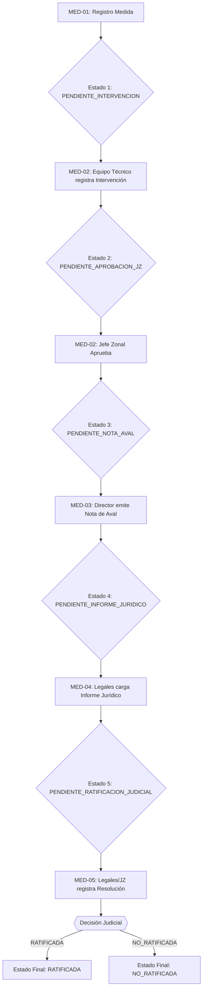
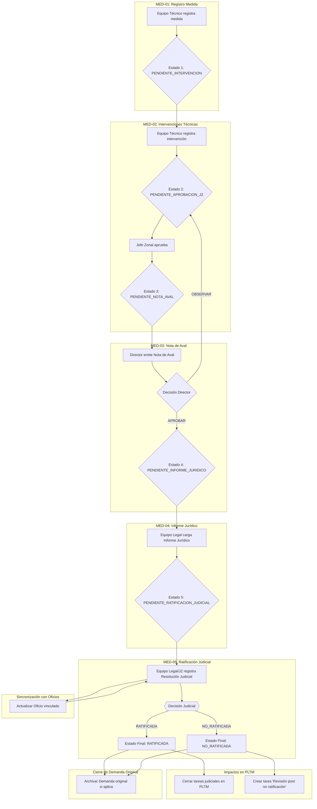

# MED-05: Ratificación Judicial y Cierre del Ciclo de Medida

## 📋 CONTEXTO TÉCNICO

### Estado de Implementación Previo
- ✅ **MED-01**: Registro Medida (TMedida, TEtapaMedida, TJuzgado) - 19/19 tests
- ✅ **MED-02**: Registro Intervenciones (TIntervencionMedida + adjuntos) - 26/26 tests
- ✅ **MED-03**: Nota de Aval Director (TNotaAval con dual decisión) - 24/24 tests
- ✅ **MED-04**: Informe Jurídico Equipo Legal (TInformeJuridico + dual adjuntos) - 15/15 tests

### Workflow Completo MED-01 → MED-05



## 🎯 DESCRIPCIÓN

**MED-05: Ratificación Judicial de la Medida** es el último paso en el "andarivel" procesal de una medida de protección (Apertura, Innovación o Prórroga). Su objetivo es **registrar la decisión final del Poder Judicial** sobre la medida solicitada, cerrando así el ciclo jurídico iniciado en MED-01.

Esta etapa formaliza si la medida es **Ratificada** o **No Ratificada** por un juez, y documenta la resolución judicial correspondiente con sus adjuntos oficiales.

### Objetivo Principal
Cerrar el ciclo completo de la medida de protección con el resultado judicial definitivo, manteniendo trazabilidad completa desde MED-01 hasta el cierre.

## 👥 ROLES Y PERMISOS

### Roles Autorizados
- **Equipo Legal** (`legal=True`): Registro y modificación de ratificación
- **Jefe Zonal (JZ)** (Nivel 3+): Registro y modificación de ratificación
- **Director**: Solo lectura
- **Equipo Técnico**: Solo lectura
- **Administrador**: Lectura completa

### Restricciones por Zona
- Usuario de Equipo Legal debe pertenecer a la zona del legajo
- JZ puede actuar en su zona asignada
- Validación vía `TCustomUserZona`

## 📊 ESTADO INICIAL Y TRANSICIONES

### Estado Inicial
- **Estado 5**: `PENDIENTE_RATIFICACION_JUDICIAL`
- Requisito: MED-04 (Informe Jurídico) debe estar completado

### Estados Finales (Cierre del Ciclo)
| Decisión | Estado Final | Descripción |
|----------|--------------|-------------|
| `RATIFICADA` | `RATIFICADA` | La medida fue aprobada por el juez |
| `NO_RATIFICADA` | `NO_RATIFICADA` | La medida fue rechazada por el juez |
| `PENDIENTE` | `PENDIENTE_RATIFICACION_JUDICIAL` | Caso edge: registrado pero sin resolución |

## 🏗️ ESTRUCTURA DE MODELOS

### Modelo Principal: `TRatificacionJudicial`

```python
# infrastructure/models/medida/TRatificacionJudicial.py

class TRatificacionJudicial(models.Model):
    """
    MED-05: Registro de la decisión judicial final sobre una medida de protección.
    Cierra el ciclo completo MED-01 → MED-05.
    """

    # RELACIÓN CON MEDIDA (ForeignKey para permitir historial)
    medida = models.ForeignKey(
        TMedida,
        on_delete=models.CASCADE,
        related_name='ratificaciones_judiciales',
        help_text="Medida que se está ratificando judicialmente"
    )

    # SOFT DELETE: Permite historial de correcciones administrativas
    activo = models.BooleanField(
        default=True,
        help_text="Indica si esta es la ratificación activa (solo una puede estar activa)"
    )

    # DECISIÓN JUDICIAL
    DECISION_CHOICES = [
        ('RATIFICADA', 'Ratificada'),
        ('NO_RATIFICADA', 'No Ratificada'),
        ('PENDIENTE', 'Pendiente')
    ]

    decision = models.CharField(
        max_length=20,
        choices=DECISION_CHOICES,
        help_text="Resultado de la resolución judicial"
    )

    # DATOS TEMPORALES
    fecha_resolucion = models.DateField(
        help_text="Fecha de la resolución judicial oficial"
    )

    fecha_notificacion = models.DateField(
        null=True,
        blank=True,
        help_text="Fecha de notificación a las partes"
    )

    # OBSERVACIONES
    observaciones = models.TextField(
        blank=True,
        null=True,
        help_text="Comentarios adicionales sobre la resolución"
    )

    # AUDITORÍA
    usuario_registro = models.ForeignKey(
        User,
        on_delete=models.PROTECT,
        related_name='ratificaciones_registradas',
        help_text="Usuario de Legales/JZ que registra la ratificación"
    )

    fecha_registro = models.DateTimeField(
        auto_now_add=True,
        help_text="Timestamp de registro en el sistema"
    )

    fecha_modificacion = models.DateTimeField(
        auto_now=True,
        help_text="Última modificación del registro"
    )

    class Meta:
        db_table = 'ratificacion_judicial'
        verbose_name = 'Ratificación Judicial'
        verbose_name_plural = 'Ratificaciones Judiciales'
        ordering = ['-fecha_registro']
        indexes = [
            models.Index(fields=['medida', 'activo'], name='idx_ratif_medida_activo'),
        ]
        constraints = [
            models.UniqueConstraint(
                fields=['medida'],
                condition=models.Q(activo=True),
                name='unique_ratificacion_activa_por_medida'
            )
        ]

    def __str__(self):
        return f"Ratificación {self.decision} - Medida {self.medida.numero_medida}"

    def clean(self):
        """
        Validaciones de negocio antes de guardar.
        """
        from django.core.exceptions import ValidationError
        from django.utils import timezone

        # Validar que la medida esté en estado correcto
        if self.medida.etapa_actual.estado != 'PENDIENTE_RATIFICACION_JUDICIAL':
            raise ValidationError(
                "La etapa de medida debe estar en estado PENDIENTE_RATIFICACION_JUDICIAL"
            )

        # Validar que no exista otra ratificación ACTIVA para esta medida
        if self.activo:
            existing_active = TRatificacionJudicial.objects.filter(
                medida=self.medida,
                activo=True
            ).exclude(pk=self.pk)

            if existing_active.exists():
                raise ValidationError(
                    "Ya existe una ratificación activa para esta medida. "
                    "Desactive la anterior antes de crear una nueva."
                )

        # Validar fecha_resolucion no futura
        if self.fecha_resolucion and self.fecha_resolucion > timezone.now().date():
            raise ValidationError({
                'fecha_resolucion': 'La fecha de resolución no puede ser futura.'
            })

        # Validar fecha_notificacion no futura
        if self.fecha_notificacion and self.fecha_notificacion > timezone.now().date():
            raise ValidationError({
                'fecha_notificacion': 'La fecha de notificación no puede ser futura.'
            })

        # Validar que fecha_notificacion >= fecha_resolucion
        if self.fecha_notificacion and self.fecha_resolucion:
            if self.fecha_notificacion < self.fecha_resolucion:
                raise ValidationError({
                    'fecha_notificacion': 'La fecha de notificación no puede ser anterior a la fecha de resolución.'
                })

    def save(self, *args, **kwargs):
        """
        Override save para ejecutar transición de estado automática y soft delete.
        """
        self.full_clean()

        # Si es una nueva ratificación activa, desactivar las anteriores
        if self.activo and not self.pk:
            TRatificacionJudicial.objects.filter(
                medida=self.medida,
                activo=True
            ).update(activo=False)

        # Guardar primero
        super().save(*args, **kwargs)

        # Transición de estado manejada en ViewSet (patrón consistente con MED-02, 03, 04)

    def desactivar(self, usuario):
        """
        Método para desactivar esta ratificación (soft delete).
        Útil para correcciones administrativas.
        """
        self.activo = False
        self.save()
        # Log de auditoría (podría registrarse en un modelo de auditoría)

    @classmethod
    def get_activa_por_medida(cls, medida):
        """
        Obtener la ratificación activa para una medida.
        """
        try:
            return cls.objects.get(medida=medida, activo=True)
        except cls.DoesNotExist:
            return None

    @classmethod
    def get_historial_por_medida(cls, medida):
        """
        Obtener todas las ratificaciones (activas e inactivas) de una medida.
        Útil para auditoría y trazabilidad.
        """
        return cls.objects.filter(medida=medida).order_by('-fecha_registro')
```

### Modelo de Adjuntos: `TRatificacionAdjunto`

```python
# infrastructure/models/medida/TRatificacionAdjunto.py

class TRatificacionAdjunto(models.Model):
    """
    MED-05: Archivos adjuntos de la ratificación judicial.
    Tipos críticos: Resolución Judicial y Cédula de Notificación.
    """

    TIPO_ADJUNTO_CHOICES = [
        ('RESOLUCION_JUDICIAL', 'Resolución Judicial'),
        ('CEDULA_NOTIFICACION', 'Cédula de Notificación'),
        ('ACUSE_RECIBO', 'Acuse de Recibo'),
        ('OTRO', 'Otro')
    ]

    ratificacion = models.ForeignKey(
        TRatificacionJudicial,
        on_delete=models.CASCADE,
        related_name='adjuntos'
    )

    tipo_adjunto = models.CharField(
        max_length=30,
        choices=TIPO_ADJUNTO_CHOICES,
        help_text="Tipo de documento adjunto"
    )

    archivo = models.FileField(
        upload_to='adjuntos/ratificaciones/',
        help_text="Archivo PDF de la resolución o cédula"
    )

    descripcion = models.CharField(
        max_length=255,
        blank=True,
        null=True,
        help_text="Descripción adicional del adjunto"
    )

    fecha_carga = models.DateTimeField(
        auto_now_add=True,
        help_text="Timestamp de carga del archivo"
    )

    usuario_carga = models.ForeignKey(
        User,
        on_delete=models.PROTECT,
        help_text="Usuario que subió el archivo"
    )

    class Meta:
        db_table = 'ratificacion_adjunto'
        verbose_name = 'Adjunto de Ratificación'
        verbose_name_plural = 'Adjuntos de Ratificaciones'
        ordering = ['tipo_adjunto', '-fecha_carga']

    def __str__(self):
        return f"{self.tipo_adjunto} - {self.ratificacion.id}"

    def clean(self):
        """
        Validar que archivo sea PDF.
        """
        from django.core.exceptions import ValidationError

        if self.archivo:
            if not self.archivo.name.endswith('.pdf'):
                raise ValidationError({
                    'archivo': 'Solo se permiten archivos PDF.'
                })
```

## 🔧 SERIALIZERS

### Serializer Principal: `TRatificacionJudicialSerializer`

```python
# api/serializers/TRatificacionJudicialSerializer.py

from rest_framework import serializers
from infrastructure.models.medida import TRatificacionJudicial, TRatificacionAdjunto
from api.serializers.TCustomUserSerializer import TCustomUserSerializer
from django.utils import timezone


class TRatificacionAdjuntoSerializer(serializers.ModelSerializer):
    """
    Serializer para adjuntos de ratificación judicial.
    """
    archivo_url = serializers.SerializerMethodField()
    usuario_carga_info = TCustomUserSerializer(source='usuario_carga', read_only=True)

    class Meta:
        model = TRatificacionAdjunto
        fields = [
            'id',
            'tipo_adjunto',
            'archivo',
            'archivo_url',
            'descripcion',
            'fecha_carga',
            'usuario_carga',
            'usuario_carga_info'
        ]
        read_only_fields = ['id', 'fecha_carga', 'usuario_carga']

    def get_archivo_url(self, obj):
        if obj.archivo:
            request = self.context.get('request')
            if request:
                return request.build_absolute_uri(obj.archivo.url)
        return None


class TRatificacionJudicialSerializer(serializers.ModelSerializer):
    """
    Serializer para ratificación judicial (MED-05).
    """
    adjuntos = TRatificacionAdjuntoSerializer(many=True, read_only=True)
    usuario_registro_info = TCustomUserSerializer(source='usuario_registro', read_only=True)

    # Campos para recibir archivos en POST/PATCH
    archivo_resolucion_judicial = serializers.FileField(write_only=True, required=True)
    archivo_cedula_notificacion = serializers.FileField(write_only=True, required=False, allow_null=True)
    archivo_acuse_recibo = serializers.FileField(write_only=True, required=False, allow_null=True)

    class Meta:
        model = TRatificacionJudicial
        fields = [
            'id',
            'medida',
            'activo',
            'decision',
            'fecha_resolucion',
            'fecha_notificacion',
            'observaciones',
            'usuario_registro',
            'usuario_registro_info',
            'fecha_registro',
            'fecha_modificacion',
            'adjuntos',
            # Write-only para archivos
            'archivo_resolucion_judicial',
            'archivo_cedula_notificacion',
            'archivo_acuse_recibo'
        ]
        read_only_fields = [
            'id',
            'activo',
            'usuario_registro',
            'fecha_registro',
            'fecha_modificacion',
            'adjuntos'
        ]

    def validate_medida(self, value):
        """
        Validar que la medida esté en estado correcto.
        """
        if value.etapa_actual.estado != 'PENDIENTE_RATIFICACION_JUDICIAL':
            raise serializers.ValidationError(
                "La medida debe estar en estado PENDIENTE_RATIFICACION_JUDICIAL."
            )

        # Validar que no exista ya una ratificación ACTIVA
        existing_active = TRatificacionJudicial.objects.filter(
            medida=value,
            activo=True
        )

        if existing_active.exists():
            raise serializers.ValidationError(
                "Ya existe una ratificación activa para esta medida. "
                "Debe desactivar la anterior antes de crear una nueva."
            )

        return value

    def validate_fecha_resolucion(self, value):
        """
        Validar que fecha_resolucion no sea futura.
        """
        if value > timezone.now().date():
            raise serializers.ValidationError(
                "La fecha de resolución no puede ser futura."
            )
        return value

    def validate_fecha_notificacion(self, value):
        """
        Validar que fecha_notificacion no sea futura.
        """
        if value and value > timezone.now().date():
            raise serializers.ValidationError(
                "La fecha de notificación no puede ser futura."
            )
        return value

    def validate(self, attrs):
        """
        Validaciones cruzadas.
        """
        fecha_resolucion = attrs.get('fecha_resolucion')
        fecha_notificacion = attrs.get('fecha_notificacion')

        if fecha_notificacion and fecha_resolucion:
            if fecha_notificacion < fecha_resolucion:
                raise serializers.ValidationError({
                    'fecha_notificacion': 'La fecha de notificación no puede ser anterior a la fecha de resolución.'
                })

        # Validar archivo_resolucion_judicial obligatorio
        if 'archivo_resolucion_judicial' not in attrs:
            raise serializers.ValidationError({
                'archivo_resolucion_judicial': 'El archivo de resolución judicial es obligatorio.'
            })

        return attrs

    def create(self, validated_data):
        """
        Crear ratificación + adjuntos.
        """
        # Extraer archivos
        archivo_resolucion = validated_data.pop('archivo_resolucion_judicial')
        archivo_cedula = validated_data.pop('archivo_cedula_notificacion', None)
        archivo_acuse = validated_data.pop('archivo_acuse_recibo', None)

        # Obtener usuario del request
        request = self.context.get('request')
        usuario_registro = request.user if request else None

        # Crear ratificación
        ratificacion = TRatificacionJudicial.objects.create(
            usuario_registro=usuario_registro,
            **validated_data
        )

        # Crear adjunto obligatorio: RESOLUCION_JUDICIAL
        TRatificacionAdjunto.objects.create(
            ratificacion=ratificacion,
            tipo_adjunto='RESOLUCION_JUDICIAL',
            archivo=archivo_resolucion,
            usuario_carga=usuario_registro
        )

        # Crear adjunto opcional: CEDULA_NOTIFICACION
        if archivo_cedula:
            TRatificacionAdjunto.objects.create(
                ratificacion=ratificacion,
                tipo_adjunto='CEDULA_NOTIFICACION',
                archivo=archivo_cedula,
                usuario_carga=usuario_registro
            )

        # Crear adjunto opcional: ACUSE_RECIBO
        if archivo_acuse:
            TRatificacionAdjunto.objects.create(
                ratificacion=ratificacion,
                tipo_adjunto='ACUSE_RECIBO',
                archivo=archivo_acuse,
                usuario_carga=usuario_registro
            )

        return ratificacion
```

## 🌐 ENDPOINTS

### `POST /api/medidas/<int:medida_id>/ratificacion/`
**Descripción**: Registrar ratificación judicial para una medida.

**Permisos**: Equipo Legal (`legal=True`) o JZ (Nivel 3+)

**Request Body**:
```json
{
  "decision": "RATIFICADA",
  "fecha_resolucion": "2025-11-20",
  "fecha_notificacion": "2025-11-21",
  "observaciones": "La medida ha sido ratificada por el Juzgado de Familia N°5.",
  "archivo_resolucion_judicial": "<binary file>",
  "archivo_cedula_notificacion": "<binary file>",
  "archivo_acuse_recibo": "<binary file>"
}
```

**Response Success (201)**:
```json
{
  "id": 1,
  "medida": 123,
  "activo": true,
  "decision": "RATIFICADA",
  "fecha_resolucion": "2025-11-20",
  "fecha_notificacion": "2025-11-21",
  "observaciones": "La medida ha sido ratificada por el Juzgado de Familia N°5.",
  "usuario_registro": 10,
  "usuario_registro_info": {
    "id": 10,
    "username": "legal_user",
    "full_name": "Juan Pérez"
  },
  "fecha_registro": "2025-11-21T10:00:00Z",
  "fecha_modificacion": "2025-11-21T10:00:00Z",
  "adjuntos": [
    {
      "id": 1,
      "tipo_adjunto": "RESOLUCION_JUDICIAL",
      "archivo_url": "http://localhost:8000/media/adjuntos/ratificaciones/resolucion_exp123.pdf",
      "descripcion": null,
      "fecha_carga": "2025-11-21T10:00:00Z",
      "usuario_carga": 10,
      "usuario_carga_info": {
        "id": 10,
        "username": "legal_user",
        "full_name": "Juan Pérez"
      }
    },
    {
      "id": 2,
      "tipo_adjunto": "CEDULA_NOTIFICACION",
      "archivo_url": "http://localhost:8000/media/adjuntos/ratificaciones/cedula_exp123.pdf",
      "descripcion": null,
      "fecha_carga": "2025-11-21T10:00:00Z",
      "usuario_carga": 10,
      "usuario_carga_info": {
        "id": 10,
        "username": "legal_user",
        "full_name": "Juan Pérez"
      }
    }
  ]
}
```

**Response Error (400)**:
```json
{
  "medida": ["La medida debe estar en estado PENDIENTE_RATIFICACION_JUDICIAL."],
  "fecha_resolucion": ["La fecha de resolución no puede ser futura."],
  "archivo_resolucion_judicial": ["El archivo de resolución judicial es obligatorio."]
}
```

**Response Error (403)**:
```json
{
  "detail": "No tiene permisos para registrar ratificaciones. Debe ser Equipo Legal o Jefe Zonal."
}
```

### `GET /api/medidas/<int:medida_id>/ratificacion/`
**Descripción**: Obtener ratificación judicial de una etapa.

**Permisos**: Equipo Legal, JZ, Director, Equipo Técnico (lectura)

**Response Success (200)**:
```json
{
  "id": 1,
  "etapa_medida": 123,
  "activo": true,
  "decision": "RATIFICADA",
  "fecha_resolucion": "2025-11-20",
  "fecha_notificacion": "2025-11-21",
  "observaciones": "La medida ha sido ratificada por el Juzgado de Familia N°5.",
  "usuario_registro": 10,
  "usuario_registro_info": {
    "id": 10,
    "username": "legal_user",
    "full_name": "Juan Pérez"
  },
  "fecha_registro": "2025-11-21T10:00:00Z",
  "fecha_modificacion": "2025-11-21T10:00:00Z",
  "adjuntos": [...]
}
```

**Response Error (404)**:
```json
{
  "detail": "No se encontró ratificación para esta etapa de medida."
}
```

### `PATCH /api/etapas-medida/<int:etapa_id>/ratificacion/`
**Descripción**: Modificar ratificación (solo si está en estado PENDIENTE).

**Permisos**: Equipo Legal (`legal=True`) o JZ (Nivel 3+)

**Request Body** (campos opcionales):
```json
{
  "decision": "NO_RATIFICADA",
  "observaciones": "Actualización de observaciones"
}
```

**Response Success (200)**: Mismo formato que GET

**Response Error (400)**:
```json
{
  "detail": "No se puede modificar una ratificación con decisión final (RATIFICADA/NO_RATIFICADA)."
}
```

### `GET /api/medidas/<int:medida_id>/ratificacion/historial/`
**Descripción**: Obtener historial completo de ratificaciones (activas + inactivas) de una etapa.

**Permisos**: Equipo Legal, JZ, Director, Administrador (lectura)

**Response Success (200)**:
```json
{
  "count": 3,
  "activa": {
    "id": 3,
    "etapa_medida": 123,
    "activo": true,
    "decision": "RATIFICADA",
    "fecha_resolucion": "2025-11-22",
    "observaciones": "Ratificación corregida - datos actualizados",
    "usuario_registro": 10,
    "fecha_registro": "2025-11-22T14:00:00Z"
  },
  "historial": [
    {
      "id": 3,
      "etapa_medida": 123,
      "activo": true,
      "decision": "RATIFICADA",
      "fecha_resolucion": "2025-11-22",
      "observaciones": "Ratificación corregida - datos actualizados",
      "usuario_registro": 10,
      "fecha_registro": "2025-11-22T14:00:00Z"
    },
    {
      "id": 2,
      "etapa_medida": 123,
      "activo": false,
      "decision": "NO_RATIFICADA",
      "fecha_resolucion": "2025-11-21",
      "observaciones": "Error en decisión - desactivada",
      "usuario_registro": 10,
      "fecha_registro": "2025-11-21T12:00:00Z"
    },
    {
      "id": 1,
      "etapa_medida": 123,
      "activo": false,
      "decision": "RATIFICADA",
      "fecha_resolucion": "2025-11-20",
      "observaciones": "Primera ratificación - error en fecha",
      "usuario_registro": 10,
      "fecha_registro": "2025-11-20T10:00:00Z"
    }
  ]
}
```

**Response Error (404)**:
```json
{
  "detail": "No se encontraron ratificaciones para esta etapa de medida."
}
```

## ✅ CRITERIOS DE ACEPTACIÓN

### CA-01: Precondición de Informe Jurídico
- [ ] No se puede crear ratificación si etapa no está en estado `PENDIENTE_RATIFICACION_JUDICIAL`
- [ ] Validar que MED-04 (Informe Jurídico) esté completado
- [ ] Error 400 con mensaje claro si precondición falla

### CA-02: Datos Mínimos Obligatorios
- [ ] `decision`: Requerido (RATIFICADA / NO_RATIFICADA / PENDIENTE)
- [ ] `fecha_resolucion`: Requerido, no puede ser futura
- [ ] `archivo_resolucion_judicial`: Requerido (PDF)
- [ ] `usuario_registro`: Auto-asignado desde request.user
- [ ] Error 400 si falta algún campo obligatorio

### CA-03: Adjuntos Duales Críticos
- [ ] RESOLUCION_JUDICIAL: Obligatorio (archivo PDF)
- [ ] CEDULA_NOTIFICACION: Opcional pero recomendado
- [ ] ACUSE_RECIBO: Opcional
- [ ] Validar formato PDF para todos los adjuntos
- [ ] Error 400 si archivo no es PDF

### CA-04: Transiciones de Estado Automáticas
- [ ] `RATIFICADA`: Transiciona etapa a estado `RATIFICADA` (final)
- [ ] `NO_RATIFICADA`: Transiciona etapa a estado `NO_RATIFICADA` (final)
- [ ] `PENDIENTE`: No transiciona (caso edge)
- [ ] Transición ejecutada en `save()` del modelo
- [ ] Usar método `_transicionar_estado()` de TEtapaMedida

### CA-05: Permisos por Rol y Zona
- [ ] Solo Equipo Legal (`legal=True`) puede crear/modificar
- [ ] Solo JZ (Nivel 3+) puede crear/modificar
- [ ] Validar zona del usuario con `TCustomUserZona`
- [ ] Director y Equipo Técnico: solo lectura
- [ ] Error 403 si usuario no autorizado

### CA-06: Validaciones Temporales
- [ ] `fecha_resolucion`: No puede ser futura
- [ ] `fecha_notificacion`: No puede ser futura (si se provee)
- [ ] `fecha_notificacion >= fecha_resolucion` (si ambas existen)
- [ ] Error 400 con mensaje específico por campo

### CA-07: Sincronización con Oficios
- [ ] Si ratificación se carga vía Oficio: actualizar MED-05 automáticamente
- [ ] Si MED-05 se actualiza manualmente: actualizar Oficio vinculado
- [ ] Mantener consistencia bidireccional
- [ ] Registrar auditoría de sincronización

### CA-08: Puente con Demanda Original
- [ ] Si proceso originó por Demanda "Carga de Oficios": archivar Demanda al finalizar MED-05
- [ ] Mantener trazabilidad Demanda → Legajo → Medida → Ratificación
- [ ] Actualizar estado Demanda a `Archivada`
- [ ] Registrar cierre en auditoría

### CA-09: Impacto Operativo en PLTM
- [ ] Si `RATIFICADA`: cerrar tareas judiciales en Plan de Trabajo (PLTM)
- [ ] Si `NO_RATIFICADA`: crear actividad "Revisión post no ratificación" asignada a JZ/Dirección
- [ ] Actualizar estado de actividades relacionadas
- [ ] Notificar cambios a usuarios asignados

### CA-10: Notificaciones Automáticas
- [ ] Notificar a Equipo Técnico al cambiar estado de MED-05
- [ ] Notificar a JZ/Dirección al cambiar estado de MED-05
- [ ] Notificar a Legales al cambiar estado de MED-05
- [ ] Incluir resultado de ratificación en notificación
- [ ] Registrar envío de notificaciones

### CA-11: Auditoría Completa
- [ ] Registrar `usuario_registro` en creación
- [ ] Registrar `fecha_registro` automáticamente
- [ ] Registrar `fecha_modificacion` en cada actualización
- [ ] Mantener historial de cambios (si aplica)
- [ ] Trazabilidad completa MED-01 → MED-05

### CA-12: Response Structure Completa
- [ ] Incluir datos de ratificación completos
- [ ] Incluir adjuntos con URLs completas
- [ ] Incluir información de usuario (nested serializer)
- [ ] Incluir timestamps de auditoría
- [ ] Formato JSON consistente con MED-01 a MED-04

### CA-13: Casos Edge y Soft Delete
- [ ] Impedir ratificación sin archivo de resolución
- [ ] Impedir modificación de ratificación final (RATIFICADA/NO_RATIFICADA)
- [ ] Impedir acceso si usuario no pertenece a zona del legajo
- [ ] Impedir duplicación de ratificación ACTIVA (solo una activa por etapa)
- [ ] Error 400 si ya existe ratificación activa para la etapa
- [ ] Permitir múltiples ratificaciones inactivas (historial de correcciones)
- [ ] Soft delete: desactivar ratificación anterior al crear nueva
- [ ] Mantener historial completo para auditoría y trazabilidad

### CA-14: Integración con Workflow Completo
- [ ] Cierra ciclo MED-01 → MED-05 correctamente
- [ ] Sincroniza con módulo Oficios
- [ ] Sincroniza con módulo Demandas
- [ ] Dispara acciones en PLTM según resultado
- [ ] Mantiene consistencia de estados en todo el sistema

### CA-15: Testing Completo
- [ ] Mínimo 18 tests unitarios cubriendo:
  - [ ] Creación exitosa con decisión RATIFICADA
  - [ ] Creación exitosa con decisión NO_RATIFICADA
  - [ ] Validación de precondición (estado correcto)
  - [ ] Validación de fechas (no futuras)
  - [ ] Validación de adjunto obligatorio
  - [ ] Validación de permisos (Legal/JZ)
  - [ ] Transiciones de estado automáticas
  - [ ] Casos edge (duplicación activa, modificación final)
  - [ ] **Soft delete: puede crear múltiples ratificaciones inactivas**
  - [ ] **Soft delete: solo una ratificación activa a la vez**
  - [ ] **Soft delete: desactivar anterior al crear nueva**
  - [ ] **Historial: obtener ratificación activa por etapa**
  - [ ] **Historial: obtener todas las ratificaciones (activas + inactivas)**
  - [ ] Sincronización con Oficios
  - [ ] Impacto en PLTM
- [ ] Coverage >90% del código relacionado

## 🧪 CASOS DE USO DETALLADOS

### Caso de Uso 1: Ratificación Exitosa (RATIFICADA)
**Precondiciones**:
- Etapa de medida en estado `PENDIENTE_RATIFICACION_JUDICIAL`
- Usuario es Equipo Legal de la zona del legajo
- MED-04 completado

**Flujo**:
1. Usuario de Legales recibe oficio judicial con ratificación
2. Ingresa a la medida en el sistema
3. Navega a la pestaña "Ratificación Judicial"
4. Selecciona decisión "RATIFICADA"
5. Ingresa fecha de resolución: 2025-11-20
6. Ingresa fecha de notificación: 2025-11-21 (opcional)
7. Adjunta archivo PDF de resolución judicial (obligatorio)
8. Adjunta cédula de notificación (opcional)
9. Escribe observaciones: "Ratificada por Juzgado de Familia N°5"
10. Guarda el formulario

**Resultado**:
- Sistema cambia estado de etapa a `RATIFICADA`
- Sistema cierra tareas judiciales en PLTM
- Sistema notifica a Equipo Técnico, JZ, Director
- Sistema registra auditoría completa
- Usuario ve confirmación: "Ratificación registrada exitosamente"

### Caso de Uso 2: No Ratificación (NO_RATIFICADA)
**Precondiciones**:
- Etapa de medida en estado `PENDIENTE_RATIFICACION_JUDICIAL`
- Usuario es JZ de la zona del legajo
- MED-04 completado

**Flujo**:
1. JZ recibe oficio judicial con rechazo de medida
2. Ingresa a la medida en el sistema
3. Navega a la pestaña "Ratificación Judicial"
4. Selecciona decisión "NO_RATIFICADA"
5. Ingresa fecha de resolución: 2025-11-15
6. Adjunta archivo PDF de resolución judicial
7. Escribe observaciones: "No ratificada. Revisar argumentos jurídicos"
8. Guarda el formulario

**Resultado**:
- Sistema cambia estado de etapa a `NO_RATIFICADA`
- Sistema crea actividad "Revisión post no ratificación" en PLTM asignada a Director
- Sistema notifica a Equipo Técnico, Director, Legales
- Sistema registra auditoría completa
- Usuario ve confirmación: "No ratificación registrada. Se ha creado tarea de revisión"

### Caso de Uso 3: Intento de Ratificación sin Informe Jurídico
**Precondiciones**:
- Etapa de medida en estado `PENDIENTE_NOTA_AVAL` (Estado 3)
- Usuario es Equipo Legal

**Flujo**:
1. Usuario intenta acceder a "Ratificación Judicial"
2. Sistema valida estado de etapa

**Resultado**:
- Sistema muestra error 400: "La etapa de medida debe estar en estado PENDIENTE_RATIFICACION_JUDICIAL"
- Usuario no puede proceder
- Sistema registra intento fallido en logs

### Caso de Uso 4: Intento de Ratificación sin Archivo
**Precondiciones**:
- Etapa de medida en estado `PENDIENTE_RATIFICACION_JUDICIAL`
- Usuario es Equipo Legal

**Flujo**:
1. Usuario completa formulario de ratificación
2. Usuario no adjunta archivo de resolución judicial
3. Usuario intenta guardar

**Resultado**:
- Sistema valida presencia de archivo obligatorio
- Sistema muestra error 400: "El archivo de resolución judicial es obligatorio"
- Usuario debe adjuntar archivo antes de proceder

### Caso de Uso 5: Consulta de Ratificación por Equipo Técnico
**Precondiciones**:
- Ratificación ya registrada
- Usuario es Equipo Técnico del legajo

**Flujo**:
1. Usuario accede a la medida en el sistema
2. Navega a la pestaña "Ratificación Judicial"
3. Sistema muestra datos de ratificación (solo lectura)

**Resultado**:
- Usuario ve decisión judicial
- Usuario ve fechas de resolución y notificación
- Usuario puede descargar adjuntos (resolución, cédula)
- Usuario NO puede modificar datos
- Sistema registra acceso en auditoría

### Caso de Uso 6: Corrección Administrativa de Ratificación (Soft Delete)
**Precondiciones**:
- Ratificación activa registrada con error
- Usuario es Equipo Legal o JZ
- Se detecta error en decisión o datos

**Flujo**:
1. Usuario de Legales detecta error en ratificación existente
2. Crea nueva ratificación con datos corregidos
3. Sistema detecta que ya existe una ratificación activa
4. Sistema desactiva automáticamente la ratificación anterior (soft delete)
5. Sistema guarda la nueva ratificación como activa
6. Sistema transiciona estado de etapa según nueva decisión

**Resultado**:
- Ratificación anterior queda inactiva (activo=False)
- Nueva ratificación queda activa (activo=True)
- Historial completo mantenido para auditoría
- Sistema registra ambos registros en auditoría
- Usuario ve confirmación: "Ratificación corregida exitosamente. La anterior se ha desactivado."
- Transición de estado ejecutada según nueva decisión

### Caso de Uso 7: Consulta de Historial de Ratificaciones
**Precondiciones**:
- Múltiples ratificaciones (activas e inactivas) para una etapa
- Usuario es Equipo Legal, JZ o Administrador

**Flujo**:
1. Usuario accede a la medida en el sistema
2. Navega a la pestaña "Ratificación Judicial"
3. Selecciona opción "Ver Historial"
4. Sistema muestra todas las ratificaciones (activas + inactivas) ordenadas por fecha

**Resultado**:
- Usuario ve ratificación activa marcada claramente
- Usuario ve todas las ratificaciones inactivas con timestamps
- Usuario ve quién registró cada ratificación
- Usuario ve motivo de desactivación (si aplica)
- Sistema registra consulta de historial en auditoría

## 📐 DIAGRAMA DE CIERRE COMPLETO

### Flujo Completo MED-01 → MED-05 con Actores



## 📝 NOTAS DE IMPLEMENTACIÓN

### Orden de Implementación
1. **Modelos**: `TRatificacionJudicial` + `TRatificacionAdjunto`
2. **Serializers**: `TRatificacionJudicialSerializer` + `TRatificacionAdjuntoSerializer`
3. **ViewSet**: `TRatificacionJudicialViewSet` con permisos custom
4. **URLs**: Registrar endpoints en `api/urls.py`
5. **Tests**: Mínimo 15 tests cubriendo todos los CA
6. **Fixtures**: Datos de ejemplo para testing
7. **Migraciones**: Aplicar y validar en DB

### Validaciones Críticas
- **ForeignKey con soft delete**: Impedir duplicación de ratificación ACTIVA (solo una activa por etapa)
- **Constraint UniqueConstraint**: Garantizar una sola ratificación activa por etapa a nivel DB
- **Index compuesto**: Optimizar queries por etapa + activo
- Estado correcto: Solo `PENDIENTE_RATIFICACION_JUDICIAL` puede ser ratificada
- Archivo obligatorio: `archivo_resolucion_judicial` debe estar presente
- Fechas no futuras: Validar `fecha_resolucion` y `fecha_notificacion`
- Permisos zona: Usuario debe pertenecer a zona del legajo vía `TCustomUserZona`
- **Soft delete automático**: Desactivar ratificación anterior al crear nueva

### Integración con MED-01 a MED-04
- Reutilizar método `_transicionar_estado()` de `TEtapaMedida`
- Mantener consistencia de permisos con MED-02, MED-03, MED-04
- Reutilizar patrones de adjuntos de MED-04 (dual adjuntos)
- Reutilizar validaciones temporales de MED-02, MED-03, MED-04

### Checklist Post-Implementación
- [ ] Modelos exportados en `infrastructure/models/__init__.py`
- [ ] Serializers exportados en `api/serializers/__init__.py`
- [ ] ViewSets exportados en `api/views/__init__.py`
- [ ] URLs registradas en `api/urls.py`
- [ ] Tests implementados en `tests/test_ratificacion_judicial_med05.py`
- [ ] Migraciones creadas: `makemigrations`
- [ ] Migraciones aplicadas: `migrate`
- [ ] Fixtures creados para testing (si aplica)
- [ ] `setup_project.py` actualizado con migraciones MED-05
- [ ] Tests ejecutados y pasando: 18-20 tests (incluyendo soft delete y historial)

## 🎯 OBJETIVOS DE TESTING

### Mínimo 18 Tests
1. `test_crear_ratificacion_ratificada_exitoso`: Creación con RATIFICADA
2. `test_crear_ratificacion_no_ratificada_exitoso`: Creación con NO_RATIFICADA
3. `test_crear_ratificacion_sin_estado_correcto_falla`: Error si estado != 5
4. `test_crear_ratificacion_sin_archivo_falla`: Error si falta archivo obligatorio
5. `test_crear_ratificacion_fecha_futura_falla`: Error si fecha_resolucion futura
6. `test_crear_ratificacion_fecha_notificacion_futura_falla`: Error si fecha_notificacion futura
7. `test_crear_ratificacion_fecha_notificacion_anterior_falla`: Error si fecha_notificacion < fecha_resolucion
8. `test_crear_ratificacion_sin_permisos_falla`: Error 403 si no es Legal/JZ
9. `test_transicion_estado_ratificada`: Validar estado final RATIFICADA
10. `test_transicion_estado_no_ratificada`: Validar estado final NO_RATIFICADA
11. `test_duplicacion_ratificacion_activa_falla`: Error 400 si ya existe ratificación ACTIVA
12. `test_multiples_ratificaciones_inactivas`: Permitir múltiples ratificaciones inactivas
13. `test_soft_delete_desactivar_anterior`: Desactivar anterior al crear nueva
14. `test_solo_una_ratificacion_activa`: Validar constraint de una activa por etapa
15. `test_get_activa_por_etapa`: Obtener ratificación activa correcta
16. `test_get_historial_por_etapa`: Obtener todas las ratificaciones (activas + inactivas)
17. `test_modificar_ratificacion_pendiente`: Permitir modificar solo si está PENDIENTE
18. `test_modificar_ratificacion_final_falla`: Error si decisión ya es RATIFICADA/NO_RATIFICADA
19. `test_adjuntos_multiples`: Validar creación de múltiples adjuntos
20. `test_permisos_zona`: Validar que usuario pertenezca a zona del legajo

## 🔗 DEPENDENCIAS TÉCNICAS

### Modelos Requeridos
- ✅ `TEtapaMedida` (MED-01)
- ✅ `TCustomUserZona` (para validación de permisos)
- ✅ `User` (Django Auth)

### Métodos Requeridos
- ✅ `TEtapaMedida._transicionar_estado()` (MED-01)
- ⚠️ Integración con PLTM (pendiente de implementación PLTM-01 a PLTM-04)
- ⚠️ Sincronización con Oficios (pendiente de implementación módulo Oficios)
- ⚠️ Archivo de Demanda (pendiente de implementación lógica de cierre Demanda)

### Fixtures Requeridos
- Usuarios de Equipo Legal con `legal=True`
- Usuarios JZ con Nivel 3+
- Etapas de medida en estado `PENDIENTE_RATIFICACION_JUDICIAL`
- Legajos con medidas en diferentes estados

---

## 📝 NOTAS DE REVISIÓN

### Cambio de OneToOneField a ForeignKey (2025-10-13)

**Motivación del cambio**:
- **Consistencia arquitectónica**: Alineación con MED-02, MED-03, MED-04 que usan ForeignKey
- **Historial de correcciones**: Permite mantener trazabilidad de correcciones administrativas
- **Auditoría completa**: Soft delete mantiene todas las ratificaciones (activas + inactivas)
- **Flexibilidad operativa**: Permite corregir errores sin perder datos históricos

**Cambios implementados**:

| Aspecto | Antes (OneToOneField) | Después (ForeignKey + Soft Delete) |
|---------|----------------------|-----------------------------------|
| **Relación** | `OneToOneField` | `ForeignKey` |
| **related_name** | `ratificacion_judicial` (singular) | `ratificaciones_judiciales` (plural) |
| **Campo activo** | ❌ No existe | ✅ `activo = BooleanField(default=True)` |
| **Constraint** | OneToOne implícito | `UniqueConstraint(etapa_medida, condition=activo=True)` |
| **Index** | Solo FK | `Index(etapa_medida, activo)` |
| **Múltiples registros** | ❌ Solo uno | ✅ Múltiples (solo uno activo) |
| **Historial** | ❌ No disponible | ✅ Completo con `get_historial_por_etapa()` |
| **Correcciones** | ❌ Requiere borrar anterior | ✅ Soft delete automático |
| **Validación** | `hasattr(value, 'ratificacion_judicial')` | `filter(etapa_medida=value, activo=True).exists()` |
| **Tests** | 15 tests | 18-20 tests |

**Métodos nuevos**:
1. `desactivar(usuario)`: Soft delete manual
2. `get_activa_por_etapa(etapa_medida)`: Obtener ratificación activa
3. `get_historial_por_etapa(etapa_medida)`: Obtener historial completo

**Beneficios**:
- ✅ Trazabilidad completa para auditorías
- ✅ Recuperación de datos en caso de error
- ✅ Consistencia con resto del módulo MED
- ✅ Flexibilidad para correcciones administrativas
- ✅ Mejora en rendimiento de queries (índice compuesto)

**Consistencia con MED-02, MED-03, MED-04**:
```python
# MED-02: TIntervencionMedida → ForeignKey + activo
etapa_medida = models.ForeignKey(TEtapaMedida, related_name='intervenciones')
activo = models.BooleanField(default=True)

# MED-03: TNotaAval → ForeignKey + activo
etapa_medida = models.ForeignKey(TEtapaMedida, related_name='notas_aval')
activo = models.BooleanField(default=True)

# MED-04: TInformeJuridico → ForeignKey + activo
etapa_medida = models.ForeignKey(TEtapaMedida, related_name='informes_juridicos')
activo = models.BooleanField(default=True)

# MED-02, 03, 04: FK a TEtapaMedida (ANTERIOR)
etapa_medida = models.ForeignKey(TEtapaMedida, related_name='...')

# MED-05: FK a TMedida (ACTUALIZADO - Consistencia Arquitectónica)
medida = models.ForeignKey(TMedida, related_name='ratificaciones_judiciales')
activo = models.BooleanField(default=True)
```

**Patrón común**: Todos los modelos MED-02 a MED-05 siguen el patrón de ForeignKey + soft delete, pero MED-02, 03, 04 apuntan a TEtapaMedida mientras que MED-05 apunta directamente a TMedida para mayor consistencia y simplicidad.

---

## 📝 NOTAS DE REVISIÓN ARQUITECTÓNICA

### Cambio: FK de TEtapaMedida → TMedida (2025-10-13)

**Problema Identificado**:
- Versión inicial de la story usaba `FK → TEtapaMedida` similar a MED-02, 03, 04
- Sin embargo, MED-02, 03, 04 **también usan FK a TMedida** (no a TEtapaMedida como se pensaba inicialmente)
- Esto creaba inconsistencia arquitectónica innecesaria

**Corrección Aplicada**:
```python
# ANTES (versión inicial - INCORRECTO):
etapa_medida = models.ForeignKey(TEtapaMedida, ...)

# DESPUÉS (versión corregida - CORRECTO):
medida = models.ForeignKey(TMedida, ...)
```

**Razones del Cambio**:
1. **Consistencia**: MED-02, 03, 04 usan `/medidas/<medida_pk>/...` en sus endpoints
2. **Simplicidad**: Una medida → Una ratificación (concepto más claro que "una etapa")
3. **Queries**: Más eficientes sin join intermedio vía etapa
4. **API Uniforme**: Todos los endpoints siguen el patrón `/medidas/{id}/recurso/`

**Impacto en Implementación**:
- ✅ Modelo: `medida` en lugar de `etapa_medida`
- ✅ Constraint: `fields=['medida']` en lugar de `fields=['etapa_medida']`
- ✅ Serializer: `validate_medida()` verifica `medida.etapa_actual.estado`
- ✅ Endpoints: `/api/medidas/<medida_id>/ratificacion/`
- ✅ ViewSet: `create(medida_pk)` en lugar de `create(etapa_pk)`
- ✅ Tests: Fixtures y aserciones ajustadas a `medida_pk`

**Beneficios**:
- Endpoints consistentes con resto del sistema MED
- Queries simplificadas (un join menos)
- API más intuitiva y predecible
- Mejor alineamiento con el modelo mental del dominio

**Fecha de Revisión**: 2025-10-13
**Revisado por**: Claude Code
**Estado**: ✅ Corrección documentada y lista para implementación

---

**Última actualización**: 2025-10-13
**Story creada por**: Claude Code + Gemini CLI Analysis
**Revisada por**: Claude Code (Corrección FK: TEtapaMedida → TMedida)
**Basado en**: Documentacion RUNNA.md - Sección Medidas de Protección (MED)
**Estado**: ✅ Documentación completa y corregida - Lista para implementación
