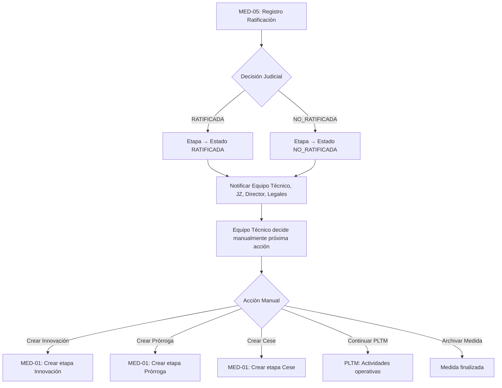

# MED-05 V2: Validación y Corrección de Alineación con MED-01 V2

**Fecha**: 2025-10-26
**Objetivo**: Validar que MED-05 esté correctamente alineado con tipos de medida y estados definidos en MED-01 V2

---

## 📋 ANÁLISIS DE TIPOS DE MEDIDA Y ESTADOS

### Tipos de Medida y Sus Estados (MED-01 V2)

| Tipo Medida | Etapas | Estados | Ratificación Judicial |
|-------------|--------|---------|----------------------|
| **MPE** (Protección Excepcional) | Apertura, Innovación, Prórroga, Cese, Post-cese | **Estados 1-5** | ✅ **SÍ (Estado 5)** |
| **MPI** (Protección Integral) | Apertura, Cese | **Estados 1-2** | ❌ **NO** |
| **MPJ** (Protección Jurídica) | Apertura, Proceso, Cese | **PLTM-driven** | ❌ **NO** |

### Estados MPE (1-5)

```
Estado 1: Pendiente de registro de intervención (MED-02)
Estado 2: Pendiente de aprobación de registro (MED-02)
Estado 3: Pendiente de Nota de Aval (MED-03)
Estado 4: Pendiente de Informe Jurídico (MED-04)
Estado 5: Pendiente de ratificación judicial (MED-05) ← SOLO MPE
```

---

## 🎯 RESPUESTAS A PREGUNTAS CRÍTICAS

### Pregunta 1: ¿MED-05 Solo Aplica a MPE?

**✅ RESPUESTA: SÍ, SOLO MPE**

**Evidencia Documentada**:
- MPE tiene estados 1-5 (incluye ratificación judicial)
- MPI solo tiene estados 1-2 (sin ratificación judicial)
- MPJ es PLTM-driven (sin estados formales 1-5)

**Implicaciones para Implementación**:

1. **Validación de Tipo de Medida (CRÍTICA)**:
   ```python
   # En TRatificacionJudicialSerializer.validate_medida()

   def validate_medida(self, value):
       # Validar TIPO DE MEDIDA
       if value.tipo_medida != 'MPE':
           raise serializers.ValidationError(
               "Solo las Medidas de Protección Excepcional (MPE) requieren "
               "ratificación judicial. Esta medida es de tipo {}.".format(
                   value.get_tipo_medida_display()
               )
           )

       # Validar ETAPA ESPECÍFICA
       etapa_nombre = value.etapa_actual.nombre_etapa
       if etapa_nombre not in ['APERTURA', 'INNOVACION', 'PRORROGA']:
           raise serializers.ValidationError(
               "Solo las etapas de Apertura, Innovación y Prórroga de MPE "
               "requieren ratificación judicial. Etapa actual: {}.".format(
                   etapa_nombre
               )
           )

       # Validar estado correcto
       if value.etapa_actual.estado != 'PENDIENTE_RATIFICACION_JUDICIAL':
           raise serializers.ValidationError(
               "La medida debe estar en estado PENDIENTE_RATIFICACION_JUDICIAL."
           )

       # Validar unicidad ratificación activa
       existing_active = TRatificacionJudicial.objects.filter(
           medida=value,
           activo=True
       )

       if existing_active.exists():
           raise serializers.ValidationError(
               "Ya existe una ratificación activa para esta medida. "
               "Debe desactivar la anterior antes de crear una nueva."
           )

       return value
   ```

2. **Tests Adicionales Requeridos**:
   - `test_crear_ratificacion_mpi_falla`: Error si medida es MPI
   - `test_crear_ratificacion_mpj_falla`: Error si medida es MPJ
   - `test_crear_ratificacion_etapa_cese_falla`: Error si etapa es CESE (no requiere ratificación)
   - `test_crear_ratificacion_etapa_postcese_falla`: Error si etapa es POST-CESE

3. **Documentación a Actualizar**:
   - Agregar sección "Tipos de Medida Aplicables" en story
   - Actualizar criterios de aceptación con validación tipo medida
   - Actualizar diagramas para mostrar exclusividad MPE

---

### Pregunta 2: ¿Qué Hacer Después de Ratificar?

**✅ RESPUESTA: OPCIÓN C - SOLO CIERRA ETAPA ACTUAL (NO CREA NUEVA AUTOMÁTICAMENTE)**

**Evidencia Documentada**:
> "MED-05: Para cerrar el ciclo jurídico de la medida" (se refiere a la ETAPA, no a la medida completa)
>
> "Notificaciones: cambios de estado en MED-05 notifican a Equipo Técnico, JZ/Dirección y Legales."
>
> "**NO menciona** creación automática de etapa posterior"

**Workflow Correcto Post-Ratificación**:



**Comportamiento del Sistema**:

1. **Al Ratificar (RATIFICADA/NO_RATIFICADA)**:
   - ✅ Cambiar estado de etapa actual a `RATIFICADA` o `NO_RATIFICADA`
   - ✅ Registrar ratificación en `TRatificacionJudicial`
   - ✅ Enviar notificaciones a roles involucrados
   - ❌ **NO crear** automáticamente nueva etapa
   - ❌ **NO modificar** PLTM automáticamente
   - ❌ **NO archivar** Demanda automáticamente

2. **Responsabilidad Operativa**:
   - **Equipo Técnico/JZ** decide la próxima acción manualmente:
     - Crear etapa Innovación (si se necesita modificar condiciones)
     - Crear etapa Prórroga (si se necesita extender plazo)
     - Crear etapa Cese (si se finaliza la medida)
     - Continuar con PLTM (actividades operativas)
     - Archivar medida (si finalizó completamente)

3. **Orden de Continuidad**:
   - Existe pero es **NO automático**
   - Secuencia lógica MPE: `Apertura → Innovación/Prórroga → Cese → Post-cese`
   - Cada transición entre etapas requiere **acción manual** del usuario autorizado

---

## 🔧 CAMBIOS REQUERIDOS EN MED-05

### CA-01: Precondición de Informe Jurídico (ACTUALIZAR)

**ANTES**:
```
- [ ] No se puede crear ratificación si etapa no está en estado `PENDIENTE_RATIFICACION_JUDICIAL`
- [ ] Validar que MED-04 (Informe Jurídico) esté completado
- [ ] Error 400 con mensaje claro si precondición falla
```

**DESPUÉS**:
```
- [ ] Validar que medida sea tipo MPE (Protección Excepcional)
- [ ] Validar que etapa sea Apertura, Innovación o Prórroga (no Cese ni Post-cese)
- [ ] No se puede crear ratificación si etapa no está en estado `PENDIENTE_RATIFICACION_JUDICIAL`
- [ ] Validar que MED-04 (Informe Jurídico) esté completado
- [ ] Error 400 con mensaje claro si precondición falla
```

### CA-04: Transiciones de Estado Automáticas (ACTUALIZAR)

**ANTES**:
```
- [ ] `RATIFICADA`: Transiciona etapa a estado `RATIFICADA` (final)
- [ ] `NO_RATIFICADA`: Transiciona etapa a estado `NO_RATIFICADA` (final)
- [ ] `PENDIENTE`: No transiciona (caso edge)
- [ ] Transición ejecutada en `save()` del modelo
- [ ] Usar método `_transicionar_estado()` de TEtapaMedida
```

**DESPUÉS**:
```
- [ ] `RATIFICADA`: Transiciona etapa a estado `RATIFICADA` (final de etapa, NO de medida)
- [ ] `NO_RATIFICADA`: Transiciona etapa a estado `NO_RATIFICADA` (final de etapa, NO de medida)
- [ ] `PENDIENTE`: No transiciona (caso edge)
- [ ] Transición ejecutada en ViewSet (patrón consistente con MED-02, 03, 04)
- [ ] Usar método `_transicionar_estado()` de TEtapaMedida
- [ ] NO crear etapa posterior automáticamente (responsabilidad manual del equipo técnico)
```

### NUEVO CA-12: Validación de Tipo de Medida

```
### CA-12: Validación de Tipo de Medida MPE
- [ ] Solo permitir ratificación para medidas tipo MPE
- [ ] Rechazar con error 400 si medida es MPI
- [ ] Rechazar con error 400 si medida es MPJ
- [ ] Mensaje de error claro indicando que solo MPE requiere ratificación judicial
- [ ] Validar etapa específica: solo Apertura, Innovación, Prórroga (no Cese ni Post-cese)
- [ ] Error específico si etapa es Cese: "La etapa de Cese no requiere ratificación judicial"
```

### Tests Adicionales Requeridos

```python
# Nuevos tests para validación tipo medida
def test_crear_ratificacion_mpi_falla(self):
    """No se puede crear ratificación para MPI (solo estados 1-2)"""

def test_crear_ratificacion_mpj_falla(self):
    """No se puede crear ratificación para MPJ (PLTM-driven)"""

def test_crear_ratificacion_etapa_cese_mpe_falla(self):
    """No se puede crear ratificación para etapa Cese de MPE"""

def test_crear_ratificacion_etapa_postcese_mpe_falla(self):
    """No se puede crear ratificación para etapa Post-cese de MPE"""

def test_crear_ratificacion_solo_apertura_innovacion_prorroga_mpe_exitoso(self):
    """Solo se puede crear ratificación para Apertura, Innovación, Prórroga de MPE"""

# Test de no creación automática de etapa
def test_ratificacion_no_crea_etapa_automaticamente(self):
    """Ratificar NO crea automáticamente nueva etapa (responsabilidad manual)"""
```

---

## 📊 RESUMEN DE CORRECCIONES

### Validaciones Críticas a Agregar

| Validación | Ubicación | Prioridad |
|------------|-----------|-----------|
| `tipo_medida == 'MPE'` | `TRatificacionJudicialSerializer.validate_medida()` | 🔴 CRÍTICA |
| `etapa IN ['APERTURA', 'INNOVACION', 'PRORROGA']` | `TRatificacionJudicialSerializer.validate_medida()` | 🔴 CRÍTICA |
| No crear etapa automáticamente post-ratificación | `TRatificacionJudicialViewSet.create()` | 🟡 ALTA |

### Documentación a Actualizar

- [ ] Story MED-05: Agregar sección "Tipos de Medida Aplicables"
- [ ] Story MED-05: Actualizar CA-01 con validación tipo medida
- [ ] Story MED-05: Actualizar CA-04 para clarificar NO creación automática
- [ ] Story MED-05: Agregar CA-12 nuevo sobre validación MPE
- [ ] Story MED-05: Actualizar diagrama Mermaid con flujo correcto post-ratificación
- [ ] Story MED-05: Actualizar casos de uso con responsabilidad manual
- [ ] Story MED-05: Agregar 5+ tests adicionales para validación tipo medida

### Tests Adicionales Requeridos

- [ ] `test_crear_ratificacion_mpi_falla`: MPI no requiere ratificación
- [ ] `test_crear_ratificacion_mpj_falla`: MPJ no requiere ratificación
- [ ] `test_crear_ratificacion_etapa_cese_falla`: Cese no requiere ratificación
- [ ] `test_crear_ratificacion_etapa_postcese_falla`: Post-cese no requiere ratificación
- [ ] `test_crear_ratificacion_solo_mpe_apertura_innovacion_prorroga`: Solo MPE A/I/P
- [ ] `test_ratificacion_no_crea_etapa_automaticamente`: No auto-creación de etapa

---

## 🎯 RECOMENDACIÓN FINAL

### Opción Recomendada: **C - Solo Cierra Etapa Actual (Manual)**

**Razones**:
1. ✅ **Alineado con documentación RUNNA-V2**: No menciona creación automática
2. ✅ **Consistente con simplificación v3.0**: Módulo declarativo, no automático
3. ✅ **Flexibilidad operativa**: Equipo técnico decide próxima acción
4. ✅ **Menor complejidad**: Sin lógica de negocio cross-etapa
5. ✅ **Desacoplamiento**: MED-05 no depende de lógica de creación de etapas

**Workflow Correcto**:
```
1. Usuario Legal registra ratificación (RATIFICADA/NO_RATIFICADA)
2. Sistema actualiza estado etapa a RATIFICADA o NO_RATIFICADA
3. Sistema notifica a Equipo Técnico, JZ, Director, Legales
4. [MANUAL] Equipo Técnico/JZ decide próxima acción:
   - Crear etapa Innovación/Prórroga (si aplica)
   - Crear etapa Cese (si finaliza)
   - Continuar con PLTM (actividades operativas)
   - Archivar medida (si completó ciclo)
```

---

## 📝 CHANGELOG DE VALIDACIÓN

**v2.0 - Validación y Corrección de Alineación con MED-01 V2 (2025-10-26)**

**Hallazgos Críticos**:
1. ✅ Confirmado: MED-05 SOLO aplica a MPE (no MPI ni MPJ)
2. ✅ Confirmado: No se debe crear etapa automáticamente post-ratificación
3. ✅ Confirmado: Solo etapas Apertura, Innovación, Prórroga requieren ratificación
4. ❌ Falta: Validación tipo medida MPE en serializer
5. ❌ Falta: Validación etapa específica (A/I/P) en serializer
6. ❌ Falta: Tests para rechazar MPI/MPJ
7. ❌ Falta: Documentación sobre responsabilidad manual post-ratificación

**Estado**: ⚠️ Requiere correcciones antes de implementación

---

**Documento creado por**: Claude Code + Gemini CLI Analysis
**Fecha**: 2025-10-26
**Próximo paso**: Actualizar story MED-05 con correcciones identificadas
