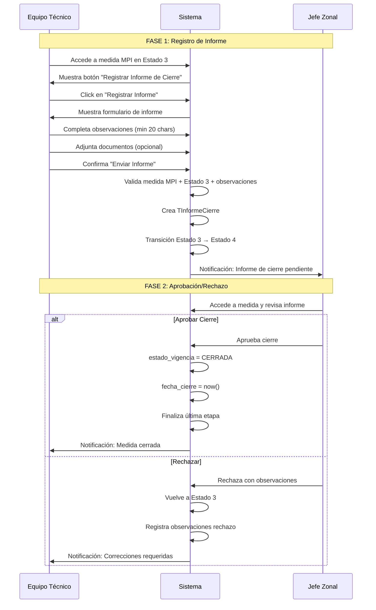

# MED-MPI-CIERRE: Informe de Cierre para Medidas MPI

**Estado**: 📋 Pendiente de implementación
**Prioridad**: Alta  
**Dependencias**: MED-01 (✅), MED-02 (✅)
**Módulo**: Medidas de Protección Integral (MPI)
**Estimación**: 18-22 horas

---

## Historia de Usuario

**Como** Equipo Técnico responsable de una Medida de Protección Integral (MPI)

**Quiero** registrar el informe de cierre cuando la medida ha cumplido sus objetivos y la situación del NNyA se ha estabilizado

**Para** formalizar el cierre de la intervención, documentar los resultados alcanzados y permitir que el Jefe Zonal apruebe el cese de la medida

---

## Contexto del Negocio

### Diferencia entre MPI y MPE

**MPI (Medida de Protección Integral)**:
- Intervención en situaciones de vulneración de derechos
- NO requiere separación del NNyA de su familia
- Seguimiento y acompañamiento técnico en el entorno familiar
- **Flujo simplificado**: Solo Estados 1-2 (sin proceso jurídico completo)
- **Cierre**: Requiere informe de cierre + aprobación de JZ (sin ratificación judicial)

**MPE (Medida de Protección Excepcional)**:
- Separación temporal del NNyA de su familia
- Requiere dispositivo institucional
- **Flujo completo**: Estados 1-5 con proceso jurídico
- **Cierre**: Requiere proceso judicial completo

### Workflow MPI - Etapa de Cierre

Según la imagen proporcionada y documentación RUNNA V2:

```
┌─────────────────────────────────────────────────────────────┐
│ ETAPA: CIERRE DE LA MEDIDA                                  │
├─────────────────────────────────────────────────────────────┤
│                                                             │
│ Estado 3: PENDIENTE_DE_INFORME_DE_CIERRE                   │
│ └──> Equipo Técnico redacta informe de cierre              │
│      └──> POST /api/medidas/{id}/informe-cierre/           │
│           └──> Transición automática a Estado 4            │
│                                                             │
│ Estado 4: INFORME_DE_CIERRE_REDACTADO                      │
│ └──> Jefe Zonal aprueba/rechaza cierre                     │
│      └──> POST /api/medidas/{id}/aprobar-cierre/           │
│           ├──> Si aprueba: medida.estado_vigencia=CERRADA  │
│           └──> Si rechaza: vuelve a Estado 3               │
│                                                             │
└─────────────────────────────────────────────────────────────┘
```

### Integración con Otras US

- **MED-01**: Creación de medida MPI con etapa inicial
- **MED-02**: Registro de intervención (Estado 1 → Estado 2)
- **LEG-04**: Visualizar estado de cierre desde detalle del legajo
- **BE-05**: Dashboard mostrando medidas pendientes de cierre

---

## Descripción Funcional

### Flujo Completo del Cierre MPI

#### Fase 1: Registro del Informe de Cierre (Estado 3 → Estado 4)

**Actor**: Equipo Técnico

1. ET accede a la medida MPI en Estado 3 (`PENDIENTE_DE_INFORME_DE_CIERRE`)
2. ET presiona botón **"Registrar Informe de Cierre"**
3. Sistema muestra modal/formulario con:
   - **Observaciones** (obligatorio, mínimo 20 caracteres): Fundamentación del cierre
   - **Adjuntos** (opcional): Documentos de respaldo
4. ET completa observaciones describiendo:
   - Objetivos alcanzados
   - Situación actual del NNyA y familia
   - Razones para el cierre de la intervención
5. ET adjunta documentos de respaldo (opcional):
   - Informe técnico final
   - Evaluaciones de seguimiento
   - Actas de reunión familiar
6. ET confirma "Enviar Informe"
7. Sistema valida:
   - Medida es MPI (tipo_medida='MPI')
   - Medida está en Estado 3
   - Observaciones tienen mínimo 20 caracteres
8. Sistema ejecuta:
   - Crea registro `TInformeCierre`
   - **Transición automática**: Estado 3 → Estado 4
   - Crea nueva `TEtapaMedida` con estado `INFORME_DE_CIERRE_REDACTADO`
   - Finaliza etapa anterior (fecha_fin_estado)
   - Notifica a Jefe Zonal

#### Fase 2: Aprobación por Jefe Zonal (Estado 4 → CERRADA)

**Actor**: Jefe Zonal

1. JZ recibe notificación de informe de cierre pendiente
2. JZ accede a la medida y revisa el informe
3. JZ toma decisión:

   **A) APROBAR CIERRE**:
   - JZ presiona "Aprobar Cierre"
   - Sistema ejecuta:
     - Actualiza `medida.estado_vigencia = 'CERRADA'`
     - Registra `medida.fecha_cierre = now()`
     - Finaliza última etapa (`fecha_fin_estado`)
     - Marca informe como `aprobado_por_jz = True`
     - Registra fecha y usuario de aprobación
   - Sistema notifica a ET
   - Medida queda CERRADA definitivamente

   **B) RECHAZAR CIERRE**:
   - JZ presiona "Rechazar" e ingresa observaciones
   - Sistema ejecuta:
     - Vuelve estado a `PENDIENTE_DE_INFORME_DE_CIERRE` (Estado 3)
     - Crea nueva `TEtapaMedida` con Estado 3
     - Registra observaciones de JZ en `informe.observaciones_rechazo`
   - Sistema notifica a ET con observaciones
   - ET debe corregir y reenviar informe

#### Diagrama de Flujo Completo



---

## Estructura de Datos

### Modelo Principal: TInformeCierre

**Ubicación**: `infrastructure/models/medida/TInformeCierre.py`

```python
from django.db import models
from django.contrib.auth import get_user_model
from django.utils.translation import gettext_lazy as _
from simple_history.models import HistoricalRecords

CustomUser = get_user_model()


class TInformeCierre(models.Model):
    """
    Modelo para registrar Informe de Cierre de medidas MPI.
    
    Este informe documenta la finalización de una Medida de Protección Integral,
    describiendo los objetivos alcanzados y la situación estabilizada del NNyA.
    
    Flujo:
    1. Equipo Técnico crea informe cuando medida está en Estado 3
    2. Sistema transiciona automáticamente a Estado 4
    3. Jefe Zonal aprueba/rechaza
    4. Si aprueba: medida.estado_vigencia = CERRADA
    5. Si rechaza: vuelve a Estado 3
    """
    
    # =================== RELACIONES ===================
    medida = models.ForeignKey(
        'TMedida',
        on_delete=models.CASCADE,
        related_name='informes_cierre',
        help_text="Medida MPI que se está cerrando"
    )
    
    etapa = models.ForeignKey(
        'TEtapaMedida',
        on_delete=models.SET_NULL,
        null=True,
        blank=True,
        related_name='informes_cierre',
        help_text="Etapa específica de Cierre (MED-01 V2)"
    )
    
    # =================== DATOS DEL INFORME ===================
    observaciones = models.TextField(
        help_text="Observaciones y fundamentación del cierre de la medida MPI (mínimo 20 caracteres)"
    )
    
    # =================== AUDITORÍA ===================
    elaborado_por = models.ForeignKey(
        CustomUser,
        on_delete=models.SET_NULL,
        null=True,
        related_name='informes_cierre_elaborados',
        help_text="Usuario (Equipo Técnico) que elaboró el informe"
    )
    
    fecha_registro = models.DateTimeField(
        auto_now_add=True,
        help_text="Timestamp de registro en el sistema"
    )
    
    fecha_modificacion = models.DateTimeField(
        auto_now=True,
        help_text="Última modificación del registro"
    )
    
    # =================== PROCESO DE APROBACIÓN ===================
    aprobado_por_jz = models.BooleanField(
        default=False,
        help_text="Si el Jefe Zonal aprobó este informe"
    )
    
    fecha_aprobacion_jz = models.DateTimeField(
        null=True,
        blank=True,
        help_text="Fecha de aprobación por Jefe Zonal"
    )
    
    jefe_zonal_aprobador = models.ForeignKey(
        CustomUser,
        on_delete=models.SET_NULL,
        null=True,
        blank=True,
        related_name='informes_cierre_aprobados',
        help_text="Jefe Zonal que aprobó el cierre"
    )
    
    # Rechazo
    rechazado = models.BooleanField(
        default=False,
        help_text="Si el Jefe Zonal rechazó este informe"
    )
    
    observaciones_rechazo = models.TextField(
        null=True,
        blank=True,
        help_text="Observaciones del Jefe Zonal en caso de rechazo"
    )
    
    fecha_rechazo = models.DateTimeField(
        null=True,
        blank=True,
        help_text="Fecha de rechazo por Jefe Zonal"
    )
    
    jefe_zonal_rechazo = models.ForeignKey(
        CustomUser,
        on_delete=models.SET_NULL,
        null=True,
        blank=True,
        related_name='informes_cierre_rechazados',
        help_text="Jefe Zonal que rechazó el informe"
    )
    
    # =================== CONTROL ===================
    activo = models.BooleanField(
        default=True,
        help_text="Si es el informe activo (solo uno puede estar activo por medida)"
    )
    
    # =================== HISTORY ===================
    history = HistoricalRecords()
    
    class Meta:
        app_label = 'infrastructure'
        db_table = 't_informe_cierre'
        verbose_name = _('Informe de Cierre')
        verbose_name_plural = _('Informes de Cierre')
        ordering = ['-fecha_registro']
        indexes = [
            models.Index(fields=['medida', 'activo']),
            models.Index(fields=['elaborado_por']),
        ]
        
    def __str__(self):
        return f"Informe Cierre - {self.medida.numero_medida} - {self.fecha_registro.strftime('%Y-%m-%d')}"
    
    def clean(self):
        """Validaciones de negocio"""
        from django.core.exceptions import ValidationError
        
        # Validar que la medida es MPI
        if self.medida and self.medida.tipo_medida != 'MPI':
            raise ValidationError({
                'medida': 'El informe de cierre solo aplica a medidas MPI'
            })
        
        # Validar observaciones mínimas
        if self.observaciones and len(self.observaciones.strip()) < 20:
            raise ValidationError({
                'observaciones': 'Las observaciones deben tener al menos 20 caracteres'
            })
    
    def save(self, *args, **kwargs):
        """Override save para validaciones y lógica de negocio"""
        self.full_clean()
        super().save(*args, **kwargs)
```

### Modelo de Adjuntos: TInformeCierreAdjunto

```python
class TInformeCierreAdjunto(models.Model):
    """Adjuntos del informe de cierre (documentos técnicos, evaluaciones)"""
    
    TIPO_INFORME_TECNICO = 'INFORME_TECNICO'
    TIPO_EVALUACION = 'EVALUACION'
    TIPO_ACTA = 'ACTA'
    TIPO_OTRO = 'OTRO'
    
    TIPO_CHOICES = [
        (TIPO_INFORME_TECNICO, 'Informe Técnico Final'),
        (TIPO_EVALUACION, 'Evaluación de Seguimiento'),
        (TIPO_ACTA, 'Acta de Reunión'),
        (TIPO_OTRO, 'Otro Documento'),
    ]
    
    informe_cierre = models.ForeignKey(
        'TInformeCierre',
        on_delete=models.CASCADE,
        related_name='adjuntos',
        help_text="Informe de cierre al que pertenece este adjunto"
    )
    
    tipo = models.CharField(
        max_length=20,
        choices=TIPO_CHOICES,
        default=TIPO_INFORME_TECNICO,
        help_text="Tipo de documento adjunto"
    )
    
    archivo = models.FileField(
        upload_to='informes_cierre/%Y/%m/',
        help_text="Archivo adjunto"
    )
    
    nombre_original = models.CharField(
        max_length=255,
        help_text="Nombre original del archivo"
    )
    
    tamaño_bytes = models.IntegerField(
        help_text="Tamaño del archivo en bytes"
    )
    
    extension = models.CharField(
        max_length=10,
        help_text="Extensión del archivo (pdf, doc, jpg, etc.)"
    )
    
    descripcion = models.CharField(
        max_length=500,
        null=True,
        blank=True,
        help_text="Descripción del documento"
    )
    
    subido_por = models.ForeignKey(
        CustomUser,
        on_delete=models.SET_NULL,
        null=True,
        help_text="Usuario que subió el archivo"
    )
    
    fecha_subida = models.DateTimeField(
        auto_now_add=True,
        help_text="Fecha de subida del archivo"
    )
    
    class Meta:
        app_label = 'infrastructure'
        db_table = 't_informe_cierre_adjunto'
        verbose_name = _('Adjunto de Informe de Cierre')
        verbose_name_plural = _('Adjuntos de Informes de Cierre')
        ordering = ['fecha_subida']
```

---

## Endpoints

### 1. Listar Informes de Cierre

```
GET /api/medidas/{medida_id}/informe-cierre/
```

**Permisos**: Equipo Técnico, Jefe Zonal, Director, Admin

**Response 200 OK**:

```json
[
  {
    "id": 1,
    "medida": 15,
    "medida_detalle": {
      "id": 15,
      "numero_medida": "MED-2025-015-MPI",
      "tipo_medida": "MPI"
    },
    "etapa": 3,
    "elaborado_por": 5,
    "elaborado_por_detalle": {
      "id": 5,
      "nombre_completo": "María González",
      "username": "mgonzalez"
    },
    "observaciones": "La familia ha logrado estabilizar su situación económica y habitacional. El NNyA asiste regularmente a la escuela y ha mejorado su rendimiento académico. Los vínculos familiares se han fortalecido significativamente...",
    "fecha_registro": "2025-01-25T14:30:00Z",
    "fecha_modificacion": "2025-01-25T14:30:00Z",
    "aprobado_por_jz": false,
    "fecha_aprobacion_jz": null,
    "jefe_zonal_aprobador": null,
    "rechazado": false,
    "observaciones_rechazo": null,
    "fecha_rechazo": null,
    "activo": true,
    "adjuntos": [
      {
        "id": 1,
        "tipo": "INFORME_TECNICO",
        "tipo_display": "Informe Técnico Final",
        "nombre_original": "informe_final_familia_gonzalez.pdf",
        "tamaño_bytes": 245678,
        "extension": "pdf",
        "url": "/media/informes_cierre/2025/01/informe_final_familia_gonzalez.pdf",
        "descripcion": "Informe técnico final del seguimiento familiar",
        "fecha_subida": "2025-01-25T14:25:00Z"
      }
    ]
  }
]
```

### 2. Crear Informe de Cierre

```
POST /api/medidas/{medida_id}/informe-cierre/
```

**Permisos**: Equipo Técnico responsable, Jefe Zonal, Director, Admin

**Validaciones**:
- Medida debe ser MPI (`tipo_medida='MPI'`)
- Medida debe estar en Estado 3 (`PENDIENTE_DE_INFORME_DE_CIERRE`)
- Usuario debe ser EQUIPO_TECNICO (mismo que registra intervenciones)
- Observaciones obligatorias (mínimo 20 caracteres)

**Request Body**:

```json
{
  "observaciones": "La familia ha logrado estabilizar su situación económica y habitacional. El NNyA asiste regularmente a la escuela y ha mejorado su rendimiento académico. Los vínculos familiares se han fortalecido significativamente tras el trabajo realizado durante los últimos 6 meses."
}
```

**Response 201 CREATED**:

```json
{
  "id": 1,
  "medida": 15,
  "medida_detalle": {
    "id": 15,
    "numero_medida": "MED-2025-015-MPI",
    "tipo_medida": "MPI",
    "estado_vigencia": "VIGENTE",
    "etapa_actual": {
      "id": 4,
      "nombre": "Cierre de la Medida",
      "estado": "INFORME_DE_CIERRE_REDACTADO",
      "estado_display": "(4) Informe de cierre redactado",
      "fecha_inicio_estado": "2025-01-25T14:30:00Z"
    }
  },
  "etapa": 4,
  "elaborado_por": 5,
  "elaborado_por_detalle": {
    "id": 5,
    "nombre_completo": "María González",
    "username": "mgonzalez"
  },
  "observaciones": "La familia ha logrado estabilizar su situación...",
  "fecha_registro": "2025-01-25T14:30:00Z",
  "fecha_modificacion": "2025-01-25T14:30:00Z",
  "aprobado_por_jz": false,
  "activo": true,
  "adjuntos": [],
  "mensaje": "Informe de cierre registrado. Estado de medida actualizado a 'Informe de cierre redactado'. Se notificó al Jefe Zonal."
}
```

**Proceso Backend**:
1. Validar estado de medida (debe ser Estado 3 MPI)
2. Validar permisos (EQUIPO_TECNICO)
3. Crear registro de Informe de Cierre
4. **Transicionar estado automáticamente**:
   - Finalizar etapa actual (Estado 3): `fecha_fin_estado = now()`
   - Crear nueva etapa con Estado 4: `INFORME_DE_CIERRE_REDACTADO`
   - Actualizar `medida.etapa_actual` → nueva etapa
5. Notificar a Jefe Zonal

**Response 400 BAD REQUEST**:

```json
{
  "error": "VALIDACION_FALLIDA",
  "detalle": "La medida no está en estado PENDIENTE_DE_INFORME_DE_CIERRE",
  "codigo": "ESTADO_INVALIDO"
}
```

```json
{
  "error": "VALIDACION_FALLIDA",
  "detalle": "Las observaciones deben tener al menos 20 caracteres",
  "codigo": "OBSERVACIONES_INSUFICIENTES"
}
```

```json
{
  "error": "TIPO_MEDIDA_INVALIDO",
  "detalle": "El informe de cierre solo aplica a medidas MPI",
  "codigo": "NO_ES_MPI"
}
```

### 3. Obtener Detalle de Informe

```
GET /api/medidas/{medida_id}/informe-cierre/{id}/
```

**Response 200 OK**: (mismo formato que lista)

### 4. Subir Adjuntos

```
POST /api/medidas/{medida_id}/informe-cierre/adjuntos/
```

**Request**: Multipart form-data

```
informe_cierre_id: 1
tipo: INFORME_TECNICO | EVALUACION | ACTA | OTRO
archivo: (file upload)
descripcion: "Descripción del documento" (opcional)
```

**Response 201 CREATED**:

```json
{
  "id": 1,
  "informe_cierre": 1,
  "tipo": "INFORME_TECNICO",
  "tipo_display": "Informe Técnico Final",
  "nombre_original": "informe_final_familia_gonzalez.pdf",
  "tamaño_bytes": 245678,
  "extension": "pdf",
  "descripcion": "Informe técnico final del seguimiento familiar",
  "url": "/media/informes_cierre/2025/01/informe_final_familia_gonzalez.pdf",
  "subido_por": {
    "id": 5,
    "nombre_completo": "María González"
  },
  "fecha_subida": "2025-01-25T14:25:00Z"
}
```

**Validaciones**:
- Extensiones permitidas: `.pdf`, `.doc`, `.docx`, `.jpg`, `.jpeg`, `.png`
- Tamaño máximo: 10 MB

**Response 400 BAD REQUEST**:

```json
{
  "error": "ARCHIVO_INVALIDO",
  "detalle": "Solo se permiten archivos PDF, DOC, DOCX, JPG, PNG",
  "extension_recibida": "exe"
}
```

**Response 413 PAYLOAD TOO LARGE**:

```json
{
  "error": "ARCHIVO_MUY_GRANDE",
  "detalle": "El tamaño máximo permitido es 10MB",
  "tamaño_recibido_mb": 15.2
}
```

### 5. Listar Adjuntos

```
GET /api/medidas/{medida_id}/informe-cierre/adjuntos/
```

**Query Params**:
- `?informe_cierre_id=1` - Filtrar por informe específico
- `?tipo=INFORME_TECNICO` - Filtrar por tipo

**Response 200 OK**: Array de adjuntos

### 6. Eliminar Adjunto

```
DELETE /api/medidas/{medida_id}/informe-cierre/adjuntos/{adjunto_id}/
```

**Permisos**: Solo el usuario que subió el archivo o Admin

**Response 204 NO CONTENT**

### 7. Aprobar Cierre (Jefe Zonal)

```
POST /api/medidas/{medida_id}/aprobar-cierre/
```

**Permisos**: Jefe Zonal de la zona, Director, Admin

**Validaciones**:
- Medida debe estar en Estado 4 (`INFORME_DE_CIERRE_REDACTADO`)
- Debe existir un informe de cierre activo
- Usuario debe ser Jefe Zonal de la zona o superior

**Request Body**: (vacío)

**Response 200 OK**:

```json
{
  "id": 15,
  "numero_medida": "MED-2025-015-MPI",
  "tipo_medida": "MPI",
  "estado_vigencia": "CERRADA",
  "fecha_apertura": "2024-06-15T10:00:00Z",
  "fecha_cierre": "2025-01-26T09:15:00Z",
  "duracion_dias": 225,
  "informe_cierre": {
    "id": 1,
    "aprobado_por_jz": true,
    "fecha_aprobacion_jz": "2025-01-26T09:15:00Z",
    "jefe_zonal_aprobador": {
      "id": 8,
      "nombre_completo": "Carlos Ramírez",
      "username": "cramirez"
    }
  },
  "etapa_actual": null,
  "mensaje": "Medida cerrada exitosamente. Se notificó al Equipo Técnico."
}
```

**Proceso Backend**:
1. Validar estado de medida (Estado 4)
2. Validar permisos (JZ de la zona)
3. Actualizar informe de cierre:
   - `aprobado_por_jz = True`
   - `fecha_aprobacion_jz = now()`
   - `jefe_zonal_aprobador = user`
4. Actualizar medida:
   - `estado_vigencia = 'CERRADA'`
   - `fecha_cierre = now()`
5. Finalizar última etapa (`fecha_fin_estado`)
6. Actualizar `medida.etapa_actual = null` (medida cerrada)
7. Notificar a Equipo Técnico

**Response 403 FORBIDDEN**:

```json
{
  "error": "PERMISO_DENEGADO",
  "detalle": "Solo el Jefe Zonal de la zona puede aprobar el cierre",
  "codigo": "JZ_REQUIRED"
}
```

### 8. Rechazar Cierre (Jefe Zonal)

```
POST /api/medidas/{medida_id}/rechazar-cierre/
```

**Permisos**: Jefe Zonal de la zona, Director, Admin

**Request Body**:

```json
{
  "observaciones": "El informe debe detallar mejor el estado actual de la situación habitacional de la familia. Falta información sobre el seguimiento escolar del NNyA en los últimos 2 meses."
}
```

**Response 200 OK**:

```json
{
  "id": 15,
  "numero_medida": "MED-2025-015-MPI",
  "tipo_medida": "MPI",
  "estado_vigencia": "VIGENTE",
  "etapa_actual": {
    "id": 5,
    "nombre": "Cierre de la Medida",
    "estado": "PENDIENTE_DE_INFORME_DE_CIERRE",
    "estado_display": "(3) Pendiente de informe de cierre",
    "fecha_inicio_estado": "2025-01-26T09:20:00Z",
    "observaciones": "El informe debe detallar mejor el estado actual de la situación habitacional..."
  },
  "informe_cierre": {
    "id": 1,
    "rechazado": true,
    "observaciones_rechazo": "El informe debe detallar mejor el estado actual de la situación habitacional...",
    "fecha_rechazo": "2025-01-26T09:20:00Z",
    "jefe_zonal_rechazo": {
      "id": 8,
      "nombre_completo": "Carlos Ramírez"
    },
    "activo": false
  },
  "mensaje": "Informe de cierre rechazado. Estado de medida vuelto a 'Pendiente de informe de cierre'. Se notificó al Equipo Técnico."
}
```

**Proceso Backend**:
1. Validar observaciones no vacías
2. Actualizar informe actual:
   - `rechazado = True`
   - `observaciones_rechazo = observaciones`
   - `fecha_rechazo = now()`
   - `jefe_zonal_rechazo = user`
   - `activo = False` (desactivar informe rechazado)
3. Transicionar medida:
   - Finalizar etapa actual (Estado 4)
   - Crear nueva etapa con Estado 3
   - Agregar observaciones de rechazo a nueva etapa
   - Actualizar `medida.etapa_actual`
4. Notificar a Equipo Técnico con observaciones

**Response 400 BAD REQUEST**:

```json
{
  "error": "OBSERVACIONES_REQUERIDAS",
  "detalle": "Las observaciones son obligatorias al rechazar un informe de cierre"
}
```

---

## Serializers

### TInformeCierreSerializer

**Ubicación**: `api/serializers/TInformeCierreSerializer.py`

```python
from rest_framework import serializers
from infrastructure.models import TInformeCierre, TInformeCierreAdjunto, TMedida
from api.serializers import CustomUserSerializer


class TInformeCierreAdjuntoSerializer(serializers.ModelSerializer):
    """Serializer para adjuntos de informe de cierre"""
    
    tipo_display = serializers.CharField(source='get_tipo_display', read_only=True)
    url = serializers.SerializerMethodField()
    subido_por = serializers.SerializerMethodField()
    
    class Meta:
        model = TInformeCierreAdjunto
        fields = [
            'id', 'tipo', 'tipo_display', 'nombre_original', 'tamaño_bytes',
            'extension', 'descripcion', 'url', 'subido_por', 'fecha_subida'
        ]
        read_only_fields = ['id', 'nombre_original', 'tamaño_bytes', 'extension', 'fecha_subida']
    
    def get_url(self, obj):
        return obj.archivo.url if obj.archivo else None
    
    def get_subido_por(self, obj):
        if obj.subido_por:
            return {
                'id': obj.subido_por.id,
                'nombre_completo': f"{obj.subido_por.first_name} {obj.subido_por.last_name}".strip(),
                'username': obj.subido_por.username
            }
        return None


class TInformeCierreSerializer(serializers.ModelSerializer):
    """Serializer para Informe de Cierre (MPI)"""
    
    # Read-only fields (nested)
    medida_detalle = serializers.SerializerMethodField()
    elaborado_por_detalle = serializers.SerializerMethodField()
    jefe_zonal_aprobador_detalle = serializers.SerializerMethodField()
    jefe_zonal_rechazo_detalle = serializers.SerializerMethodField()
    adjuntos = TInformeCierreAdjuntoSerializer(many=True, read_only=True)
    
    # Write-only fields
    medida_id = serializers.PrimaryKeyRelatedField(
        queryset=TMedida.objects.all(),
        source='medida',
        write_only=True
    )
    
    class Meta:
        model = TInformeCierre
        fields = [
            'id', 'medida', 'medida_id', 'medida_detalle',
            'etapa',
            'elaborado_por', 'elaborado_por_detalle',
            'observaciones',
            'fecha_registro', 'fecha_modificacion',
            'aprobado_por_jz', 'fecha_aprobacion_jz',
            'jefe_zonal_aprobador', 'jefe_zonal_aprobador_detalle',
            'rechazado', 'observaciones_rechazo', 'fecha_rechazo',
            'jefe_zonal_rechazo', 'jefe_zonal_rechazo_detalle',
            'activo',
            'adjuntos'
        ]
        read_only_fields = [
            'id', 'medida', 'elaborado_por', 'fecha_registro', 'fecha_modificacion',
            'aprobado_por_jz', 'fecha_aprobacion_jz', 'jefe_zonal_aprobador',
            'rechazado', 'observaciones_rechazo', 'fecha_rechazo',
            'jefe_zonal_rechazo', 'activo', 'etapa'
        ]
    
    def get_medida_detalle(self, obj):
        """Detalle básico de la medida"""
        if obj.medida:
            return {
                'id': obj.medida.id,
                'numero_medida': obj.medida.numero_medida,
                'tipo_medida': obj.medida.tipo_medida,
                'tipo_medida_display': obj.medida.get_tipo_medida_display(),
                'estado_vigencia': obj.medida.estado_vigencia
            }
        return None
    
    def get_elaborado_por_detalle(self, obj):
        """Usuario que elaboró el informe"""
        if obj.elaborado_por:
            return {
                'id': obj.elaborado_por.id,
                'nombre_completo': f"{obj.elaborado_por.first_name} {obj.elaborado_por.last_name}".strip(),
                'username': obj.elaborado_por.username
            }
        return None
    
    def get_jefe_zonal_aprobador_detalle(self, obj):
        """JZ que aprobó"""
        if obj.jefe_zonal_aprobador:
            return {
                'id': obj.jefe_zonal_aprobador.id,
                'nombre_completo': f"{obj.jefe_zonal_aprobador.first_name} {obj.jefe_zonal_aprobador.last_name}".strip(),
                'username': obj.jefe_zonal_aprobador.username
            }
        return None
    
    def get_jefe_zonal_rechazo_detalle(self, obj):
        """JZ que rechazó"""
        if obj.jefe_zonal_rechazo:
            return {
                'id': obj.jefe_zonal_rechazo.id,
                'nombre_completo': f"{obj.jefe_zonal_rechazo.first_name} {obj.jefe_zonal_rechazo.last_name}".strip(),
                'username': obj.jefe_zonal_rechazo.username
            }
        return None
    
    def validate(self, attrs):
        """Validaciones de negocio"""
        medida = attrs.get('medida')
        
        # Validar que la medida es MPI
        if medida and medida.tipo_medida != 'MPI':
            raise serializers.ValidationError({
                'medida': 'El informe de cierre solo aplica a medidas MPI'
            })
        
        # Validar observaciones mínimas
        observaciones = attrs.get('observaciones', '')
        if observaciones and len(observaciones.strip()) < 20:
            raise serializers.ValidationError({
                'observaciones': 'Las observaciones deben tener al menos 20 caracteres'
            })
        
        return attrs
    
    def create(self, validated_data):
        """Override create para agregar usuario desde contexto"""
        request = self.context.get('request')
        
        if request and request.user:
            validated_data['elaborado_por'] = request.user
        
        return super().create(validated_data)
```

---

## ViewSet Implementation

**Ubicación**: `api/views/TInformeCierreView.py`

```python
from rest_framework import status
from rest_framework.decorators import action
from rest_framework.response import Response
from rest_framework.permissions import IsAuthenticated
from django.utils import timezone
from django.core.exceptions import ValidationError

from .BaseView import BaseViewSet
from infrastructure.models import TInformeCierre, TInformeCierreAdjunto, TMedida, TEtapaMedida
from api.serializers import TInformeCierreSerializer, TInformeCierreAdjuntoSerializer


class TInformeCierreViewSet(BaseViewSet):
    """ViewSet para informes de cierre MPI"""
    
    model = TInformeCierre
    serializer_class = TInformeCierreSerializer
    permission_classes = [IsAuthenticated]
    http_method_names = ['get', 'post']
    
    def get_queryset(self):
        """Filtrar informes según permisos"""
        user = self.request.user
        medida_pk = self.kwargs.get('medida_pk')
        
        queryset = TInformeCierre.objects.all().select_related(
            'medida', 'etapa', 'elaborado_por',
            'jefe_zonal_aprobador', 'jefe_zonal_rechazo'
        ).prefetch_related('adjuntos')
        
        if medida_pk:
            queryset = queryset.filter(medida_id=medida_pk)
        
        # TODO: Aplicar filtros por permisos de zona
        
        return queryset
    
    def create(self, request, medida_pk=None):
        """
        POST /api/medidas/{medida_id}/informe-cierre/
        
        Crear informe de cierre para medida MPI.
        Transiciona automáticamente Estado 3 → Estado 4
        """
        # Obtener medida
        try:
            medida = TMedida.objects.select_related('etapa_actual').get(id=medida_pk)
        except TMedida.DoesNotExist:
            return Response(
                {'error': 'MEDIDA_NO_ENCONTRADA', 'detalle': 'La medida no existe'},
                status=status.HTTP_404_NOT_FOUND
            )
        
        # Validar que es MPI
        if medida.tipo_medida != 'MPI':
            return Response(
                {
                    'error': 'TIPO_MEDIDA_INVALIDO',
                    'detalle': 'El informe de cierre solo aplica a medidas MPI',
                    'codigo': 'NO_ES_MPI'
                },
                status=status.HTTP_400_BAD_REQUEST
            )
        
        # Validar estado actual (debe ser Estado 3: PENDIENTE_DE_INFORME_DE_CIERRE)
        if not medida.etapa_actual or medida.etapa_actual.estado != 'PENDIENTE_DE_INFORME_DE_CIERRE':
            return Response(
                {
                    'error': 'VALIDACION_FALLIDA',
                    'detalle': 'La medida no está en estado PENDIENTE_DE_INFORME_DE_CIERRE',
                    'estado_actual': medida.etapa_actual.estado if medida.etapa_actual else None,
                    'codigo': 'ESTADO_INVALIDO'
                },
                status=status.HTTP_400_BAD_REQUEST
            )
        
        # Validar permisos (TODO: verificar que es ET responsable o JZ de la zona)
        # if not self._puede_crear_informe(request.user, medida):
        #     return Response(...)
        
        # Agregar medida_id al request data
        data = request.data.copy()
        data['medida_id'] = medida.id
        
        # Crear informe
        serializer = self.get_serializer(data=data, context={'request': request})
        
        if not serializer.is_valid():
            return Response(serializer.errors, status=status.HTTP_400_BAD_REQUEST)
        
        # Guardar informe
        informe = serializer.save()
        
        # TRANSICIÓN AUTOMÁTICA: Estado 3 → Estado 4
        try:
            # Finalizar etapa actual (Estado 3)
            if medida.etapa_actual:
                medida.etapa_actual.fecha_fin_estado = timezone.now()
                medida.etapa_actual.save()
            
            # Crear nueva etapa (Estado 4: INFORME_DE_CIERRE_REDACTADO)
            nueva_etapa = TEtapaMedida.objects.create(
                medida=medida,
                nombre='Cierre de la Medida',
                tipo_etapa='CIERRE',  # Asumiendo MED-01 V2
                estado='INFORME_DE_CIERRE_REDACTADO',
                fecha_inicio_estado=timezone.now()
            )
            
            # Vincular informe a nueva etapa
            informe.etapa = nueva_etapa
            informe.save()
            
            # Actualizar etapa_actual de la medida
            medida.etapa_actual = nueva_etapa
            medida.save()
            
            # TODO: Notificar a Jefe Zonal
            
        except Exception as e:
            # Rollback: eliminar informe creado si falla la transición
            informe.delete()
            return Response(
                {
                    'error': 'ERROR_TRANSICION',
                    'detalle': f'Error al transicionar estado: {str(e)}'
                },
                status=status.HTTP_500_INTERNAL_SERVER_ERROR
            )
        
        # Retornar con mensaje de éxito
        response_data = serializer.data
        response_data['mensaje'] = (
            "Informe de cierre registrado. Estado de medida actualizado a 'Informe de cierre redactado'. "
            "Se notificó al Jefe Zonal."
        )
        
        return Response(response_data, status=status.HTTP_201_CREATED)
    
    @action(detail=False, methods=['post'], url_path='aprobar-cierre')
    def aprobar_cierre(self, request, medida_pk=None):
        """
        POST /api/medidas/{medida_id}/aprobar-cierre/
        
        Aprobar cierre de medida MPI (Jefe Zonal).
        Cierra la medida definitivamente.
        """
        # Obtener medida
        try:
            medida = TMedida.objects.select_related('etapa_actual').get(id=medida_pk)
        except TMedida.DoesNotExist:
            return Response(
                {'error': 'MEDIDA_NO_ENCONTRADA'},
                status=status.HTTP_404_NOT_FOUND
            )
        
        # Validar estado actual (debe ser Estado 4: INFORME_DE_CIERRE_REDACTADO)
        if not medida.etapa_actual or medida.etapa_actual.estado != 'INFORME_DE_CIERRE_REDACTADO':
            return Response(
                {
                    'error': 'ESTADO_INVALIDO',
                    'detalle': 'La medida no está en estado INFORME_DE_CIERRE_REDACTADO'
                },
                status=status.HTTP_400_BAD_REQUEST
            )
        
        # Obtener informe activo
        try:
            informe = TInformeCierre.objects.get(medida=medida, activo=True)
        except TInformeCierre.DoesNotExist:
            return Response(
                {
                    'error': 'INFORME_NO_ENCONTRADO',
                    'detalle': 'No existe un informe de cierre activo para esta medida'
                },
                status=status.HTTP_404_NOT_FOUND
            )
        
        # Validar permisos (debe ser JZ de la zona)
        # TODO: if not self._es_jefe_zonal_de_zona(request.user, medida):
        #     return Response({'error': 'PERMISO_DENEGADO'}, status=403)
        
        # APROBAR CIERRE
        try:
            # Actualizar informe
            informe.aprobado_por_jz = True
            informe.fecha_aprobacion_jz = timezone.now()
            informe.jefe_zonal_aprobador = request.user
            informe.save()
            
            # CERRAR MEDIDA
            medida.estado_vigencia = 'CERRADA'
            medida.fecha_cierre = timezone.now()
            
            # Finalizar última etapa
            if medida.etapa_actual:
                medida.etapa_actual.fecha_fin_estado = timezone.now()
                medida.etapa_actual.save()
            
            # Actualizar etapa_actual a null (medida cerrada)
            medida.etapa_actual = None
            medida.save()
            
            # TODO: Notificar a Equipo Técnico
            
        except Exception as e:
            return Response(
                {'error': 'ERROR_AL_APROBAR', 'detalle': str(e)},
                status=status.HTTP_500_INTERNAL_SERVER_ERROR
            )
        
        # Retornar medida cerrada
        from api.serializers import TMedidaSerializer
        medida_serializer = TMedidaSerializer(medida)
        
        response_data = medida_serializer.data
        response_data['mensaje'] = "Medida cerrada exitosamente. Se notificó al Equipo Técnico."
        
        return Response(response_data, status=status.HTTP_200_OK)
    
    @action(detail=False, methods=['post'], url_path='rechazar-cierre')
    def rechazar_cierre(self, request, medida_pk=None):
        """
        POST /api/medidas/{medida_id}/rechazar-cierre/
        
        Rechazar informe de cierre (Jefe Zonal).
        Vuelve a Estado 3 con observaciones.
        """
        # Obtener medida
        try:
            medida = TMedida.objects.select_related('etapa_actual').get(id=medida_pk)
        except TMedida.DoesNotExist:
            return Response(
                {'error': 'MEDIDA_NO_ENCONTRADA'},
                status=status.HTTP_404_NOT_FOUND
            )
        
        # Validar observaciones
        observaciones = request.data.get('observaciones', '').strip()
        if not observaciones:
            return Response(
                {
                    'error': 'OBSERVACIONES_REQUERIDAS',
                    'detalle': 'Las observaciones son obligatorias al rechazar un informe de cierre'
                },
                status=status.HTTP_400_BAD_REQUEST
            )
        
        # Obtener informe activo
        try:
            informe = TInformeCierre.objects.get(medida=medida, activo=True)
        except TInformeCierre.DoesNotExist:
            return Response(
                {'error': 'INFORME_NO_ENCONTRADO'},
                status=status.HTTP_404_NOT_FOUND
            )
        
        # RECHAZAR INFORME
        try:
            # Actualizar informe actual (desactivar)
            informe.rechazado = True
            informe.observaciones_rechazo = observaciones
            informe.fecha_rechazo = timezone.now()
            informe.jefe_zonal_rechazo = request.user
            informe.activo = False
            informe.save()
            
            # Finalizar etapa actual (Estado 4)
            if medida.etapa_actual:
                medida.etapa_actual.fecha_fin_estado = timezone.now()
                medida.etapa_actual.save()
            
            # Crear nueva etapa (volver a Estado 3)
            nueva_etapa = TEtapaMedida.objects.create(
                medida=medida,
                nombre='Cierre de la Medida',
                tipo_etapa='CIERRE',
                estado='PENDIENTE_DE_INFORME_DE_CIERRE',
                observaciones=observaciones,
                fecha_inicio_estado=timezone.now()
            )
            
            # Actualizar etapa_actual
            medida.etapa_actual = nueva_etapa
            medida.save()
            
            # TODO: Notificar a Equipo Técnico con observaciones
            
        except Exception as e:
            return Response(
                {'error': 'ERROR_AL_RECHAZAR', 'detalle': str(e)},
                status=status.HTTP_500_INTERNAL_SERVER_ERROR
            )
        
        # Retornar medida actualizada
        from api.serializers import TMedidaSerializer
        medida_serializer = TMedidaSerializer(medida)
        
        response_data = medida_serializer.data
        response_data['mensaje'] = (
            "Informe de cierre rechazado. Estado de medida vuelto a 'Pendiente de informe de cierre'. "
            "Se notificó al Equipo Técnico."
        )
        
        return Response(response_data, status=status.HTTP_200_OK)
    
    @action(detail=False, methods=['get', 'post'], url_path='adjuntos')
    def adjuntos(self, request, medida_pk=None):
        """
        GET/POST /api/medidas/{medida_id}/informe-cierre/adjuntos/
        
        Listar o subir adjuntos del informe de cierre.
        """
        if request.method == 'GET':
            # Listar adjuntos
            informe_id = request.query_params.get('informe_cierre_id')
            tipo = request.query_params.get('tipo')
            
            adjuntos = TInformeCierreAdjunto.objects.filter(
                informe_cierre__medida_id=medida_pk
            )
            
            if informe_id:
                adjuntos = adjuntos.filter(informe_cierre_id=informe_id)
            
            if tipo:
                adjuntos = adjuntos.filter(tipo=tipo)
            
            serializer = TInformeCierreAdjuntoSerializer(adjuntos, many=True)
            return Response(serializer.data)
        
        elif request.method == 'POST':
            # Subir adjunto
            informe_id = request.data.get('informe_cierre_id')
            
            if not informe_id:
                return Response(
                    {'error': 'INFORME_REQUERIDO', 'detalle': 'informe_cierre_id es obligatorio'},
                    status=status.HTTP_400_BAD_REQUEST
                )
            
            try:
                informe = TInformeCierre.objects.get(id=informe_id, medida_id=medida_pk)
            except TInformeCierre.DoesNotExist:
                return Response(
                    {'error': 'INFORME_NO_ENCONTRADO'},
                    status=status.HTTP_404_NOT_FOUND
                )
            
            # Validar archivo
            archivo = request.FILES.get('archivo')
            if not archivo:
                return Response(
                    {'error': 'ARCHIVO_REQUERIDO'},
                    status=status.HTTP_400_BAD_REQUEST
                )
            
            # Validar extensión
            extension = archivo.name.split('.')[-1].lower()
            extensiones_permitidas = ['pdf', 'doc', 'docx', 'jpg', 'jpeg', 'png']
            
            if extension not in extensiones_permitidas:
                return Response(
                    {
                        'error': 'ARCHIVO_INVALIDO',
                        'detalle': 'Solo se permiten archivos PDF, DOC, DOCX, JPG, PNG',
                        'extension_recibida': extension
                    },
                    status=status.HTTP_400_BAD_REQUEST
                )
            
            # Validar tamaño (10 MB)
            tamaño_mb = archivo.size / (1024 * 1024)
            if tamaño_mb > 10:
                return Response(
                    {
                        'error': 'ARCHIVO_MUY_GRANDE',
                        'detalle': 'El tamaño máximo permitido es 10MB',
                        'tamaño_recibido_mb': round(tamaño_mb, 2)
                    },
                    status=status.HTTP_413_REQUEST_ENTITY_TOO_LARGE
                )
            
            # Crear adjunto
            adjunto = TInformeCierreAdjunto.objects.create(
                informe_cierre=informe,
                tipo=request.data.get('tipo', 'INFORME_TECNICO'),
                archivo=archivo,
                nombre_original=archivo.name,
                tamaño_bytes=archivo.size,
                extension=extension,
                descripcion=request.data.get('descripcion', ''),
                subido_por=request.user
            )
            
            serializer = TInformeCierreAdjuntoSerializer(adjunto)
            return Response(serializer.data, status=status.HTTP_201_CREATED)
    
    @action(detail=False, methods=['delete'], url_path='adjuntos/(?P<adjunto_id>[^/.]+)')
    def eliminar_adjunto(self, request, medida_pk=None, adjunto_id=None):
        """
        DELETE /api/medidas/{medida_id}/informe-cierre/adjuntos/{adjunto_id}/
        
        Eliminar un adjunto del informe de cierre.
        """
        try:
            adjunto = TInformeCierreAdjunto.objects.get(
                id=adjunto_id,
                informe_cierre__medida_id=medida_pk
            )
        except TInformeCierreAdjunto.DoesNotExist:
            return Response(
                {'error': 'ADJUNTO_NO_ENCONTRADO'},
                status=status.HTTP_404_NOT_FOUND
            )
        
        # Validar permisos (solo quien lo subió o admin)
        if not request.user.is_superuser and adjunto.subido_por != request.user:
            return Response(
                {'error': 'PERMISO_DENEGADO'},
                status=status.HTTP_403_FORBIDDEN
            )
        
        # Eliminar archivo físico
        if adjunto.archivo:
            adjunto.archivo.delete()
        
        # Eliminar registro
        adjunto.delete()
        
        return Response(status=status.HTTP_204_NO_CONTENT)
```

---

## URLs Configuration

**Ubicación**: `api/urls.py`

```python
from django.urls import path, include
from rest_framework_nested import routers
from api.views import TMedidaViewSet, TInformeCierreViewSet

router = routers.DefaultRouter()

# Medidas router
medidas_router = routers.NestedDefaultRouter(router, r'medidas', lookup='medida')
medidas_router.register(
    r'informe-cierre',
    TInformeCierreViewSet,
    basename='medidas-informe-cierre'
)

urlpatterns = [
    path('', include(router.urls)),
    path('', include(medidas_router.urls)),
]
```

---

## Frontend Implementation

### 1. API Service

**Ubicación**: `src/app/(runna)/legajo-mesa/api/informe-cierre-api-service.ts`

```typescript
/**
 * API Service for Informe de Cierre (MPI)
 */

import { get, create, post, deleteResource } from "@/app/api/apiService"

export interface InformeCierreAdjunto {
  id: number
  tipo: "INFORME_TECNICO" | "EVALUACION" | "ACTA" | "OTRO"
  tipo_display: string
  nombre_original: string
  tamaño_bytes: number
  extension: string
  descripcion?: string
  url: string
  subido_por: {
    id: number
    nombre_completo: string
  }
  fecha_subida: string
}

export interface InformeCierre {
  id: number
  medida: number
  medida_detalle: {
    id: number
    numero_medida: string
    tipo_medida: string
    tipo_medida_display: string
    estado_vigencia: string
  }
  etapa: number | null
  elaborado_por: number
  elaborado_por_detalle: {
    id: number
    nombre_completo: string
    username: string
  }
  observaciones: string
  fecha_registro: string
  fecha_modificacion: string
  aprobado_por_jz: boolean
  fecha_aprobacion_jz: string | null
  jefe_zonal_aprobador: {
    id: number
    nombre_completo: string
    username: string
  } | null
  rechazado: boolean
  observaciones_rechazo: string | null
  fecha_rechazo: string | null
  jefe_zonal_rechazo: {
    id: number
    nombre_completo: string
  } | null
  activo: boolean
  adjuntos: InformeCierreAdjunto[]
}

export interface CreateInformeCierreRequest {
  observaciones: string
}

export interface RechazarCierreRequest {
  observaciones: string
}

/**
 * Listar informes de cierre de una medida
 * GET /api/medidas/{medida_id}/informe-cierre/
 */
export const getInformesCierre = async (medidaId: number): Promise<InformeCierre[]> => {
  try {
    return await get<InformeCierre[]>(`medidas/${medidaId}/informe-cierre/`)
  } catch (error) {
    console.error(`Error fetching informes cierre for medida ${medidaId}:`, error)
    throw error
  }
}

/**
 * Crear informe de cierre
 * POST /api/medidas/{medida_id}/informe-cierre/
 */
export const createInformeCierre = async (
  medidaId: number,
  data: CreateInformeCierreRequest
): Promise<InformeCierre> => {
  try {
    return await create<InformeCierre>(
      `medidas/${medidaId}/informe-cierre`,
      data as any
    )
  } catch (error) {
    console.error(`Error creating informe cierre for medida ${medidaId}:`, error)
    throw error
  }
}

/**
 * Aprobar cierre de medida
 * POST /api/medidas/{medida_id}/aprobar-cierre/
 */
export const aprobarCierre = async (medidaId: number): Promise<any> => {
  try {
    return await post(`medidas/${medidaId}/informe-cierre/aprobar-cierre/`, {})
  } catch (error) {
    console.error(`Error aprobando cierre for medida ${medidaId}:`, error)
    throw error
  }
}

/**
 * Rechazar cierre de medida
 * POST /api/medidas/{medida_id}/rechazar-cierre/
 */
export const rechazarCierre = async (
  medidaId: number,
  data: RechazarCierreRequest
): Promise<any> => {
  try {
    return await post(`medidas/${medidaId}/informe-cierre/rechazar-cierre/`, data)
  } catch (error) {
    console.error(`Error rechazando cierre for medida ${medidaId}:`, error)
    throw error
  }
}

/**
 * Subir adjunto a informe de cierre
 * POST /api/medidas/{medida_id}/informe-cierre/adjuntos/
 */
export const uploadAdjuntoInformeCierre = async (
  medidaId: number,
  informeCierreId: number,
  file: File,
  tipo: "INFORME_TECNICO" | "EVALUACION" | "ACTA" | "OTRO",
  descripcion?: string
): Promise<InformeCierreAdjunto> => {
  try {
    const formData = new FormData()
    formData.append("archivo", file)
    formData.append("informe_cierre_id", informeCierreId.toString())
    formData.append("tipo", tipo)
    if (descripcion) {
      formData.append("descripcion", descripcion)
    }

    const response = await fetch(`/api/medidas/${medidaId}/informe-cierre/adjuntos/`, {
      method: "POST",
      body: formData,
      // No incluir Content-Type para que el navegador lo setee automáticamente con boundary
    })

    if (!response.ok) {
      throw new Error(`Error uploading file: ${response.statusText}`)
    }

    return await response.json()
  } catch (error) {
    console.error("Error uploading adjunto:", error)
    throw error
  }
}

/**
 * Eliminar adjunto
 * DELETE /api/medidas/{medida_id}/informe-cierre/adjuntos/{adjunto_id}/
 */
export const deleteAdjuntoInformeCierre = async (
  medidaId: number,
  adjuntoId: number
): Promise<void> => {
  try {
    await deleteResource(`medidas/${medidaId}/informe-cierre/adjuntos/${adjuntoId}/`)
  } catch (error) {
    console.error("Error deleting adjunto:", error)
    throw error
  }
}
```

### 2. Modal Component

**Ubicación**: `src/app/(runna)/legajo/[id]/medida/[medidaId]/components/dialogs/informe-cierre-modal.tsx`

```typescript
"use client"

import React, { useState } from "react"
import {
  Dialog,
  DialogTitle,
  DialogContent,
  DialogActions,
  Button,
  TextField,
  IconButton,
  Box,
  Typography,
  Alert,
  CircularProgress,
  List,
  ListItem,
  ListItemText,
  ListItemSecondaryAction,
} from "@mui/material"
import CloseIcon from "@mui/icons-material/Close"
import AttachFileIcon from "@mui/icons-material/AttachFile"
import DeleteIcon from "@mui/icons-material/Delete"
import { createInformeCierre, uploadAdjuntoInformeCierre, InformeCierre } from "../../api/informe-cierre-api-service"

interface InformeCierreModalProps {
  open: boolean
  onClose: () => void
  medidaId: number
  onSuccess?: (informe: InformeCierre) => void
}

export const InformeCierreModal: React.FC<InformeCierreModalProps> = ({
  open,
  onClose,
  medidaId,
  onSuccess,
}) => {
  const [observaciones, setObservaciones] = useState("")
  const [archivos, setArchivos] = useState<File[]>([])
  const [isSubmitting, setIsSubmitting] = useState(false)
  const [error, setError] = useState<string | null>(null)

  const handleFileChange = (event: React.ChangeEvent<HTMLInputElement>) => {
    if (event.target.files) {
      const newFiles = Array.from(event.target.files)
      setArchivos((prev) => [...prev, ...newFiles])
    }
  }

  const handleRemoveFile = (index: number) => {
    setArchivos((prev) => prev.filter((_, i) => i !== index))
  }

  const handleSubmit = async () => {
    setError(null)

    // Validar observaciones
    if (observaciones.trim().length < 20) {
      setError("Las observaciones deben tener al menos 20 caracteres")
      return
    }

    setIsSubmitting(true)

    try {
      // 1. Crear informe de cierre
      const informeCreado = await createInformeCierre(medidaId, {
        observaciones: observaciones.trim(),
      })

      // 2. Subir adjuntos si existen
      if (archivos.length > 0) {
        await Promise.all(
          archivos.map((archivo) =>
            uploadAdjuntoInformeCierre(
              medidaId,
              informeCreado.id,
              archivo,
              "INFORME_TECNICO", // Default type
              `Adjunto: ${archivo.name}`
            )
          )
        )
      }

      // 3. Éxito - cerrar modal y notificar
      if (onSuccess) {
        onSuccess(informeCreado)
      }
      handleClose()
    } catch (err: any) {
      console.error("Error creating informe cierre:", err)
      setError(err?.message || "Error al crear el informe de cierre")
    } finally {
      setIsSubmitting(false)
    }
  }

  const handleClose = () => {
    setObservaciones("")
    setArchivos([])
    setError(null)
    onClose()
  }

  return (
    <Dialog open={open} onClose={handleClose} maxWidth="md" fullWidth>
      <DialogTitle>
        Registrar Informe de Cierre
        <IconButton
          onClick={handleClose}
          sx={{ position: "absolute", right: 8, top: 8 }}
        >
          <CloseIcon />
        </IconButton>
      </DialogTitle>

      <DialogContent dividers>
        <Typography variant="body2" color="text.secondary" sx={{ mb: 2 }}>
          Complete la fundamentación del cierre de esta medida MPI. Describa los
          objetivos alcanzados y la situación estabilizada del NNyA y su familia.
        </Typography>

        {error && (
          <Alert severity="error" sx={{ mb: 2 }}>
            {error}
          </Alert>
        )}

        <TextField
          label="Observaciones *"
          multiline
          rows={6}
          fullWidth
          value={observaciones}
          onChange={(e) => setObservaciones(e.target.value)}
          placeholder="Describa los objetivos alcanzados, la situación actual del NNyA y familia, y las razones para el cierre de la intervención..."
          helperText={`${observaciones.length} caracteres (mínimo 20)`}
          error={observaciones.length > 0 && observaciones.length < 20}
          sx={{ mb: 3 }}
        />

        <Box sx={{ mb: 2 }}>
          <Button
            variant="outlined"
            component="label"
            startIcon={<AttachFileIcon />}
          >
            Adjuntar Documentos
            <input
              type="file"
              hidden
              multiple
              accept=".pdf,.doc,.docx,.jpg,.jpeg,.png"
              onChange={handleFileChange}
            />
          </Button>
          <Typography variant="caption" display="block" sx={{ mt: 1 }}>
            Formatos permitidos: PDF, DOC, DOCX, JPG, PNG (máx. 10MB cada uno)
          </Typography>
        </Box>

        {archivos.length > 0 && (
          <List dense>
            {archivos.map((archivo, index) => (
              <ListItem key={index}>
                <ListItemText
                  primary={archivo.name}
                  secondary={`${(archivo.size / 1024 / 1024).toFixed(2)} MB`}
                />
                <ListItemSecondaryAction>
                  <IconButton
                    edge="end"
                    onClick={() => handleRemoveFile(index)}
                  >
                    <DeleteIcon />
                  </IconButton>
                </ListItemSecondaryAction>
              </ListItem>
            ))}
          </List>
        )}
      </DialogContent>

      <DialogActions>
        <Button onClick={handleClose} disabled={isSubmitting}>
          Cancelar
        </Button>
        <Button
          onClick={handleSubmit}
          variant="contained"
          disabled={isSubmitting || observaciones.trim().length < 20}
        >
          {isSubmitting ? <CircularProgress size={24} /> : "Enviar Informe"}
        </Button>
      </DialogActions>
    </Dialog>
  )
}
```

### 3. Integration in MPI Workflow Tab

Update `unified-workflow-tab.tsx` to show "Registrar Informe de Cierre" button when MPI is in Estado 3.

---

## Criterios de Aceptación

### CA-1: Registro de Informe de Cierre

- ✅ ET puede crear informe cuando medida MPI está en Estado 3
- ✅ Observaciones son obligatorias (mínimo 20 caracteres)
- ✅ Sistema valida que medida es MPI antes de permitir creación
- ✅ Sistema transiciona automáticamente Estado 3 → Estado 4
- ✅ Sistema notifica a Jefe Zonal

### CA-2: Adjuntos

- ✅ ET puede adjuntar documentos (PDF, DOC, DOCX, JPG, PNG)
- ✅ Tamaño máximo: 10 MB por archivo
- ✅ Sistema valida extensiones permitidas
- ✅ Sistema almacena metadata (nombre, tamaño, tipo)

### CA-3: Aprobación por JZ

- ✅ JZ puede aprobar informe de cierre
- ✅ Al aprobar, medida cambia a `estado_vigencia='CERRADA'`
- ✅ Sistema registra `fecha_cierre` automáticamente
- ✅ Sistema finaliza última etapa
- ✅ Sistema notifica a ET

### CA-4: Rechazo por JZ

- ✅ JZ puede rechazar informe con observaciones obligatorias
- ✅ Al rechazar, medida vuelve a Estado 3
- ✅ Sistema crea nueva etapa con observaciones de rechazo
- ✅ Informe rechazado se marca como inactivo
- ✅ Sistema notifica a ET con observaciones

### CA-5: Permisos

| Rol                     | Crear Informe | Aprobar | Rechazar |
| ----------------------- | ------------- | ------- | -------- |
| **Equipo Técnico (responsable)** | ✅            | ❌      | ❌       |
| **Jefe Zonal (de la zona)**      | ✅            | ✅      | ✅       |
| **Director**                     | ✅            | ✅      | ✅       |
| **Admin**                        | ✅            | ✅      | ✅       |

### CA-6: Validaciones

- ✅ Solo medidas MPI pueden tener informe de cierre
- ✅ Medida debe estar en Estado 3 para crear informe
- ✅ Medida debe estar en Estado 4 para aprobar/rechazar
- ✅ Solo un informe puede estar activo por medida
- ✅ Observaciones mínimo 20 caracteres

### CA-7: Auditoría

- ✅ Sistema registra quién elaboró el informe
- ✅ Sistema registra quién aprobó/rechazó
- ✅ Fechas de registro, aprobación, rechazo
- ✅ simple_history registra cambios

---

## Tests Requeridos

### Suite 1: Creación de Informe (5 tests)

```python
def test_crear_informe_cierre_mpi(self):
    """ET puede crear informe de cierre para medida MPI en Estado 3"""
    # Crear medida MPI en Estado 3
    # Crear informe con observaciones válidas
    # Verificar transición a Estado 4

def test_crear_informe_solo_mpi(self):
    """No se puede crear informe de cierre para MPE"""
    # Intentar crear informe para medida MPE
    # Verificar error TIPO_MEDIDA_INVALIDO

def test_validar_observaciones_minimas(self):
    """Observaciones deben tener mínimo 20 caracteres"""
    # Intentar crear con observaciones cortas
    # Verificar error de validación

def test_validar_estado_medida(self):
    """Solo se puede crear informe en Estado 3"""
    # Intentar crear en Estado 1, 2, 4
    # Verificar error ESTADO_INVALIDO

def test_desactivar_informe_anterior_al_rechazar(self):
    """Al rechazar, informe anterior se marca como inactivo"""
    # Crear informe, rechazarlo
    # Verificar activo=False en informe rechazado
```

### Suite 2: Transiciones de Estado (4 tests)

```python
def test_transicion_estado_3_a_4_automatica(self):
    """Crear informe transiciona automáticamente Estado 3 → 4"""
    # Crear informe
    # Verificar nueva etapa con Estado 4
    # Verificar etapa anterior finalizada

def test_aprobar_cierra_medida(self):
    """Aprobar informe cierra la medida"""
    # Aprobar informe
    # Verificar estado_vigencia='CERRADA'
    # Verificar fecha_cierre registrada

def test_rechazar_vuelve_a_estado_3(self):
    """Rechazar informe vuelve a Estado 3"""
    # Rechazar con observaciones
    # Verificar nueva etapa Estado 3
    # Verificar observaciones en etapa

def test_etapa_actual_null_al_cerrar(self):
    """Al cerrar medida, etapa_actual es null"""
    # Aprobar cierre
    # Verificar medida.etapa_actual is None
```

### Suite 3: Adjuntos (3 tests)

```python
def test_subir_adjunto_a_informe(self):
    """Se pueden subir adjuntos a informe de cierre"""
    # Crear informe
    # Subir archivo PDF
    # Verificar adjunto guardado con metadata

def test_validar_extension_archivo(self):
    """Solo se permiten extensiones válidas"""
    # Intentar subir .exe
    # Verificar error ARCHIVO_INVALIDO

def test_validar_tamaño_archivo(self):
    """Archivos mayores a 10MB son rechazados"""
    # Mock archivo de 15MB
    # Verificar error ARCHIVO_MUY_GRANDE
```

### Suite 4: Permisos (3 tests)

```python
def test_et_puede_crear_informe(self):
    """Equipo Técnico puede crear informe"""
    # ET crea informe
    # Verificar 201 CREATED

def test_jz_puede_aprobar(self):
    """Jefe Zonal puede aprobar cierre"""
    # JZ aprueba
    # Verificar medida cerrada

def test_et_no_puede_aprobar(self):
    """Equipo Técnico no puede aprobar"""
    # ET intenta aprobar
    # Verificar 403 FORBIDDEN
```

---

## Migraciones

### Migración 0042: Crear modelos de informe de cierre

**Operaciones**:
1. Crear `t_informe_cierre`
2. Crear `t_informe_cierre_adjunto`
3. Agregar índices para performance

---

## Próximos Pasos

Una vez implementado MED-MPI-CIERRE:

1. **MED-MPE-CESE**: Implementar flujo de cese para MPE (más complejo, requiere oficios judiciales)
2. **Dashboard**: Agregar métricas de medidas cerradas
3. **Reportes**: Generar reportes estadísticos de cierres
4. **Notificaciones**: Sistema completo de notificaciones in-app y email

---

## Notas Técnicas

### Diferencias Clave entre Cierre MPI y Cese MPE

| Aspecto | MPI - Cierre | MPE - Cese |
|---------|-------------|------------|
| **Estados** | Solo 1-2 (simplificado) | Estados 1-5 completos |
| **Proceso Jurídico** | NO requiere ratificación judicial | SÍ requiere proceso judicial |
| **Aprobación** | Jefe Zonal aprueba directamente | Requiere oficio judicial |
| **Documentación** | Informe técnico | Informe + oficios + resolución |
| **Transición** | Directo a CERRADA | Requiere fecha_cese_efectivo |

### Estados MPI

```
Estado 1: PENDIENTE_REGISTRO_INTERVENCION (MED-02)
Estado 2: PENDIENTE_APROBACION_REGISTRO (MED-02 aprobación JZ)
Estado 3: PENDIENTE_DE_INFORME_DE_CIERRE (este flujo)
Estado 4: INFORME_DE_CIERRE_REDACTADO (este flujo)
→ Aprobar cierre: estado_vigencia='CERRADA'
```

---

**Fin de Story MED-MPI-CIERRE**

