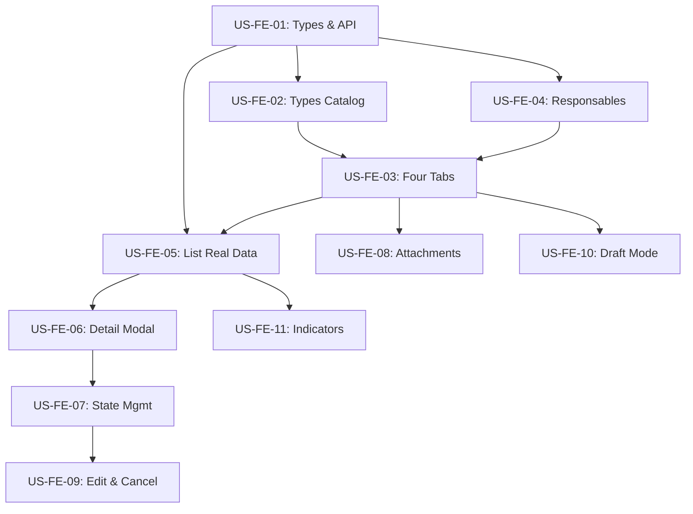

# PLTM-01 Frontend Implementation Workflow

## Executive Summary

Complete frontend implementation for "Gestión de Actividades del Plan de Trabajo" (Work Plan Activity Management). This workflow breaks down the implementation into 11 user stories with clear dependencies, technical specifications, and acceptance criteria.

---

## 📊 Current State Analysis

### Existing Components
| Component | Location | Status | Gaps |
|-----------|----------|--------|------|
| **plan-trabajo-tab.tsx** | `legajo/[id]/medida/[medidaId]/components/medida/mpe-tabs/` | ⚠️ Partial | Mock data, no API integration, missing features |
| **plan-accion-modal.tsx** | `legajo/[id]/medida/[medidaId]/components/medida/` | ⚠️ Partial | 3/4 tabs, no API, placeholders |
| **RegistrarActividadModal.tsx** | `demanda/ui/` | ✅ Complete | Different context (Demanda vs Plan Trabajo) |
| **actividades.tsx** | `components/evaluacion/tabs/` | ✅ Complete | Display only, different context |

### Backend API Available
✅ **All endpoints documented** in `stories/RUNNA API (8).yaml`:
- `/api/actividades/` - GET (list with filters), POST (create)
- `/api/actividades/{id}/` - GET, PUT, PATCH, DELETE
- `/api/actividades/{id}/adjuntos/` - POST
- `/api/actividades/marcar-vencidas/` - POST
- `/api/actividad-tipo/` - GET (activity types catalog)
- `/api/actividad-tipo/{id}/` - GET

### Critical Missing Features
1. ❌ Four actor tabs (only 3 exist, missing Legal)
2. ❌ Real API integration (currently mock data)
3. ❌ TTipoActividad catalog integration
4. ❌ Activity state management (5 states)
5. ❌ Responsible users selection
6. ❌ Multiple attachments with types
7. ❌ Activity detail/edit/cancel workflows
8. ❌ Draft mode
9. ❌ Filters and advanced search
10. ❌ Indicators (origen, dias_restantes, esta_vencida)

---

## 🎯 User Stories Breakdown

### **Phase 1: Foundation (Week 1)**

#### **US-FE-01: Type System & API Integration Layer**
**Priority**: P0 (Blocker for all other stories)
**Effort**: 4 hours
**Dependencies**: None

**Description**:
Create TypeScript type definitions and API service layer for all PLTM-01 entities to establish type-safe communication with backend.

**Technical Specifications**:
```typescript
// File: src/app/(runna)/legajo/[id]/medida/[medidaId]/types/actividades.ts

// Activity Types Catalog
export interface TTipoActividad {
  id: number
  actor: 'EQUIPO_TECNICO' | 'EQUIPOS_RESIDENCIALES' | 'ADULTOS_INSTITUCION' | 'EQUIPO_LEGAL'
  actor_display: string
  nombre: string
  descripcion?: string
  requiere_evidencia: boolean
  activo: boolean
  orden: number
  fecha_creacion: string
}

// Attachment
export interface TAdjuntoActividad {
  id: number
  tipo_adjunto: 'ACTA_COMPROMISO' | 'EVIDENCIA' | 'INFORME' | 'FOTO' | 'OTRO'
  tipo_adjunto_display: string
  archivo: string
  archivo_url: string
  descripcion?: string
  fecha_carga: string
  usuario_carga: number
  usuario_carga_info: {
    id: number
    username: string
    full_name: string
  }
}

// Activity
export interface TActividadPlanTrabajo {
  id: number
  plan_trabajo: number

  // Type & Classification
  tipo_actividad: number
  tipo_actividad_info: TTipoActividad
  subactividad: string
  actor: string
  actor_display: string

  // Temporal Planning
  fecha_planificacion: string
  fecha_inicio_real?: string
  fecha_finalizacion_real?: string

  // State
  estado: 'PENDIENTE' | 'EN_PROGRESO' | 'REALIZADA' | 'CANCELADA' | 'VENCIDA'
  estado_display: string

  // Description
  descripcion?: string

  // Responsible Users
  responsable_principal: number
  responsable_principal_info: {
    id: number
    username: string
    full_name: string
  }
  responsables_secundarios: number[]
  responsables_secundarios_info: Array<{
    id: number
    username: string
    full_name: string
  }>

  // External Referents
  referentes_externos?: string

  // Origin
  origen: 'MANUAL' | 'DEMANDA_PI' | 'DEMANDA_OFICIO' | 'OFICIO'
  origen_display: string
  origen_demanda?: number
  origen_oficio?: number

  // Draft
  es_borrador: boolean

  // Audit
  usuario_creacion: number
  usuario_creacion_info: {
    id: number
    username: string
    full_name: string
  }
  fecha_creacion: string
  usuario_modificacion?: number
  fecha_modificacion: string

  // Cancellation
  motivo_cancelacion?: string
  fecha_cancelacion?: string
  usuario_cancelacion?: number

  // Computed
  esta_vencida: boolean
  dias_restantes: number

  // Attachments
  adjuntos: TAdjuntoActividad[]
}

// API Request/Response types
export interface CreateActividadRequest {
  plan_trabajo: number
  tipo_actividad: number
  subactividad: string
  fecha_planificacion: string
  descripcion?: string
  responsable_principal: number
  responsables_secundarios?: number[]
  referentes_externos?: string
  origen?: 'MANUAL' | 'DEMANDA_PI' | 'DEMANDA_OFICIO' | 'OFICIO'
  origen_demanda?: number
  origen_oficio?: number
  es_borrador?: boolean
  adjuntos_archivos?: File[]
  adjuntos_tipos?: string[]
  adjuntos_descripciones?: string[]
}

export interface UpdateActividadRequest {
  tipo_actividad?: number
  subactividad?: string
  fecha_planificacion?: string
  descripcion?: string
  responsable_principal?: number
  responsables_secundarios?: number[]
  referentes_externos?: string
  estado?: 'PENDIENTE' | 'EN_PROGRESO' | 'REALIZADA' | 'CANCELADA' | 'VENCIDA'
  es_borrador?: boolean
  motivo_cancelacion?: string
}

export interface ActividadFilters {
  estado?: string
  actor?: string
  responsable_principal?: number
  fecha_desde?: string
  fecha_hasta?: string
  origen?: string
  es_borrador?: boolean
  ordering?: string
  search?: string
}

export interface ActividadListResponse {
  count: number
  next?: string
  previous?: string
  results: TActividadPlanTrabajo[]
}
```

```typescript
// File: src/app/(runna)/legajo/[id]/medida/[medidaId]/services/actividadService.ts

import { get, post, patch, delete as del } from '@/app/api/apiService'
import type {
  TActividadPlanTrabajo,
  TTipoActividad,
  TAdjuntoActividad,
  CreateActividadRequest,
  UpdateActividadRequest,
  ActividadFilters,
  ActividadListResponse
} from '../types/actividades'

export const actividadService = {
  // List activities with filters
  async list(planTrabajoId: number, filters?: ActividadFilters): Promise<ActividadListResponse> {
    const params = new URLSearchParams({
      plan_trabajo: planTrabajoId.toString(),
      ...Object.entries(filters || {}).reduce((acc, [key, value]) => {
        if (value !== undefined && value !== null) {
          acc[key] = String(value)
        }
        return acc
      }, {} as Record<string, string>)
    })

    return get<ActividadListResponse>(`actividades/?${params.toString()}`)
  },

  // Get single activity
  async get(id: number): Promise<TActividadPlanTrabajo> {
    return get<TActividadPlanTrabajo>(`actividades/${id}/`)
  },

  // Create activity
  async create(data: CreateActividadRequest): Promise<TActividadPlanTrabajo> {
    const formData = new FormData()

    // Append scalar fields
    Object.entries(data).forEach(([key, value]) => {
      if (key === 'adjuntos_archivos' || key === 'adjuntos_tipos' || key === 'adjuntos_descripciones') {
        return // Handle separately
      }
      if (key === 'responsables_secundarios' && Array.isArray(value)) {
        value.forEach(id => formData.append('responsables_secundarios', id.toString()))
      } else if (value !== undefined && value !== null) {
        formData.append(key, String(value))
      }
    })

    // Handle file attachments
    if (data.adjuntos_archivos) {
      data.adjuntos_archivos.forEach((file, index) => {
        formData.append('adjuntos_archivos', file)
        if (data.adjuntos_tipos?.[index]) {
          formData.append('adjuntos_tipos', data.adjuntos_tipos[index])
        }
        if (data.adjuntos_descripciones?.[index]) {
          formData.append('adjuntos_descripciones', data.adjuntos_descripciones[index])
        }
      })
    }

    return post<TActividadPlanTrabajo>('actividades/', formData)
  },

  // Update activity
  async update(id: number, data: UpdateActividadRequest): Promise<TActividadPlanTrabajo> {
    return patch<TActividadPlanTrabajo>(`actividades/${id}/`, data)
  },

  // Cancel activity (soft delete)
  async cancel(id: number, motivo: string): Promise<void> {
    return del(`actividades/${id}/`, { motivo_cancelacion: motivo })
  },

  // Add attachment to existing activity
  async addAttachment(actividadId: number, data: {
    tipo_adjunto: string
    archivo: File
    descripcion?: string
  }): Promise<TAdjuntoActividad> {
    const formData = new FormData()
    formData.append('tipo_adjunto', data.tipo_adjunto)
    formData.append('archivo', data.archivo)
    if (data.descripcion) {
      formData.append('descripcion', data.descripcion)
    }

    return post<TAdjuntoActividad>(`actividades/${actividadId}/adjuntos/`, formData)
  },

  // Get activity types catalog
  async getTipos(actor?: string): Promise<TTipoActividad[]> {
    const params = actor ? `?actor=${actor}&activo=true` : '?activo=true'
    return get<TTipoActividad[]>(`actividad-tipo/${params}`)
  },

  // Get single activity type
  async getTipo(id: number): Promise<TTipoActividad> {
    return get<TTipoActividad>(`actividad-tipo/${id}/`)
  },

  // Auto-mark overdue activities (admin only)
  async marcarVencidas(): Promise<{ count: number }> {
    return post<{ count: number }>('actividades/marcar-vencidas/', {})
  }
}
```

**Acceptance Criteria**:
- [x] All TypeScript types defined with correct field types
- [x] API service layer with all CRUD operations
- [x] File upload handling for attachments
- [x] Query parameter serialization for filters
- [x] Proper type safety throughout
- [x] Error handling in service layer

**Testing**:
```typescript
// Test type definitions compile correctly
const testActividad: TActividadPlanTrabajo = {
  id: 1,
  plan_trabajo: 5,
  tipo_actividad: 1,
  tipo_actividad_info: {
    id: 1,
    actor: 'EQUIPO_TECNICO',
    actor_display: 'Equipo Técnico',
    nombre: 'Visita Domiciliaria',
    requiere_evidencia: true,
    activo: true,
    orden: 1,
    fecha_creacion: '2025-01-01T00:00:00Z'
  },
  // ... rest of required fields
}

// Test API service calls
const actividades = await actividadService.list(5, {
  estado: 'PENDIENTE',
  actor: 'EQUIPO_TECNICO'
})
```

---

#### **US-FE-02: Activity Types Catalog Integration**
**Priority**: P0 (Required for activity creation)
**Effort**: 3 hours
**Dependencies**: US-FE-01

**Description**:
Implement dynamic TTipoActividad dropdown that filters by actor and loads real catalog from backend.

**Technical Specifications**:
```typescript
// File: src/app/(runna)/legajo/[id]/medida/[medidaId]/components/medida/TipoActividadSelect.tsx

import { useEffect, useState } from 'react'
import { FormControl, InputLabel, Select, MenuItem, FormHelperText } from '@mui/material'
import { actividadService } from '../services/actividadService'
import type { TTipoActividad } from '../types/actividades'

interface TipoActividadSelectProps {
  value: number
  onChange: (value: number) => void
  actor?: string
  error?: boolean
  helperText?: string
  disabled?: boolean
}

export const TipoActividadSelect: React.FC<TipoActividadSelectProps> = ({
  value,
  onChange,
  actor,
  error,
  helperText,
  disabled
}) => {
  const [tipos, setTipos] = useState<TTipoActividad[]>([])
  const [loading, setLoading] = useState(false)

  useEffect(() => {
    loadTipos()
  }, [actor])

  const loadTipos = async () => {
    setLoading(true)
    try {
      const data = await actividadService.getTipos(actor)
      setTipos(data)
    } catch (error) {
      console.error('Error loading activity types:', error)
    } finally {
      setLoading(false)
    }
  }

  return (
    <FormControl fullWidth error={error} disabled={disabled}>
      <InputLabel>Tipo de Actividad</InputLabel>
      <Select
        value={value || ''}
        onChange={(e) => onChange(Number(e.target.value))}
        label="Tipo de Actividad"
      >
        {loading ? (
          <MenuItem disabled>Cargando...</MenuItem>
        ) : tipos.length === 0 ? (
          <MenuItem disabled>No hay tipos disponibles</MenuItem>
        ) : (
          tipos.map((tipo) => (
            <MenuItem key={tipo.id} value={tipo.id}>
              {tipo.nombre}
              {tipo.requiere_evidencia && ' 📎'}
            </MenuItem>
          ))
        )}
      </Select>
      {helperText && <FormHelperText>{helperText}</FormHelperText>}
    </FormControl>
  )
}
```

**Acceptance Criteria**:
- [x] Loads real activity types from `/api/actividad-tipo/`
- [x] Filters by actor when actor prop provided
- [x] Shows "📎" indicator for types requiring evidence
- [x] Handles loading and error states
- [x] Integrates with React Hook Form

---

#### **US-FE-03: Four Actor Tabs Implementation**
**Priority**: P0 (Core requirement)
**Effort**: 6 hours
**Dependencies**: US-FE-01, US-FE-02

**Description**:
Complete the four actor tabs (Equipo Técnico, Equipos Residenciales, Adultos/Institución, Equipo Legal) with actor-specific forms and validations.

**Technical Specifications**:
```typescript
// File: src/app/(runna)/legajo/[id]/medida/[medidaId]/components/medida/plan-accion-modal.tsx
// MAJOR REFACTOR

"use client"

import React, { useState, useEffect } from 'react'
import {
  Dialog,
  DialogTitle,
  DialogContent,
  DialogActions,
  Tabs,
  Tab,
  Box,
  Button,
  IconButton,
  Typography
} from '@mui/material'
import CloseIcon from '@mui/icons-material/Close'
import { ActorTabContent } from './ActorTabContent'
import type { CreateActividadRequest } from '../../types/actividades'

interface PlanAccionModalProps {
  open: boolean
  onClose: () => void
  planTrabajoId: number
  onSuccess?: () => void
}

export const PlanAccionModal: React.FC<PlanAccionModalProps> = ({
  open,
  onClose,
  planTrabajoId,
  onSuccess
}) => {
  const [activeTab, setActiveTab] = useState(0)
  const [formData, setFormData] = useState<Partial<CreateActividadRequest>>({})

  const actors = [
    { value: 'EQUIPO_TECNICO', label: 'Equipo técnico' },
    { value: 'EQUIPOS_RESIDENCIALES', label: 'Equipos residenciales' },
    { value: 'ADULTOS_INSTITUCION', label: 'Adultos responsables/Institución' },
    { value: 'EQUIPO_LEGAL', label: 'Equipo de Legales' }
  ]

  const handleTabChange = (event: React.SyntheticEvent, newValue: number) => {
    setActiveTab(newValue)
    setFormData({}) // Reset form when switching tabs
  }

  const handleFormChange = (updates: Partial<CreateActividadRequest>) => {
    setFormData(prev => ({ ...prev, ...updates }))
  }

  const handleSave = async () => {
    // Validation and submission handled in ActorTabContent
  }

  return (
    <Dialog
      open={open}
      onClose={onClose}
      maxWidth="md"
      fullWidth
      PaperProps={{
        sx: {
          borderRadius: 3,
          maxHeight: '95vh'
        }
      }}
    >
      <DialogTitle sx={{
        textAlign: 'center',
        fontWeight: 600,
        fontSize: '1.5rem',
        position: 'relative',
        pb: 1,
        borderBottom: '1px solid #e0e0e0'
      }}>
        Plan de Acción MPE
        <IconButton
          onClick={onClose}
          sx={{
            position: 'absolute',
            right: 8,
            top: 8,
            color: 'grey.500',
          }}
        >
          <CloseIcon />
        </IconButton>
      </DialogTitle>

      <DialogContent sx={{ px: 4, py: 3, overflow: 'auto' }}>
        <Tabs
          value={activeTab}
          onChange={handleTabChange}
          sx={{
            mb: 3,
            '& .MuiTab-root': {
              textTransform: 'none',
              fontSize: '0.875rem'
            }
          }}
        >
          {actors.map((actor, index) => (
            <Tab key={actor.value} label={actor.label} />
          ))}
        </Tabs>

        <ActorTabContent
          actor={actors[activeTab].value}
          planTrabajoId={planTrabajoId}
          formData={formData}
          onChange={handleFormChange}
          onClose={onClose}
          onSuccess={onSuccess}
        />
      </DialogContent>
    </Dialog>
  )
}
```

```typescript
// File: src/app/(runna)/legajo/[id]/medida/[medidaId]/components/medida/ActorTabContent.tsx

import React, { useState } from 'react'
import { useForm, Controller } from 'react-hook-form'
import { zodResolver } from '@hookform/resolvers/zod'
import * as z from 'zod'
import {
  Box,
  TextField,
  Button,
  Typography,
  Alert
} from '@mui/material'
import { DatePicker } from '@mui/x-date-pickers/DatePicker'
import { LocalizationProvider } from '@mui/x-date-pickers/LocalizationProvider'
import { AdapterDateFns } from '@mui/x-date-pickers/AdapterDateFnsV3'
import { es } from 'date-fns/locale'
import { TipoActividadSelect } from './TipoActividadSelect'
import { ResponsableSelect } from './ResponsableSelect'
import { AttachmentUpload } from './AttachmentUpload'
import { actividadService } from '../../services/actividadService'
import type { CreateActividadRequest } from '../../types/actividades'

const actividadSchema = z.object({
  tipo_actividad: z.number().min(1, 'El tipo de actividad es requerido'),
  subactividad: z.string().min(1, 'La subactividad es requerida'),
  fecha_planificacion: z.date().min(new Date(1900, 0, 1), 'La fecha es requerida'),
  descripcion: z.string().optional(),
  responsable_principal: z.number().min(1, 'El responsable principal es requerido'),
  responsables_secundarios: z.array(z.number()).optional(),
  referentes_externos: z.string().optional(),
  es_borrador: z.boolean().optional(),
  adjuntos_archivos: z.array(z.instanceof(File)).optional(),
  adjuntos_tipos: z.array(z.string()).optional(),
  adjuntos_descripciones: z.array(z.string()).optional()
})

type ActividadFormData = z.infer<typeof actividadSchema>

interface ActorTabContentProps {
  actor: string
  planTrabajoId: number
  formData: Partial<CreateActividadRequest>
  onChange: (updates: Partial<CreateActividadRequest>) => void
  onClose: () => void
  onSuccess?: () => void
}

export const ActorTabContent: React.FC<ActorTabContentProps> = ({
  actor,
  planTrabajoId,
  onClose,
  onSuccess
}) => {
  const [loading, setLoading] = useState(false)
  const [error, setError] = useState<string | null>(null)

  const {
    control,
    handleSubmit,
    watch,
    formState: { errors }
  } = useForm<ActividadFormData>({
    resolver: zodResolver(actividadSchema),
    defaultValues: {
      tipo_actividad: 0,
      subactividad: '',
      fecha_planificacion: new Date(),
      descripcion: '',
      responsable_principal: 0,
      responsables_secundarios: [],
      referentes_externos: '',
      es_borrador: false
    }
  })

  const selectedTipo = watch('tipo_actividad')

  const onSubmit = async (data: ActividadFormData) => {
    setLoading(true)
    setError(null)

    try {
      await actividadService.create({
        ...data,
        plan_trabajo: planTrabajoId,
        origen: 'MANUAL',
        fecha_planificacion: data.fecha_planificacion.toISOString().split('T')[0]
      })

      onSuccess?.()
      onClose()
    } catch (err: any) {
      console.error('Error creating activity:', err)
      setError(err.response?.data?.detail || 'Error al crear la actividad')
    } finally {
      setLoading(false)
    }
  }

  return (
    <Box component="form" onSubmit={handleSubmit(onSubmit)} sx={{ display: 'flex', flexDirection: 'column', gap: 3 }}>
      {error && <Alert severity="error">{error}</Alert>}

      <Box>
        <Typography variant="body2" sx={{ fontWeight: 500, mb: 2 }}>
          Tipo de actividad
        </Typography>
        <Controller
          name="tipo_actividad"
          control={control}
          render={({ field }) => (
            <TipoActividadSelect
              value={field.value}
              onChange={field.onChange}
              actor={actor}
              error={!!errors.tipo_actividad}
              helperText={errors.tipo_actividad?.message}
            />
          )}
        />
      </Box>

      <Controller
        name="subactividad"
        control={control}
        render={({ field }) => (
          <TextField
            {...field}
            label="Subactividad (detalle específico)"
            multiline
            rows={2}
            error={!!errors.subactividad}
            helperText={errors.subactividad?.message}
          />
        )}
      />

      <LocalizationProvider dateAdapter={AdapterDateFns} adapterLocale={es}>
        <Controller
          name="fecha_planificacion"
          control={control}
          render={({ field }) => (
            <DatePicker
              label="Fecha de planificación"
              value={field.value}
              onChange={(newValue) => field.onChange(newValue)}
              slotProps={{
                textField: {
                  fullWidth: true,
                  error: !!errors.fecha_planificacion,
                  helperText: errors.fecha_planificacion?.message
                }
              }}
            />
          )}
        />
      </LocalizationProvider>

      <Controller
        name="descripcion"
        control={control}
        render={({ field }) => (
          <TextField
            {...field}
            label="Descripción (opcional)"
            multiline
            rows={4}
            error={!!errors.descripcion}
            helperText={errors.descripcion?.message}
          />
        )}
      />

      <Box>
        <Typography variant="body2" sx={{ fontWeight: 500, mb: 2 }}>
          Responsables
        </Typography>
        <Controller
          name="responsable_principal"
          control={control}
          render={({ field }) => (
            <ResponsableSelect
              label="Responsable Principal"
              value={field.value}
              onChange={field.onChange}
              error={!!errors.responsable_principal}
              helperText={errors.responsable_principal?.message}
            />
          )}
        />

        <Controller
          name="responsables_secundarios"
          control={control}
          render={({ field }) => (
            <ResponsableSelect
              label="Responsables Secundarios (opcional)"
              value={field.value || []}
              onChange={field.onChange}
              multiple
              sx={{ mt: 2 }}
            />
          )}
        />
      </Box>

      <Controller
        name="referentes_externos"
        control={control}
        render={({ field }) => (
          <TextField
            {...field}
            label="Referentes Externos (opcional)"
            multiline
            rows={2}
            helperText="Ej: Institución, persona, teléfono"
          />
        )}
      />

      <Controller
        name="adjuntos_archivos"
        control={control}
        render={({ field }) => (
          <AttachmentUpload
            files={field.value || []}
            onChange={field.onChange}
            requiereEvidencia={selectedTipo ? false : false} // TODO: Get from tipo
          />
        )}
      />

      <Box sx={{ display: 'flex', gap: 2, justifyContent: 'flex-end' }}>
        <Controller
          name="es_borrador"
          control={control}
          render={({ field }) => (
            <Button
              type="submit"
              variant="outlined"
              disabled={loading}
              onClick={() => field.onChange(true)}
            >
              Guardar como Borrador
            </Button>
          )}
        />

        <Button
          type="submit"
          variant="contained"
          disabled={loading}
        >
          {loading ? 'Guardando...' : 'Guardar Actividad'}
        </Button>
      </Box>
    </Box>
  )
}
```

**Acceptance Criteria**:
- [x] Four tabs implemented (Técnico, Residenciales, Adultos, Legal)
- [x] Each tab filters TTipoActividad by actor
- [x] Form validation per actor
- [x] Draft mode saves without full validation
- [x] Success/error feedback
- [x] Form resets on tab switch

---

### **Phase 2: Core Features (Week 2)**

#### **US-FE-04: Responsible Users Selection**
**Priority**: P1
**Effort**: 3 hours
**Dependencies**: US-FE-01

**Technical Specifications**:
```typescript
// File: src/app/(runna)/legajo/[id]/medida/[medidaId]/components/medida/ResponsableSelect.tsx

import { useEffect, useState } from 'react'
import {
  FormControl,
  InputLabel,
  Select,
  MenuItem,
  Chip,
  Box,
  FormHelperText,
  OutlinedInput
} from '@mui/material'
import { get } from '@/app/api/apiService'

interface User {
  id: number
  username: string
  first_name: string
  last_name: string
  full_name: string
}

interface ResponsableSelectProps {
  value: number | number[]
  onChange: (value: number | number[]) => void
  label: string
  multiple?: boolean
  error?: boolean
  helperText?: string
  disabled?: boolean
  sx?: any
}

export const ResponsableSelect: React.FC<ResponsableSelectProps> = ({
  value,
  onChange,
  label,
  multiple = false,
  error,
  helperText,
  disabled,
  sx
}) => {
  const [users, setUsers] = useState<User[]>([])
  const [loading, setLoading] = useState(false)

  useEffect(() => {
    loadUsers()
  }, [])

  const loadUsers = async () => {
    setLoading(true)
    try {
      const data = await get<User[]>('users/?is_active=true')
      setUsers(data)
    } catch (error) {
      console.error('Error loading users:', error)
    } finally {
      setLoading(false)
    }
  }

  return (
    <FormControl fullWidth error={error} disabled={disabled} sx={sx}>
      <InputLabel>{label}</InputLabel>
      <Select
        value={value}
        onChange={(e) => onChange(e.target.value as any)}
        label={label}
        multiple={multiple}
        input={<OutlinedInput label={label} />}
        renderValue={(selected) => {
          if (multiple && Array.isArray(selected)) {
            return (
              <Box sx={{ display: 'flex', flexWrap: 'wrap', gap: 0.5 }}>
                {selected.map((id) => {
                  const user = users.find(u => u.id === id)
                  return user ? (
                    <Chip
                      key={id}
                      label={user.full_name}
                      size="small"
                    />
                  ) : null
                })}
              </Box>
            )
          } else {
            const user = users.find(u => u.id === selected)
            return user ? user.full_name : ''
          }
        }}
      >
        {loading ? (
          <MenuItem disabled>Cargando usuarios...</MenuItem>
        ) : users.length === 0 ? (
          <MenuItem disabled>No hay usuarios disponibles</MenuItem>
        ) : (
          users.map((user) => (
            <MenuItem key={user.id} value={user.id}>
              {user.full_name} ({user.username})
            </MenuItem>
          ))
        )}
      </Select>
      {helperText && <FormHelperText>{helperText}</FormHelperText>}
    </FormControl>
  )
}
```

**Acceptance Criteria**:
- [x] Loads active users from API
- [x] Single-select for principal
- [x] Multi-select with chips for secundarios
- [x] Displays full_name with username
- [x] Error handling and loading states

---

#### **US-FE-05: Activity List with Real Data**
**Priority**: P1
**Effort**: 4 hours
**Dependencies**: US-FE-01, US-FE-03

**Technical Specifications**:
```typescript
// File: src/app/(runna)/legajo/[id]/medida/[medidaId]/components/medida/mpe-tabs/plan-trabajo-tab.tsx
// COMPLETE REFACTOR

"use client"

import React, { useState, useEffect } from 'react'
import {
  Box,
  Typography,
  Paper,
  Table,
  TableBody,
  TableCell,
  TableContainer,
  TableHead,
  TableRow,
  Button,
  Chip,
  IconButton,
  TablePagination,
  TextField,
  Select,
  MenuItem,
  FormControl,
  InputLabel,
  Grid
} from '@mui/material'
import VisibilityIcon from '@mui/icons-material/Visibility'
import EditIcon from '@mui/icons-material/Edit'
import CancelIcon from '@mui/icons-material/Cancel'
import { PlanAccionModal } from '../plan-accion-modal'
import { ActividadDetailModal } from '../ActividadDetailModal'
import { actividadService } from '../../services/actividadService'
import type { TActividadPlanTrabajo, ActividadFilters } from '../../types/actividades'

interface PlanTrabajoTabProps {
  medidaData: any
  planTrabajoId: number
}

export const PlanTrabajoTab: React.FC<PlanTrabajoTabProps> = ({ medidaData, planTrabajoId }) => {
  const [actividades, setActividades] = useState<TActividadPlanTrabajo[]>([])
  const [loading, setLoading] = useState(false)
  const [page, setPage] = useState(0)
  const [rowsPerPage, setRowsPerPage] = useState(10)
  const [totalCount, setTotalCount] = useState(0)

  // Modals
  const [planAccionModalOpen, setPlanAccionModalOpen] = useState(false)
  const [detailModalOpen, setDetailModalOpen] = useState(false)
  const [selectedActividad, setSelectedActividad] = useState<TActividadPlanTrabajo | null>(null)

  // Filters
  const [filters, setFilters] = useState<ActividadFilters>({
    estado: '',
    actor: '',
    search: ''
  })

  useEffect(() => {
    loadActividades()
  }, [page, rowsPerPage, filters])

  const loadActividades = async () => {
    setLoading(true)
    try {
      const response = await actividadService.list(planTrabajoId, {
        ...filters,
        ordering: '-fecha_creacion'
      })
      setActividades(response.results)
      setTotalCount(response.count)
    } catch (error) {
      console.error('Error loading activities:', error)
    } finally {
      setLoading(false)
    }
  }

  const handleChangePage = (event: unknown, newPage: number) => {
    setPage(newPage)
  }

  const handleChangeRowsPerPage = (event: React.ChangeEvent<HTMLInputElement>) => {
    setRowsPerPage(parseInt(event.target.value, 10))
    setPage(0)
  }

  const getEstadoColor = (estado: string) => {
    const colors: Record<string, any> = {
      'PENDIENTE': { backgroundColor: '#ff9800', color: 'white' },
      'EN_PROGRESO': { backgroundColor: '#2196f3', color: 'white' },
      'REALIZADA': { backgroundColor: '#4caf50', color: 'white' },
      'CANCELADA': { backgroundColor: '#f44336', color: 'white' },
      'VENCIDA': { backgroundColor: '#9e9e9e', color: 'white' }
    }
    return colors[estado] || { backgroundColor: '#9e9e9e', color: 'white' }
  }

  const handleViewDetail = (actividad: TActividadPlanTrabajo) => {
    setSelectedActividad(actividad)
    setDetailModalOpen(true)
  }

  return (
    <>
      <Box sx={{ p: 3 }}>
        <Paper elevation={2} sx={{ borderRadius: 2 }}>
          {/* Header with Filters */}
          <Box sx={{ p: 3, pb: 2 }}>
            <Box sx={{ display: 'flex', justifyContent: 'space-between', alignItems: 'center', mb: 2 }}>
              <Typography variant="h6" sx={{ fontWeight: 600 }}>
                Plan de trabajo
              </Typography>
              <Button
                variant="contained"
                color="primary"
                onClick={() => setPlanAccionModalOpen(true)}
                sx={{ textTransform: 'none', borderRadius: 2 }}
              >
                Agregar actividad
              </Button>
            </Box>

            {/* Filters */}
            <Grid container spacing={2}>
              <Grid item xs={12} sm={4}>
                <TextField
                  fullWidth
                  size="small"
                  label="Buscar"
                  value={filters.search || ''}
                  onChange={(e) => setFilters({ ...filters, search: e.target.value })}
                />
              </Grid>
              <Grid item xs={12} sm={4}>
                <FormControl fullWidth size="small">
                  <InputLabel>Estado</InputLabel>
                  <Select
                    value={filters.estado || ''}
                    onChange={(e) => setFilters({ ...filters, estado: e.target.value })}
                    label="Estado"
                  >
                    <MenuItem value="">Todos</MenuItem>
                    <MenuItem value="PENDIENTE">Pendiente</MenuItem>
                    <MenuItem value="EN_PROGRESO">En Progreso</MenuItem>
                    <MenuItem value="REALIZADA">Realizada</MenuItem>
                    <MenuItem value="CANCELADA">Cancelada</MenuItem>
                    <MenuItem value="VENCIDA">Vencida</MenuItem>
                  </Select>
                </FormControl>
              </Grid>
              <Grid item xs={12} sm={4}>
                <FormControl fullWidth size="small">
                  <InputLabel>Actor</InputLabel>
                  <Select
                    value={filters.actor || ''}
                    onChange={(e) => setFilters({ ...filters, actor: e.target.value })}
                    label="Actor"
                  >
                    <MenuItem value="">Todos</MenuItem>
                    <MenuItem value="EQUIPO_TECNICO">Equipo Técnico</MenuItem>
                    <MenuItem value="EQUIPOS_RESIDENCIALES">Equipos Residenciales</MenuItem>
                    <MenuItem value="ADULTOS_INSTITUCION">Adultos/Institución</MenuItem>
                    <MenuItem value="EQUIPO_LEGAL">Equipo Legal</MenuItem>
                  </Select>
                </FormControl>
              </Grid>
            </Grid>
          </Box>

          {/* Table */}
          <TableContainer>
            <Table>
              <TableHead>
                <TableRow sx={{ backgroundColor: 'primary.main' }}>
                  <TableCell sx={{ fontWeight: 600, color: 'white', fontSize: '0.875rem' }}>
                    Tipo / Subactividad
                  </TableCell>
                  <TableCell sx={{ fontWeight: 600, color: 'white', fontSize: '0.875rem' }}>
                    Actor
                  </TableCell>
                  <TableCell sx={{ fontWeight: 600, color: 'white', fontSize: '0.875rem' }}>
                    Responsable
                  </TableCell>
                  <TableCell sx={{ fontWeight: 600, color: 'white', fontSize: '0.875rem' }}>
                    Fecha Plan.
                  </TableCell>
                  <TableCell sx={{ fontWeight: 600, color: 'white', fontSize: '0.875rem' }}>
                    Estado
                  </TableCell>
                  <TableCell sx={{ fontWeight: 600, color: 'white', fontSize: '0.875rem' }}>
                    Días Restantes
                  </TableCell>
                  <TableCell sx={{ fontWeight: 600, color: 'white', fontSize: '0.875rem', textAlign: 'center' }}>
                    Acciones
                  </TableCell>
                </TableRow>
              </TableHead>
              <TableBody>
                {loading ? (
                  <TableRow>
                    <TableCell colSpan={7} align="center">Cargando...</TableCell>
                  </TableRow>
                ) : actividades.length === 0 ? (
                  <TableRow>
                    <TableCell colSpan={7} align="center">No hay actividades</TableCell>
                  </TableRow>
                ) : (
                  actividades.map((actividad) => (
                    <TableRow key={actividad.id} hover>
                      <TableCell>
                        <Typography variant="body2" fontWeight={500}>
                          {actividad.tipo_actividad_info.nombre}
                        </Typography>
                        <Typography variant="caption" color="text.secondary">
                          {actividad.subactividad}
                        </Typography>
                      </TableCell>
                      <TableCell>{actividad.actor_display}</TableCell>
                      <TableCell>{actividad.responsable_principal_info.full_name}</TableCell>
                      <TableCell>
                        {new Date(actividad.fecha_planificacion).toLocaleDateString('es-ES')}
                      </TableCell>
                      <TableCell>
                        <Chip
                          label={actividad.estado_display}
                          sx={{
                            ...getEstadoColor(actividad.estado),
                            fontWeight: 500,
                            fontSize: '0.75rem'
                          }}
                          size="small"
                        />
                      </TableCell>
                      <TableCell>
                        <Chip
                          label={`${actividad.dias_restantes} días`}
                          color={actividad.esta_vencida ? 'error' : 'default'}
                          size="small"
                        />
                      </TableCell>
                      <TableCell sx={{ textAlign: 'center' }}>
                        <Box sx={{ display: 'flex', gap: 1, justifyContent: 'center' }}>
                          <IconButton
                            size="small"
                            onClick={() => handleViewDetail(actividad)}
                            sx={{
                              backgroundColor: 'rgba(156, 39, 176, 0.1)',
                              color: 'primary.main',
                              '&:hover': { backgroundColor: 'rgba(156, 39, 176, 0.2)' }
                            }}
                          >
                            <VisibilityIcon fontSize="small" />
                          </IconButton>
                          <IconButton
                            size="small"
                            disabled={actividad.estado === 'REALIZADA' || actividad.estado === 'CANCELADA'}
                            sx={{
                              backgroundColor: 'rgba(156, 39, 176, 0.1)',
                              color: 'primary.main',
                              '&:hover': { backgroundColor: 'rgba(156, 39, 176, 0.2)' }
                            }}
                          >
                            <EditIcon fontSize="small" />
                          </IconButton>
                          <IconButton
                            size="small"
                            disabled={actividad.estado === 'REALIZADA' || actividad.estado === 'CANCELADA'}
                            color="error"
                          >
                            <CancelIcon fontSize="small" />
                          </IconButton>
                        </Box>
                      </TableCell>
                    </TableRow>
                  ))
                )}
              </TableBody>
            </Table>
          </TableContainer>

          {/* Pagination */}
          <TablePagination
            rowsPerPageOptions={[5, 10, 25, 50]}
            component="div"
            count={totalCount}
            rowsPerPage={rowsPerPage}
            page={page}
            onPageChange={handleChangePage}
            onRowsPerPageChange={handleChangeRowsPerPage}
            labelRowsPerPage="Filas por página:"
          />
        </Paper>
      </Box>

      {/* Modals */}
      <PlanAccionModal
        open={planAccionModalOpen}
        onClose={() => setPlanAccionModalOpen(false)}
        planTrabajoId={planTrabajoId}
        onSuccess={loadActividades}
      />

      {selectedActividad && (
        <ActividadDetailModal
          open={detailModalOpen}
          onClose={() => {
            setDetailModalOpen(false)
            setSelectedActividad(null)
          }}
          actividad={selectedActividad}
          onUpdate={loadActividades}
        />
      )}
    </>
  )
}
```

**Acceptance Criteria**:
- [x] Real API data from `/api/actividades/`
- [x] Three filters: search, estado, actor
- [x] Pagination with backend support
- [x] Estado color coding (5 states)
- [x] Dias_restantes indicator with color
- [x] Responsive design
- [x] Loading states

---

#### **US-FE-06: Activity Detail Modal**
**Priority**: P1
**Effort**: 4 hours
**Dependencies**: US-FE-01, US-FE-05

**Technical Specifications**:
```typescript
// File: src/app/(runna)/legajo/[id]/medida/[medidaId]/components/medida/ActividadDetailModal.tsx

import React, { useState } from 'react'
import {
  Dialog,
  DialogTitle,
  DialogContent,
  DialogActions,
  Box,
  Typography,
  Button,
  IconButton,
  Chip,
  Divider,
  Grid,
  List,
  ListItem,
  ListItemIcon,
  ListItemText,
  Link
} from '@mui/material'
import CloseIcon from '@mui/icons-material/Close'
import AttachFileIcon from '@mui/icons-material/AttachFile'
import PersonIcon from '@mui/icons-material/Person'
import GroupIcon from '@mui/icons-material/Group'
import EventIcon from '@mui/icons-material/Event'
import DescriptionIcon from '@mui/icons-material/Description'
import type { TActividadPlanTrabajo } from '../../types/actividades'

interface ActividadDetailModalProps {
  open: boolean
  onClose: () => void
  actividad: TActividadPlanTrabajo
  onUpdate?: () => void
}

export const ActividadDetailModal: React.FC<ActividadDetailModalProps> = ({
  open,
  onClose,
  actividad,
  onUpdate
}) => {
  const getEstadoColor = (estado: string) => {
    const colors: Record<string, any> = {
      'PENDIENTE': { backgroundColor: '#ff9800', color: 'white' },
      'EN_PROGRESO': { backgroundColor: '#2196f3', color: 'white' },
      'REALIZADA': { backgroundColor: '#4caf50', color: 'white' },
      'CANCELADA': { backgroundColor: '#f44336', color: 'white' },
      'VENCIDA': { backgroundColor: '#9e9e9e', color: 'white' }
    }
    return colors[estado] || { backgroundColor: '#9e9e9e', color: 'white' }
  }

  return (
    <Dialog
      open={open}
      onClose={onClose}
      maxWidth="md"
      fullWidth
      PaperProps={{ sx: { borderRadius: 3 } }}
    >
      <DialogTitle sx={{
        textAlign: 'center',
        fontWeight: 600,
        fontSize: '1.5rem',
        position: 'relative',
        pb: 1,
        borderBottom: '1px solid #e0e0e0'
      }}>
        Detalle de Actividad
        <IconButton
          onClick={onClose}
          sx={{ position: 'absolute', right: 8, top: 8, color: 'grey.500' }}
        >
          <CloseIcon />
        </IconButton>
      </DialogTitle>

      <DialogContent sx={{ px: 4, py: 3 }}>
        <Box sx={{ display: 'flex', flexDirection: 'column', gap: 3 }}>
          {/* Header with Estado and Dias Restantes */}
          <Box sx={{ display: 'flex', gap: 2, alignItems: 'center' }}>
            <Chip
              label={actividad.estado_display}
              sx={{
                ...getEstadoColor(actividad.estado),
                fontWeight: 500,
                fontSize: '0.875rem'
              }}
            />
            <Chip
              label={`${actividad.dias_restantes} días restantes`}
              color={actividad.esta_vencida ? 'error' : 'default'}
            />
            {actividad.es_borrador && (
              <Chip
                label="BORRADOR"
                variant="outlined"
                color="warning"
              />
            )}
            {actividad.origen !== 'MANUAL' && (
              <Chip
                label={`Origen: ${actividad.origen_display}`}
                variant="outlined"
                color="info"
              />
            )}
          </Box>

          <Divider />

          {/* Tipo y Subactividad */}
          <Box>
            <Typography variant="h6" gutterBottom>
              {actividad.tipo_actividad_info.nombre}
            </Typography>
            <Typography variant="body2" color="text.secondary">
              {actividad.subactividad}
            </Typography>
            <Typography variant="caption" color="primary">
              {actividad.actor_display}
            </Typography>
          </Box>

          {/* Descripción */}
          {actividad.descripcion && (
            <Box>
              <Typography variant="subtitle2" gutterBottom>
                <DescriptionIcon fontSize="small" sx={{ verticalAlign: 'middle', mr: 1 }} />
                Descripción
              </Typography>
              <Typography variant="body2">{actividad.descripcion}</Typography>
            </Box>
          )}

          {/* Fechas */}
          <Grid container spacing={2}>
            <Grid item xs={12} sm={6}>
              <Box>
                <Typography variant="subtitle2" gutterBottom>
                  <EventIcon fontSize="small" sx={{ verticalAlign: 'middle', mr: 1 }} />
                  Fecha Planificación
                </Typography>
                <Typography variant="body2">
                  {new Date(actividad.fecha_planificacion).toLocaleDateString('es-ES', {
                    dateStyle: 'medium'
                  })}
                </Typography>
              </Box>
            </Grid>
            {actividad.fecha_inicio_real && (
              <Grid item xs={12} sm={6}>
                <Box>
                  <Typography variant="subtitle2" gutterBottom>Fecha Inicio Real</Typography>
                  <Typography variant="body2">
                    {new Date(actividad.fecha_inicio_real).toLocaleDateString('es-ES', {
                      dateStyle: 'medium'
                    })}
                  </Typography>
                </Box>
              </Grid>
            )}
            {actividad.fecha_finalizacion_real && (
              <Grid item xs={12} sm={6}>
                <Box>
                  <Typography variant="subtitle2" gutterBottom>Fecha Finalización Real</Typography>
                  <Typography variant="body2">
                    {new Date(actividad.fecha_finalizacion_real).toLocaleDateString('es-ES', {
                      dateStyle: 'medium'
                    })}
                  </Typography>
                </Box>
              </Grid>
            )}
          </Grid>

          {/* Responsables */}
          <Box>
            <Typography variant="subtitle2" gutterBottom>
              <PersonIcon fontSize="small" sx={{ verticalAlign: 'middle', mr: 1 }} />
              Responsable Principal
            </Typography>
            <Typography variant="body2">{actividad.responsable_principal_info.full_name}</Typography>

            {actividad.responsables_secundarios_info && actividad.responsables_secundarios_info.length > 0 && (
              <>
                <Typography variant="subtitle2" gutterBottom sx={{ mt: 2 }}>
                  <GroupIcon fontSize="small" sx={{ verticalAlign: 'middle', mr: 1 }} />
                  Responsables Secundarios
                </Typography>
                <Box sx={{ display: 'flex', flexWrap: 'wrap', gap: 1 }}>
                  {actividad.responsables_secundarios_info.map(resp => (
                    <Chip
                      key={resp.id}
                      label={resp.full_name}
                      size="small"
                      variant="outlined"
                    />
                  ))}
                </Box>
              </>
            )}
          </Box>

          {/* Referentes Externos */}
          {actividad.referentes_externos && (
            <Box>
              <Typography variant="subtitle2" gutterBottom>Referentes Externos</Typography>
              <Typography variant="body2">{actividad.referentes_externos}</Typography>
            </Box>
          )}

          {/* Adjuntos */}
          {actividad.adjuntos && actividad.adjuntos.length > 0 && (
            <Box>
              <Typography variant="subtitle2" gutterBottom>
                <AttachFileIcon fontSize="small" sx={{ verticalAlign: 'middle', mr: 1 }} />
                Adjuntos ({actividad.adjuntos.length})
              </Typography>
              <List dense>
                {actividad.adjuntos.map((adjunto, index) => (
                  <ListItem key={adjunto.id}>
                    <ListItemIcon>
                      <AttachFileIcon />
                    </ListItemIcon>
                    <ListItemText
                      primary={
                        <Link href={adjunto.archivo_url} target="_blank" rel="noopener">
                          {adjunto.archivo.split('/').pop()}
                        </Link>
                      }
                      secondary={`${adjunto.tipo_adjunto_display} - ${new Date(adjunto.fecha_carga).toLocaleDateString('es-ES')}`}
                    />
                  </ListItem>
                ))}
              </List>
            </Box>
          )}

          {/* Cancelación */}
          {actividad.estado === 'CANCELADA' && actividad.motivo_cancelacion && (
            <Box sx={{ bgcolor: 'error.light', p: 2, borderRadius: 1 }}>
              <Typography variant="subtitle2" gutterBottom>Motivo de Cancelación</Typography>
              <Typography variant="body2">{actividad.motivo_cancelacion}</Typography>
              <Typography variant="caption" color="text.secondary">
                Cancelada el {new Date(actividad.fecha_cancelacion!).toLocaleDateString('es-ES')}
              </Typography>
            </Box>
          )}

          {/* Auditoría */}
          <Box sx={{ bgcolor: 'grey.100', p: 2, borderRadius: 1 }}>
            <Typography variant="caption" color="text.secondary">
              Creada por {actividad.usuario_creacion_info.full_name} el{' '}
              {new Date(actividad.fecha_creacion).toLocaleDateString('es-ES', {
                dateStyle: 'medium',
                timeStyle: 'short'
              })}
            </Typography>
            {actividad.fecha_modificacion !== actividad.fecha_creacion && (
              <Typography variant="caption" color="text.secondary" display="block">
                Última modificación: {new Date(actividad.fecha_modificacion).toLocaleDateString('es-ES', {
                  dateStyle: 'medium',
                  timeStyle: 'short'
                })}
              </Typography>
            )}
          </Box>
        </Box>
      </DialogContent>

      <DialogActions sx={{ px: 4, pb: 3, pt: 2 }}>
        <Button onClick={onClose} variant="contained" fullWidth>
          Cerrar
        </Button>
      </DialogActions>
    </Dialog>
  )
}
```

**Acceptance Criteria**:
- [x] Display all activity fields
- [x] Show nested objects (tipo_info, responsable_info, adjuntos)
- [x] Conditional rendering (draft, origen, cancelación)
- [x] Deep-links for adjuntos
- [x] Audit trail display
- [x] Responsive layout

---

### **Phase 3: Advanced Features (Week 3)**

#### **US-FE-07: Activity State Management**
**Priority**: P1
**Effort**: 5 hours
**Dependencies**: US-FE-05, US-FE-06

#### **US-FE-08: Multiple Attachments**
**Priority**: P2
**Effort**: 4 hours
**Dependencies**: US-FE-03

#### **US-FE-09: Activity Edit & Cancel**
**Priority**: P1
**Effort**: 5 hours
**Dependencies**: US-FE-06, US-FE-07

#### **US-FE-10: Draft Mode & Validation**
**Priority**: P2
**Effort**: 3 hours
**Dependencies**: US-FE-03

#### **US-FE-11: Indicators & Metadata**
**Priority**: P2
**Effort**: 2 hours
**Dependencies**: US-FE-05

---

## 🔄 Implementation Dependencies



---

## 📊 Sprint Planning (3 Weeks)

### **Sprint 1 (Week 1): Foundation**
- US-FE-01: Type System & API (4h) - Day 1-2
- US-FE-02: Activity Types Catalog (3h) - Day 2
- US-FE-03: Four Actor Tabs (6h) - Day 3-4
- US-FE-04: Responsible Users (3h) - Day 4
**Total**: 16 hours

### **Sprint 2 (Week 2): Core Features**
- US-FE-05: Activity List (4h) - Day 1-2
- US-FE-06: Detail Modal (4h) - Day 2-3
- US-FE-07: State Management (5h) - Day 3-4
**Total**: 13 hours

### **Sprint 3 (Week 3): Advanced Features**
- US-FE-08: Multiple Attachments (4h) - Day 1
- US-FE-09: Edit & Cancel (5h) - Day 2-3
- US-FE-10: Draft Mode (3h) - Day 3
- US-FE-11: Indicators (2h) - Day 4
**Total**: 14 hours

**Grand Total**: 43 hours over 3 weeks

---

## ✅ Acceptance Testing Checklist

### Global Tests
- [ ] All TypeScript types compile without errors
- [ ] All API calls use typed responses
- [ ] Error handling implemented everywhere
- [ ] Loading states on all async operations
- [ ] Responsive design on mobile/tablet/desktop

### Feature-Specific Tests
- [ ] **US-FE-01**: API service layer works with real backend
- [ ] **US-FE-02**: Activity types load and filter by actor
- [ ] **US-FE-03**: All four tabs functional with proper validations
- [ ] **US-FE-04**: Responsible user selection (single and multiple)
- [ ] **US-FE-05**: List shows real data with filters and pagination
- [ ] **US-FE-06**: Detail modal displays all relationships
- [ ] **US-FE-07**: State transitions work correctly
- [ ] **US-FE-08**: Multiple attachments upload with types
- [ ] **US-FE-09**: Edit and cancel workflows functional
- [ ] **US-FE-10**: Draft mode saves without full validation
- [ ] **US-FE-11**: Indicators show correct values

---

## 🚀 Next Steps

1. **Review this workflow** with team and adjust priorities
2. **Start with US-FE-01** (foundation - cannot proceed without it)
3. **Iterate through sprints** in dependency order
4. **Test after each user story** before moving to next
5. **Document learnings** for future reference

---

## 📚 References

- **Backend API**: `stories/RUNNA API (8).yaml`
- **User Story**: `stories/PLTM-01_Gestion_Actividades_Plan_Trabajo.md`
- **Existing Code**:
  - `src/app/(runna)/legajo/[id]/medida/[medidaId]/components/medida/mpe-tabs/plan-trabajo-tab.tsx`
  - `src/app/(runna)/legajo/[id]/medida/[medidaId]/components/medida/plan-accion-modal.tsx`
  - `src/app/(runna)/demanda/ui/RegistrarActividadModal.tsx`

---

**Last Updated**: 2025-10-19
**Created By**: PM Agent + Sequential Analysis
**Status**: Ready for Implementation
