# PLTM-01: Gestión de Actividades del Plan de Trabajo

## 📋 CONTEXTO TÉCNICO

### Estado de Implementación Previo
- ✅ **LEG-02**: Registro de Legajo (TLegajo completo) - Base para medidas
- ✅ **MED-01**: Registro Medida (TMedida, TEtapaMedida, TJuzgado) - 19/19 tests
- ✅ **MED-02**: Registro Intervenciones (TIntervencionMedida) - 26/26 tests
- ✅ **MED-03**: Nota de Aval Director (TNotaAval) - 24/24 tests
- ✅ **MED-04**: Informe Jurídico (TInformeJuridico) - 15/15 tests
- ✅ **MED-05**: Ratificación Judicial (TRatificacionJudicial) - 20/20 tests

### Modelos Base Existentes
```python
# infrastructure/models/medida/medida_models.py

class TPlanDeTrabajo(models.Model):
    """
    Plan de trabajo asociado a una medida.
    Agrupa todas las actividades de intervención.
    Auto-creado al crear TMedida vía signal post_save.
    """
    medida = models.OneToOneField(
        TMedida,
        on_delete=models.CASCADE,
        related_name='plan_trabajo'
    )
    # Otros campos...

    # IMPORTANTE: Se crea automáticamente al crear TMedida
    # Acceso desde medida: medida.plan_trabajo
    # Disponible en MED-01 GET: plan_trabajo_id en TMedidaDetalleSerializer

class TActividad(models.Model):
    """
    Actividad individual dentro del plan de trabajo.
    Representa una tarea específica a realizar.
    """
    plan_trabajo = models.ForeignKey(
        TPlanDeTrabajo,
        on_delete=models.CASCADE,
        related_name='actividades'
    )
    # Otros campos...
```

### Workflow PLTM Paralelo a MED

```mermaid
graph TD
    A[MED-01: Registro Medida] --> B{Se crea TPlanDeTrabajo}
    B --> C[PLTM-01: Gestión Actividades]

    subgraph "Paralelo a MED-02 → MED-05"
        C --> D[Crear Actividad Manual]
        C --> E[Auto-crear desde Demanda PI]
        C --> F[Auto-crear desde Oficio]

        D --> G[TActividad: PENDIENTE]
        E --> G
        F --> G

        G --> H[PLTM-02: Acción sobre Actividad]
        H --> I[EN_PROGRESO]
        I --> J[REALIZADA / CANCELADA]
    end

    J --> K[PLTM-03: Informes Mensuales]
    K --> L[PLTM-04: Historial Seguimiento]
```



## 🎯 DESCRIPCIÓN

**PLTM-01: Gestión de Actividades del Plan de Trabajo** es el módulo central para organizar y planificar las acciones de intervención asociadas a una Medida de Protección. Opera en **paralelo** al circuito formal de aprobación (MED-02 → MED-05), permitiendo al equipo técnico, residenciales y otros actores crear, visualizar y gestionar actividades específicas que ejecutan el plan de intervención.

### Objetivo Principal
Crear y organizar actividades del Plan de Trabajo en tabs por actor, para ejecutar acciones en paralelo al circuito de aprobación/ratificación, manteniendo trazabilidad completa y automatizando la creación desde Demandas y Oficios.

## 👥 ROLES Y PERMISOS

### Roles Autorizados

#### Creación y Edición Completa
- **Equipo Técnico** (`tecnico=True`): Crear y gestionar actividades propias
- **Equipo Legal** (`legal=True`): Crear y gestionar actividades de Oficios judiciales
- **Director** (Nivel 4+): Crear y gestionar todas las actividades
- **Jefe Zonal (JZ)** (Nivel 3+): Crear y gestionar actividades de su zona

#### Lectura
- **Todos los roles**: Lectura de actividades de legajos de su zona
- **Administrador**: Lectura completa de todas las actividades

### Restricciones por Zona
- Usuario debe pertenecer a la zona del legajo
- Validación vía `TCustomUserZona`
- JZ puede actuar en su zona asignada
- Director puede actuar en toda la provincia

## 📊 ESTADOS DE ACTIVIDADES

### Estados del Modelo TActividad (V2: 8 estados)

| Estado | Código | Descripción | Transición |
|--------|--------|-------------|------------|
| **Pendiente** | `PENDIENTE` | Actividad creada, sin iniciar | Estado inicial |
| **En Progreso** | `EN_PROGRESO` | Actividad en ejecución | Desde PENDIENTE |
| **Completada** | `COMPLETADA` | Actividad completada exitosamente | Desde EN_PROGRESO |
| **Pendiente Visado** | `PENDIENTE_VISADO` | Completada, esperando visado de Legales | Desde COMPLETADA (si requiere_visado_legales=True) |
| **Visado con Observación** | `VISADO_CON_OBSERVACION` | Visado rechazado con observaciones | Desde PENDIENTE_VISADO |
| **Visado Aprobado** | `VISADO_APROBADO` | Visado aprobado por Legales | Desde PENDIENTE_VISADO |
| **Cancelada** | `CANCELADA` | Actividad cancelada con motivo | Desde PENDIENTE/EN_PROGRESO |
| **Vencida** | `VENCIDA` | Plazo expirado sin completar | Auto-marcado por sistema |

### Transiciones Manuales
```python
# Flujo normal:
PENDIENTE → EN_PROGRESO → COMPLETADA

# Si requiere_visado_legales=True:
COMPLETADA → PENDIENTE_VISADO → VISADO_APROBADO
            ↓
        VISADO_CON_OBSERVACION → EN_PROGRESO (reapertura)

# Cancelación (requiere motivo):
PENDIENTE/EN_PROGRESO → CANCELADA
```

### Transiciones Automáticas
```python
# Sistema auto-marca VENCIDA si:
if fecha_planificacion < today() and estado not in ['COMPLETADA', 'VISADO_APROBADO', 'CANCELADA']:
    estado = 'VENCIDA'

# Sistema transiciona a PENDIENTE_VISADO si:
if estado == 'COMPLETADA' and tipo_actividad.requiere_visado_legales:
    estado = 'PENDIENTE_VISADO'
    # Notificar a Equipo Legal
```

### Bloqueos de Edición
- **Actividades COMPLETADA/CANCELADA/VISADO_APROBADO**: Solo lectura
- **Reapertura**: Solo JZ/Director/Admin pueden reabrir con motivo
- **Visado**: Solo Equipo Legal puede aprobar/rechazar visados

## 🏗️ ESTRUCTURA DE MODELOS

### Modelo Catálogo: `TTipoActividadPlanTrabajo`

```python
# infrastructure/models/medida/TTipoActividadPlanTrabajo.py

class TTipoActividadPlanTrabajo(models.Model):
    """
    PLTM-01 V2: Catálogo de tipos de actividades configurables desde Admin.
    Define plantillas de actividades con automatización para Oficios.
    """

    TIPO_CHOICES = [
        ('OFICIO', 'Oficio'),
        ('MANUAL', 'Manual')
    ]

    TIPO_MEDIDA_CHOICES = [
        ('MPI', 'MPI - Medida de Protección Integral'),
        ('MPE', 'MPE - Medida de Protección Excepcional'),
        ('MPJ', 'MPJ - Medida de Protección Judicial')
    ]

    ETAPA_MEDIDA_CHOICES = [
        ('APERTURA', 'Apertura'),
        ('INNOVACION', 'Innovación'),
        ('PRORROGA', 'Prórroga'),
        ('CESE', 'Cese'),
        ('POST_CESE', 'Post-cese'),
        ('PROCESO', 'Proceso')
    ]

    # Identificación
    nombre = models.CharField(
        max_length=100,
        help_text="Nombre del tipo de actividad (ej: 'Visita domiciliaria')"
    )

    descripcion = models.TextField(
        blank=True,
        null=True,
        help_text="Descripción detallada del tipo de actividad"
    )

    # **V2: Tipo de Actividad (OFICIO o MANUAL)**
    tipo = models.CharField(
        max_length=20,
        choices=TIPO_CHOICES,
        default='MANUAL',
        help_text="Tipo de actividad: OFICIO (creada automáticamente desde oficio judicial) o MANUAL (creada por equipo de trabajo)"
    )

    # **V2: Tipo de Oficio (solo si tipo=OFICIO)**
    tipo_oficio = models.ForeignKey(
        'TTipoOficio',
        on_delete=models.SET_NULL,
        null=True,
        blank=True,
        related_name='tipos_actividad',
        help_text="Tipo de oficio que genera esta actividad (solo si tipo=OFICIO). Si está presente, notifica a Equipo Legal automáticamente."
    )

    # **V2: Tipo de Medida Aplicable (ENUM - único valor)**
    tipo_medida_aplicable = models.CharField(
        max_length=10,
        choices=TIPO_MEDIDA_CHOICES,
        null=True,
        blank=True,
        help_text="Tipo de medida aplicable (MPI, MPE, MPJ)"
    )

    # **V2: Etapa de Medida Aplicable (ENUM)**
    etapa_medida_aplicable = models.CharField(
        max_length=20,
        choices=ETAPA_MEDIDA_CHOICES,
        null=True,
        blank=True,
        help_text="Etapa de medida aplicable (Apertura, Innovación, Prórroga, Cese, Post-cese, Proceso)"
    )

    # **V2: Plantilla Adjunta**
    plantilla_adjunta = models.FileField(
        upload_to='plantillas/actividades/',
        null=True,
        blank=True,
        help_text="Documento modelo/plantilla para la actividad"
    )

    # **V2: Requiere Visado de Legales**
    requiere_visado_legales = models.BooleanField(
        default=False,
        help_text="Si es True, requiere visado del equipo legal antes de completar"
    )

    # **V2: Plazo en Días**
    plazo_dias = models.IntegerField(
        default=0,
        help_text="Plazo en días para calcular fecha de vencimiento automáticamente"
    )

    # **V2: Permite Gestión Grupal**
    permite_gestion_grupal = models.BooleanField(
        default=False,
        help_text="Si es True, permite gestionar sobre grupo de medidas vinculadas"
    )

    # Configuración
    requiere_evidencia = models.BooleanField(
        default=False,
        help_text="Si es True, cerrar la actividad exige adjuntos obligatorios"
    )

    activo = models.BooleanField(
        default=True,
        help_text="Indica si este tipo está disponible para selección"
    )

    orden = models.IntegerField(
        default=0,
        help_text="Orden de visualización en listas"
    )

    fecha_creacion = models.DateTimeField(
        auto_now_add=True
    )

    class Meta:
        db_table = 'tipo_actividad_plan_trabajo'
        verbose_name = 'Tipo de Actividad Plan Trabajo'
        verbose_name_plural = 'Tipos de Actividades Plan Trabajo'
        ordering = ['orden', 'nombre']
        indexes = [
            models.Index(fields=['tipo', 'activo'], name='idx_tipo_act_pt_tipo_activo'),
        ]

    def __str__(self):
        return f"{self.nombre} ({self.get_tipo_display()})"

    def clean(self):
        """
        Validaciones de negocio.
        """
        from django.core.exceptions import ValidationError

        # Si tipo=OFICIO, tipo_oficio es obligatorio
        if self.tipo == 'OFICIO' and not self.tipo_oficio:
            raise ValidationError({
                'tipo_oficio': 'Tipo de Oficio es obligatorio cuando tipo=OFICIO.'
            })

        # Si tipo=MANUAL, tipo_oficio debe ser nulo
        if self.tipo == 'MANUAL' and self.tipo_oficio:
            raise ValidationError({
                'tipo_oficio': 'Tipo de Oficio debe ser nulo cuando tipo=MANUAL.'
            })


### Modelo Intermedio: `TPlanTrabajoActividadPredeterminada`

```python
# infrastructure/models/medida/TPlanTrabajoActividadPredeterminada.py

class TPlanTrabajoActividadPredeterminada(models.Model):
    """
    PLTM-01 V2: Tabla intermedia para asignar actividades predeterminadas a PLTM.
    Define qué tipos de actividad se crean automáticamente al crear un Plan de Trabajo.
    """

    tipo_medida = models.ForeignKey(
        'TTipoMedida',
        on_delete=models.CASCADE,
        related_name='actividades_predeterminadas',
        help_text="Tipo de medida al que se aplica esta actividad predeterminada"
    )

    tipo_actividad = models.ForeignKey(
        'TTipoActividadPlanTrabajo',
        on_delete=models.CASCADE,
        related_name='asignaciones_predeterminadas',
        help_text="Tipo de actividad a crear automáticamente"
    )

    orden = models.IntegerField(
        default=0,
        help_text="Orden de creación de actividades"
    )

    activo = models.BooleanField(
        default=True,
        help_text="Indica si esta asignación está activa"
    )

    fecha_creacion = models.DateTimeField(
        auto_now_add=True
    )

    class Meta:
        db_table = 'plan_trabajo_actividad_predeterminada'
        verbose_name = 'Actividad Predeterminada de Plan Trabajo'
        verbose_name_plural = 'Actividades Predeterminadas de Plan Trabajo'
        ordering = ['tipo_medida', 'orden']
        unique_together = [['tipo_medida', 'tipo_actividad']]
        indexes = [
            models.Index(fields=['tipo_medida', 'activo'], name='idx_pt_actpred_tipo_activo'),
        ]

    def __str__(self):
        return f"{self.tipo_medida.nombre} - {self.tipo_actividad.nombre}"
```

### Modelo Principal: `TActividad` (Extendido)

```python
# infrastructure/models/medida/medida_models.py

class TActividad(models.Model):
    """
    PLTM-01: Actividad individual del Plan de Trabajo.
    Representa tareas específicas del Equipo de Trabajo con seguimiento completo.
    """

    # RELACIÓN CON PLAN DE TRABAJO
    plan_trabajo = models.ForeignKey(
        TPlanDeTrabajo,
        on_delete=models.CASCADE,
        related_name='actividades'
    )

    # TIPO Y CLASIFICACIÓN
    tipo_actividad = models.ForeignKey(
        TTipoActividadPlanTrabajo,
        on_delete=models.PROTECT,
        related_name='actividades',
        help_text="Tipo de actividad (catálogo configurable desde Admin)"
    )

    subactividad = models.CharField(
        max_length=200,
        help_text="Detalle específico de la subactividad"
    )

    # PLANIFICACIÓN TEMPORAL
    fecha_planificacion = models.DateField(
        help_text="Fecha planificada para realizar la actividad"
    )

    fecha_inicio_real = models.DateField(
        null=True,
        blank=True,
        help_text="Fecha real de inicio (cuando pasa a EN_PROGRESO)"
    )

    fecha_finalizacion_real = models.DateField(
        null=True,
        blank=True,
        help_text="Fecha real de finalización (cuando pasa a REALIZADA)"
    )

    # ESTADO Y SEGUIMIENTO (V2: 8 estados)
    ESTADO_CHOICES = [
        ('PENDIENTE', 'Pendiente'),
        ('EN_PROGRESO', 'En Progreso'),
        ('COMPLETADA', 'Completada'),
        ('PENDIENTE_VISADO', 'Pendiente Visado'),
        ('VISADO_CON_OBSERVACION', 'Visado con Observación'),
        ('VISADO_APROBADO', 'Visado Aprobado'),
        ('CANCELADA', 'Cancelada'),
        ('VENCIDA', 'Vencida')
    ]

    estado = models.CharField(
        max_length=30,
        choices=ESTADO_CHOICES,
        default='PENDIENTE',
        help_text="Estado actual de la actividad"
    )

    # DESCRIPCIÓN Y DETALLES
    descripcion = models.TextField(
        blank=True,
        null=True,
        help_text="Descripción detallada de la actividad"
    )

    # RESPONSABLES
    responsable_principal = models.ForeignKey(
        User,
        on_delete=models.PROTECT,
        related_name='actividades_responsable',
        help_text="Usuario responsable principal de la actividad"
    )

    responsables_secundarios = models.ManyToManyField(
        User,
        related_name='actividades_colaborador',
        blank=True,
        help_text="Usuarios colaboradores adicionales"
    )

    # REFERENTES EXTERNOS
    referentes_externos = models.TextField(
        blank=True,
        null=True,
        help_text="Contactos externos: institución, persona, teléfono (JSON o texto libre)"
    )

    # ORIGEN DE LA ACTIVIDAD
    ORIGEN_CHOICES = [
        ('MANUAL', 'Creación Manual'),
        ('DEMANDA_PI', 'Demanda - Petición de Informe'),
        ('DEMANDA_OFICIO', 'Demanda - Carga de Oficios'),
        ('OFICIO', 'Oficio Judicial')
    ]

    origen = models.CharField(
        max_length=20,
        choices=ORIGEN_CHOICES,
        default='MANUAL',
        help_text="Origen de la actividad"
    )

    origen_demanda = models.ForeignKey(
        'TRegistroDemanda',
        on_delete=models.SET_NULL,
        null=True,
        blank=True,
        related_name='actividades_generadas',
        help_text="Demanda que generó esta actividad (si aplica)"
    )

    origen_oficio = models.ForeignKey(
        'TOficio',
        on_delete=models.SET_NULL,
        null=True,
        blank=True,
        related_name='actividades_generadas',
        help_text="Oficio que generó esta actividad (si aplica)"
    )

    # BORRADOR (permite guardar sin completar)
    es_borrador = models.BooleanField(
        default=False,
        help_text="Si es True, la actividad está en modo borrador"
    )

    # AUDITORÍA
    usuario_creacion = models.ForeignKey(
        User,
        on_delete=models.PROTECT,
        related_name='actividades_creadas',
        help_text="Usuario que creó la actividad"
    )

    fecha_creacion = models.DateTimeField(
        auto_now_add=True,
        help_text="Timestamp de creación"
    )

    usuario_modificacion = models.ForeignKey(
        User,
        on_delete=models.PROTECT,
        related_name='actividades_modificadas',
        null=True,
        blank=True,
        help_text="Último usuario que modificó la actividad"
    )

    fecha_modificacion = models.DateTimeField(
        auto_now=True,
        help_text="Última modificación del registro"
    )

    # CANCELACIÓN (cuando estado = CANCELADA)
    motivo_cancelacion = models.TextField(
        blank=True,
        null=True,
        help_text="Motivo de cancelación de la actividad"
    )

    fecha_cancelacion = models.DateTimeField(
        null=True,
        blank=True,
        help_text="Timestamp de cancelación"
    )

    usuario_cancelacion = models.ForeignKey(
        User,
        on_delete=models.PROTECT,
        null=True,
        blank=True,
        related_name='actividades_canceladas',
        help_text="Usuario que canceló la actividad"
    )

    class Meta:
        db_table = 'actividad'
        verbose_name = 'Actividad'
        verbose_name_plural = 'Actividades'
        ordering = ['-fecha_planificacion', '-fecha_creacion']
        indexes = [
            models.Index(fields=['plan_trabajo', 'estado'], name='idx_actividad_plan_estado'),
            models.Index(fields=['responsable_principal', 'estado'], name='idx_actividad_responsable'),
            models.Index(fields=['fecha_planificacion', 'estado'], name='idx_actividad_fecha_estado'),
        ]

    def __str__(self):
        return f"{self.tipo_actividad.nombre} - {self.subactividad} ({self.get_estado_display()})"

    def clean(self):
        """
        Validaciones de negocio antes de guardar.
        """
        from django.core.exceptions import ValidationError
        from django.utils import timezone

        # Validar que fecha_planificacion no sea muy antigua (más de 1 año)
        if self.fecha_planificacion:
            one_year_ago = timezone.now().date() - timedelta(days=365)
            if self.fecha_planificacion < one_year_ago:
                raise ValidationError({
                    'fecha_planificacion': 'La fecha de planificación no puede ser anterior a 1 año.'
                })

        # Validar que si está CANCELADA, tenga motivo
        if self.estado == 'CANCELADA' and not self.motivo_cancelacion:
            raise ValidationError({
                'motivo_cancelacion': 'Debe proporcionar un motivo de cancelación.'
            })

    def save(self, *args, **kwargs):
        """
        Override save para auto-completar campos y validaciones.
        """
        self.full_clean()

        # Auto-marcar fecha_inicio_real al pasar a EN_PROGRESO
        if self.estado == 'EN_PROGRESO' and not self.fecha_inicio_real:
            self.fecha_inicio_real = timezone.now().date()

        # Auto-marcar fecha_finalizacion_real al pasar a COMPLETADA
        if self.estado == 'COMPLETADA' and not self.fecha_finalizacion_real:
            self.fecha_finalizacion_real = timezone.now().date()

        # **V2: Auto-transición a PENDIENTE_VISADO si requiere visado**
        if self.estado == 'COMPLETADA' and self.tipo_actividad.requiere_visado_legales:
            self.estado = 'PENDIENTE_VISADO'
            # TODO: Disparar notificación a Equipo Legal cuando tipo=OFICIO

        # Auto-marcar fecha_cancelacion al pasar a CANCELADA
        if self.estado == 'CANCELADA' and not self.fecha_cancelacion:
            self.fecha_cancelacion = timezone.now()

        super().save(*args, **kwargs)

    @classmethod
    def marcar_vencidas(cls):
        """
        Método de clase para auto-marcar actividades vencidas.
        Se ejecuta diariamente por un cron job o Celery task.

        V2: Excluye estados completados (COMPLETADA, VISADO_APROBADO, CANCELADA)
        """
        from django.utils import timezone
        hoy = timezone.now().date()

        actividades_vencidas = cls.objects.filter(
            fecha_planificacion__lt=hoy,
            estado__in=['PENDIENTE', 'EN_PROGRESO', 'PENDIENTE_VISADO', 'VISADO_CON_OBSERVACION']
        )

        count = actividades_vencidas.update(estado='VENCIDA')
        return count

    @property
    def esta_vencida(self):
        """
        Propiedad para verificar si la actividad está vencida.

        V2: Excluye estados completados (COMPLETADA, VISADO_APROBADO, CANCELADA)
        """
        from django.utils import timezone
        estados_finales = ['COMPLETADA', 'VISADO_APROBADO', 'CANCELADA']
        if self.fecha_planificacion < timezone.now().date() and self.estado not in estados_finales:
            return True
        return False

    @property
    def dias_restantes(self):
        """
        Calcula los días restantes hasta el vencimiento.
        Negativo si está vencida.
        """
        from django.utils import timezone
        delta = self.fecha_planificacion - timezone.now().date()
        return delta.days
```

### Modelo de Adjuntos: `TAdjuntoActividad`

```python
# infrastructure/models/medida/TAdjuntoActividad.py

class TAdjuntoActividad(models.Model):
    """
    PLTM-01: Archivos adjuntos de actividades.
    Soporta múltiples tipos: Acta Compromiso, Evidencia, etc.
    """

    TIPO_ADJUNTO_CHOICES = [
        ('ACTA_COMPROMISO', 'Acta Compromiso'),
        ('EVIDENCIA', 'Evidencia'),
        ('INFORME', 'Informe'),
        ('FOTO', 'Fotografía'),
        ('OTRO', 'Otro')
    ]

    actividad = models.ForeignKey(
        TActividad,
        on_delete=models.CASCADE,
        related_name='adjuntos'
    )

    tipo_adjunto = models.CharField(
        max_length=30,
        choices=TIPO_ADJUNTO_CHOICES,
        help_text="Tipo de documento adjunto"
    )

    archivo = models.FileField(
        upload_to='adjuntos/actividades/',
        help_text="Archivo adjunto (PDF, JPG, PNG)"
    )

    descripcion = models.CharField(
        max_length=255,
        blank=True,
        null=True,
        help_text="Descripción del adjunto"
    )

    fecha_carga = models.DateTimeField(
        auto_now_add=True,
        help_text="Timestamp de carga del archivo"
    )

    usuario_carga = models.ForeignKey(
        User,
        on_delete=models.PROTECT,
        help_text="Usuario que subió el archivo"
    )

    class Meta:
        db_table = 'adjunto_actividad'
        verbose_name = 'Adjunto de Actividad'
        verbose_name_plural = 'Adjuntos de Actividades'
        ordering = ['tipo_adjunto', '-fecha_carga']

    def __str__(self):
        return f"{self.tipo_adjunto} - {self.actividad.id}"

    def clean(self):
        """
        Validar extensión de archivo.
        """
        from django.core.exceptions import ValidationError

        if self.archivo:
            extension = self.archivo.name.split('.')[-1].lower()
            extensiones_permitidas = ['pdf', 'jpg', 'jpeg', 'png', 'doc', 'docx']

            if extension not in extensiones_permitidas:
                raise ValidationError({
                    'archivo': f'Extensión no permitida. Permitidas: {", ".join(extensiones_permitidas)}'
                })
```

## 🔧 SERIALIZERS

### Serializer de Tipo de Actividad: `TTipoActividadPlanTrabajoSerializer`

```python
# api/serializers/TTipoActividadPlanTrabajoSerializer.py

from rest_framework import serializers
from infrastructure.models.medida import TTipoActividadPlanTrabajo


class TTipoActividadPlanTrabajoSerializer(serializers.ModelSerializer):
    """
    Serializer para tipos de actividad del plan de trabajo (catálogo configurable desde Admin).
    """
    tipo_display = serializers.CharField(source='get_tipo_display', read_only=True)
    tipo_medida_aplicable_display = serializers.CharField(source='get_tipo_medida_aplicable_display', read_only=True)
    etapa_medida_aplicable_display = serializers.CharField(source='get_etapa_medida_aplicable_display', read_only=True)
    tipo_oficio_info = serializers.SerializerMethodField()
    plantilla_adjunta_url = serializers.SerializerMethodField()

    class Meta:
        model = TTipoActividadPlanTrabajo
        fields = [
            'id',
            'nombre',
            'descripcion',
            'tipo',
            'tipo_display',
            'tipo_oficio',
            'tipo_oficio_info',
            'tipo_medida_aplicable',
            'tipo_medida_aplicable_display',
            'etapa_medida_aplicable',
            'etapa_medida_aplicable_display',
            'plantilla_adjunta',
            'plantilla_adjunta_url',
            'requiere_visado_legales',
            'plazo_dias',
            'permite_gestion_grupal',
            'requiere_evidencia',
            'activo',
            'orden',
            'fecha_creacion'
        ]
        read_only_fields = ['id', 'fecha_creacion']

    def get_tipo_oficio_info(self, obj):
        if obj.tipo_oficio:
            return {
                'id': obj.tipo_oficio.id,
                'nombre': obj.tipo_oficio.nombre
            }
        return None

    def get_plantilla_adjunta_url(self, obj):
        if obj.plantilla_adjunta:
            request = self.context.get('request')
            if request:
                return request.build_absolute_uri(obj.plantilla_adjunta.url)
        return None
```

### Serializer de Adjuntos: `TAdjuntoActividadSerializer`

```python
# api/serializers/TAdjuntoActividadSerializer.py

from rest_framework import serializers
from infrastructure.models.medida import TAdjuntoActividad
from api.serializers.TCustomUserSerializer import TCustomUserSerializer


class TAdjuntoActividadSerializer(serializers.ModelSerializer):
    """
    Serializer para adjuntos de actividades.
    """
    archivo_url = serializers.SerializerMethodField()
    usuario_carga_info = TCustomUserSerializer(source='usuario_carga', read_only=True)
    tipo_adjunto_display = serializers.CharField(source='get_tipo_adjunto_display', read_only=True)

    class Meta:
        model = TAdjuntoActividad
        fields = [
            'id',
            'tipo_adjunto',
            'tipo_adjunto_display',
            'archivo',
            'archivo_url',
            'descripcion',
            'fecha_carga',
            'usuario_carga',
            'usuario_carga_info'
        ]
        read_only_fields = ['id', 'fecha_carga', 'usuario_carga', 'tipo_adjunto_display']

    def get_archivo_url(self, obj):
        if obj.archivo:
            request = self.context.get('request')
            if request:
                return request.build_absolute_uri(obj.archivo.url)
        return None
```

### Serializer Principal: `TActividadSerializer`

```python
# api/serializers/TActividadSerializer.py

from rest_framework import serializers
from infrastructure.models.medida import TActividad, TAdjuntoActividad, TTipoActividadPlanTrabajo
from api.serializers.TCustomUserSerializer import TCustomUserSerializer
from api.serializers.TAdjuntoActividadSerializer import TAdjuntoActividadSerializer
from api.serializers.TTipoActividadPlanTrabajoSerializer import TTipoActividadPlanTrabajoSerializer
from django.utils import timezone


class TActividadSerializer(serializers.ModelSerializer):
    """
    Serializer para actividades del plan de trabajo (PLTM-01 V2).
    """
    # Read-only nested serializers
    tipo_actividad_info = TTipoActividadPlanTrabajoSerializer(source='tipo_actividad', read_only=True)
    responsable_principal_info = TCustomUserSerializer(source='responsable_principal', read_only=True)
    responsables_secundarios_info = TCustomUserSerializer(source='responsables_secundarios', many=True, read_only=True)
    usuario_creacion_info = TCustomUserSerializer(source='usuario_creacion', read_only=True)
    adjuntos = TAdjuntoActividadSerializer(many=True, read_only=True)

    # Display fields
    estado_display = serializers.CharField(source='get_estado_display', read_only=True)
    origen_display = serializers.CharField(source='get_origen_display', read_only=True)

    # Computed fields
    esta_vencida = serializers.BooleanField(read_only=True)
    dias_restantes = serializers.IntegerField(read_only=True)

    # Write-only para archivos adjuntos
    adjuntos_archivos = serializers.ListField(
        child=serializers.FileField(),
        write_only=True,
        required=False,
        allow_empty=True
    )

    adjuntos_tipos = serializers.ListField(
        child=serializers.ChoiceField(choices=TAdjuntoActividad.TIPO_ADJUNTO_CHOICES),
        write_only=True,
        required=False,
        allow_empty=True
    )

    adjuntos_descripciones = serializers.ListField(
        child=serializers.CharField(allow_blank=True, required=False),
        write_only=True,
        required=False,
        allow_empty=True
    )

    class Meta:
        model = TActividad
        fields = [
            'id',
            'plan_trabajo',
            'tipo_actividad',
            'tipo_actividad_info',
            'subactividad',
            'fecha_planificacion',
            'fecha_inicio_real',
            'fecha_finalizacion_real',
            'estado',
            'estado_display',
            'descripcion',
            'responsable_principal',
            'responsable_principal_info',
            'responsables_secundarios',
            'responsables_secundarios_info',
            'referentes_externos',
            'origen',
            'origen_display',
            'origen_demanda',
            'origen_oficio',
            'es_borrador',
            'usuario_creacion',
            'usuario_creacion_info',
            'fecha_creacion',
            'usuario_modificacion',
            'fecha_modificacion',
            'motivo_cancelacion',
            'fecha_cancelacion',
            'usuario_cancelacion',
            'esta_vencida',
            'dias_restantes',
            'adjuntos',
            # Write-only para adjuntos
            'adjuntos_archivos',
            'adjuntos_tipos',
            'adjuntos_descripciones'
        ]
        read_only_fields = [
            'id',
            'fecha_inicio_real',
            'fecha_finalizacion_real',
            'usuario_creacion',
            'fecha_creacion',
            'usuario_modificacion',
            'fecha_modificacion',
            'fecha_cancelacion',
            'usuario_cancelacion',
            'esta_vencida',
            'dias_restantes',
            'adjuntos'
        ]

    def validate_tipo_actividad(self, value):
        """
        Validar que tipo_actividad esté activo.
        """
        if not value.activo:
            raise serializers.ValidationError(
                "El tipo de actividad seleccionado no está activo."
            )
        return value

    def validate_fecha_planificacion(self, value):
        """
        Validar que fecha_planificacion no sea muy antigua.
        """
        one_year_ago = timezone.now().date() - timedelta(days=365)
        if value < one_year_ago:
            raise serializers.ValidationError(
                "La fecha de planificación no puede ser anterior a 1 año."
            )
        return value

    def validate_responsables_secundarios(self, value):
        """
        Validar que responsables_secundarios no incluya al responsable_principal.
        """
        responsable_principal = self.initial_data.get('responsable_principal')
        if responsable_principal and responsable_principal in [u.id for u in value]:
            raise serializers.ValidationError(
                "El responsable principal no puede estar en la lista de responsables secundarios."
            )
        return value

    def validate(self, attrs):
        """
        Validaciones cruzadas.
        """
        # Validar que si estado es CANCELADA, tenga motivo
        estado = attrs.get('estado', self.instance.estado if self.instance else None)
        motivo_cancelacion = attrs.get('motivo_cancelacion')

        if estado == 'CANCELADA' and not motivo_cancelacion:
            raise serializers.ValidationError({
                'motivo_cancelacion': 'Debe proporcionar un motivo de cancelación.'
            })

        # Validar adjuntos: archivos, tipos y descripciones deben tener la misma longitud
        adjuntos_archivos = attrs.get('adjuntos_archivos', [])
        adjuntos_tipos = attrs.get('adjuntos_tipos', [])
        adjuntos_descripciones = attrs.get('adjuntos_descripciones', [])

        if adjuntos_archivos:
            if len(adjuntos_archivos) != len(adjuntos_tipos):
                raise serializers.ValidationError({
                    'adjuntos_tipos': 'Debe proporcionar un tipo para cada archivo adjunto.'
                })

            # Descripciones opcionales, pero si se proveen, deben coincidir en cantidad
            if adjuntos_descripciones and len(adjuntos_descripciones) != len(adjuntos_archivos):
                raise serializers.ValidationError({
                    'adjuntos_descripciones': 'Las descripciones deben coincidir en cantidad con los archivos.'
                })

        return attrs

    def create(self, validated_data):
        """
        Crear actividad + adjuntos.
        """
        # Extraer adjuntos
        adjuntos_archivos = validated_data.pop('adjuntos_archivos', [])
        adjuntos_tipos = validated_data.pop('adjuntos_tipos', [])
        adjuntos_descripciones = validated_data.pop('adjuntos_descripciones', [])

        # Extraer responsables_secundarios (ManyToMany)
        responsables_secundarios = validated_data.pop('responsables_secundarios', [])

        # Obtener usuario del request
        request = self.context.get('request')
        usuario_creacion = request.user if request else None

        # Crear actividad
        actividad = TActividad.objects.create(
            usuario_creacion=usuario_creacion,
            **validated_data
        )

        # Asignar responsables_secundarios
        if responsables_secundarios:
            actividad.responsables_secundarios.set(responsables_secundarios)

        # Crear adjuntos
        for i, archivo in enumerate(adjuntos_archivos):
            tipo_adjunto = adjuntos_tipos[i]
            descripcion = adjuntos_descripciones[i] if i < len(adjuntos_descripciones) else ''

            TAdjuntoActividad.objects.create(
                actividad=actividad,
                tipo_adjunto=tipo_adjunto,
                archivo=archivo,
                descripcion=descripcion,
                usuario_carga=usuario_creacion
            )

        return actividad

    def update(self, instance, validated_data):
        """
        Actualizar actividad (sin adjuntos en PATCH).
        Adjuntos se gestionan en endpoint separado.
        """
        # Extraer responsables_secundarios
        responsables_secundarios = validated_data.pop('responsables_secundarios', None)

        # Obtener usuario del request
        request = self.context.get('request')
        usuario_modificacion = request.user if request else None

        # Actualizar campos
        for attr, value in validated_data.items():
            setattr(instance, attr, value)

        instance.usuario_modificacion = usuario_modificacion

        # Si se pasa a CANCELADA, registrar usuario y fecha
        if validated_data.get('estado') == 'CANCELADA':
            instance.usuario_cancelacion = usuario_modificacion
            instance.fecha_cancelacion = timezone.now()

        instance.save()

        # Actualizar responsables_secundarios si se proveen
        if responsables_secundarios is not None:
            instance.responsables_secundarios.set(responsables_secundarios)

        return instance
```

## 🌐 ENDPOINTS

### `POST /api/planes-trabajo/<int:plan_pk>/actividades/`
**Descripción**: Crear actividad en un plan de trabajo.

**Permisos**: Equipo Técnico, JZ (Nivel 3+), Director (Nivel 4+)

**Request Body (multipart/form-data)**:
```json
{
  "tipo_actividad": 1,
  "subactividad": "Visita domiciliaria para evaluación de entorno familiar",
  "fecha_planificacion": "2025-11-25",
  "descripcion": "Evaluación de condiciones habitacionales y dinámica familiar",
  "responsable_principal": 10,
  "responsables_secundarios": [12, 15],
  "referentes_externos": "Nombre: María Gómez, Tel: 3815551234, Institución: Escuela N°5",
  "origen": "MANUAL",
  "es_borrador": false,
  "adjuntos_archivos": ["<binary file 1>", "<binary file 2>"],
  "adjuntos_tipos": ["ACTA_COMPROMISO", "EVIDENCIA"],
  "adjuntos_descripciones": ["Acta firmada", "Foto del domicilio"]
}
```

**Response Success (201)**:
```json
{
  "id": 1,
  "plan_trabajo": 5,
  "tipo_actividad": 1,
  "tipo_actividad_info": {
    "id": 1,
    "nombre": "Visita Domiciliaria",
    "descripcion": "Visita al hogar del niño/adolescente",
    "requiere_evidencia": true,
    "activo": true,
    "orden": 1
  },
  "subactividad": "Visita domiciliaria para evaluación de entorno familiar",
  "fecha_planificacion": "2025-11-25",
  "fecha_inicio_real": null,
  "fecha_finalizacion_real": null,
  "estado": "PENDIENTE",
  "estado_display": "Pendiente",
  "descripcion": "Evaluación de condiciones habitacionales y dinámica familiar",
  "responsable_principal": 10,
  "responsable_principal_info": {
    "id": 10,
    "username": "tecnico_user",
    "full_name": "Juan Pérez"
  },
  "responsables_secundarios": [12, 15],
  "responsables_secundarios_info": [
    {
      "id": 12,
      "username": "tecnico_user2",
      "full_name": "Ana López"
    },
    {
      "id": 15,
      "username": "tecnico_user3",
      "full_name": "Carlos Ruiz"
    }
  ],
  "referentes_externos": "Nombre: María Gómez, Tel: 3815551234, Institución: Escuela N°5",
  "origen": "MANUAL",
  "origen_display": "Creación Manual",
  "origen_demanda": null,
  "origen_oficio": null,
  "es_borrador": false,
  "usuario_creacion": 10,
  "usuario_creacion_info": {
    "id": 10,
    "username": "tecnico_user",
    "full_name": "Juan Pérez"
  },
  "fecha_creacion": "2025-11-01T10:00:00Z",
  "usuario_modificacion": null,
  "fecha_modificacion": "2025-11-01T10:00:00Z",
  "motivo_cancelacion": null,
  "fecha_cancelacion": null,
  "usuario_cancelacion": null,
  "esta_vencida": false,
  "dias_restantes": 24,
  "adjuntos": [
    {
      "id": 1,
      "tipo_adjunto": "ACTA_COMPROMISO",
      "tipo_adjunto_display": "Acta Compromiso",
      "archivo_url": "http://localhost:8000/media/adjuntos/actividades/acta_123.pdf",
      "descripcion": "Acta firmada",
      "fecha_carga": "2025-11-01T10:00:00Z",
      "usuario_carga": 10,
      "usuario_carga_info": {
        "id": 10,
        "username": "tecnico_user",
        "full_name": "Juan Pérez"
      }
    },
    {
      "id": 2,
      "tipo_adjunto": "EVIDENCIA",
      "tipo_adjunto_display": "Evidencia",
      "archivo_url": "http://localhost:8000/media/adjuntos/actividades/foto_domicilio_123.jpg",
      "descripcion": "Foto del domicilio",
      "fecha_carga": "2025-11-01T10:00:00Z",
      "usuario_carga": 10,
      "usuario_carga_info": {
        "id": 10,
        "username": "tecnico_user",
        "full_name": "Juan Pérez"
      }
    }
  ]
}
```

**Response Error (400)**:
```json
{
  "tipo_actividad": ["El tipo de actividad seleccionado no está activo."],
  "fecha_planificacion": ["La fecha de planificación no puede ser anterior a 1 año."],
  "motivo_cancelacion": ["Debe proporcionar un motivo de cancelación."]
}
```

**Response Error (403)**:
```json
{
  "detail": "No tiene permisos para crear actividades. Debe ser Equipo Técnico, JZ o Director."
}
```

### `GET /api/planes-trabajo/<int:plan_pk>/actividades/`
**Descripción**: Listar actividades de un plan de trabajo.

**Permisos**: Equipo Técnico, JZ, Director, Legal (lectura)

**Query Parameters**:
- `estado`: Filtrar por estado (PENDIENTE, EN_PROGRESO, COMPLETADA, PENDIENTE_VISADO, VISADO_CON_OBSERVACION, VISADO_APROBADO, CANCELADA, VENCIDA)
- `responsable_principal`: Filtrar por ID de responsable
- `fecha_desde`: Filtrar desde fecha (formato: YYYY-MM-DD)
- `fecha_hasta`: Filtrar hasta fecha (formato: YYYY-MM-DD)
- `origen`: Filtrar por origen (MANUAL, DEMANDA_PI, DEMANDA_OFICIO, OFICIO)
- `es_borrador`: Filtrar por borrador (true/false)
- `ordering`: Ordenar por campo (fecha_planificacion, -fecha_creacion, estado)

**Response Success (200)**:
```json
{
  "count": 15,
  "next": "http://localhost:8000/api/planes-trabajo/5/actividades/?page=2",
  "previous": null,
  "results": [
    {
      "id": 1,
      "tipo_actividad_info": {...},
      "subactividad": "Visita domiciliaria para evaluación de entorno familiar",
      "fecha_planificacion": "2025-11-25",
      "estado_display": "Pendiente",
      "responsable_principal_info": {...},
      "esta_vencida": false,
      "dias_restantes": 24,
      "adjuntos": [...]
    },
    ...
  ]
}
```

### `GET /api/actividades/<int:actividad_id>/`
**Descripción**: Obtener detalle de una actividad específica.

**Permisos**: Equipo Técnico, JZ, Director, Legal (lectura)

**Response Success (200)**: Mismo formato que POST

**Response Error (404)**:
```json
{
  "detail": "No se encontró la actividad."
}
```

### `PATCH /api/actividades/<int:actividad_id>/`
**Descripción**: Modificar actividad (sin adjuntos).

**Permisos**: Responsable de la actividad, JZ, Director, Admin

**Request Body (parcial)**:
```json
{
  "estado": "EN_PROGRESO",
  "descripcion": "Actualizando estado a En Progreso"
}
```

**Response Success (200)**: Mismo formato que GET

**Response Error (403)**:
```json
{
  "detail": "No tiene permisos para modificar esta actividad."
}
```

### `DELETE /api/actividades/<int:actividad_id>/`
**Descripción**: Cancelar actividad (soft delete).

**Permisos**: Responsable de la actividad, JZ, Director, Admin

**Request Body**:
```json
{
  "motivo_cancelacion": "Actividad duplicada, se canceló por error administrativo"
}
```

**Response Success (200)**:
```json
{
  "detail": "Actividad cancelada exitosamente.",
  "actividad": {
    "id": 1,
    "estado": "CANCELADA",
    "motivo_cancelacion": "Actividad duplicada, se canceló por error administrativo",
    "fecha_cancelacion": "2025-11-02T14:30:00Z",
    "usuario_cancelacion": 10
  }
}
```

**Response Error (400)**:
```json
{
  "motivo_cancelacion": ["Debe proporcionar un motivo de cancelación."]
}
```

### `POST /api/actividades/<int:actividad_id>/adjuntos/`
**Descripción**: Agregar adjuntos a una actividad existente.

**Permisos**: Responsable, responsables_secundarios, JZ, Director

**Request Body (multipart/form-data)**:
```json
{
  "tipo_adjunto": "EVIDENCIA",
  "archivo": "<binary file>",
  "descripcion": "Nueva evidencia fotográfica"
}
```

**Response Success (201)**:
```json
{
  "id": 3,
  "tipo_adjunto": "EVIDENCIA",
  "tipo_adjunto_display": "Evidencia",
  "archivo_url": "http://localhost:8000/media/adjuntos/actividades/evidencia_nueva_123.jpg",
  "descripcion": "Nueva evidencia fotográfica",
  "fecha_carga": "2025-11-03T10:00:00Z",
  "usuario_carga": 10,
  "usuario_carga_info": {
    "id": 10,
    "username": "tecnico_user",
    "full_name": "Juan Pérez"
  }
}
```

### `GET /api/tipos-actividad/`
**Descripción**: Listar tipos de actividad disponibles (catálogo).

**Permisos**: Todos los usuarios autenticados

**Query Parameters**:
- `activo`: Filtrar por activo (true/false)
- `tipo`: Filtrar por tipo (OFICIO, MANUAL)

**Response Success (200)**:
```json
{
  "count": 15,
  "next": null,
  "previous": null,
  "results": [
    {
      "id": 1,
      "nombre": "Visita Domiciliaria",
      "descripcion": "Visita al hogar del niño/adolescente",
      "tipo": "MANUAL",
      "tipo_display": "Manual",
      "requiere_evidencia": true,
      "requiere_visado_legales": false,
      "activo": true,
      "orden": 1
    },
    {
      "id": 2,
      "nombre": "Entrevista con Referentes",
      "descripcion": "Entrevista con adultos responsables o referentes comunitarios",
      "tipo": "MANUAL",
      "tipo_display": "Manual",
      "requiere_evidencia": false,
      "requiere_visado_legales": false,
      "activo": true,
      "orden": 2
    },
    ...
  ]
}
```

### `POST /api/actividades/marcar-vencidas/`
**Descripción**: Endpoint administrativo para auto-marcar actividades vencidas (ejecutado por cron).

**Permisos**: Admin only

**Response Success (200)**:
```json
{
  "detail": "Se marcaron 5 actividades como vencidas.",
  "count": 5
}
```

## ✅ CRITERIOS DE ACEPTACIÓN

### CA-01: Creación Manual de Actividad
- [ ] Usuario Equipo Técnico, JZ o Director puede crear actividades
- [ ] Campos obligatorios: `tipo_actividad`, `subactividad`, `fecha_planificacion`, `responsable_principal`
- [ ] Se puede guardar como **Borrador** (`es_borrador=True`)
- [ ] Error 400 si faltan campos obligatorios
- [ ] `responsable_principal` debe ser un usuario del Equipo de Trabajo

### CA-02: Auto-creación desde Demanda PI
- [ ] Si Demanda tiene objetivo "Petición de Informe (PI)": crear actividad automáticamente
- [ ] `origen = 'DEMANDA_PI'`
- [ ] `origen_demanda` apunta a la demanda origen
- [ ] `tipo_actividad` se asigna según tipo de PI
- [ ] Sistema registra en auditoría la auto-creación

### CA-03: Auto-creación desde Oficio Judicial
- [ ] Si Oficio judicial se carga: crear actividad automáticamente según tipo
- [ ] **Tipos de Oficio y Responsabilidad**:
  - [ ] **Ratificación de Medida** → Actividad: "Gestionar Ratificación Judicial" (notifica a Legales)
  - [ ] **Pedido de Informe** → Actividad: "Responder Pedido Judicial" (notifica a Legales)
  - [ ] **Orden de Medida** → Actividad: "Ejecutar Medida Ordenada"
  - [ ] **Otros** → Actividad: "Gestionar Oficio Judicial" (notifica a Legales)
- [ ] `origen = 'OFICIO'`
- [ ] `origen_oficio` apunta al oficio origen
- [ ] `tipo_actividad` se asigna automáticamente según tipo de Oficio
- [ ] `responsable_principal` se asigna al Jefe del Equipo Técnico del Legajo
- [ ] **Notificaciones**: Si tipo=OFICIO, enviar notificación a Equipo Legal + JZ + Equipo Técnico del legajo
- [ ] **Vincular con MED-05**: Si es "Ratificación", crear registro MED-05 en estado PENDIENTE
- [ ] Sistema registra en auditoría la auto-creación con tipo de Oficio

### CA-04: Transferencia de Actividades entre Equipos de Trabajo
- [ ] Equipo de Trabajo responsable del Legajo puede transferir actividades a otros Equipos de Trabajo
- [ ] Endpoint: `POST /api/actividades/<id>/transferir/`
- [ ] Request body: `{"equipo_destino_id": <id>, "motivo_transferencia": "texto"}`
- [ ] Solo JZ, Director o responsable_principal pueden transferir
- [ ] Al transferir, `responsable_principal` cambia al jefe del equipo destino
- [ ] Sistema registra en auditoría la transferencia con motivo

### CA-05: Adjuntos Múltiples
- [ ] Se pueden adjuntar múltiples archivos al crear actividad
- [ ] Tipos soportados: ACTA_COMPROMISO, EVIDENCIA, INFORME, FOTO, OTRO
- [ ] Extensiones permitidas: PDF, JPG, JPEG, PNG, DOC, DOCX
- [ ] Cada adjunto tiene descripción opcional
- [ ] Error 400 si extensión no permitida

### CA-06: Estados y Transiciones (V2: 8 Estados)
- [ ] Estado inicial: `PENDIENTE`
- [ ] Transición manual: `PENDIENTE` → `EN_PROGRESO` → `COMPLETADA`
- [ ] Transición automática: Si `COMPLETADA` y `tipo_actividad.requiere_visado_legales=True` → `PENDIENTE_VISADO`
- [ ] Transición manual (Legal): `PENDIENTE_VISADO` → `VISADO_APROBADO` o `VISADO_CON_OBSERVACION`
- [ ] Transición manual: `PENDIENTE/EN_PROGRESO/PENDIENTE_VISADO/VISADO_CON_OBSERVACION` → `CANCELADA` (requiere motivo)
- [ ] Transición automática: `PENDIENTE/EN_PROGRESO/PENDIENTE_VISADO/VISADO_CON_OBSERVACION` → `VENCIDA` (si fecha_planificacion < hoy)
- [ ] Sistema marca `fecha_inicio_real` al pasar a `EN_PROGRESO`
- [ ] Sistema marca `fecha_finalizacion_real` al pasar a `COMPLETADA`
- [ ] Si tipo=OFICIO y requiere visado, notificar a Equipo Legal al pasar a PENDIENTE_VISADO

### CA-07: Validaciones de Negocio
- [ ] `fecha_planificacion` no puede ser anterior a 1 año
- [ ] `tipo_actividad` debe estar activo
- [ ] Si `estado = CANCELADA`: `motivo_cancelacion` es obligatorio
- [ ] Responsable principal no puede estar en `responsables_secundarios`
- [ ] Responsable principal debe pertenecer a un Equipo de Trabajo

### CA-08: Permisos por Rol y Zona
- [ ] Creación: Equipo Técnico, JZ (Nivel 3+), Director (Nivel 4+)
- [ ] Edición: Responsable, JZ, Director, Admin
- [ ] Lectura: Todos los roles (incluido Legal)
- [ ] Validar zona del usuario con `TCustomUserZona`
- [ ] Error 403 si usuario no autorizado

### CA-09: Deep-links Requeridos
- [ ] Actividad vinculada a `plan_trabajo` → `medida` → `legajo`
- [ ] Si origen es DEMANDA_PI: link a `origen_demanda`
- [ ] Si origen es OFICIO: link a `origen_oficio`
- [ ] Frontend puede navegar desde actividad a cualquier entidad relacionada

### CA-10: Notificaciones Configurables
- [ ] Al crear actividad con plazo: notificar a `responsable_principal`
- [ ] Recordatorios automáticos:
  - [ ] N-3 días antes del vencimiento
  - [ ] N-1 día antes del vencimiento
  - [ ] Día N (día del vencimiento)
- [ ] Notificar a `responsables_secundarios` si están configurados
- [ ] Notificaciones in-app y email (configurable)
- [ ] Registrar envío en tabla de notificaciones

### CA-11: Auditoría Completa
- [ ] Registrar `usuario_creacion` en creación
- [ ] Registrar `fecha_creacion` automáticamente
- [ ] Registrar `usuario_modificacion` en cada actualización
- [ ] Registrar `fecha_modificacion` en cada actualización
- [ ] Si se cancela: registrar `usuario_cancelacion` y `fecha_cancelacion`
- [ ] Mantener historial inmutable de cambios

### CA-12: Response Structure Completa
- [ ] Incluir datos de actividad completos
- [ ] Incluir `tipo_actividad_info` (nested serializer)
- [ ] Incluir `responsable_principal_info` y `responsables_secundarios_info`
- [ ] Incluir adjuntos con URLs completas
- [ ] Incluir campos computados: `esta_vencida`, `dias_restantes`
- [ ] Formato JSON consistente con MED y LEG

### CA-13: Casos Edge
- [ ] Impedir creación de actividad sin `tipo_actividad` activo
- [ ] Impedir cancelación sin motivo
- [ ] Impedir modificación de actividad `REALIZADA` o `CANCELADA` (solo Admin/JZ puede reabrir)
- [ ] Impedir acceso si usuario no pertenece a zona del legajo
- [ ] Error 400 con mensajes claros por campo

### CA-14: Funcionalidad de Borrador
- [ ] Se puede guardar actividad como borrador (`es_borrador=True`)
- [ ] Actividades borrador no generan notificaciones
- [ ] Actividades borrador no se cuentan en métricas de informes
- [ ] Al publicar borrador (`es_borrador=False`): generar notificaciones

### CA-15: Testing Completo
- [ ] Mínimo 15 tests unitarios cubriendo:
  - [ ] Creación manual exitosa
  - [ ] Auto-creación desde Demanda PI
  - [ ] Auto-creación desde Oficio
  - [ ] Validación de campos obligatorios
  - [ ] Validación de tipo_actividad activo
  - [ ] Transiciones de estado
  - [ ] Auto-marcado de VENCIDA
  - [ ] Adjuntos múltiples
  - [ ] Permisos por rol
  - [ ] Validación de zona
  - [ ] Borrador y publicación
  - [ ] Cancelación con motivo
  - [ ] Casos edge (modificación de finalizada, etc.)
  - [ ] Deep-links correctos
  - [ ] Notificaciones automáticas
- [ ] Coverage >90% del código relacionado

## 🧪 CASOS DE USO DETALLADOS

### Caso de Uso 1: Creación Manual de Actividad por Equipo Técnico
**Precondiciones**:
- Plan de Trabajo existe para la medida
- Usuario es Equipo Técnico de la zona del legajo
- Tipos de actividad están configurados en el sistema

**Flujo**:
1. Usuario accede a la medida en el sistema
2. Navega a la pestaña "Plan de Trabajo"
3. Presiona botón "Crear Actividad"
4. Sistema abre modal "Plan de Acción"
5. Selecciona tipo: "Visita Domiciliaria"
6. Ingresa subactividad: "Evaluación de entorno familiar"
7. Ingresa fecha de planificación: 2025-11-25
8. Ingresa descripción: "Verificar condiciones habitacionales"
9. Selecciona responsable principal: Juan Pérez (auto-completa)
10. Agrega responsable secundario: Ana López
11. Ingresa referentes externos: "Escuela N°5 - María Gómez - 381555123"
12. Adjunta archivo: acta_compromiso.pdf (tipo: ACTA_COMPROMISO)
13. Presiona "Guardar"

**Resultado**:
- Sistema crea actividad con `estado=PENDIENTE`
- Sistema registra `usuario_creacion=Juan Pérez`
- Sistema crea adjunto con `tipo_adjunto=ACTA_COMPROMISO`
- Sistema envía notificación a Juan Pérez y Ana López
- Sistema programa recordatorios para 2025-11-22, 2025-11-24, 2025-11-25
- Usuario ve confirmación: "Actividad creada exitosamente"

### Caso de Uso 2A: Auto-creación desde Demanda PI (Equipo Técnico)
**Precondiciones**:
- Demanda registrada con objetivo "Petición de Informe (PI)"
- Demanda asignada a un legajo con medida activa
- Plan de Trabajo existe para la medida

**Flujo**:
1. Sistema detecta nueva Demanda con objetivo "PI"
2. Sistema identifica legajo y medida asociados
3. Sistema obtiene plan_trabajo de la medida
4. Sistema crea actividad automáticamente:
   - `tipo_actividad`: "Elaboración de Informe" (según tipo PI)
   - `subactividad`: "Informe solicitado por Juzgado X"
   - `fecha_planificacion`: fecha_vencimiento de la demanda
   - `responsable_principal`: Jefe de Equipo Técnico de la zona
   - `origen`: "DEMANDA_PI"
   - `origen_demanda`: ID de la demanda
5. Sistema registra en auditoría la auto-creación
6. Sistema notifica al responsable asignado (Equipo Técnico del Legajo)

**Resultado**:
- Actividad creada automáticamente con origen trazable
- Responsable notificado con deep-link a la demanda
- Plazo sincronizado con vencimiento de la demanda
- Auditoría completa del proceso de auto-creación

### Caso de Uso 2B: Auto-creación desde Oficio Judicial (Equipo Legal)
**Precondiciones**:
- Demanda registrada con objetivo "Carga de Oficios"
- Oficio registrado con tipo específico (Ratificación, Pedido de Informe, Orden de Medida)
- Legajo con medida activa asociado
- Plan de Trabajo existe para la medida

**Flujo - Caso 1: Oficio de Ratificación**:
1. Usuario de Mesa de Entrada registra Demanda con objetivo "Carga de Oficios"
2. Sistema abre asistente de registro de Oficio
3. Usuario selecciona tipo: "Ratificación de Medida"
4. Usuario completa datos: Juzgado, Carátula, Expediente, Fecha, Adjunto PDF
5. Sistema vincula Oficio a Legajo y Medida existente
6. Sistema ejecuta auto-creación:
   - Crea actividad con `tipo_actividad`: "Gestionar Ratificación Judicial" (tipo=OFICIO, requiere_visado_legales=True)
   - `subactividad`: "Ratificación - Exp. [Número] - [Juzgado]"
   - `fecha_planificacion`: fecha_vencimiento del Oficio
   - `responsable_principal`: Jefe del Equipo Técnico del Legajo
   - `origen`: "OFICIO"
   - `origen_oficio`: ID del oficio
7. **Integración MED-05**: Sistema crea registro TRatificacionJudicial en estado PENDIENTE
8. Sistema genera deep-link desde actividad a MED-05
9. **Notificaciones**: Sistema notifica a Equipo Legal + JZ + Equipo Técnico del legajo
10. Sistema bloquea Demanda para acciones no judiciales

**Resultado**:
- Actividad de Ratificación asignada al Equipo Técnico del Legajo
- Notificación enviada a Equipo Legal (para visado posterior)
- Registro MED-05 creado en estado PENDIENTE
- Deep-link bidireccional: Actividad ↔ MED-05 ↔ Oficio
- Demanda bloqueada hasta cierre de ratificación

**Flujo - Caso 2: Oficio de Pedido de Informe**:
1-5. [Mismo flujo inicial]
6. Sistema ejecuta auto-creación:
   - Crea actividad con `tipo_actividad`: "Responder Pedido Judicial" (tipo=OFICIO, requiere_visado_legales=True)
   - `subactividad`: "Respuesta a pedido judicial - Exp. [Número]"
   - `responsable_principal`: Jefe del Equipo Técnico del Legajo
7. Sistema genera deep-link a CONS-03 (Envío de respuestas)
8. **Notificaciones**: Sistema notifica a Equipo Legal + JZ + Equipo Técnico
9. Cierre de actividad requiere adjuntar acuse de recibo

**Resultado**:
- Actividad de Respuesta asignada al Equipo Técnico del Legajo
- Notificación enviada a Equipo Legal (para visado posterior)
- Deep-link a CONS-03 para envío de respuesta
- Validación obligatoria de acuse de recibo al cerrar

**Flujo - Caso 3: Oficio de Orden de Medida**:
1-5. [Mismo flujo inicial]
6. Sistema ejecuta auto-creación:
   - Crea actividad con `tipo_actividad`: "Ejecutar Medida Ordenada" (tipo=OFICIO)
   - `subactividad`: "Ejecutar medida ordenada - Exp. [Número]"
   - `responsable_principal`: Jefe del Equipo Técnico del Legajo
7. Sistema genera deep-link a MED-01/MED-02 para registro/intervención
8. **Notificaciones**: Sistema notifica a Equipo Técnico + Legal + JZ

**Resultado**:
- Actividad de Ejecución asignada al Equipo Técnico del Legajo
- Notificación enviada a Equipo Legal
- Deep-link a MED-01/02 para gestión de medida

**Auditoría Completa**:
- Registro de tipo de Oficio que generó la actividad
- Timestamps de creación automática
- Usuario que registró el Oficio
- Trazabilidad completa: Demanda → Oficio → Actividad → MED-05 (si aplica)

### Caso de Uso 3: Transición de Estado: PENDIENTE → EN_PROGRESO → REALIZADA
**Precondiciones**:
- Actividad existe con `estado=PENDIENTE`
- Usuario es responsable principal de la actividad

**Flujo**:
1. Usuario accede a la actividad
2. Presiona botón "Iniciar Actividad"
3. Sistema cambia `estado` a `EN_PROGRESO`
4. Sistema marca `fecha_inicio_real` con fecha actual
5. Sistema registra `usuario_modificacion`
6. Usuario ejecuta la actividad (visita, entrevista, etc.)
7. Usuario regresa al sistema
8. Presiona botón "Marcar como Realizada"
9. Sistema valida si `tipo_actividad.requiere_evidencia=True`:
   - Si es True: exige adjuntar evidencia obligatoria
10. Usuario adjunta evidencia (foto, acta, informe)
11. Sistema cambia `estado` a `REALIZADA`
12. Sistema marca `fecha_finalizacion_real` con fecha actual
13. Sistema registra `usuario_modificacion`
14. Sistema notifica a responsables_secundarios y JZ

**Resultado**:
- Actividad completada con timestamps reales
- Evidencia adjuntada y trazable
- Auditoría completa del ciclo de vida
- Métricas actualizadas para informes mensuales

### Caso de Uso 4: Auto-marcado de Actividad VENCIDA
**Precondiciones**:
- Actividad existe con `estado=PENDIENTE` o `EN_PROGRESO`
- `fecha_planificacion` < fecha actual
- Cron job configurado para ejecutar diariamente

**Flujo**:
1. Cron job ejecuta a las 00:00 hrs diariamente
2. Sistema ejecuta `TActividad.marcar_vencidas()`
3. Sistema filtra actividades con:
   - `fecha_planificacion < hoy`
   - `estado IN ('PENDIENTE', 'EN_PROGRESO')`
4. Sistema cambia `estado` a `VENCIDA` en todas las actividades filtradas
5. Sistema registra cantidad de actividades marcadas
6. Sistema envía notificación a responsables principales
7. Sistema notifica a JZ/Director con listado de actividades vencidas

**Resultado**:
- Actividades vencidas identificadas automáticamente
- Responsables notificados para tomar acciones correctivas
- Métricas de vencimiento actualizadas
- Reporte de actividades vencidas disponible para auditoría

### Caso de Uso 5: Cancelación de Actividad con Motivo
**Precondiciones**:
- Actividad existe con `estado=PENDIENTE` o `EN_PROGRESO`
- Usuario es responsable, JZ, Director o Admin

**Flujo**:
1. Usuario accede a la actividad
2. Presiona botón "Cancelar Actividad"
3. Sistema abre modal de cancelación
4. Sistema exige ingresar `motivo_cancelacion`
5. Usuario ingresa: "Actividad duplicada, ya se realizó en otra medida"
6. Usuario confirma cancelación
7. Sistema cambia `estado` a `CANCELADA`
8. Sistema marca `usuario_cancelacion` y `fecha_cancelacion`
9. Sistema bloquea edición de la actividad (solo lectura)
10. Sistema notifica a responsables y JZ/Director

**Resultado**:
- Actividad cancelada con motivo trazable
- Auditoría completa del motivo de cancelación
- Actividad bloqueada para evitar modificaciones accidentales
- Notificaciones enviadas a stakeholders

### Caso de Uso 6: Agregar Adjunto a Actividad Existente
**Precondiciones**:
- Actividad existe con `estado=EN_PROGRESO`
- Usuario es responsable principal o secundario

**Flujo**:
1. Usuario accede a la actividad
2. Navega a la sección "Adjuntos"
3. Presiona botón "Agregar Adjunto"
4. Selecciona tipo: "EVIDENCIA"
5. Sube archivo: foto_visita_domiciliaria.jpg
6. Ingresa descripción: "Foto del hogar durante visita"
7. Presiona "Guardar"
8. Sistema valida extensión (JPG permitido)
9. Sistema crea adjunto vinculado a la actividad
10. Sistema registra `usuario_carga` y `fecha_carga`

**Resultado**:
- Adjunto agregado exitosamente con metadata completa
- Archivo disponible para descarga con URL completa
- Auditoría de carga registrada
- Usuario ve confirmación: "Adjunto agregado exitosamente"

## 📐 DIAGRAMA DE FLUJO COMPLETO PLTM-01

### Flujo de Creación y Ciclo de Vida de Actividades

```mermaid
graph TD
    subgraph "Creación de Actividad"
        A[Trigger: Manual / Demanda PI / Oficio] --> B{Tipo de Origen}
        B -- MANUAL --> C[Usuario crea desde modal]
        B -- DEMANDA_PI --> D[Sistema auto-crea desde PI]
        D --> D1[Responsable: Jefe Equipo Técnico]
        B -- OFICIO --> E{Tipo de Oficio}

        E -- Ratificación --> E1[Responsable: Jefe Equipo Técnico]
        E1 --> E1A[Crear MED-05 PENDIENTE]
        E1A --> E1B[Notificar Equipo Legal]
        E1B --> E1C[Deep-link: Actividad ↔ MED-05]

        E -- Pedido Informe --> E2[Responsable: Jefe Equipo Técnico]
        E2 --> E2A[Notificar Equipo Legal]
        E2A --> E2B[Deep-link: CONS-03]

        E -- Orden Medida --> E3[Responsable: Jefe Equipo Técnico]
        E3 --> E3A[Notificar Equipo Legal]
        E3A --> E3B[Deep-link: MED-01/02]

        E -- Otros --> E4[Responsable: Jefe Equipo Técnico]
        E4 --> E4A[Notificar Equipo Legal]

        C --> F[Validar campos obligatorios]
        D1 --> F
        E1C --> F
        E2B --> F
        E3B --> F
        E4A --> F
        E2A --> F
        E3A --> F
        E4 --> F

        F --> G{Validación OK?}
        G -- NO --> H[Error 400: Mostrar errores]
        G -- SÍ --> I[Crear TActividad]

        I --> J[Auto-completar actor desde tipo_actividad]
        J --> K[Crear adjuntos si existen]
        K --> L[Asignar responsables_secundarios]
        L --> M{es_borrador?}
        M -- SÍ --> N[Guardar sin notificar]
        M -- NO --> O{Actor?}
        O -- EQUIPO_LEGAL --> O1[Notif: Legal + JZ + Técnico]
        O -- EQUIPO_TECNICO --> O2[Notif: Técnico + JZ]
        O -- OTROS --> O3[Notif: Responsable + JZ]
        O1 --> P[Programar recordatorios N-3, N-1, N]
        O2 --> P
        O3 --> P
    end

    subgraph "Ciclo de Vida"
        P --> Q[Estado: PENDIENTE]
        Q --> R{Acción del usuario}
        R -- Iniciar --> S[Estado: EN_PROGRESO]
        R -- Cancelar --> T[Estado: CANCELADA - Exige motivo]

        S --> U{Acción del usuario}
        U -- Completar --> V{requiere_evidencia?}
        V -- SÍ --> W[Validar adjuntos obligatorios]
        V -- NO --> X[Estado: REALIZADA]
        W -- OK --> X
        W -- FALTA --> Y[Error: Adjuntar evidencia]
        U -- Cancelar --> T

        Q --> Z{fecha_planificacion < hoy?}
        S --> Z
        Z -- SÍ --> AA[Cron: Estado VENCIDA]
        Z -- NO --> AB[Mantener estado actual]
    end

    subgraph "Notificaciones"
        P --> AC[Notif: Creación a responsables]
        S --> AD[Notif: Inicio a secundarios]
        X --> AE[Notif: Completada a JZ/Director]
        T --> AF[Notif: Cancelada a stakeholders]
        AA --> AG[Notif: Vencida a responsables]
    end
```



## 📝 NOTAS DE IMPLEMENTACIÓN

### Orden de Implementación
1. **Modelo Catálogo**: `TTipoActividad`
2. **Fixture**: Poblar `TTipoActividad` con tipos predefinidos
3. **Modelo Extendido**: Actualizar `TActividad` con campos nuevos
4. **Modelo Adjuntos**: `TAdjuntoActividad`
5. **Serializers**: `TTipoActividadSerializer`, `TAdjuntoActividadSerializer`, `TActividadSerializer`
6. **ViewSets**: `TTipoActividadViewSet`, `TActividadViewSet`
7. **URLs**: Registrar endpoints en `api/urls.py`
8. **Tests**: Mínimo 15 tests cubriendo todos los CA
9. **Fixtures de Testing**: Datos de ejemplo para tests
10. **Migraciones**: Aplicar y validar en DB
11. **Cron Job**: Configurar auto-marcado de VENCIDAS (Celery o Django-cron)
12. **Notificaciones**: Integrar con sistema de notificaciones (NOTINT-01/02)

### Validaciones Críticas
- `tipo_actividad` debe estar activo
- `fecha_planificacion` no puede ser muy antigua (>1 año)
- Actor debe coincidir con `tipo_actividad.actor`
- Si `estado=CANCELADA`: exigir `motivo_cancelacion`
- Si `tipo_actividad.requiere_evidencia=True` y `estado=REALIZADA`: exigir adjuntos
- Usuario debe pertenecer a zona del legajo vía `TCustomUserZona`
- Responsable principal no puede estar en `responsables_secundarios`

### Integración con MED-01 a MED-05
- `TActividad.plan_trabajo` → `TPlanDeTrabajo.medida` → `TMedida`
- Actividades operan en paralelo a etapas de medida (MED-02 → MED-05)
- No bloquean transiciones de estado de medida
- Se registran en PLTM-04 (Historial de Seguimiento)

### Checklist Post-Implementación
- [ ] Modelos exportados en `infrastructure/models/__init__.py`
- [ ] Serializers exportados en `api/serializers/__init__.py`
- [ ] ViewSets exportados en `api/views/__init__.py`
- [ ] URLs registradas en `api/urls.py`
- [ ] Tests implementados en `tests/test_actividades_pltm01.py`
- [ ] Fixtures creados en `infrastructure/fixtures/tipos_actividad.json`
- [ ] Migraciones creadas: `makemigrations`
- [ ] Migraciones aplicadas: `migrate`
- [ ] `setup_project.py` actualizado con migraciones PLTM-01
- [ ] `populate_database.py` actualizado con fixtures de tipos_actividad
- [ ] Tests ejecutados y pasando: 15+ tests
- [ ] Cron job configurado para auto-marcado de VENCIDAS
- [ ] Notificaciones integradas con NOTINT-01/02

## 🎯 OBJETIVOS DE TESTING

### Mínimo 15 Tests
1. `test_crear_actividad_manual_exitoso`: Creación manual con todos los campos
2. `test_crear_actividad_auto_desde_demanda_pi`: Auto-creación desde Demanda PI
3. `test_crear_actividad_auto_desde_oficio`: Auto-creación desde Oficio
4. `test_crear_actividad_sin_tipo_activo_falla`: Error si tipo_actividad.activo=False
5. `test_crear_actividad_sin_campos_obligatorios_falla`: Error si faltan campos
6. `test_transicion_pendiente_a_en_progreso`: Validar transición de estado
7. `test_transicion_en_progreso_a_realizada`: Validar transición de estado
8. `test_transicion_a_cancelada_sin_motivo_falla`: Error si falta motivo
9. `test_auto_marcar_vencida`: Cron marca VENCIDA si fecha_planificacion < hoy
10. `test_crear_actividad_con_adjuntos_multiples`: Validar creación de adjuntos
11. `test_crear_actividad_sin_permisos_falla`: Error 403 si no es Técnico/JZ/Director
12. `test_crear_actividad_fuera_de_zona_falla`: Error 403 si usuario no pertenece a zona
13. `test_guardar_actividad_como_borrador`: Validar `es_borrador=True`
14. `test_publicar_borrador_genera_notificaciones`: Notificaciones al publicar
15. `test_agregar_adjunto_a_actividad_existente`: Endpoint de adjuntos
16. `test_modificar_actividad_realizada_falla`: Error si estado=REALIZADA (solo Admin puede)
17. `test_deep_links_correctos`: Validar origen_demanda y origen_oficio

## 🔗 DEPENDENCIAS TÉCNICAS

### Modelos Requeridos
- ✅ `TPlanDeTrabajo` (existente en medida_models.py)
- ✅ `TMedida` (MED-01)
- ✅ `TCustomUserZona` (para validación de permisos)
- ✅ `User` (Django Auth)
- ⚠️ `TRegistroDemanda` (REG-01 - para auto-creación desde PI)
- ⚠️ `TOficio` (módulo Oficios - pendiente de implementación)

### Métodos Requeridos
- ⚠️ Sistema de Notificaciones (NOTINT-01/02 - pendiente)
- ⚠️ Cron Job o Celery Task para auto-marcar VENCIDAS
- ⚠️ Integración con PLTM-04 (Historial de Seguimiento)

### Fixtures Requeridos
- Tipos de actividad predefinidos (fixture obligatorio)
- Usuarios de Equipo Técnico, JZ, Director con zonas asignadas
- Planes de trabajo con medidas asociadas
- Demandas con objetivo "PI" para testing de auto-creación
- Oficios para testing de auto-creación

---

## 📝 FIXTURE: Tipos de Actividad Predefinidos

```json
[
  {
    "model": "infrastructure.TTipoActividadPlanTrabajo",
    "pk": 1,
    "fields": {
      "nombre": "Visita Domiciliaria",
      "descripcion": "Visita al hogar del niño/adolescente para evaluación de entorno familiar",
      "tipo": "MANUAL",
      "requiere_evidencia": true,
      "requiere_visado_legales": false,
      "plazo_dias": 15,
      "activo": true,
      "orden": 1
    }
  },
  {
    "model": "infrastructure.TTipoActividadPlanTrabajo",
    "pk": 2,
    "fields": {
      "nombre": "Entrevista con Referentes",
      "descripcion": "Entrevista con adultos responsables o referentes comunitarios",
      "tipo": "MANUAL",
      "requiere_evidencia": false,
      "requiere_visado_legales": false,
      "plazo_dias": 10,
      "activo": true,
      "orden": 2
    }
  },
  {
    "model": "infrastructure.TTipoActividadPlanTrabajo",
    "pk": 3,
    "fields": {
      "nombre": "Elaboración de Informe",
      "descripcion": "Elaboración de informe técnico para presentar al juzgado",
      "tipo": "MANUAL",
      "requiere_evidencia": true,
      "requiere_visado_legales": true,
      "plazo_dias": 30,
      "activo": true,
      "orden": 3
    }
  },
  {
    "model": "infrastructure.TTipoActividadPlanTrabajo",
    "pk": 4,
    "fields": {
      "nombre": "Reunión de Equipo",
      "descripcion": "Reunión de coordinación y análisis de caso",
      "tipo": "MANUAL",
      "requiere_evidencia": false,
      "requiere_visado_legales": false,
      "plazo_dias": 7,
      "activo": true,
      "orden": 4
    }
  },
  {
    "model": "infrastructure.TTipoActividadPlanTrabajo",
    "pk": 11,
    "fields": {
      "nombre": "Gestionar Ratificación Judicial",
      "descripcion": "Gestión de oficio de ratificación de medida - Vinculado a MED-05",
      "tipo": "OFICIO",
      "requiere_evidencia": true,
      "requiere_visado_legales": true,
      "plazo_dias": 10,
      "activo": true,
      "orden": 11
    }
  },
  {
    "model": "infrastructure.TTipoActividadPlanTrabajo",
    "pk": 12,
    "fields": {
      "nombre": "Responder Pedido Judicial",
      "descripcion": "Respuesta a pedido de informe judicial - Vinculado a CONS-03",
      "tipo": "OFICIO",
      "requiere_evidencia": true,
      "requiere_visado_legales": true,
      "plazo_dias": 15,
      "activo": true,
      "orden": 12
    }
  },
  {
    "model": "infrastructure.TTipoActividadPlanTrabajo",
    "pk": 13,
    "fields": {
      "nombre": "Ejecutar Medida Ordenada",
      "descripcion": "Ejecución de medida ordenada judicialmente - Vinculado a MED-01/02",
      "tipo": "OFICIO",
      "requiere_evidencia": true,
      "requiere_visado_legales": false,
      "plazo_dias": 30,
      "activo": true,
      "orden": 13
    }
  },
  {
    "model": "infrastructure.TTipoActividadPlanTrabajo",
    "pk": 14,
    "fields": {
      "nombre": "Gestionar Oficio Judicial",
      "descripcion": "Gestión de oficio judicial de tipo 'Otros'",
      "tipo": "OFICIO",
      "requiere_evidencia": false,
      "requiere_visado_legales": true,
      "plazo_dias": 20,
      "activo": true,
      "orden": 14
    }
  }
]
```

---

**Última actualización**: 2025-10-25 (Corrección V2.2: Eliminado campo actor_responsable redundante)
**Story creada por**: Claude Code + Gemini CLI Analysis
**Basado en**: Documentacion RUNNA-V2.md - Secciones PLTM, BE-04, MED-05, REG-01
**Estado**: ✅ Documentación V2.2 completa y corregida - Lista para implementación

---

## 📝 NOTAS DE CORRECCIÓN ARQUITECTÓNICA

### Corrección: Gestión de Oficios por Equipo Legal (2025-10-18)

**Problema Identificado**:
- Versión inicial asumía que Oficios generaban actividades genéricas
- Análisis de Gemini CLI sobre BE-04 y MED-05 reveló que Oficios son responsabilidad del EQUIPO LEGAL
- Faltaba diferenciación por tipo de Oficio y sus actores específicos

**Cambios Aplicados**:

1. **Nuevo Actor en TTipoActividad.ACTOR_CHOICES**:
   ```python
   ('EQUIPO_LEGAL', 'Equipo de Legales')
   ```

2. **CA-03 Corregido - Auto-creación desde Oficio**:
   - Especificado que actor por defecto es EQUIPO_LEGAL
   - Diferenciación por tipo de Oficio:
     * **Ratificación** → EQUIPO_LEGAL + Crear MED-05 PENDIENTE
     * **Pedido de Informe** → EQUIPO_LEGAL + Deep-link CONS-03
     * **Orden de Medida** → EQUIPO_TECNICO (excepción) + Deep-link MED-01/02
     * **Otros** → EQUIPO_LEGAL
   - Notificaciones: Legal + JZ + Equipo Técnico

3. **4 Nuevos Tipos de Actividad** (Fixture pk: 11, 12, 13, 14):
   - pk 11 - Gestionar Ratificación Judicial (Actor: EQUIPO_LEGAL, requiere_evidencia=True)
   - pk 12 - Responder Pedido Judicial (Actor: EQUIPO_LEGAL, requiere_evidencia=True)
   - pk 13 - Ejecutar Medida Ordenada (Actor: EQUIPO_TECNICO, requiere_evidencia=True)
   - pk 14 - Gestionar Oficio Judicial (Actor: EQUIPO_LEGAL, requiere_evidencia=False)

4. **Nuevo Caso de Uso 2B**: Auto-creación desde Oficio Judicial
   - 3 flujos detallados por tipo de Oficio
   - Integración con MED-05 para Ratificaciones
   - Deep-links específicos según tipo
   - Notificaciones a 3 actores: Legal, JZ, Técnico

5. **Actualización de Roles y Permisos**:
   - Equipo Legal puede crear y gestionar actividades de Oficios
   - Tab "Equipo de Legales" en modal (visible solo para `legal=True`)

6. **Diagrama de Flujo Actualizado**:
   - Bifurcación en auto-creación por tipo de Oficio
   - Diferenciación de actor según tipo
   - Notificaciones específicas por actor

**Razones del Cambio**:
1. **Coherencia con Documentacion RUNNA.md**: BE-04 especifica que Legales gestiona Oficios
2. **Integración con MED-05**: Ratificaciones deben crear registro MED-05 automáticamente
3. **Separación de Responsabilidades**: Legal maneja judicial, Técnico maneja intervención
4. **Trazabilidad Completa**: Deep-links bidireccionales entre Oficio, Actividad y MED-05

**Impacto en Implementación**:
- ✅ Modelo: Agregar 'EQUIPO_LEGAL' a ACTOR_CHOICES
- ✅ Fixture: Agregar 3 tipos de actividad legal (pk: 11, 12, 13)
- ✅ Lógica Auto-creación: Diferenciar por tipo de Oficio al crear actividad
- ✅ Notificaciones: Enviar a 3 actores (Legal, JZ, Técnico) para Oficios
- ✅ ViewSet: Validar permisos específicos para actor EQUIPO_LEGAL
- ✅ Tests: Agregar tests para auto-creación desde Oficios con tipos específicos

**Beneficios**:
- Responsabilidades claras: Legal → Judicial, Técnico → Intervención
- Workflow alineado con proceso real documentado
- Integración automática con MED-05 para Ratificaciones
- Notificaciones completas a todos los stakeholders
- Trazabilidad bidireccional completa

**Fecha de Corrección**: 2025-10-18
**Corregido por**: Claude Code con análisis Gemini CLI
**Basado en**: Análisis de BE-04, MED-05, REG-01 en Documentacion RUNNA.md
**Estado**: ✅ Corrección documentada y lista para implementación

---

## 📝 CHANGELOG V2 - ACTUALIZACIÓN ARQUITECTÓNICA MAYOR

### Actualización V2: Actividades Configurables desde Admin (2025-10-25)

**Contexto**:
- Cliente proveyó feedback después de implementación V1
- Documentación actualizada a RUNNA-V2.md
- V1 IMPLEMENTADA: 21/21 tests unitarios + 11/11 E2E passing
- Cambios arquitectónicos MAYORES requeridos

**Análisis de Gemini CLI sobre RUNNA-V2.md** identificó:

#### 1. **CAMBIO CRÍTICO: Modelo `TTipoActividadPlanTrabajo`** (no `TTipoActividad`)

**Problema V1**:
- Modelo llamado `TTipoActividad` era genérico
- No soportaba automatización desde Oficios
- No diferenciaba tipos OFICIO vs MANUAL
- No tenía configuración avanzada para Admin

**Solución V2**:
```python
class TTipoActividadPlanTrabajo(models.Model):
    # NUEVOS CAMPOS V2:
    tipo = models.CharField(choices=[('OFICIO', 'Oficio'), ('MANUAL', 'Manual')])
    tipo_oficio = models.ForeignKey('TTipoOficio', ...)  # Solo si tipo=OFICIO
    tipo_medida_aplicable = models.ForeignKey('TTipoMedida', ...)  # Único valor MPI/MPE/MPJ
    etapa_medida_aplicable = models.ForeignKey('TEtapaMedida', ...)
    plantilla_adjunta = models.FileField(...)
    requiere_visado_legales = models.BooleanField(...)
    plazo_dias = models.IntegerField(...)  # Cálculo automático de vencimiento
    permite_gestion_grupal = models.BooleanField(...)
```

**Beneficios**:
- ✅ Automatización completa desde Oficios judiciales
- ✅ Plantillas descargables para usuarios
- ✅ Gestión grupal para medidas vinculadas
- ✅ Visado legal obligatorio para ciertos tipos
- ✅ Cálculo automático de plazos

#### 2. **NUEVO: Tabla Intermedia `TPlanTrabajoActividadPredeterminada`**

**Problema V1**:
- No había forma de asignar actividades predeterminadas a PLTM
- Creación manual de cada actividad era repetitiva
- No se aprovechaba configuración desde Admin

**Solución V2**:
```python
class TPlanTrabajoActividadPredeterminada(models.Model):
    tipo_medida = models.ForeignKey('TTipoMedida', ...)
    tipo_actividad = models.ForeignKey('TTipoActividadPlanTrabajo', ...)
    orden = models.IntegerField(...)
    activo = models.BooleanField(...)

    class Meta:
        unique_together = [['tipo_medida', 'tipo_actividad']]
```

**Flujo Automático**:
1. Admin configura actividades predeterminadas para MPE
2. Al crear Medida MPE → Signal post_save crea TPlanDeTrabajo
3. Sistema lee `TPlanTrabajoActividadPredeterminada` donde tipo_medida=MPE
4. Crea automáticamente N actividades en PENDIENTE
5. Usuario solo completa actividades, no las crea manualmente

**Beneficios**:
- ✅ Estandarización de planes de trabajo por tipo de medida
- ✅ Reducción de errores humanos
- ✅ Configuración centralizada en Admin
- ✅ Facilita onboarding de nuevos usuarios

#### 3. **ENUM `tipo`: OFICIO vs MANUAL** (no PETICION_INFORME)

**Problema V1**:
- Análisis Gemini reveló que PETICION_INFORME no es un tipo separado
- Es un **objetivo de Demanda** que dispara creación de actividad OFICIO

**Corrección V2**:
```python
TIPO_CHOICES = [
    ('OFICIO', 'Oficio'),      # Creada automáticamente desde Demanda/Oficio
    ('MANUAL', 'Manual')       # Creada manualmente por usuario
]
```

**Lógica**:
- **OFICIO**: Sistema detecta Demanda PI → crea actividad automáticamente
- **MANUAL**: Usuario crea desde modal "Plan de Acción MPE"

#### 4. **`tipo_oficio` como ForeignKey** (no ENUM)

**Problema V1**:
- tipo_oficio era un ENUM hardcodeado
- No era escalable ni configurable

**Solución V2**:
```python
tipo_oficio = models.ForeignKey(
    'TTipoOficio',
    on_delete=models.SET_NULL,
    null=True,
    blank=True,
    related_name='tipos_actividad'
)
```

**Validación**:
```python
def clean(self):
    # Si tipo=OFICIO, tipo_oficio es obligatorio
    if self.tipo == 'OFICIO' and not self.tipo_oficio:
        raise ValidationError(...)

    # Si tipo=MANUAL, tipo_oficio debe ser nulo
    if self.tipo == 'MANUAL' and self.tipo_oficio:
        raise ValidationError(...)
```

#### 5. **`tipo_medida_aplicable` con valor único** (no ManyToMany)

**Problema V1**:
- Análisis Gemini confirmó que permite **único valor**: MPI, MPE o MPJ
- No es relación muchos a muchos

**Solución V2**:
```python
tipo_medida_aplicable = models.ForeignKey(
    'TTipoMedida',
    on_delete=models.PROTECT,
    null=True,
    blank=True,
    related_name='tipos_actividad',
    help_text="Tipo de medida aplicable (MPI, MPE, MPJ)"
)
```

#### 6. **Actualización de Serializers**

**Cambios**:
- `TTipoActividadSerializer` → `TTipoActividadPlanTrabajoSerializer`
- Agregados campos: `tipo_display`, `tipo_oficio_info`, `tipo_medida_aplicable_info`, `plantilla_adjunta_url`
- Serializer más rico para frontend con nested objects

**Response Structure Mejorada**:
```json
{
  "id": 1,
  "nombre": "Gestionar Ratificación Judicial",
  "tipo": "OFICIO",
  "tipo_display": "Oficio",
  "tipo_oficio_info": {
    "id": 3,
    "nombre": "Ratificación de Medida"
  },
  "tipo_medida_aplicable_info": {
    "id": 2,
    "nombre": "MPE"
  },
  "plantilla_adjunta_url": "http://localhost:8000/media/plantillas/ratificacion.pdf",
  "requiere_visado_legales": true,
  "plazo_dias": 10,
  "permite_gestion_grupal": false
}
```

### Impacto en Implementación Existente (V1)

#### Migraciones Requeridas:
1. **Renombrar modelo**: `TTipoActividad` → `TTipoActividadPlanTrabajo`
2. **Renombrar tabla**: `tipo_actividad` → `tipo_actividad_plan_trabajo`
3. **Agregar campos nuevos**: `tipo`, `tipo_oficio`, `tipo_medida_aplicable`, `etapa_medida_aplicable`, `plantilla_adjunta`, `requiere_visado_legales`, `plazo_dias`, `permite_gestion_grupal`
4. **Renombrar campo**: `actor` → `actor_responsable`
5. **Crear modelo**: `TPlanTrabajoActividadPredeterminada`
6. **Crear tabla intermedia**: `plan_trabajo_actividad_predeterminada`

#### Actualización de Referencias:
- ✅ `TActividad.tipo_actividad` → ForeignKey a `TTipoActividadPlanTrabajo`
- ✅ Actualizar imports en serializers
- ✅ Actualizar fixtures: agregar campos V2
- ✅ Actualizar tests: validar nuevos campos

#### Fixture V2 Example:
```json
{
  "model": "infrastructure.TTipoActividadPlanTrabajo",
  "pk": 11,
  "fields": {
    "nombre": "Gestionar Ratificación Judicial",
    "tipo": "OFICIO",
    "tipo_oficio": 3,
    "tipo_medida_aplicable": 2,
    "etapa_medida_aplicable": 5,
    "actor_responsable": "EQUIPO_LEGAL",
    "requiere_visado_legales": true,
    "plazo_dias": 10,
    "permite_gestion_grupal": false,
    "requiere_evidencia": true,
    "activo": true,
    "orden": 1
  }
}
```

### Tests Adicionales Requeridos:

1. `test_crear_tipo_actividad_oficio_sin_tipo_oficio_falla`: Validar clean()
2. `test_crear_tipo_actividad_manual_con_tipo_oficio_falla`: Validar clean()
3. `test_asignar_actividades_predeterminadas_a_plan_trabajo`: Tabla intermedia
4. `test_crear_actividad_con_plantilla_adjunta`: Descargar plantilla
5. `test_actividad_requiere_visado_legales`: Workflow de visado
6. `test_calculo_automatico_fecha_vencimiento_por_plazo_dias`: plazo_dias → fecha_vencimiento
7. `test_gestion_grupal_medidas_vinculadas`: permite_gestion_grupal=True

### Checklist de Migración V1 → V2:

- [ ] Crear backup de base de datos
- [ ] Crear migración para renombrar modelo `TTipoActividad` → `TTipoActividadPlanTrabajo`
- [ ] Crear migración para agregar campos V2 a `TTipoActividadPlanTrabajo`
- [ ] Crear modelo `TPlanTrabajoActividadPredeterminada`
- [ ] Actualizar serializers: `TTipoActividadPlanTrabajoSerializer`
- [ ] Actualizar referencias en `TActividadSerializer`
- [ ] Actualizar fixtures con campos V2
- [ ] Migrar datos existentes: llenar campos nuevos con valores por defecto
- [ ] Ejecutar migraciones: `makemigrations` + `migrate`
- [ ] Poblar tabla intermedia: crear asignaciones predeterminadas para MPE
- [ ] Ejecutar tests V1 existentes: verificar compatibilidad
- [ ] Agregar tests V2 nuevos: cubrir campos nuevos
- [ ] Validar E2E: workflow completo con actividades predeterminadas
- [ ] Actualizar documentación API: nuevos campos en responses
- [ ] Notificar frontend: actualizar contratos de API

### Beneficios de Actualización V2:

**Para Usuarios**:
- ✅ Planes de trabajo precargados automáticamente
- ✅ Menos trabajo manual, más productividad
- ✅ Plantillas descargables para actividades
- ✅ Plazos calculados automáticamente
- ✅ Visado legal integrado en workflow

**Para Administradores**:
- ✅ Configuración centralizada desde Django Admin
- ✅ Estandarización de procesos por tipo de medida
- ✅ Fácil modificación sin tocar código
- ✅ Auditoría completa de configuraciones

**Para Desarrolladores**:
- ✅ Arquitectura más escalable y mantenible
- ✅ Separación clara: OFICIO (automático) vs MANUAL (usuario)
- ✅ Validaciones robustas en modelo
- ✅ Relaciones ForeignKey en lugar de ENUMs hardcodeados

### Timeline Estimado de Migración:

- **Día 1**: Crear migraciones + Actualizar modelos (4h)
- **Día 2**: Actualizar serializers + Actualizar referencias (4h)
- **Día 3**: Migrar fixtures + Poblar tabla intermedia (3h)
- **Día 4**: Ejecutar migraciones + Validar datos migrados (2h)
- **Día 5**: Actualizar tests V1 + Agregar tests V2 (5h)
- **Día 6**: Validación E2E + Correcciones (3h)
- **Día 7**: Documentación + Notificación a frontend (2h)

**Total Estimado**: 23 horas (~3 sprints)

### Riesgos y Mitigaciones:

**Riesgo 1**: Pérdida de datos en migración de renombrado
- **Mitigación**: Backup completo antes de migración + Migración reversible

**Riesgo 2**: Tests V1 fallan después de cambios
- **Mitigación**: Ejecutar tests después de cada migración incremental

**Riesgo 3**: Frontend desactualizado no muestra campos nuevos
- **Mitigación**: Mantener compatibilidad hacia atrás en serializers (campos opcionales)

**Riesgo 4**: Actividades existentes sin tipo_medida_aplicable
- **Mitigación**: Migración de datos con valores por defecto + Script de limpieza

---

**Fecha de Actualización V2**: 2025-10-25
**Actualizado por**: Claude Code con análisis Gemini CLI sobre RUNNA-V2.md
**Basado en**: Análisis exhaustivo de sección PLTM en Documentacion RUNNA-V2.md
**Estado**: ✅ Actualización V2 documentada - Lista para migración incremental
**Versión**: V2.0 (Arquitectura configurables desde Admin + Actividades predeterminadas)

---

## 📝 CORRECCIÓN ARQUITECTÓNICA V2.2 - Eliminación de Campo Redundante (2025-10-25)

### Corrección 3: Campo actor_responsable es REDUNDANTE

**Problema Detectado**:
- V2.0 y V2.1 incluían campo `actor_responsable` con 4 opciones: EQUIPO_TECNICO, EQUIPOS_RESIDENCIALES, ADULTOS_INSTITUCION, EQUIPO_LEGAL
- Diseño contemplaba 4 tabs en UI según actor
- Feedback del usuario reveló que este campo es redundante e innecesario

**Análisis del Usuario**:
> "Si es de tipo_oficio siempre deberá notificar a legales, y las actividades siempre serán responsabilidad de un equipo de trabajo(equipo tecnico), por lo que, ese campo, es redundante. Lo unico a tener en cuenta es que, en el PLTM, el equipo de trabajo responsable del Legajo al que se relaciona la medida, puede derivar ciertas actividades a otros equipos de trabajo."

**Entendimiento Correcto del Negocio**:
1. **TODAS las actividades** son ejecutadas por **Equipos de Trabajo** (técnicos)
2. Si `tipo=OFICIO`, el sistema **notifica** a Equipo Legal, pero **NO ejecuta** la actividad
3. El Equipo de Trabajo puede **transferir actividades** a otros Equipos de Trabajo
4. No existen 4 tipos diferentes de actores, solo **Equipos de Trabajo** con capacidad de transferencia

**Correcciones Aplicadas**:

1. **Eliminado campo `actor_responsable` de `TTipoActividadPlanTrabajo`**:
```python
# ANTES (INCORRECTO - V2.1):
ACTOR_CHOICES = [
    ('EQUIPO_TECNICO', 'Equipo Técnico'),
    ('EQUIPOS_RESIDENCIALES', 'Equipos Residenciales'),
    ('ADULTOS_INSTITUCION', 'Adultos Responsables/Institución'),
    ('EQUIPO_LEGAL', 'Equipo de Legales')
]

actor_responsable = models.CharField(
    max_length=30,
    choices=ACTOR_CHOICES,
    help_text="Actor responsable por defecto de esta actividad"
)

# DESPUÉS (CORRECTO - V2.2):
# Campo eliminado completamente
# Todas las actividades son responsabilidad de Equipos de Trabajo
```

2. **Eliminado campo `actor` de `TActividad`**:
```python
# ANTES (INCORRECTO - V2.1):
actor = models.CharField(
    max_length=30,
    choices=TTipoActividadPlanTrabajo.ACTOR_CHOICES,
    help_text="Actor asignado"
)

# DESPUÉS (CORRECTO - V2.2):
# Campo eliminado completamente
# responsable_principal siempre es un usuario del Equipo de Trabajo
```

3. **Simplificado `__str__()` de `TTipoActividadPlanTrabajo`**:
```python
# ANTES:
def __str__(self):
    return f"{self.get_actor_responsable_display()} - {self.nombre} ({self.get_tipo_display()})"

# DESPUÉS:
def __str__(self):
    return f"{self.nombre} ({self.get_tipo_display()})"
```

4. **Eliminada validación redundante en `TActividad.clean()`**:
```python
# ANTES (validación eliminada):
if self.tipo_actividad and self.actor != self.tipo_actividad.actor:
    raise ValidationError({
        'actor': f'El actor debe coincidir con el tipo de actividad'
    })
```

5. **Eliminada auto-completación en `TActividad.save()`**:
```python
# ANTES (lógica eliminada):
if self.tipo_actividad and not self.actor:
    self.actor = self.tipo_actividad.actor_responsable
```

6. **Actualizado serializer `TTipoActividadPlanTrabajoSerializer`**:
```python
# Eliminados campos:
# - actor_responsable
# - actor_responsable_display
```

7. **Actualizado serializer `TActividadSerializer`**:
```python
# Eliminados campos:
# - actor
# - actor_display
```

8. **Actualizado CA-03: Auto-creación desde Oficios**:
```python
# ANTES:
- actor: EQUIPO_LEGAL
- responsable_principal: Jefe de Equipo Legal

# DESPUÉS:
- responsable_principal: Jefe del Equipo Técnico del Legajo
- Notificación automática a Equipo Legal cuando tipo=OFICIO
```

9. **Agregado CA-04: Transferencia de Actividades entre Equipos de Trabajo**:
- Endpoint: `POST /api/actividades/<id>/transferir/`
- Permite transferir actividades a otros Equipos de Trabajo
- `responsable_principal` cambia al jefe del equipo destino
- Auditoría completa de transferencias

10. **Simplificado UI design**:
- Eliminado diseño de 4 tabs por actor
- UI unificada para gestión de actividades
- Todas las actividades gestionadas por Equipos de Trabajo

**Lógica de Notificaciones Corregida**:
```python
# Si tipo=OFICIO → Notificar a Equipo Legal
if tipo_actividad.tipo == 'OFICIO':
    enviar_notificacion(equipo_legal)
    enviar_notificacion(jefe_zonal)
    enviar_notificacion(equipo_tecnico_legajo)
```

**Impacto en Migraciones V2.1 → V2.2**:

1. Eliminar campo `actor_responsable` de `TTipoActividadPlanTrabajo`
2. Eliminar campo `actor` de `TActividad`
3. Actualizar índices: eliminar `idx_tipo_act_pt_actor_activo` y `idx_actividad_actor_estado`
4. Actualizar ordering de `TTipoActividadPlanTrabajo`: `['orden', 'nombre']`
5. Actualizar fixtures: eliminar campo `actor_responsable`
6. Actualizar tests: eliminar validaciones de actor
7. Implementar endpoint de transferencia

**Beneficios de V2.2**:

- ✅ **Arquitectura simplificada**: Sin redundancia de campos
- ✅ **Lógica de negocio correcta**: Refleja workflow real del usuario
- ✅ **UI más simple**: Sin complejidad innecesaria de tabs
- ✅ **Flexibilidad**: Transferencia de actividades entre equipos
- ✅ **Notificaciones claras**: Equipo Legal notificado, no responsable

**Fecha de Corrección V2.2**: 2025-10-25
**Corregido por**: Claude Code basado en feedback directo del usuario
**Razón**: Campo actor_responsable redundante - todas las actividades son responsabilidad de Equipos de Trabajo
**Estado**: ✅ Corrección V2.2 aplicada - Lista para implementación

---

## 📝 CORRECCIONES POST-ANÁLISIS V2 (2025-10-25)

### Corrección 1: tipo_medida_aplicable y etapa_medida_aplicable son ENUMs (no ForeignKey)

**Problema Detectado**:
- Versión inicial V2 usaba ForeignKey para estos campos
- Análisis Gemini CLI sobre RUNNA-V2.md confirmó que son ENUMs

**Corrección Aplicada**:
```python
# ANTES (INCORRECTO):
tipo_medida_aplicable = models.ForeignKey('TTipoMedida', ...)
etapa_medida_aplicable = models.ForeignKey('TEtapaMedida', ...)

# DESPUÉS (CORRECTO):
TIPO_MEDIDA_CHOICES = [
    ('MPI', 'MPI - Medida de Protección Integral'),
    ('MPE', 'MPE - Medida de Protección Excepcional'),
    ('MPJ', 'MPJ - Medida de Protección Judicial')
]

ETAPA_MEDIDA_CHOICES = [
    ('APERTURA', 'Apertura'),
    ('INNOVACION', 'Innovación'),
    ('PRORROGA', 'Prórroga'),
    ('CESE', 'Cese'),
    ('POST_CESE', 'Post-cese'),
    ('PROCESO', 'Proceso')
]

tipo_medida_aplicable = models.CharField(max_length=10, choices=TIPO_MEDIDA_CHOICES, ...)
etapa_medida_aplicable = models.CharField(max_length=20, choices=ETAPA_MEDIDA_CHOICES, ...)
```

**Razón**:
- RUNNA-V2.md especifica valores fijos: "MPI / MPE / MPJ" y "Apertura, Innovación, Prórroga, Cese, Post-cese, Proceso"
- No hay tabla de referencia, son valores configurables directamente en el modelo

### Corrección 2: Estados de Actividad - 8 estados (no 5)

**Problema Detectado**:
- V1 tenía 5 estados: PENDIENTE, EN_PROGRESO, REALIZADA, CANCELADA, VENCIDA
- Análisis Gemini CLI reveló 8 estados en V2

**Corrección Aplicada**:
```python
# ANTES (V1 - 5 estados):
ESTADO_CHOICES = [
    ('PENDIENTE', 'Pendiente'),
    ('EN_PROGRESO', 'En Progreso'),
    ('REALIZADA', 'Realizada'),
    ('CANCELADA', 'Cancelada'),
    ('VENCIDA', 'Vencida')
]

# DESPUÉS (V2 - 8 estados):
ESTADO_CHOICES = [
    ('PENDIENTE', 'Pendiente'),
    ('EN_PROGRESO', 'En Progreso'),
    ('COMPLETADA', 'Completada'),                        # Cambio: REALIZADA → COMPLETADA
    ('PENDIENTE_VISADO', 'Pendiente Visado'),           # NUEVO
    ('VISADO_CON_OBSERVACION', 'Visado con Observación'), # NUEVO
    ('VISADO_APROBADO', 'Visado Aprobado'),             # NUEVO
    ('CANCELADA', 'Cancelada'),
    ('VENCIDA', 'Vencida')
]
```

**Flujo de Visado Agregado**:
```python
COMPLETADA → PENDIENTE_VISADO (si requiere_visado_legales=True)
           → VISADO_APROBADO (aprobado por Legales)
           → VISADO_CON_OBSERVACION (rechazado por Legales)
```

**Impacto**:
- Método `save()`: Auto-transición a PENDIENTE_VISADO cuando se completa y requiere_visado_legales=True
- Método `marcar_vencidas()`: Incluye PENDIENTE_VISADO y VISADO_CON_OBSERVACION como estados vencibles
- Propiedad `esta_vencida`: Excluye COMPLETADA, VISADO_APROBADO, CANCELADA como estados finales

### Corrección 3: Serializer - tipo_medida_aplicable_display y etapa_medida_aplicable_display

**Problema Detectado**:
- Serializer inicial usaba SerializerMethodField para nested objects
- Con ENUM, debe usar get_<field>_display() de Django

**Corrección Aplicada**:
```python
# ANTES (INCORRECTO con ForeignKey):
tipo_medida_aplicable_info = serializers.SerializerMethodField()

def get_tipo_medida_aplicable_info(self, obj):
    return {'id': obj.tipo_medida_aplicable.id, 'nombre': obj.tipo_medida_aplicable.nombre}

# DESPUÉS (CORRECTO con ENUM):
tipo_medida_aplicable_display = serializers.CharField(
    source='get_tipo_medida_aplicable_display',
    read_only=True
)
```

**Response Structure Actualizada**:
```json
{
  "tipo_medida_aplicable": "MPE",
  "tipo_medida_aplicable_display": "MPE - Medida de Protección Excepcional",
  "etapa_medida_aplicable": "APERTURA",
  "etapa_medida_aplicable_display": "Apertura"
}
```

### Checklist de Correcciones Aplicadas:

- [x] TTipoActividadPlanTrabajo: Agregados TIPO_MEDIDA_CHOICES y ETAPA_MEDIDA_CHOICES
- [x] TTipoActividadPlanTrabajo: tipo_medida_aplicable como CharField con choices
- [x] TTipoActividadPlanTrabajo: etapa_medida_aplicable como CharField con choices
- [x] TActividad: ESTADO_CHOICES actualizado a 8 estados
- [x] TActividad: estado CharField max_length=30 (antes 20)
- [x] TActividad.save(): Auto-transición a PENDIENTE_VISADO agregada
- [x] TActividad.marcar_vencidas(): Incluye estados de visado
- [x] TActividad.esta_vencida: Excluye COMPLETADA, VISADO_APROBADO, CANCELADA
- [x] TTipoActividadPlanTrabajoSerializer: Agregados _display fields para ENUMs
- [x] Documentación: Sección de estados actualizada con 8 estados y flujos de visado
- [x] Documentación: Transiciones manuales y automáticas clarificadas

### Impacto en Migraciones:

**Migraciones Adicionales Requeridas**:
1. `TActividad.estado`: Migrar datos de `REALIZADA` → `COMPLETADA`
2. `TActividad.estado`: Aumentar max_length de 20 → 30
3. `TTipoActividadPlanTrabajo`: Cambiar tipo_medida_aplicable de ForeignKey → CharField
4. `TTipoActividadPlanTrabajo`: Cambiar etapa_medida_aplicable de ForeignKey → CharField
5. Poblar valores por defecto para actividades existentes sin tipo_medida/etapa

**Script de Migración de Datos**:
```python
# Migrar estados V1 → V2
TActividad.objects.filter(estado='REALIZADA').update(estado='COMPLETADA')

# Poblar valores por defecto para tipos de actividad existentes
TTipoActividadPlanTrabajo.objects.filter(
    tipo_medida_aplicable__isnull=True
).update(tipo_medida_aplicable='MPE')  # Default MPE
```

---

**Fecha de Correcciones**: 2025-10-25 (2 horas después de V2.0)
**Corregido por**: Claude Code con análisis Gemini CLI (segunda revisión)
**Basado en**: Citas textuales de Documentacion RUNNA-V2.md
**Estado**: ✅ Correcciones aplicadas - ENUMs confirmados - Estados V2 completos
**Versión**: V2.1 (Correcciones ENUMs + Estados de Visado)
